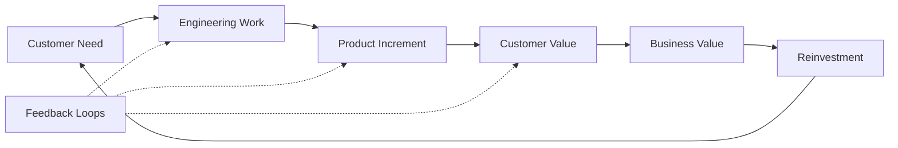
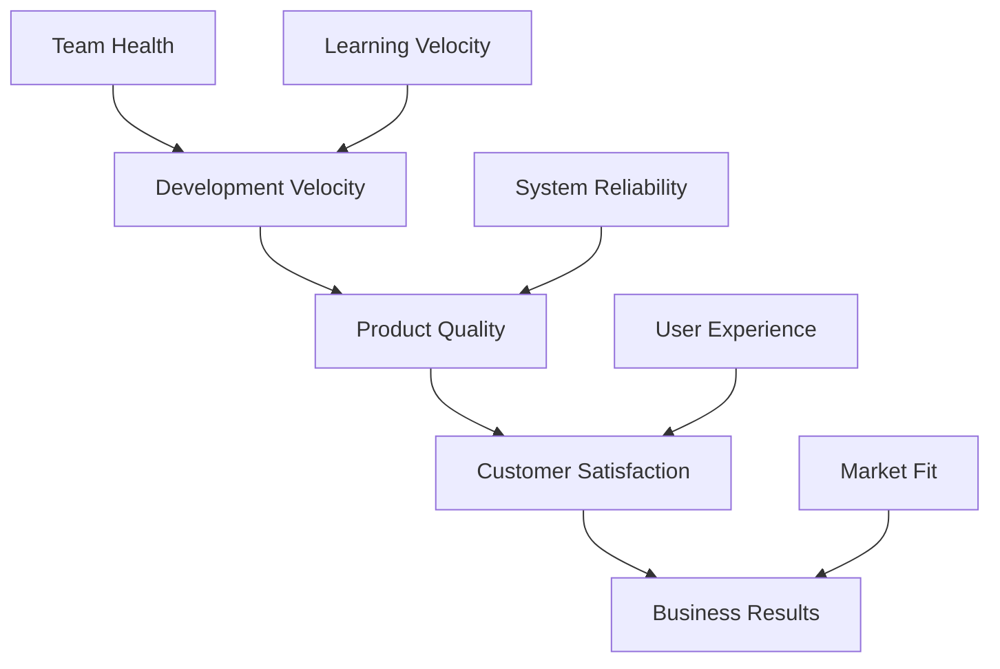

# First Principle #1: Value Creation


## Overview

Value Creation
description: Value Creation overview and navigation
---

# First Principle #1: Value Creation

## Table of Contents

- [Definition](#definition)
- [Why This Principle Matters](#why-this-principle-matters)
  - [The Value Chain](#the-value-chain)
- [Core Components of Value Creation](#core-components-of-value-creation)
  - [Systems Perspective on Value Creation](#systems-perspective-on-value-creation)
  - [Value Stream Mapping for Engineering Leaders](#value-stream-mapping-for-engineering-leaders)
  - [1. Customer Value](#1-customer-value)
  - [2.

**Reading time:** ~15 minutes

## Table of Contents

- [Definition](#definition)
- [Why This Principle Matters](#why-this-principle-matters)
  - [The Value Chain](#the-value-chain)
- [Core Components of Value Creation](#core-components-of-value-creation)
  - [Systems Perspective on Value Creation](#systems-perspective-on-value-creation)
  - [Value Stream Mapping for Engineering Leaders](#value-stream-mapping-for-engineering-leaders)
  - [1. Customer Value](#1-customer-value)
  - [2. Business Value](#2-business-value)
  - [3. The Value Equation for Engineering](#3-the-value-equation-for-engineering)
  - [Modern Value Measurement: DORA Metrics Integration](#modern-value-measurement-dora-metrics-integration)
- [Common Value Creation Patterns in Engineering](#common-value-creation-patterns-in-engineering)
  - [Pattern 1: The Platform Play](#pattern-1-the-platform-play)
  - [Pattern 2: The Reliability Investment  ](#pattern-2-the-reliability-investment-)
  - [Pattern 3: The Technical Debt Paydown](#pattern-3-the-technical-debt-paydown)
  - [Pattern 4: The Innovation Bet](#pattern-4-the-innovation-bet)
- [Anti-Patterns That Destroy Value](#anti-patterns-that-destroy-value)
  - [1. The Over-Engineering Trap](#1-the-over-engineering-trap)
  - [2. The Technical Purity Prison](#2-the-technical-purity-prison)
  - [3. The Feature Factory](#3-the-feature-factory)
  - [4. The Innovation Theater](#4-the-innovation-theater)
- [Real-World Value Creation Stories](#real-world-value-creation-stories)
  - [Case Study 1: The Netflix API That Saved the Company](#case-study-1-the-netflix-api-that-saved-the-company)
  - [Case Study 2: The Shopify Database Migration That Nobody Wanted](#case-study-2-the-shopify-database-migration-that-nobody-wanted)
  - [Case Study 3: The Stripe API Design That Created a $95B Company](#case-study-3-the-stripe-api-design-that-created-a-95b-company)
- [AI-Assisted Value Identification](#ai-assisted-value-identification)
  - [Modern Value Discovery with AI](#modern-value-discovery-with-ai)
- [Simplified AI value scoring model](#simplified-ai-value-scoring-model)
  - [AI-Enhanced Value Stream Analysis](#ai-enhanced-value-stream-analysis)
- [Frameworks for Value-Driven Decisions](#frameworks-for-value-driven-decisions)
  - [The ICE Framework](#the-ice-framework)
  - [The Enhanced Value Stream Map](#the-enhanced-value-stream-map)
  - [The Technical Investment Portfolio](#the-technical-investment-portfolio)
- [Measuring Value Creation](#measuring-value-creation)
  - [Modern Value Metrics Framework](#modern-value-metrics-framework)
  - [Value Creation Dashboard](#value-creation-dashboard)
  - [The North Star Metric](#the-north-star-metric)
- [Value Creation in Practice](#value-creation-in-practice)
  - [Case Study: The Airbnb Search Rewrite - When Value Creation Requires Courage](#case-study-the-airbnb-search-rewrite-when-value-creation-requires-courage)
  - [Interview Story Template](#interview-story-template)
- [Connecting to Other Principles](#connecting-to-other-principles)
- [Value Creation Anti-Story: The $50M Feature Nobody Used](#value-creation-anti-story-the-50m-feature-nobody-used)
- [Self-Reflection Questions](#self-reflection-questions)
  - [Traditional Value Assessment](#traditional-value-assessment)
  - [Modern Value Leadership](#modern-value-leadership)
- [The "Value Creation Radar" - A Leadership Tool](#the-value-creation-radar-a-leadership-tool)
  - [Weekly Value Pulse Check](#weekly-value-pulse-check)
  - [The "So What?" Test](#the-so-what-test)
  - [Value Creation Stories for Interviews](#value-creation-stories-for-interviews)
- [Action Items](#action-items)
  - [This Week](#this-week)
  - [This Month](#this-month)
  - [This Quarter](#this-quarter)
- [Application in Other Levels](#application-in-other-levels)
  - [Level II: Core Business Concepts](#level-ii-core-business-concepts)
  - [Level III: Engineering Applications](#level-iii-engineering-applications)
  - [Level IV: Interview Execution](#level-iv-interview-execution)
- [Next Steps](#next-steps)


> "The purpose of business is to create and keep a customer." - Peter Drucker

## Definition

Value Creation is the fundamental reason any business exists: to solve real problems for real people in a way that's worth more to them than it costs to deliver. For engineering leaders, this means every technical decision must ultimately serve customer and business value.

## Why This Principle Matters

### The Value Chain
```
Engineering Work → Product Features → Customer Problems Solved → 
Revenue/Retention → Company Sustainability → More Engineering Investment
```

Break any link in this chain, and the entire system fails.

## Core Components of Value Creation

### Systems Perspective on Value Creation

**Value as Flow, Not Stock**: Modern engineering leadership views value creation as a continuous flow through interconnected systems, not isolated features or one-time deliveries.



**Key Insight**: Optimizing any single component without considering the whole system can reduce overall value creation.

### Value Stream Mapping for Engineering Leaders

**Definition**: Visual representation of all steps in the value creation process, from customer request to delivered outcome.

**Core Components**:

| Stage | Activities | Typical Duration | Value-Add % |
|-------|------------|------------------|-------------|
| **Discovery** | Requirements gathering, research | 2-5 days | 15% |
| **Design** | Architecture, UI/UX, planning | 3-8 days | 25% |
| **Development** | Coding, testing, review | 10-20 days | 40% |
| **Deployment** | CI/CD, staging, production | 1-3 days | 10% |
| **Validation** | Monitoring, user feedback | Ongoing | 10% |

**Value Stream Optimization Framework**:
1. **Map Current State**: Document every step, handoff, and delay
2. **Identify Bottlenecks**: Where does work queue up?
3. **Eliminate Waste**: Remove non-value-adding activities
4. **Optimize Flow**: Reduce batch sizes, improve handoffs
5. **Measure & Iterate**: Continuous improvement of the flow

### 1. Customer Value
**Definition**: The benefit customers receive minus the cost (money, time, effort) they pay.

**Engineering Applications**:

- Performance improvements (faster = more value)
- Reliability engineering (uptime = trust = value)  
- User experience (easier = more adoption = more value)
- Security (protection = peace of mind = value)

### 2. Business Value
**Definition**: Sustainable profit that funds continued operation and growth.

**Engineering Levers**:
- **Revenue Growth**: Features that drive new sales or upsells
- **Cost Reduction**: Efficiency that improves margins
- **Risk Mitigation**: Preventing losses (security, compliance)
- **Strategic Positioning**: Technical moats and differentiators

### 3. The Value Equation for Engineering

```
Value Created = (Customer Benefit × Scale) - (Development Cost + Operational Cost)
                 ________________________________________________
                           Time to Market
```

This equation reveals why engineering leaders must balance:
- Feature richness vs. speed to market
- Perfect architecture vs. good enough
- Technical excellence vs. business pragmatism

### Modern Value Measurement: DORA Metrics Integration

**DORA (DevOps Research and Assessment) Four Key Metrics** provide empirical measures of engineering value delivery:

| Metric | Definition | Elite Performance | Value Connection |
|--------|------------|-------------------|------------------|
| **Lead Time** | Code commit to production | < 1 hour | Faster customer value delivery |
| **Deployment Frequency** | How often we deploy | On-demand (multiple times/day) | Higher customer feedback velocity |
| **Change Failure Rate** | % of deployments causing failures | < 15% | Sustainable value delivery quality |
| **Recovery Time** | Time to restore service after failure | < 1 hour | Minimizes customer value disruption |

**Value Creation through DORA Excellence**:
- **Lead Time** reduction = Faster hypothesis validation
- **Deployment Frequency** increase = More customer learning cycles
- **Change Failure Rate** decrease = More predictable value delivery
- **Recovery Time** reduction = Higher customer trust and retention

**Integration Framework**:
```python
value_delivery_score = (
    (1 / lead_time_hours) * 
    deployment_frequency_per_day * 
    (1 - change_failure_rate) * 
    (1 / recovery_time_hours)
) * customer_satisfaction_score
```

## Common Value Creation Patterns in Engineering

### Pattern 1: The Platform Play
**Approach**: Build once, leverage many times
**Example**: Creating an internal API platform that accelerates all future development
**Value Multiplication**: 10x over 2 years

### Pattern 2: The Reliability Investment  
**Approach**: Spend now to prevent future losses
**Example**: Implementing comprehensive monitoring and alerting
**Value Protection**: Prevents $1M+/hour outage costs

### Pattern 3: The Technical Debt Paydown
**Approach**: Slow down today to speed up tomorrow
**Example**: Refactoring critical path code
**Value Acceleration**: 2x feature velocity after 6 months

### Pattern 4: The Innovation Bet
**Approach**: Risk resources on potential breakthrough
**Example**: ML-powered feature that could transform user experience
**Value Potential**: 10-100x if successful, 0 if not

## Anti-Patterns That Destroy Value

### 1. The Over-Engineering Trap
- Building for theoretical scale that never materializes while competitors capture the market

### 2. The Technical Purity Prison
- Pursuing architectural perfection while business opportunities expire

### 3. The Feature Factory
- Shipping features without validating customer value, creating complexity without benefit

### 4. The Innovation Theater
- Chasing trendy technologies that don't solve real problems

## Real-World Value Creation Stories

### Case Study 1: The Netflix API That Saved the Company

**Context**: 2007, Netflix was struggling with a monolithic architecture that limited innovation speed. Reed Hastings knew streaming was the future but couldn't pivot fast enough.

**Value Insight**: Instead of rebuilding everything, the engineering team created internal APIs that broke apart the monolith piece by piece. Each API was measured by one metric: "Does this help us ship streaming features faster?"

**Execution**: They identified the most value-limiting constraint - the recommendation engine. By separating it into its own service, they could:
- A/B test recommendations rapidly
- Scale recommendation compute independently
- Allow multiple teams to improve the experience

**Value Created**: This single architectural decision enabled Netflix to:
- Launch streaming 2 years earlier than planned
- Personalize content for 200M+ users
- Generate $25B+ annual revenue from streaming

**Wisdom from the Field**: "The highest value engineering decisions aren't about code—they're about removing the constraints that limit your team's ability to deliver value to customers." - Netflix Engineering Leader

### Case Study 2: The Shopify Database Migration That Nobody Wanted

**Context**: 2017, Shopify's MySQL database was hitting limits during peak shopping events like Black Friday. Merchants were losing money, engineers were stressed, but nobody wanted to tackle the "boring" infrastructure work.

**Value Reframe**: The engineering leader reframed the problem: "Every minute of downtime during Black Friday costs our merchants $1.2M in lost sales. This isn't database work—this is revenue protection work."

**The Hidden Value**: By migrating to a sharded database architecture:
- Eliminated single point of failure
- Enabled horizontal scaling
- Reduced Black Friday incidents from 4 hours to 4 minutes

**Result**: Shopify's merchant success rate improved 99.9%→99.99%, protecting $2B+ in merchant revenue during peak events.

**Wisdom from the Field**: "Value creation often looks like thankless infrastructure work. The art is connecting boring technical improvements to exciting business outcomes."

### Case Study 3: The Stripe API Design That Created a $95B Company

**Context**: 2010, accepting payments online required integrating with complex, developer-hostile APIs that took weeks to implement.

**Value Hypothesis**: "What if we could turn payment integration from a weeks-long project into a 7-line code snippet?"

**Execution**: The Collison brothers obsessed over developer experience:
- One API call to charge a card
- Extensive documentation with live examples
- Immediate sandbox access
- Error messages that actually helped

**Value Multiplier**: By reducing integration friction, Stripe enabled:
- Thousands of startups to launch faster
- Existing companies to expand internationally
- New business models (subscription, marketplace)

**Result**: Developer adoption → business adoption → $95B valuation

**Wisdom from the Field**: "The highest value features often don't add capability—they remove friction. Easy beats feature-rich every time."

## AI-Assisted Value Identification

### Modern Value Discovery with AI

**Challenge**: Traditional value identification relies on human intuition and limited data analysis. Modern engineering leaders leverage AI to discover hidden value opportunities.

**AI-Powered Value Analysis**:

| Application | AI Technique | Value Discovery |
|-------------|--------------|----------------|
| **User Behavior Analysis** | ML clustering | Identify underserved user segments |
| **Feature Usage Patterns** | Time series analysis | Predict feature value before building |
| **Performance Optimization** | Predictive analytics | Proactively improve user experience |
| **Technical Debt Impact** | Graph neural networks | Quantify maintenance cost impact |
| **Market Opportunity** | NLP sentiment analysis | Real-time competitive intelligence |

**Example: AI-Driven Feature Prioritization**

```python
## Simplified AI value scoring model
def ai_value_score(feature):
    user_demand = predict_user_adoption(feature.description)
    technical_effort = estimate_complexity(feature.requirements)
    business_impact = forecast_revenue_impact(feature.metrics)
    
    return (user_demand * business_impact) / technical_effort
```

**Case Study**: Spotify's AI-driven playlist features:
- **AI Discovery**: ML identified music discovery as underserved need
- **Value Hypothesis**: Personalized discovery increases engagement
- **Implementation**: Discover Weekly, Daily Mix algorithms
- **Result**: 40% increase in user engagement, $2B+ annual value

### AI-Enhanced Value Stream Analysis

**Automated Bottleneck Detection**:
- **Code Analysis**: AI identifies complex modules slowing development
- **Process Mining**: ML discovers inefficient workflow patterns
- **Predictive Quality**: AI predicts defect-prone changes before deployment
- **Resource Optimization**: ML optimizes team allocation for maximum value

## Frameworks for Value-Driven Decisions

### The ICE Framework
**Impact** × **Confidence** × **Ease** = Priority Score

Applied to engineering:
- **Impact**: Revenue potential, cost savings, risk reduction
- **Confidence**: Technical feasibility, market validation
- **Ease**: Development effort, operational complexity

### The Enhanced Value Stream Map

**Digital-First Value Stream Mapping**:

Trace every engineering activity to customer outcome with modern tooling:

1. **What customer problem does this solve?**
   - Use customer journey mapping tools (Miro, Figma)
   - Integrate with user analytics (Amplitude, Mixpanel)
   - Leverage customer feedback platforms (Intercom, Zendesk)

2. **How much is solving it worth to them?**
   - A/B test value hypotheses
   - Measure willingness-to-pay through pricing experiments
   - Track retention/engagement improvements

3. **What's our cost to deliver and maintain?**
   - Engineering time tracking (Linear, Jira)
   - Infrastructure cost monitoring (AWS Cost Explorer, DataDog)
   - Technical debt quantification tools (SonarQube, CodeClimate)

4. **What's the competitive alternative?**
   - Competitive intelligence platforms (Klenty, Crayon)
   - Market research automation (Google Trends, SEMrush)
   - Customer switching analysis

**Value Stream Health Dashboard**:
```
Flow Efficiency = Value-Add Time / Total Lead Time
Target: > 25% (World-class: > 40%)

Customer Value Realization Rate = Features Used / Features Shipped
Target: > 60% (Elite: > 80%)

Value Feedback Cycle Time = Deploy to Customer Insight
Target: < 7 days (Elite: < 24 hours)
```

### The Technical Investment Portfolio
Balance your engineering investments:
- **70%** Core value delivery (features customers pay for)
- **20%** Efficiency/platform (reduce future costs)
- **10%** Innovation bets (potential breakthroughs)

## Measuring Value Creation

### Modern Value Metrics Framework

**Leading Indicators** (Predictive):
- **Flow Metrics**: Lead time, cycle time, flow efficiency
- **Quality Metrics**: Change failure rate, recovery time
- **Innovation Metrics**: Experiment velocity, learning rate
- **Customer Metrics**: Feature adoption curves, user engagement trends
- **Team Metrics**: Psychological safety scores, learning velocity

**Lagging Indicators** (Confirmatory):
- **Business Impact**: Revenue per engineer, customer lifetime value
- **Market Position**: Net Promoter Score, market share growth
- **Financial Health**: Gross margins, cost per transaction
- **Sustainability**: Employee retention, technical debt ratio

### Value Creation Dashboard

**Systems View of Value Metrics**:



**Integration with Modern Tools**:

| Metric Category | Tools | Automation Level |
|----------------|-------|------------------|
| **Engineering Flow** | Linear, GitHub Insights | Fully automated |
| **Product Usage** | Amplitude, Mixpanel | Real-time dashboards |
| **Business Impact** | Salesforce, HubSpot | Weekly automated reports |
| **Customer Satisfaction** | Delighted, Typeform | Continuous collection |
| **System Health** | DataDog, New Relic | Real-time monitoring |

### The North Star Metric
Choose one metric that best captures value creation for your context:
- **B2C**: Daily active users, engagement time
- **B2B SaaS**: Net revenue retention, customer lifetime value
- **Marketplace**: Gross merchandise value, liquidity
- **Infrastructure**: Uptime, cost per transaction

## Value Creation in Practice

### Case Study: The Airbnb Search Rewrite - When Value Creation Requires Courage

**Context**: 2014, Airbnb's search was powered by a fragile, monolithic system that crashed during peak booking periods. The team faced a critical choice: band-aid fixes or complete rewrite.

**The Scary Numbers**:
- Current system: 3-second average search time, 15% crash rate during peaks
- Rewrite would take 18 months with 12 engineers
- Risk: Could break search entirely, killing the company
- Opportunity cost: $50M in lost bookings during peak seasons

**Value Framework Applied**:
1. **Quantify current pain**: 
   - 15% search failures = $180M annual lost bookings
   - Developer velocity: 6-week cycle time for search improvements
   - Customer frustration: 23% of users abandoned after search failure

2. **Project future state**:
   - Sub-second search response time
   - 99.9% availability during peaks
   - 2-day cycle time for search improvements
   - Personalized results (impossible with old system)

3. **Calculate true ROI**:
   - Direct revenue protection: $180M annually
   - Innovation velocity: 15x faster search iterations
   - Competitive advantage: Personalized search driving 25% more bookings
   - Total value: $500M+ over 3 years

4. **Risk mitigation strategy**:
   - Build new system alongside old one
   - A/B test with 1% of traffic, gradually increase
   - Fallback to old system if issues arise
   - Team rotations to prevent burnout

**The Courage Moment**: When the CFO questioned spending $24M on "fixing something that works," the engineering leader responded: "We're not fixing what works—we're building what our future requires."

**Result**: 
- New search system launched on time
- Bookings increased 30% in first quarter
- Search-driven revenue grew $400M in year one
- Engineering team velocity improved 10x

**Wisdom from the Field**: "The highest-value engineering decisions often look risky to finance and obvious to customers. Your job is bridging that gap with data and conviction."

### Interview Story Template

When discussing value creation in interviews:

```
Situation: [Business context and problem]
Value Hypothesis: [What value we believed we could create]
Analysis: [How we quantified potential value]
Execution: [How we delivered the value]
Measurement: [Actual value created]
Learning: [How this informed future decisions]
```

## Connecting to Other Principles

Value Creation doesn't exist in isolation:

- **[Decision-Making](../../engineering-leadership/level-1-first-principles/decision-making/)**: Value guides what to decide - every decision should optimize for value creation
- **[Human Behavior](../../engineering-leadership/level-1-first-principles/human-behavior/)**: People are motivated by creating meaningful value - align individual purpose with organizational value
- **[Systems Thinking](../../engineering-leadership/level-1-first-principles/systems-thinking/)**: Value flows through systems - optimize the whole value stream, not just parts
- **[Integrity & Ethics](../../engineering-leadership/level-1-first-principles/integrity-ethics/)**: Sustainable value requires trust - ethical practices create long-term value

## Value Creation Anti-Story: The $50M Feature Nobody Used

**Context**: 2019, a major e-commerce company spent 2 years building an AI-powered "personal shopping assistant" feature.

**The Investment**:
- 15 ML engineers, 2 years
- $50M total cost (salaries + infrastructure)
- Delayed 3 major customer-requested features
- Opportunity cost of alternative projects

**The Failure**:
- Less than 2% of users tried the feature
- Of those who tried it, only 10% used it more than once
- Customer surveys revealed: "I don't want AI picking my clothes"
- Feature was quietly removed after 6 months

**What Went Wrong**:
1. **No customer validation**: Built what sounded cool, not what customers wanted
2. **Sunk cost fallacy**: Kept investing because they'd already invested so much
3. **Value assumption**: Assumed automation always creates value
4. **Opportunity cost blindness**: Ignored the features customers actually requested

**The Real Cost**: 
- Direct: $50M wasted
- Indirect: Customer frustration with missing features
- Competitive: Rivals gained ground by shipping requested features
- Morale: Team demoralized by building something nobody used

**Wisdom from the Field**: "The most expensive technical decisions aren't the ones that fail technically—they're the ones that succeed technically but fail to create value."

## Self-Reflection Questions

### Traditional Value Assessment
1. Can you quantify the value of your last three major technical decisions?
2. How do you communicate value to non-technical stakeholders?
3. What percentage of your team's work directly creates customer value?
4. How do you balance short-term vs. long-term value creation?
5. What value have you destroyed through technical decisions?

### Modern Value Leadership
6. **Systems Thinking**: Can you trace how your technical decisions ripple through the entire value stream?
7. **AI Integration**: How are you using AI/ML to discover hidden value opportunities in your data/systems?
8. **Flow Optimization**: What's your team's current flow efficiency, and how are you improving it?
9. **DORA Excellence**: How do your DORA metrics compare to industry benchmarks, and what's your improvement plan?
10. **Value Stream Health**: Can you visualize your end-to-end value delivery process and identify the biggest bottlenecks?
11. **Customer-Centricity**: How quickly can you get from customer feedback to production improvement?
12. **Sustainable Value**: How do you ensure value creation doesn't come at the cost of team burnout or technical sustainability?

## The "Value Creation Radar" - A Leadership Tool

### Weekly Value Pulse Check
Every Friday, ask your team:
1. **Value Created**: What customer problems did we solve this week?
2. **Value Blocked**: What prevented us from creating more value?
3. **Value Opportunities**: What customer pain points did we discover?
4. **Value Risks**: What might destroy value we've already created?

### The "So What?" Test
For every technical decision, ask three levels:
1. **What** are we building?
2. **So what** - why does this matter to users?
3. **So what** - why does this matter to the business?

If you can't answer all three clearly, stop and reconsider.

### Value Creation Stories for Interviews

**Template**: "I once [technical action] that [customer outcome] resulting in [business impact]"

**Examples**:
- "I once redesigned our API response format that reduced mobile app load time by 2 seconds, resulting in 15% higher user retention and $3M additional revenue."
- "I once automated our deployment pipeline that reduced release cycle from 6 weeks to 2 days, resulting in 12x faster customer feedback loops and 40% increase in feature adoption."
- "I once implemented database query optimization that cut server costs by 60%, allowing us to reinvest $2M annually in customer-facing features."

## Action Items

### This Week
- Audit your current projects through the value lens
- Calculate the ROI of your team's work
- Identify one low-value activity to stop
- **New**: Practice the "So What?" test on your current highest-priority project

### This Month
- Implement value metrics in your team dashboards
- Train your team on value-based prioritization
- Start every technical discussion with "What value does this create?"
- **New**: Conduct a "Value Creation Radar" session with your team

### This Quarter
- Develop your team's value creation scorecard
- Tie performance reviews to value delivered
- Build value creation into your hiring process
- **New**: Create a "Value Creation Wall" showcasing customer impact stories

## Application in Other Levels

### Level II: Core Business Concepts
- **[Strategy](../../engineering-leadership/level-2-core-business/strategy/)**: Value creation drives strategic choices
- **[Finance](../../engineering-leadership/level-2-core-business/finance/)**: Quantifying and measuring value
- **[Operations](../../engineering-leadership/level-2-core-business/operations/)**: Delivering value efficiently

### Level III: Engineering Applications
- **[Technical Leadership](../../engineering-leadership/level-3-applications/technical-leadership/)**: Technical decisions that maximize value
- **[Business Acumen](../../engineering-leadership/level-3-applications/business-acumen/)**: Connecting engineering to business value
- **[People Management](../../engineering-leadership/level-3-applications/people-management/)**: Building teams that create value

### Level IV: Interview Execution
- **[Behavioral Stories](../../engineering-leadership/level-4-interview-execution/behavioral/)**: Demonstrating value creation impact
- **[Technical Leadership](../../engineering-leadership/level-4-interview-execution/technical-leadership/)**: Articulating technical value

## Next Steps

1. **Immediate**: Audit your current projects through the value lens
2. **This Week**: Practice quantifying value in your daily decisions
3. **This Month**: Develop value metrics for your team
4. **For Interviews**: Prepare 3-5 stories showcasing value creation

---

*Continue your journey: Explore how [Decision-Making](../../engineering-leadership/level-1-first-principles/decision-making/) operationalizes value creation through structured choices, or see how [Strategy](../../engineering-leadership/level-2-core-business/strategy/) builds on value creation principles.*