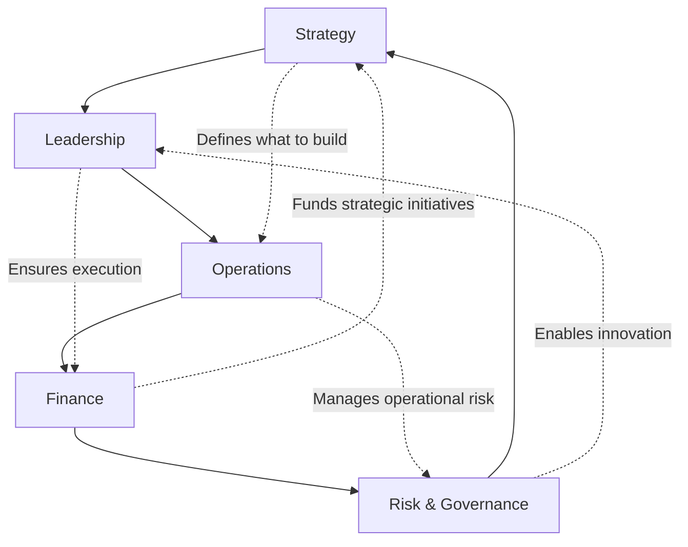

# Level II: Core Business Concepts - The Strategic "How"

> "First principles tell us why to act. Business concepts tell us how to win." - Synthesis of MBA Wisdom

## Overview

Core Business Concepts are the essential disciplines taught in elite MBA programs, adapted for engineering leaders. While First Principles are universal truths, these concepts are the proven frameworks for creating competitive advantage and sustainable success.

## The Five Essential Disciplines

\n\n### 1. [Strategy](/technical-strategy)
**Creating and Capturing Sustainable Value**

Strategy is the art of making integrated choices about where to play and how to win. For engineering leaders, this means building technical capabilities that create lasting competitive advantage.

**Key Frameworks**: Porter's Five Forces, Blue Ocean, Disruption Theory, Platform Strategy

### 2. [Leadership](/human-cost-leadership)  
**Mobilizing Humans Toward Shared Goals**

Leadership transforms individual capability into collective achievement. It's about vision, influence, and creating environments where talented people do their best work.

**Key Frameworks**: Situational Leadership, Servant Leadership, Kotter's Change Model, Multipliers

### 3. [Operations](/interview-prep/engineering-leadership/level-2-core-business/operations/index)
**Building the Engine of Execution**

Operations is the science of delivering value efficiently and reliably. For engineering, this encompasses everything from system architecture to deployment pipelines to incident response.

**Key Frameworks**: Lean, Theory of Constraints, Six Sigma, DevOps, SRE Principles

### 4. [Finance](/interview-prep/engineering-leadership/level-2-core-business/finance/index)
**Understanding and Creating Economic Value**

Finance provides the language of business and tools for investment decisions. Engineering leaders must speak this language to secure resources and demonstrate impact.

**Key Frameworks**: NPV/ROI, Unit Economics, Cost of Capital, Real Options, Budget Management

### 5. [Risk & Governance](/interview-prep/engineering-leadership/level-2-core-business/risk-governance/index)
**Managing Uncertainty and Ensuring Accountability**

Risk management and governance create the guardrails for sustainable growth. This includes technical risk, security, compliance, and organizational controls.

**Key Frameworks**: COSO ERM, RACI Matrix, Three Lines of Defense, Crisis Management

## Integration: How Business Concepts Connect

## Why Engineering Leaders Need Business Concepts

### 1. **Speaking the Language of Business**
- Translate technical achievements into business impact
- Participate as peer in executive discussions
- Secure resources by demonstrating ROI

### 2. **Making Better Decisions**
- Evaluate trade-offs using proven frameworks
- Consider financial and strategic implications
- Balance short-term delivery with long-term value

### 3. **Leading at Scale**
- Move from managing projects to leading organizations
- Build systems and cultures, not just products
- Create sustainable competitive advantage

### 4. **Career Advancement**
- Directors and VPs are business leaders first
- MBA concepts are expected at senior levels
- Differentiate yourself from purely technical leaders

## The Engineering Leader's Business Toolkit

### Essential Capabilities by Level

| Level | Strategy | Leadership | Operations | Finance | Risk |
|-------|----------|------------|------------|---------|------|
| **Manager (L5-6)** | Team roadmaps | Direct reports | Sprint execution | Project budgets | Code quality |
| **Senior Manager (L6-7)** | Product strategy | Multiple teams | System design | Headcount planning | Security basics |
| **Director (L7-8)** | Portfolio strategy | Organizational design | Platform operations | P&L responsibility | Compliance |
| **VP+ (L8+)** | Company strategy | Executive presence | Operational excellence | Investment decisions | Board reporting |

## Common Anti-Patterns

### 1. **The Pure Technologist**
"I just want to focus on technology"
- **Reality**: Senior roles require business acumen
- **Fix**: Gradually build business skills alongside technical

### 2. **The MBA Wannabe**
Using jargon without understanding
- **Reality**: Superficial knowledge is obvious
- **Fix**: Deep learning, practical application

### 3. **The Framework Junkie**
Applying frameworks mechanically
- **Reality**: Context matters more than frameworks
- **Fix**: Understand principles behind frameworks

### 4. **The Silo Thinker**
Treating disciplines as separate
- **Reality**: They're deeply interconnected
- **Fix**: Practice integrated thinking

## Learning Path Through Business Concepts

### Foundation Building (Months 1-3)
1. **Start with Strategy**: Understand value creation at scale
2. **Add Leadership**: Learn to multiply your impact through others
3. **Operations Excellence**: Build reliable, scalable systems

### Advanced Development (Months 4-6)
4. **Financial Fluency**: Speak the language of business
5. **Risk Mastery**: Anticipate and manage uncertainty
6. **Integration**: Apply all concepts to real challenges

### Mastery Practice (Ongoing)
- Case study analysis
- Cross-functional projects
- Executive shadowing
- Board presentation practice

## Real-World Integration Exercise

**Scenario**: Building a new platform team

**Strategy Application**:
- What unique value will this platform provide?
- How does it create competitive advantage?
- What's our differentiation strategy?

**Leadership Application**:
- How do we attract top talent?
- What culture do we need?
- How do we manage stakeholder buy-in?

**Operations Application**:
- What's our service delivery model?
- How do we measure reliability?
- What's our scaling strategy?

**Finance Application**:
- What's the ROI calculation?
- How do we fund this investment?
- What are success metrics?

**Risk Application**:
- What could go wrong?
- How do we mitigate risks?
- What governance do we need?

## Interview Excellence Through Business Concepts

### The Executive Mindset

When answering interview questions:
1. **Start with business impact** (not technical details)
2. **Use appropriate frameworks** (shows structured thinking)
3. **Quantify outcomes** (revenue, cost, efficiency)
4. **Address multiple stakeholders** (not just engineering)
5. **Consider long-term implications** (not just immediate wins)

### Power Phrases by Discipline

**Strategy**: "To create sustainable competitive advantage..."
**Leadership**: "To align and mobilize the organization..."
**Operations**: "To deliver predictable value at scale..."
**Finance**: "The business case showed XX% ROI..."
**Risk**: "We identified and mitigated key risks including..."

## Self-Assessment

Rate yourself (1-5) on each discipline:

**Strategy**
- [ ] Can articulate team's strategic value
- [ ] Understand competitive dynamics
- [ ] Make portfolio-level decisions
- [ ] Create technical moats

**Leadership**
- [ ] Inspire beyond direct authority
- [ ] Navigate organizational politics
- [ ] Drive cultural change
- [ ] Develop other leaders

**Operations**
- [ ] Design scalable systems
- [ ] Optimize end-to-end flow
- [ ] Build operational excellence
- [ ] Measure what matters

**Finance**
- [ ] Build compelling business cases
- [ ] Manage P&L responsibility
- [ ] Understand unit economics
- [ ] Make investment trade-offs

**Risk & Governance**
- [ ] Identify systemic risks
- [ ] Build appropriate controls
- [ ] Manage compliance requirements
- [ ] Lead through crises

## The Path to Business Mastery

Remember: You don't need an MBA, but you do need MBA-level thinking. These concepts aren't academic exercises—they're practical tools for engineering leaders who want to maximize their impact.

**Start here**: Pick the discipline where you're weakest and dive deep. Apply it to your current challenges. Teach it to your team. 

**Success looks like**: Seamlessly integrating business thinking into technical leadership, creating value that's both innovative and sustainable.

## Connecting Business Concepts to First Principles

Each business concept operationalizes multiple first principles:

- **[Strategy](/technical-strategy)** applies **[Value Creation](/interview-prep/engineering-leadership/level-1-first-principles/value-creation/index/)** and **[Systems Thinking](/interview-prep/engineering-leadership/level-1-first-principles/systems-thinking/index/)**
- **[Leadership](/human-cost-leadership)** centers on **[Human Behavior](/interview-prep/engineering-leadership/level-1-first-principles/human-behavior/index/)** and **[Integrity](/interview-prep/engineering-leadership/level-1-first-principles/integrity-ethics/index/)**
- **[Operations](/interview-prep/engineering-leadership/level-2-core-business/operations/index)** delivers **[Value Creation](/interview-prep/engineering-leadership/level-1-first-principles/value-creation/index/)** through **[Systems Thinking](/interview-prep/engineering-leadership/level-1-first-principles/systems-thinking/index/)**
- **[Finance](/interview-prep/engineering-leadership/level-2-core-business/finance/index)** quantifies **[Value Creation](/interview-prep/engineering-leadership/level-1-first-principles/value-creation/index/)** and guides **[Decision-Making](/interview-prep/engineering-leadership/level-1-first-principles/decision-making/index/)**
- **[Risk & Governance](/interview-prep/engineering-leadership/level-2-core-business/risk-governance/index)** protects through **[Systems Thinking](/interview-prep/engineering-leadership/level-1-first-principles/systems-thinking/index/)** and **[Integrity](/interview-prep/engineering-leadership/level-1-first-principles/integrity-ethics/index/)**

## Next Steps

### For Engineering Managers
1. Start with **[Finance](/interview-prep/engineering-leadership/level-2-core-business/finance/index)** - Learn to speak the language of business
2. Add **[Strategy](/technical-strategy)** - Think beyond your immediate team
3. Deepen **[Leadership](/human-cost-leadership)** - Scale your impact through others

### For Senior Managers & Directors
1. Master **[Strategy](/technical-strategy)** - Shape technical direction
2. Excel at **[Operations](/interview-prep/engineering-leadership/level-2-core-business/operations/index)** - Build scalable systems
3. Understand **[Risk & Governance](/interview-prep/engineering-leadership/level-2-core-business/risk-governance/index)** - Protect value creation

### Interview Preparation
1. **Week 1-2**: Study each concept deeply
2. **Week 3**: Map your experiences to concepts
3. **Week 4**: Practice using business language

---

*Ready to dive deeper? Choose a discipline to explore, or continue to [Level III: Engineering Leadership Applications](/interview-prep/engineering-leadership/level-3-applications/index/) to see these concepts in action. For foundational understanding, revisit [Level I: First Principles](/interview-prep/engineering-leadership/level-1-first-principles/index/).*