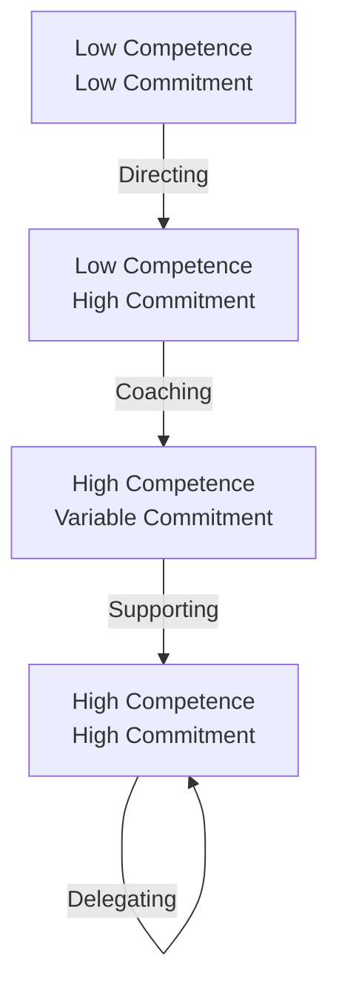

# Business Concept #2: Leadership

> "Leadership is not about being in charge. It's about taking care of those in your charge." - Simon Sinek

## Definition

Leadership is the art and science of mobilizing people toward shared goals. It's about creating environments where talented individuals become high-performing teams, where good ideas become great products, and where potential transforms into performance. For engineering leaders, this means balancing technical excellence with human dynamics.

## Core Leadership Frameworks

### 1. Situational Leadership (Blanchard & Hersey)

Adapting your style to individual readiness:



**Engineering Applications**:

| Situation | Leadership Style | Actions |
|-----------|-----------------|---------|
| New grad onboarding | **Directing** | Clear tasks, frequent check-ins, pair programming |
| Mid-level learning new tech | **Coaching** | Explain why, guide exploration, review together |
| Senior facing imposter syndrome | **Supporting** | Listen, encourage, remove barriers |
| Staff engineer on familiar project | **Delegating** | Define outcomes, trust execution |

### 2. Servant Leadership (Greenleaf)

The leader-first vs. servant-first paradigm:

**Traditional Leadership**:
```
Leader → Commands → Team → Executes → Results
```

**Servant Leadership**:
```
Leader → Serves → Team → Empowered → Superior Results
```

**Engineering Manifestations**:
- Removing blockers before team asks
- Taking on-call shifts during crunch
- Fighting for team resources
- Shielding from organizational chaos
- Celebrating team over self

### 3. Transformational Leadership (Bass)

The Four Components:

<div class="leadership-framework">

**1. Idealized Influence**
- Model the behavior you want
- Make decisions based on values
- Build trust through consistency

**2. Inspirational Motivation**
- Paint compelling technical vision
- Connect work to larger purpose
- Celebrate progress and learning

**3. Intellectual Stimulation**
- Challenge assumptions
- Encourage innovation
- Make failure safe

**4. Individualized Consideration**
- Know each person's goals
- Provide tailored growth opportunities
- Adapt communication style

</div>

### 4. Kotter's 8-Step Change Process

Leading organizational transformation:

1. **Create Urgency**: Why must we change now?
2. **Build Coalition**: Who will drive this?
3. **Form Vision**: Where are we going?
4. **Communicate Vision**: Get everyone on board
5. **Empower Action**: Remove barriers
6. **Create Wins**: Build momentum
7. **Consolidate Gains**: Don't declare victory early
8. **Anchor Changes**: Make it stick

**Engineering Example**: Microservices Migration
1. Show monolith limitations (outages, slow delivery)
2. Get senior engineers + architects aligned
3. Define target architecture and benefits
4. Town halls, documentation, demos
5. Provide tools, training, time
6. Celebrate first service extraction
7. Keep going despite complexity
8. Update hiring, onboarding, processes

## Leadership Dimensions for Engineering

### 1. Technical Leadership

**Definition**: Guiding technical decisions and mentoring technical growth

**Key Responsibilities**:
- Setting technical vision and standards
- Making architectural decisions
- Conducting code reviews that teach
- Building technical culture
- Representing engineering externally

**Balance Required**:
```
Too Technical: Micromanaging, doing instead of leading
Too Abstract: Losing technical credibility, poor decisions
Just Right: Strategic technical direction with tactical awareness
```

### 2. People Leadership

**The Engineering Manager's Dilemma**:
- Engineers value autonomy
- But need alignment
- They want challenging work
- But not overwhelming
- They seek growth
- But fear failure

**Core People Practices**:

<div class="people-practices">

**One-on-Ones**
- Weekly, sacred time
- Their agenda, not yours
- Career development focus
- Psychological safety

**Performance Management**
- Continuous feedback
- Clear expectations
- Growth-oriented
- Fair and consistent

**Team Building**
- Shared experiences
- Collaborative challenges
- Celebrating together
- Learning from failure

**Conflict Resolution**
- Address quickly
- Focus on behavior
- Seek understanding
- Find common ground

</div>

### 3. Organizational Leadership

**Leading Beyond Direct Reports**:

| Influence Without Authority | How to Execute |
|----------------------------|----------------|
| **Vision Alignment** | Create compelling technical vision others want to join |
| **Expertise Power** | Be the go-to person for critical knowledge |
| **Relationship Capital** | Invest in cross-functional relationships before you need them |
| **Value Demonstration** | Show impact, others will want to partner |
| **Political Savvy** | Understand power dynamics and navigate effectively |

### 4. Strategic Leadership

Connecting technical work to business outcomes:

```
Business Strategy: "Expand internationally"
                ↓
Product Strategy: "Multi-language, multi-currency"
                ↓
Technical Strategy: "Internationalization platform"
                ↓
Team Strategy: "I18n specialists, distributed teams"
                ↓
Execution: Specific projects and timelines
```

## Leadership Styles Spectrum

### The Range Every Leader Needs

| Style | When to Use | Example Situation |
|-------|-------------|-------------------|
| **Directive** | Crisis, low competence | Production down, junior on-call |
| **Coaching** | Developing skills | Mid-level ready for architect role |
| **Affiliative** | Healing rifts | After layoffs or failed project |
| **Democratic** | Building buy-in | Choosing new tech stack |
| **Pacesetting** | High performers | Experienced team, tight deadline |
| **Visionary** | Need direction | Starting new initiative |

### Style Flexibility Exercise

For each scenario, identify the appropriate style:
1. Team demoralized after project cancellation
2. Exploring new ML capabilities
3. Senior engineer underperforming
4. Urgent security patch needed
5. Planning next quarter's roadmap

## Building High-Performing Engineering Teams

### The Tuckman Model in Engineering

**Forming** → **Storming** → **Norming** → **Performing**

| Stage | Characteristics | Leadership Actions |
|-------|----------------|-------------------|
| **Forming** | Polite, uncertain, dependent | Set clear expectations, provide structure |
| **Storming** | Conflicts emerge, boundaries tested | Facilitate healthy conflict, clarify roles |
| **Norming** | Cohesion develops, standards emerge | Reinforce positive patterns, build culture |
| **Performing** | Self-directed, innovative | Get out of the way, provide resources |

### Psychological Safety: The Foundation

Creating environment for:
- Admitting mistakes without punishment
- Asking questions without judgment
- Proposing ideas without ridicule
- Taking risks without fear

**Practical Actions**:
- Model vulnerability ("I don't know")
- Celebrate learning from failures
- Ask questions more than give answers
- Admit your own mistakes publicly

### The Multiplier Effect

**Diminishers** (avoid these):
- Micromanager: "I'll just do it myself"
- Empire Builder: "Everything goes through me"
- Know-it-All: "Here's how you should do it"
- Decision Maker: "I'll decide for the team"

**Multipliers** (embrace these):
- Talent Magnet: "Let's leverage your strength"
- Liberator: "It's safe to think here"
- Challenger: "What's possible?"
- Debate Maker: "Let's explore options"

## Leadership Communication

### The Engineering Leader's Communication Stack

1. **Vision Communication**
   - Paint the future state
   - Connect to individual impact
   - Use concrete examples
   - Repeat 7x more than comfortable

2. **Technical Communication**
   - Right level of abstraction
   - Visual > verbal
   - Metaphors that resonate
   - Interactive demonstrations

3. **Difficult Conversations**
   - SBI Model: Situation-Behavior-Impact
   - Focus on specific examples
   - Collaborative problem-solving
   - Clear next steps

4. **Upward Communication**
   - Executive summary first
   - Data-driven narratives
   - Risk + mitigation
   - Clear asks

### Storytelling for Engineers

The Technical Leadership Story Arc:
```
Context (technical landscape)
    ↓
Challenge (what needed solving)
    ↓
Journey (how we approached it)
    ↓
Discovery (what we learned)
    ↓
Transformation (how it changed us)
    ↓
Impact (business + technical outcomes)
```

## Leading Through Challenges

### Crisis Leadership

When systems fail and pressure mounts:

**The Crisis Leadership Protocol**:
1. **Stabilize**: Stop the bleeding
2. **Communicate**: Frequent, transparent updates
3. **Mobilize**: Right people on right problems
4. **Support**: Coffee, food, rotation
5. **Learn**: Blameless post-mortem
6. **Improve**: Systematic prevention

### Leading Through Ambiguity

When direction is unclear:
- Acknowledge the uncertainty
- Define what we do know
- Create experiments to learn
- Iterate based on feedback
- Communicate progress frequently

### Leading Change

**Why Engineering Changes Fail**:
- Underestimating technical debt
- Ignoring cultural resistance
- Poor stakeholder management
- Insufficient investment
- Declaring victory too early

**Success Factors**:
- Clear burning platform
- Coalition of influencers
- Quick wins to build momentum
- Sustained commitment
- Systems thinking

## Developing Leadership Skills

### The 70-20-10 Model

- **70%**: On-the-job experiences (stretch assignments)
- **20%**: Learning from others (mentoring, observation)
- **10%**: Formal training (courses, books)

### Leadership Development Plan

**6-Month Arc**:

Month 1-2: **Foundation**
- Read "The Manager's Path"
- Practice different leadership styles
- Get 360 feedback

Month 3-4: **Application**
- Lead a cross-functional initiative
- Mentor a junior engineer
- Handle a difficult situation

Month 5-6: **Mastery**
- Teach leadership skills
- Lead organizational change
- Build leadership pipeline

## Interview Mastery: Demonstrating Leadership

### Leadership Story Categories

1. **Building Teams**: Hiring, onboarding, culture
2. **Developing People**: Mentoring, growth, succession
3. **Driving Change**: Technical, organizational, cultural
4. **Managing Crisis**: Incidents, conflicts, failures
5. **Influencing Up/Out**: Getting buy-in, resources

### The STAR-L Framework

**Situation**: Context requiring leadership
**Task**: What needed to be accomplished
**Action**: Your leadership approach
**Result**: Measurable outcomes
**Leadership Lesson**: What you learned about leading

### Power Phrases
- "I recognized the team needed..."
- "To align stakeholders, I..."
- "I adapted my leadership style to..."
- "The key was building trust through..."
- "I empowered the team by..."

## Common Leadership Pitfalls

### The Technical Leader Traps

1. **The Hero Complex**: Solving everything yourself
2. **The Perfectionist**: Paralysis through standards
3. **The Avoider**: Dodging difficult conversations
4. **The Politician**: Playing games over delivering
5. **The Burnout**: Not modeling sustainability

### Red Flags in Your Leadership

- Team members stop sharing problems
- Always the smartest person in room
- Doing more coding than leading
- Avoiding conflict at all costs
- Team dependent on you

## The Leadership Journey

### From IC to Executive

**Individual Contributor**: Personal excellence
**Tech Lead**: Technical leadership
**Manager**: People leadership
**Senior Manager**: Team of teams
**Director**: Organizational leadership
**VP**: Strategic leadership
**CTO**: Visionary leadership

Each level requires letting go of the previous level's strengths.

## Connection to First Principles

- **[Human Behavior](../../../engineering-leadership/level-1-first-principles/human-behavior/index.md)**: Leadership is fundamentally about understanding and motivating humans
- **[Value Creation](../../../engineering-leadership/level-1-first-principles/value-creation/index.md)**: Leaders align human effort toward value
- **[Decision-Making](../../../engineering-leadership/level-1-first-principles/decision-making/index.md)**: Leaders create decision-making systems
- **[Systems Thinking](../../../engineering-leadership/level-1-first-principles/systems-thinking/index.md)**: Leaders shape organizational systems
- **[Integrity & Ethics](../../../engineering-leadership/level-1-first-principles/integrity-ethics/index.md)**: Leadership requires moral authority

## Connection to Other Business Concepts

- **[Strategy](../../../engineering-leadership/level-2-core-business/strategy/index.md)**: Leadership executes strategy through people
- **[Operations](../../../engineering-leadership/level-2-core-business/operations/index.md)**: Leaders build operational excellence
- **[Finance](../../../engineering-leadership/level-2-core-business/finance/index.md)**: Leaders manage resources efficiently
- **[Risk & Governance](../../../engineering-leadership/level-2-core-business/risk-governance/index.md)**: Leaders navigate uncertainty

## Application in Level III

- **[People Management](../../../engineering-leadership/level-3-applications/people-management/index.md)**: Direct application of leadership principles
- **[Technical Leadership](../../../engineering-leadership/level-3-applications/technical-leadership/index.md)**: Leading through technical excellence
- **[Organizational Design](../../../engineering-leadership/level-3-applications/organizational-design/index.md)**: Designing systems for leadership
- **[Business Acumen](../../../engineering-leadership/level-3-applications/business-acumen/index.md)**: Leading across functions

## Interview Application (Level IV)

- **[Behavioral Interviews](../../../engineering-leadership/level-4-interview-execution/behavioral/index.md)**: Demonstrating leadership impact
- **[Culture Fit](../../../engineering-leadership/level-4-interview-execution/culture-values/index.md)**: Showing leadership alignment
- **[Technical Leadership](../../../engineering-leadership/level-4-interview-execution/technical-leadership/index.md)**: Leading technical initiatives

## Next Steps

1. **Today**: Identify your default leadership style and one situation where you need to adapt
2. **This Week**: Practice one new leadership behavior
3. **This Month**: Get 360 feedback on your leadership
4. **For Interviews**: Prepare 5 leadership stories across different contexts

---

*Continue your journey: Explore how [Operations](../../../engineering-leadership/level-2-core-business/operations/index.md) transforms leadership vision into reliable execution at scale, or dive into [People Management](../../../engineering-leadership/level-3-applications/people-management/index.md) for practical leadership application.*