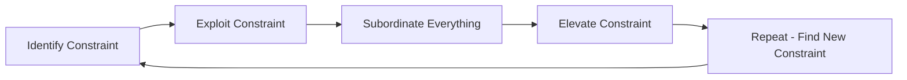
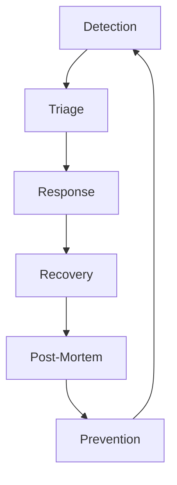

# Business Concept #3: Operations

> "Excellence is not a singular act, but a habit. You are what you repeatedly do." - Aristotle (via Will Durant)

## Definition

Operations is the discipline of delivering value reliably, efficiently, and at scale. For engineering leaders, it encompasses everything from code deployment to incident response, from system architecture to team processes. It's where strategy meets reality, where elegant designs encounter messy production environments.

## Core Operations Frameworks

### 1. Lean Principles

Eliminating waste and maximizing value:

**The 7 Wastes (TIMWOOD) in Engineering**:

| Waste Type | Engineering Example | Solution |
|------------|-------------------|----------|
| **Transportation** | Data moving between services | Colocate related data |
| **Inventory** | Undeployed code, unused features | Continuous deployment |
| **Motion** | Context switching, manual processes | Automation, focus time |
| **Waiting** | Blocked on dependencies, reviews | Async communication, SLAs |
| **Over-processing** | Gold-plating, premature optimization | MVP approach, metrics |
| **Over-production** | Features nobody uses | User research, analytics |
| **Defects** | Bugs, incidents, rework | Quality at source |

### 2. Theory of Constraints (Goldratt)

Finding and elevating the bottleneck:



**Engineering Applications**:
- Code review bottleneck → Automated checks
- Database constraint → Caching layer
- Deploy bottleneck → Parallel pipelines
- Knowledge bottleneck → Documentation

### 3. DevOps & Site Reliability Engineering

The modern operations philosophy:

**DevOps Principles**:
1. **Culture**: Shared ownership, blameless
2. **Automation**: Everything as code
3. **Measurement**: Metrics drive decisions
4. **Sharing**: Knowledge spreads freely

**SRE Practices**:
- Error budgets balance reliability and velocity
- Service Level Objectives (SLOs) define "good enough"
- Toil reduction through automation
- Capacity planning based on growth

### 4. Six Sigma / DMAIC

Data-driven process improvement:

**Define** → **Measure** → **Analyze** → **Improve** → **Control**

**Engineering Example**: Reducing Deploy Time
- **Define**: Deploy takes 2 hours, target 15 minutes
- **Measure**: Break down each step's duration
- **Analyze**: Tests take 75% of time, mostly integration
- **Improve**: Parallelize tests, use test containers
- **Control**: Monitor deploy time, alert on regression

## Operational Excellence Dimensions

### 1. System Reliability

**The Reliability Equation**:
```
Reliability = MTBF / (MTBF + MTTR)

Where:
- MTBF = Mean Time Between Failures
- MTTR = Mean Time To Recovery
```

**Improving MTBF**:
- Redundancy at every layer
- Graceful degradation
- Circuit breakers
- Load testing
- Chaos engineering

**Improving MTTR**:
- Excellent monitoring
- Clear runbooks
- Automated recovery
- Practice incidents
- Rollback capabilities

### 2. Performance Engineering

**The Performance Stack**:

| Layer | Metrics | Optimization Techniques |
|-------|---------|------------------------|
| **Frontend** | Load time, TTI, FCP | CDN, caching, lazy loading |
| **API** | Latency, throughput | Connection pooling, caching |
| **Backend** | Response time, CPU | Algorithm optimization, async |
| **Database** | Query time, IOPS | Indexing, denormalization |
| **Infrastructure** | Utilization, cost | Right-sizing, auto-scaling |

**Performance Culture**:
- Performance budgets in CI/CD
- Real user monitoring (RUM)
- Synthetic monitoring
- Load testing before launch
- Capacity planning discipline

### 3. Deployment Excellence

**Modern Deployment Patterns**:

<div class="deployment-patterns">

**Blue-Green Deployment**
- Two identical environments
- Instant switch with rollback
- Zero downtime
- Higher resource cost

**Canary Deployment**
- Gradual rollout (1% → 10% → 50% → 100%)
- Real user testing
- Automatic rollback on errors
- Requires good monitoring

**Feature Flags**
- Decouple deploy from release
- A/B testing capability
- Instant rollback
- Operational complexity

**Progressive Delivery**
- Combines canary + feature flags
- User segment targeting
- Gradual exposure
- Maximum control

</div>

### 4. Incident Management

**The Incident Lifecycle**:



**Incident Command Structure**:
- **Incident Commander**: Owns the incident
- **Tech Lead**: Drives technical resolution
- **Communications**: Updates stakeholders
- **Scribe**: Documents timeline

**Key Practices**:
- Clear severity definitions
- Escalation procedures
- Communication templates
- Blameless post-mortems
- Action item tracking

## Operational Metrics & KPIs

### The DORA Metrics

Research-backed indicators of operational excellence:

| Metric | Elite | High | Medium | Low |
|--------|-------|------|--------|-----|
| **Deploy Frequency** | Multiple/day | Daily-Weekly | Weekly-Monthly | Monthly+ |
| **Lead Time** | < 1 hour | 1 day-1 week | 1 week-1 month | 1+ months |
| **MTTR** | < 1 hour | < 1 day | < 1 week | 1+ weeks |
| **Change Failure Rate** | 0-15% | 16-30% | 31-45% | 46%+ |

### Business-Aligned Metrics

Connect operational metrics to business outcomes:

```
Operational Metric → Business Impact
━━━━━━━━━━━━━━━━━━━━━━━━━━━━━━━━━
Uptime (99.9%) → Revenue protection ($X/hour)
Page load time → Conversion rate (Y% per 100ms)
Deploy frequency → Feature velocity → Market responsiveness
MTTR → Customer trust → Retention rate
Error rate → Support tickets → Operational cost
```

### Leading vs. Lagging Indicators

**Leading** (predictive):
- Code coverage trends
- Technical debt ratio
- Deploy confidence score
- Team health metrics

**Lagging** (results):
- Incident count
- Customer complaints
- Revenue impact
- Attrition rate

## Building Operational Culture

### 1. Ownership Mindset

**"You Build It, You Run It"** - Werner Vogels, Amazon CTO

**Implementing Ownership**:
- Teams own services end-to-end
- On-call for what you build
- Direct customer feedback
- Full lifecycle responsibility

**Benefits**:
- Better design decisions
- Faster incident response
- Reduced friction
- Innovation mindset

### 2. Continuous Improvement

**The Kaizen Approach**:

Daily: Fix small issues immediately
Weekly: Team retrospectives
Monthly: Process reviews
Quarterly: Major improvements

**Improvement Frameworks**:
- Five Whys for root cause
- A3 thinking for proposals
- PDCA cycle for changes
- Gemba walks for observation

### 3. Operational Readiness

**Production Readiness Checklist**:

<div class="readiness-checklist">

**Reliability**
- [ ] Redundancy implemented
- [ ] Graceful degradation
- [ ] Circuit breakers
- [ ] Retry logic
- [ ] Timeout handling

**Observability**
- [ ] Metrics dashboard
- [ ] Log aggregation
- [ ] Distributed tracing
- [ ] Alerts configured
- [ ] SLOs defined

**Security**
- [ ] Security review
- [ ] Secrets management
- [ ] Access controls
- [ ] Audit logging
- [ ] Vulnerability scanning

**Operations**
- [ ] Runbooks written
- [ ] On-call scheduled
- [ ] Capacity planned
- [ ] Cost estimated
- [ ] Documentation complete

</div>

## Scaling Operations

### 1. From Startup to Scale

| Stage | Focus | Key Practices |
|-------|-------|--------------|
| **Startup** | Ship fast | Manual processes OK, monitor basics |
| **Growth** | Don't break | Add automation, improve reliability |
| **Scale** | Efficiency | Optimize costs, platform thinking |
| **Enterprise** | Governance | Compliance, standardization |

### 2. Platform Engineering

Building platforms that accelerate development:

**Internal Platform Components**:
- Self-service infrastructure
- Standardized CI/CD
- Observability platform
- Security scanning
- Cost management

**Success Factors**:
- Treat platform as product
- Developer experience focus
- Clear documentation
- Migration support
- Measure adoption

### 3. Operational Maturity Model

**Level 1: Reactive**
- Fighting fires
- Manual everything
- No standards

**Level 2: Managed**
- Basic monitoring
- Some automation
- Incident process

**Level 3: Proactive**
- Predictive alerts
- Self-healing
- Capacity planning

**Level 4: Optimized**
- Continuous improvement
- Innovation culture
- Business alignment

## Common Operational Pitfalls

### 1. The Hero Culture
**Symptoms**: Celebrating firefighting over prevention
**Fix**: Reward fire prevention, not just fighting

### 2. Tool Fetishism
**Symptoms**: New tool for every problem
**Fix**: Master fewer tools deeply

### 3. Metric Mania
**Symptoms**: Measuring everything, improving nothing
**Fix**: Focus on actionable metrics

### 4. Process Prison
**Symptoms**: Process slows delivery
**Fix**: Automate process, don't add manual steps

### 5. Perfection Paralysis
**Symptoms**: Never good enough to ship
**Fix**: Define "good enough" with SLOs

## Interview Excellence: Operational Stories

### Story Categories

1. **Scaling Systems**: 10x growth challenges
2. **Incident Response**: Major outage handling
3. **Process Improvement**: Efficiency gains
4. **Automation**: Toil reduction
5. **Cost Optimization**: Doing more with less

### The Operational Story Framework

```
Context: System/process state
Problem: What wasn't working
Analysis: Root cause investigation
Solution: Operational improvements
Implementation: How you executed
Results: Metrics before/after
Learning: Operational insights
```

### Power Phrases
- "To improve reliability, we implemented..."
- "Our operational metrics showed..."
- "By applying Theory of Constraints..."
- "We reduced MTTR from X to Y by..."
- "The ROI of this automation was..."

## Developing Operational Excellence

### Skills Development Path

**Foundation** (Months 1-3):
- Learn monitoring/observability
- Understand SRE principles
- Practice incident response

**Intermediate** (Months 4-6):
- Design for reliability
- Implement automation
- Lead improvements

**Advanced** (Months 7-12):
- Build platforms
- Define operations strategy
- Mentor others

### Recommended Resources
- "Site Reliability Engineering" - Google
- "The Phoenix Project" - Kim, Behr, Spafford
- "Accelerate" - Forsgren, Humble, Kim
- "The Goal" - Goldratt
- AWS Well-Architected Framework

## Operations in Different Contexts

### Startup Operations
- Focus on basics that matter
- Manual processes acceptable
- Monitor what could kill you
- Prepare for scale early

### Enterprise Operations
- Governance and compliance
- Change management critical
- Standards and platforms
- Risk management focus

### High-Growth Operations
- Scalability over perfection
- Automate everything possible
- Hire ahead of growth
- Technical debt management

## Connection to Other Concepts

- **Strategy**: Operations enables strategic goals
- **Leadership**: Leaders build operational culture
- **Finance**: Operations drives efficiency/cost
- **Risk**: Operations manages technical risk

---

*Next: Explore how [Finance](../../../../interview-prep/engineering-leadership/level-2-core-business/finance/index.md) provides the language and tools to quantify operational value.*