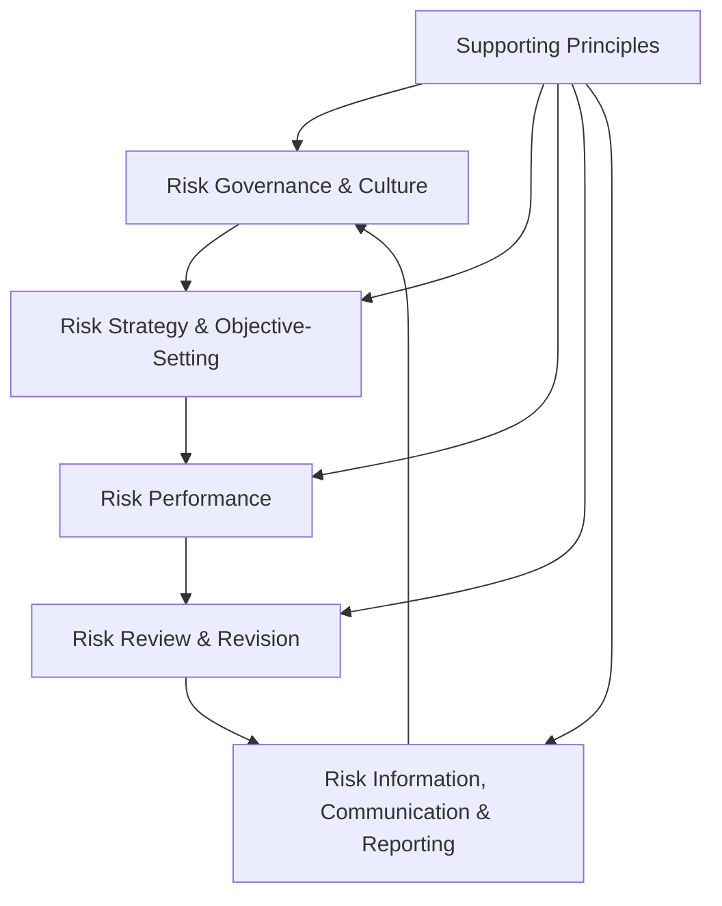
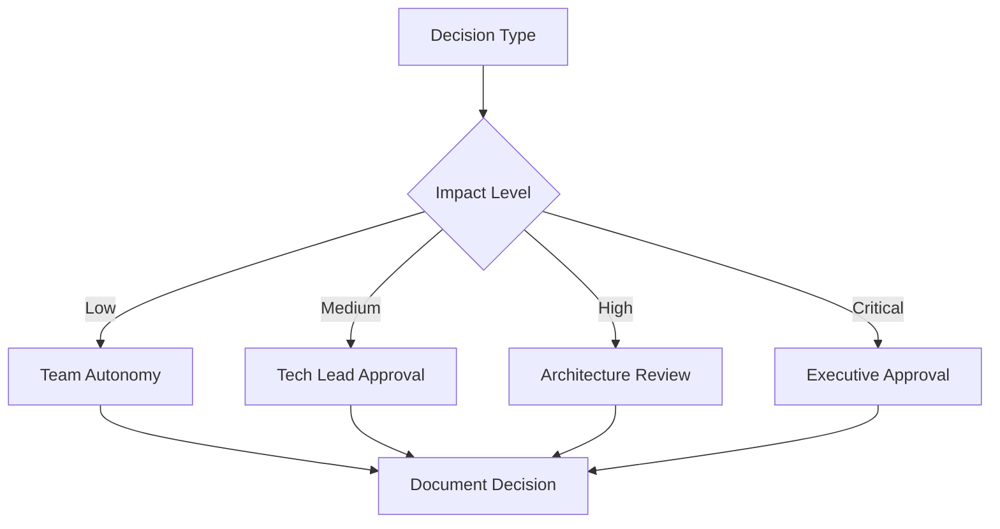
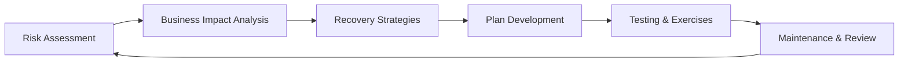

# Business Concept #5: Risk & Governance


## Overview

Risk Governance
description: Risk Governance overview and navigation
---

# Business Concept #5: Risk & Governance

## Table of Contents

- [Definition](#definition)
- [Core Risk Management Frameworks](#core-risk-management-frameworks)
  - [1. COSO ERM Framework](#1-coso-erm-framework)
  - [2.

**Reading time:** ~9 minutes

## Table of Contents

- [Definition](#definition)
- [Core Risk Management Frameworks](#core-risk-management-frameworks)
  - [1. COSO ERM Framework](#1-coso-erm-framework)
  - [2. ISO 31000 Risk Management](#2-iso-31000-risk-management)
  - [3. Three Lines of Defense Model](#3-three-lines-of-defense-model)
  - [4. FAIR (Factor Analysis of Information Risk)](#4-fair-factor-analysis-of-information-risk)
- [Types of Risk in Engineering](#types-of-risk-in-engineering)
  - [1. Technical Risk](#1-technical-risk)
  - [2. Security Risk](#2-security-risk)
  - [3. Compliance Risk](#3-compliance-risk)
  - [4. Operational Risk](#4-operational-risk)
- [Risk Assessment Methodologies](#risk-assessment-methodologies)
  - [1. Risk Matrix Approach](#1-risk-matrix-approach)
  - [2. Quantitative Risk Analysis](#2-quantitative-risk-analysis)
- [Estimating project delay risk](#estimating-project-delay-risk)
  - [3. Failure Mode and Effects Analysis (FMEA)](#3-failure-mode-and-effects-analysis-fmea)
- [Governance Structures](#governance-structures)
  - [1. RACI Matrix for Tech Decisions](#1-raci-matrix-for-tech-decisions)
  - [2. Technical Governance Bodies](#2-technical-governance-bodies)
  - [3. Decision Rights Framework](#3-decision-rights-framework)
- [Crisis Management](#crisis-management)
  - [1. Crisis Response Framework](#1-crisis-response-framework)
  - [2. Crisis Communication](#2-crisis-communication)
  - [3. War Room Protocols](#3-war-room-protocols)
- [Business Continuity Planning](#business-continuity-planning)
  - [1. BCP Framework](#1-bcp-framework)
  - [2. Recovery Objectives](#2-recovery-objectives)
  - [3. Disaster Recovery Patterns](#3-disaster-recovery-patterns)
- [Security Governance](#security-governance)
  - [1. Security Development Lifecycle (SDL)](#1-security-development-lifecycle-sdl)
  - [2. Zero Trust Implementation](#2-zero-trust-implementation)
  - [3. Security Metrics & KPIs](#3-security-metrics-kpis)
- [Audit & Controls](#audit-controls)
  - [1. Control Framework](#1-control-framework)
  - [2. Audit Preparation](#2-audit-preparation)
  - [3. Continuous Compliance](#3-continuous-compliance)
- [Board Reporting for Technical Leaders](#board-reporting-for-technical-leaders)
  - [1. Executive Risk Dashboard](#1-executive-risk-dashboard)
  - [2. Board Communication](#2-board-communication)
  - [3. Metrics That Matter to Boards](#3-metrics-that-matter-to-boards)
- [Interview Excellence: Risk & Governance](#interview-excellence-risk-governance)
  - [Story Framework](#story-framework)
  - [Power Phrases](#power-phrases)
  - [Example Topics](#example-topics)
- [Developing Risk & Governance Expertise](#developing-risk-governance-expertise)
  - [Learning Path](#learning-path)
  - [Recommended Resources](#recommended-resources)
- [Risk & Governance in Practice](#risk-governance-in-practice)
  - [Startup Context](#startup-context)
  - [Enterprise Context](#enterprise-context)
  - [High-Growth Context](#high-growth-context)
- [Connection to Other Concepts](#connection-to-other-concepts)


> "The biggest risk is not taking any risk. In a world that's changing really quickly, the only strategy that is guaranteed to fail is not taking risks." - Mark Zuckerberg

## Definition

Risk & Governance encompasses the frameworks, processes, and structures that identify, assess, and manage uncertainties while ensuring accountability, compliance, and ethical decision-making. For engineering leaders, it means building systems and cultures that balance innovation with responsibility, speed with safety, and autonomy with alignment.

## Core Risk Management Frameworks

### 1. COSO ERM Framework

Enterprise Risk Management integrated approach:



**Engineering Applications**:
- **Governance**: Technical leadership accountability
- **Strategy**: Risk appetite in technology choices
- **Performance**: SLAs, error budgets, security metrics
- **Review**: Post-mortems, architecture reviews
- **Communication**: Risk dashboards, stakeholder updates

### 2. ISO 31000 Risk Management

International standard for systematic risk management:

**Risk Management Process**:
1. **Establish Context**: Internal/external environment
2. **Risk Assessment**:
   - Risk Identification
   - Risk Analysis
   - Risk Evaluation
3. **Risk Treatment**: Mitigate, transfer, accept, avoid
4. **Monitor & Review**: Continuous improvement
5. **Communication & Consultation**: Stakeholder engagement

### 3. Three Lines of Defense Model

Organizational risk governance structure:

| Line | Role | Engineering Context |
|------|------|-------------------|
| **First Line** | Risk Owners | Development teams, architects |
| **Second Line** | Risk Control | Security, compliance, QA teams |
| **Third Line** | Risk Assurance | Internal audit, external reviews |

**Implementation Example**:
- **1st**: Dev teams own code quality, security practices
- **2nd**: Security team sets standards, monitors compliance
- **3rd**: Independent audits verify controls effectiveness

### 4. FAIR (Factor Analysis of Information Risk)

Quantitative cyber risk analysis:

```
Risk = Probability of Loss Event × Probable Loss Magnitude

Where:
- Loss Event Frequency = Threat Event Frequency × Vulnerability
- Loss Magnitude = Primary Loss + Secondary Loss
```

**Engineering Value**: Transforms vague security concerns into financial impact estimates for prioritization.

## Types of Risk in Engineering

### 1. Technical Risk

**Categories & Mitigation**:

| Risk Type | Examples | Mitigation Strategies |
|-----------|----------|---------------------|
| **Architecture** | Monolith scaling limits | Modular design, clear boundaries |
| **Technology** | Framework obsolescence | Abstraction layers, standards |
| **Performance** | Database bottlenecks | Capacity planning, caching |
| **Integration** | Third-party API failures | Circuit breakers, fallbacks |
| **Technical Debt** | Code complexity growth | Refactoring budget, metrics |

### 2. Security Risk

**Modern Security Governance Framework**:

<div class="security-framework">

**Zero Trust Architecture**
- Verify explicitly
- Least privilege access
- Assume breach mindset

**DevSecOps Integration**
- Security as code
- Shift left testing
- Automated compliance

**Data Protection**
- Encryption at rest/transit
- Access controls
- Privacy by design

**Incident Response**
- Playbooks ready
- Regular drills
- Clear escalation

</div>

### 3. Compliance Risk

**Regulatory Landscape for Tech**:

| Regulation | Scope | Engineering Impact |
|------------|-------|-------------------|
| **GDPR** | EU data privacy | Data architecture, consent flows |
| **CCPA** | California privacy | Similar to GDPR, deletion rights |
| **SOX** | Financial controls | Change management, access logs |
| **HIPAA** | Healthcare data | Encryption, audit trails |
| **PCI-DSS** | Payment cards | Network segmentation, key management |

### 4. Operational Risk

**Categories**:
- **Availability**: System downtime
- **Capacity**: Inability to scale
- **Process**: Manual error-prone tasks
- **People**: Key person dependencies
- **Vendor**: Third-party failures

## Risk Assessment Methodologies

### 1. Risk Matrix Approach

```
Impact
  ^
5 |  M  H  H  C  C
4 |  L  M  H  H  C
3 |  L  M  M  H  H
2 |  L  L  M  M  H
1 |  L  L  L  M  M
  +-----------------> Likelihood
    1  2  3  4  5

L=Low, M=Medium, H=High, C=Critical
```

**Engineering Calibration**:
- **Impact**: Revenue loss, data breach, user trust
- **Likelihood**: Historical data, industry benchmarks

### 2. Quantitative Risk Analysis

**Monte Carlo Simulation Example**:
```python
## Estimating project delay risk
import numpy as np

def simulate_project_risk(n_simulations=10000):
    delays = []
    for _ in range(n_simulations):
        # Risk factors with probability and impact
        architecture_risk = np.random.choice([0, 30], p=[0.7, 0.3])
        integration_risk = np.random.choice([0, 20], p=[0.8, 0.2])
        resource_risk = np.random.choice([0, 15], p=[0.9, 0.1])
        
        total_delay = architecture_risk + integration_risk + resource_risk
        delays.append(total_delay)
    
    return {
        'p50': np.percentile(delays, 50),
        'p90': np.percentile(delays, 90),
        'p99': np.percentile(delays, 99)
    }
```

### 3. Failure Mode and Effects Analysis (FMEA)

For systematic risk identification:

| Component | Failure Mode | Effect | Severity | Probability | Detection | RPN |
|-----------|--------------|--------|----------|-------------|-----------|-----|
| Database | Connection pool exhaustion | Service unavailable | 8 | 3 | 7 | 168 |
| API Gateway | Rate limit misconfiguration | DoS vulnerability | 9 | 2 | 5 | 90 |
| Cache | Eviction policy bug | Performance degradation | 6 | 4 | 8 | 192 |

*RPN (Risk Priority Number) = Severity × Probability × Detection*

## Governance Structures

### 1. RACI Matrix for Tech Decisions

| Decision | Dev Team | Tech Lead | Architect | Security | CTO |
|----------|----------|-----------|-----------|----------|-----|
| Language choice | C | A | R | I | I |
| Security standards | I | C | C | A | R |
| Architecture patterns | I | C | A | C | R |
| Tool selection | R | A | C | C | I |
| Incident response | R | A | I | C | I |

*R=Responsible, A=Accountable, C=Consulted, I=Informed*

### 2. Technical Governance Bodies

**Architecture Review Board (ARB)**:
- **Purpose**: Major technical decisions
- **Members**: Senior architects, security, operations
- **Frequency**: Weekly/biweekly
- **Outputs**: Decision records, standards

**Security Council**:
- **Purpose**: Security posture oversight
- **Members**: CISO, engineering leads, legal
- **Frequency**: Monthly
- **Outputs**: Risk register, policy updates

**Change Advisory Board (CAB)**:
- **Purpose**: Production change approval
- **Members**: Ops, dev leads, business
- **Frequency**: As needed
- **Outputs**: Change approvals, risk assessments

### 3. Decision Rights Framework



## Crisis Management

### 1. Crisis Response Framework

**Severity Levels**:

| Level | Impact | Response Time | Stakeholders | Example |
|-------|--------|--------------|--------------|---------|
| **SEV1** | Business critical | < 15 min | CEO, customers | Complete outage |
| **SEV2** | Major degradation | < 30 min | VP, key customers | Payment failure |
| **SEV3** | Minor impact | < 2 hours | Director, support | Slow queries |
| **SEV4** | Minimal impact | < 24 hours | Manager | UI glitch |

### 2. Crisis Communication

**Internal Communication Flow**:
```
Detection → Incident Commander → War Room
                ↓                    ↓
           Tech Teams          Stakeholder Updates
                ↓                    ↓
           Resolution          Customer Communication
```

**Communication Templates**:

<div class="communication-template">

**Initial Notice** (T+5 minutes)
"We are investigating reports of [issue]. Teams are engaged. Update in 15 minutes."

**Status Update** (T+20 minutes)
"[Issue] identified. Impact: [scope]. Root cause: [if known]. ETA: [estimate]. Workaround: [if any]."

**Resolution** (T+X)
"[Issue] resolved at [time]. Root cause: [summary]. Full post-mortem to follow."

</div>

### 3. War Room Protocols

**Physical/Virtual Setup**:
- Dedicated channel/room
- Clear roles assigned
- No observers (participants only)
- Scribe documenting timeline
- Regular status checkpoints

**Post-Crisis Actions**:
1. Hot wash (immediate debrief)
2. Timeline reconstruction
3. Impact analysis
4. Post-mortem scheduling
5. Action items tracking

## Business Continuity Planning

### 1. BCP Framework

**Key Components**:



### 2. Recovery Objectives

**Critical Metrics**:

| System Tier | RTO | RPO | Availability Target | Cost Multiplier |
|-------------|-----|-----|-------------------|----------------|
| **Tier 1** | < 1 hour | < 15 min | 99.99% | 3-5x |
| **Tier 2** | < 4 hours | < 1 hour | 99.9% | 2-3x |
| **Tier 3** | < 24 hours | < 4 hours | 99.5% | 1.5-2x |
| **Tier 4** | < 72 hours | < 24 hours | 99% | 1.2-1.5x |

*RTO = Recovery Time Objective, RPO = Recovery Point Objective*

### 3. Disaster Recovery Patterns

**Multi-Region Architecture**:
- Active-Active: Full redundancy, highest cost
- Active-Passive: Standby region, moderate cost
- Pilot Light: Minimal standby, lower cost
- Backup & Restore: Lowest cost, highest RTO

## Security Governance

### 1. Security Development Lifecycle (SDL)

**Integration Points**:

| Phase | Security Activities | Engineering Ownership |
|-------|-------------------|---------------------|
| **Design** | Threat modeling, security requirements | Architects |
| **Develop** | Secure coding, SAST | Developers |
| **Test** | DAST, penetration testing | QA + Security |
| **Deploy** | Security configs, secrets management | DevOps |
| **Operate** | Monitoring, incident response | SRE + Security |

### 2. Zero Trust Implementation

**Technical Controls**:
```yaml
Identity:
  - Multi-factor authentication
  - Identity federation
  - Privileged access management

Network:
  - Micro-segmentation
  - Software-defined perimeter
  - Encrypted communications

Data:
  - Classification and labeling
  - Encryption everywhere
  - Data loss prevention

Applications:
  - Runtime protection
  - API security
  - Code signing
```

### 3. Security Metrics & KPIs

**Operational Metrics**:
- Mean time to detect (MTTD)
- Mean time to respond (MTTR)
- Vulnerability closure rate
- Patch compliance percentage
- Security training completion

**Risk Metrics**:
- Critical vulnerabilities open
- Risk score trending
- Third-party risk ratings
- Compliance audit findings
- Security incident frequency

## Audit & Controls

### 1. Control Framework

**COBIT Controls for IT**:

| Control Objective | Engineering Implementation |
|------------------|--------------------------|
| **Change Management** | Git flow, PR reviews, CI/CD gates |
| **Access Control** | RBAC, MFA, regular access reviews |
| **Data Integrity** | Checksums, audit logs, immutability |
| **Availability** | SLAs, redundancy, monitoring |
| **Confidentiality** | Encryption, key management, DLP |

### 2. Audit Preparation

**Engineering Audit Checklist**:

<div class="audit-checklist">

**Documentation**
- [ ] Architecture diagrams current
- [ ] Runbooks updated
- [ ] Security policies documented
- [ ] Change logs maintained
- [ ] Access reviews completed

**Technical Evidence**
- [ ] Monitoring dashboards
- [ ] Incident reports
- [ ] Vulnerability scan results
- [ ] Penetration test reports
- [ ] Performance benchmarks

**Process Evidence**
- [ ] Code review records
- [ ] Deployment approvals
- [ ] Training certificates
- [ ] Risk assessments
- [ ] Vendor assessments

</div>

### 3. Continuous Compliance

**Automation Strategy**:
- Policy as code
- Compliance scanning in CI/CD
- Automated evidence collection
- Real-time dashboards
- Self-service audit reports

## Board Reporting for Technical Leaders

### 1. Executive Risk Dashboard

**Key Components**:
```
┌─────────────────────────────────────────┐
│ Technical Risk Executive Summary         │
├─────────────────┬───────────────────────┤
│ Overall Risk    │ ██████░░ MEDIUM       │
├─────────────────┼───────────────────────┤
│ Security        │ ████░░░░ LOW          │
│ Availability    │ ██████░░ MEDIUM       │
│ Compliance      │ ████░░░░ LOW          │
│ Technical Debt  │ ████████ HIGH         │
├─────────────────┴───────────────────────┤
│ Top 3 Risks:                            │
│ 1. Legacy system modernization          │
│ 2. Cloud concentration risk             │
│ 3. Talent retention in security         │
└─────────────────────────────────────────┘
```

### 2. Board Communication

**Technical Risk Narrative Structure**:
1. **Executive Summary**: 3 key points
2. **Risk Landscape**: Major changes since last update
3. **Mitigation Progress**: Actions taken and results
4. **Investment Needs**: Resources required
5. **Future Outlook**: Emerging risks and opportunities

**Translation Guidelines**:
- Technical risk → Business impact
- Probabilities → Scenarios
- Mitigation → Investment ROI
- Compliance → Competitive advantage

### 3. Metrics That Matter to Boards

| Technical Metric | Board Translation |
|-----------------|------------------|
| 99.9% uptime | $X revenue protected |
| 2-hour RTO | Y% customer retention |
| Security score 85/100 | Top quartile vs. peers |
| 15% technical debt | $Z future cost avoided |
| 95% patch compliance | Reduced breach probability |

## Interview Excellence: Risk & Governance

### Story Framework

```
Situation: Risk identified or governance gap
Assessment: How you evaluated impact/likelihood
Strategy: Mitigation or governance approach
Implementation: How you executed
Measurement: Risk reduction achieved
Learning: Governance improvements made
```

### Power Phrases
- "Our risk assessment revealed..."
- "To improve governance, we implemented..."
- "The control framework ensured..."
- "By quantifying risk in business terms..."
- "Our crisis management protocol..."

### Example Topics
1. **Security Incident**: Response and remediation
2. **Compliance Achievement**: SOC2, ISO certification
3. **Governance Implementation**: New decision framework
4. **Risk Mitigation**: Architecture changes for resilience
5. **Crisis Leadership**: Major outage management

## Developing Risk & Governance Expertise

### Learning Path

**Foundation** (Months 1-3):
- Risk management basics
- Security fundamentals
- Compliance requirements
- Incident response

**Intermediate** (Months 4-9):
- Governance frameworks
- Quantitative risk analysis
- Audit preparation
- Board communication

**Advanced** (Months 10-12):
- Enterprise risk strategy
- Cultural transformation
- Executive influence
- Industry leadership

### Recommended Resources
- "Measuring and Managing Information Risk" - Freund & Jones
- "The Failure of Risk Management" - Hubbard
- "Security Chaos Engineering" - Shortridge & Forsgren
- NIST Cybersecurity Framework
- ISO 27001/31000 standards

## Risk & Governance in Practice

### Startup Context
- Risk appetite: Higher
- Focus: Product-market fit
- Governance: Lightweight
- Key risks: Technical debt, security basics

### Enterprise Context
- Risk appetite: Lower
- Focus: Compliance, stability
- Governance: Formal structures
- Key risks: Change management, legacy systems

### High-Growth Context
- Risk appetite: Balanced
- Focus: Scalability, talent
- Governance: Evolving rapidly
- Key risks: Process gaps, vendor dependencies

## Connection to Other Concepts

- **Strategy**: Risk appetite shapes strategic choices
- **Leadership**: Leaders set risk culture tone
- **Operations**: Controls embedded in processes
- **Finance**: Risk quantification in financial terms

---

*This completes the Level II Core Business concepts. Next, explore [Level III Applications](../../engineering-leadership/level-3-applications/) to see how these fundamentals combine in real-world scenarios.*