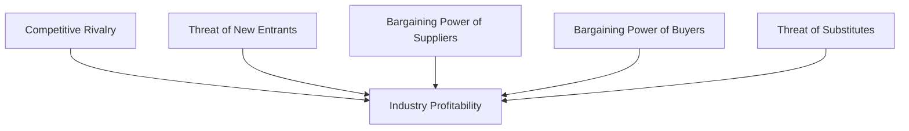

# Business Concept #1: Strategy

> "Strategy is about making choices, trade-offs; it's about deliberately choosing to be different." - Michael Porter

## Definition

Strategy is the integrated set of choices that positions an organization to create unique value. For engineering leaders, strategy means building technical capabilities and making architectural decisions that create sustainable competitive advantage—not just solving today's problems, but positioning for tomorrow's opportunities.

## Core Strategic Frameworks

### 1. Porter's Five Forces

Understanding competitive dynamics in your industry:



**Engineering Applications**:
- **Rivalry**: How does our tech stack compare to competitors?
- **New Entrants**: What technical moats prevent disruption?
- **Suppliers**: Vendor lock-in risks (cloud, tools, talent)
- **Buyers**: Customer switching costs via integration
- **Substitutes**: Open source alternatives, new paradigms

### 2. Blue Ocean Strategy

Creating uncontested market space:

| Red Ocean | Blue Ocean |
|-----------|------------|
| Compete in existing markets | Create new markets |
| Beat the competition | Make competition irrelevant |
| Exploit existing demand | Create and capture new demand |
| Value-cost trade-off | Break the value-cost trade-off |

**Engineering Example**: Netflix streaming
- **Eliminated**: Physical media, late fees
- **Reduced**: Content selection (initially)
- **Raised**: Convenience, instant access
- **Created**: Binge-watching, algorithmic recommendations

### 3. Disruption Theory (Christensen)

How new technologies overturn established players:

```
Performance
    ^
    |     Sustaining Innovation
    |    /
    |   / Market Needs
    |  /  ---------------
    | /  /
    |/  / Disruptive Innovation
    +-----------------------> Time
```

**Engineering Implications**:
- Don't over-serve current customers
- Watch for "good enough" alternatives
- Consider modular architectures
- Enable business model innovation

### 4. Platform Strategy

Building ecosystems that create network effects:

**Key Elements**:
1. **Core functionality** (what you build)
2. **APIs/Extensions** (what others build)
3. **Governance rules** (how ecosystem operates)
4. **Economic model** (how value is shared)

**Success Factors**:
- Lower barriers to entry
- Provide clear value to all sides
- Maintain quality without stifling innovation
- Capture fair value without being greedy

## Strategic Thinking for Engineering Leaders

### 1. Technical Strategy Components

<div class="strategy-framework">

**Vision**: Where are we going?
- 3-5 year technical north star
- Inspiring but achievable
- Aligned with business strategy

**Capabilities**: What must we be great at?
- Core technical competencies
- Differentiating skills
- Platform capabilities

**Architecture**: How do we organize?
- System design principles
- Technology choices
- Team structures (Conway's Law)

**Roadmap**: What's the sequence?
- Prioritized initiatives
- Dependency management
- Resource allocation

**Metrics**: How do we measure success?
- Business outcomes
- Technical health
- Team effectiveness

</div>

### 2. The Strategy Stack

```
Business Strategy
    ↓ (informs)
Product Strategy  
    ↓ (enables)
Technical Strategy
    ↓ (guides)
Team Strategy
    ↓ (executes)
Individual Growth
```

Each level must align with and enable the level above.

### 3. Strategic Decision Frameworks

#### Build vs. Buy vs. Partner

| Factor | Build | Buy | Partner |
|--------|-------|-----|---------|
| **When** | Core differentiator | Commodity capability | Complementary strength |
| **Control** | Maximum | Minimal | Shared |
| **Cost** | High initial, low ongoing | Low initial, high ongoing | Medium both |
| **Speed** | Slowest | Fastest | Medium |
| **Risk** | Execution risk | Vendor risk | Relationship risk |

#### Technical Debt as Strategic Choice

Not all debt is bad:
- **Strategic debt**: Conscious trade-off for speed
- **Tactical debt**: Shortcuts that enable learning
- **Negligent debt**: Lazy or uninformed decisions
- **Reckless debt**: Knowing better but not caring

Strategic approach: Take debt deliberately, pay it down systematically.

## Strategic Patterns in Engineering

### Pattern 1: The Platform Play

**Strategy**: Build once, leverage many times
**Example**: Amazon's transition from monolith to services to AWS
**Key Moves**:
1. Identify common needs across products
2. Abstract into reusable services
3. Dogfood internally
4. Expose externally
5. Create ecosystem

### Pattern 2: The Open Source Gambit

**Strategy**: Commoditize complements, monetize core
**Example**: Google with Android, Kubernetes
**Key Moves**:
1. Open source non-differentiating layers
2. Build community and mindshare
3. Monetize through services/support
4. Shape industry standards
5. Reduce competitor moats

### Pattern 3: The Data Network Effect

**Strategy**: More users → more data → better product → more users
**Example**: Google Search, Netflix recommendations
**Key Moves**:
1. Instrument everything
2. Build ML/data capabilities
3. Create personalization
4. Increase switching costs
5. Compound advantage over time

### Pattern 4: The Developer Experience Moat

**Strategy**: Make developers love you, they'll bring companies
**Example**: Stripe, Twilio, GitHub
**Key Moves**:
1. Obsess over API design
2. Excellent documentation
3. Fast onboarding
4. Great debugging tools
5. Responsive support

## Strategic Planning Process

### 1. Environmental Scanning

**External Analysis**:
- Technology trends (Gartner, ThoughtWorks)
- Competitive moves
- Customer needs evolution
- Regulatory changes
- Talent market shifts

**Internal Analysis**:
- Technical capabilities audit
- Architectural debt assessment
- Team skills inventory
- System reliability trends
- Innovation velocity

### 2. Strategic Options Generation

For any strategic challenge, generate multiple options:

**Example**: Scaling to 10x users
- **Option A**: Vertical scaling (bigger machines)
- **Option B**: Horizontal scaling (more machines)
- **Option C**: Architectural overhaul (microservices)
- **Option D**: Hybrid approach (selective decomposition)

Evaluate each against:
- Cost (initial + ongoing)
- Risk (technical + organizational)  
- Time to value
- Future flexibility
- Team capability

### 3. Strategy Communication

The best strategy fails without buy-in:

```markdown
## Technical Strategy One-Pager

**Vision**: Where we're going and why

**Current State**: Honest assessment
- Strengths to leverage
- Gaps to address
- Risks to mitigate

**Strategic Pillars**: 3-5 major initiatives
- Pillar 1: [What and why]
- Pillar 2: [What and why]
- Pillar 3: [What and why]

**Success Metrics**: How we'll measure progress
- Business outcomes
- Technical improvements
- Team development

**Roadmap**: Sequenced milestones
- Q1: Foundations
- Q2: Early wins
- Q3: Acceleration
- Q4: Transformation
```

## Common Strategic Failures

### 1. Strategy vs. Planning Confusion
**Planning**: We'll migrate to microservices
**Strategy**: We'll enable autonomous teams through architectural boundaries

Strategy is about choices and trade-offs, not just activities.

### 2. Technology for Technology's Sake
Adopting Kubernetes because it's cool vs. because it enables specific strategic advantages.

### 3. Ignoring Organizational Reality
Great technical strategy that requires capabilities the organization doesn't have and can't build.

### 4. Lack of Courage
Incremental improvements when transformation is needed. Playing not to lose instead of playing to win.

## Strategic Thinking in Action

### Case Study: Technical Platform Strategy

**Context**: E-commerce company hitting scaling limits

**Strategic Analysis**:
- **Five Forces**: New entrants using modern cloud-native architectures
- **Internal**: Monolith limiting team autonomy and deployment speed
- **Opportunity**: Platform approach could enable new business models

**Strategic Choices**:
1. **Where to Play**: Platform for internal teams first, then partners
2. **How to Win**: Best developer experience in industry
3. **Capabilities**: API design, distributed systems, DevOps excellence
4. **Not Doing**: Full microservices (too complex), staying monolithic (too limiting)

**Execution**:
- Year 1: Extract core services (authentication, payments)
- Year 2: Build platform tools (deployment, monitoring)
- Year 3: Open to partners, new revenue stream

**Results**:
- Deployment frequency: 2/month → 100+/day
- Team autonomy: High satisfaction scores
- New revenue: 15% from platform services
- Competitive position: Seen as technical leader

## Interview Mastery: Demonstrating Strategic Thinking

### Strategic Story Structure

```
Context: Business and technical landscape
Analysis: What I observed (forces, trends, gaps)
Options: Different paths considered
Choice: What we decided and why (trade-offs)
Execution: How we implemented
Results: Business and technical outcomes
Learning: Strategic insights gained
```

### Power Phrases
- "Our strategic analysis revealed..."
- "We had to choose between X and Y, we chose X because..."
- "This created sustainable competitive advantage through..."
- "The strategic trade-off was..."
- "Looking at the five forces..."

### Red Flags to Avoid
- Describing tactics without strategy
- No clear trade-offs or choices
- Technology decisions without business context
- Following trends without analysis
- No competitive consideration

## Developing Strategic Thinking

### Daily Practices
- Ask "why" before "how"
- Consider second-order effects
- Think in terms of systems and capabilities
- Look for patterns across decisions

### Weekly Exercises
- Analyze competitor technical moves
- Review major decisions for strategic alignment
- Practice explaining technical choices in business terms

### Quarterly Development
- Create/update technical strategy document
- Present strategy to non-technical stakeholders
- Study successful platform strategies
- Analyze failed technical strategies

### Recommended Resources
- "Good Strategy Bad Strategy" - Rumelt
- "The Innovator's Dilemma" - Christensen  
- "Platform Revolution" - Parker et al.
- "Crossing the Chasm" - Moore
- High Scalability blog for technical strategies

## Connection to First Principles

- **[Value Creation](../../level-1-first-principles/value-creation/)**: Strategy determines how we create unique value
- **[Decision-Making](../../level-1-first-principles/decision-making/)**: Strategic choices are the highest-impact decisions
- **[Systems Thinking](../../level-1-first-principles/systems-thinking/)**: Strategy requires understanding competitive systems
- **[Human Behavior](../../level-1-first-principles/human-behavior/)**: Strategy must account for organizational capability
- **[Integrity & Ethics](../../level-1-first-principles/integrity-ethics/)**: Sustainable strategy requires ethical foundation

## Connection to Other Business Concepts

- **[Leadership](../leadership/)**: Strategy without execution is hallucination
- **[Operations](../operations/)**: Strategy guides operational choices
- **[Finance](../finance/)**: Strategy must be economically viable
- **[Risk & Governance](../risk-governance/)**: Strategic choices create new risks

## Application in Level III

- **[Technical Leadership](../../level-3-applications/technical-leadership/)**: Translating business strategy to technical strategy
- **[Organizational Design](../../level-3-applications/organizational-design/)**: Aligning structure with strategy (Conway's Law)
- **[Business Acumen](../../level-3-applications/business-acumen/)**: Connecting engineering to strategic outcomes
- **[People Management](../../level-3-applications/people-management/)**: Building teams for strategic capabilities

## Interview Application (Level IV)

- **[Technical Leadership Interviews](../../level-4-interview-execution/technical-leadership/)**: Demonstrating strategic technical thinking
- **[System Design](../../level-4-interview-execution/system-org-design/)**: Strategic approach to architecture
- **[Behavioral Stories](../../level-4-interview-execution/behavioral/)**: Showing strategic impact

## Next Steps

1. **This Week**: Analyze your current technical strategy using Porter's Five Forces
2. **This Month**: Create a one-page technical strategy for your area
3. **This Quarter**: Present strategy to non-technical stakeholders
4. **For Interviews**: Prepare 3 stories demonstrating strategic thinking

---

*Continue your journey: Explore how [Leadership](../leadership/) transforms strategic vision into organizational reality, or see how [Technical Leadership](../../level-3-applications/technical-leadership/) applies strategic thinking in practice.*