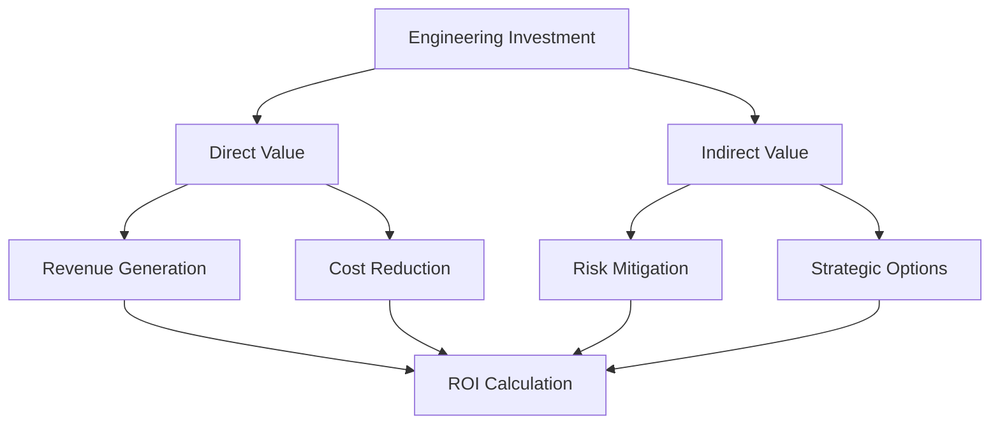

# Business Acumen

## Aligning Engineering Excellence with Business Success

Business acumen for engineering leaders means understanding how technical decisions impact business outcomes, effectively managing resources, and communicating value to stakeholders across the organization.

## Core Competencies

### 1. Business Metrics & KPIs
- **Engineering Metrics**: Velocity, quality, reliability measures
- **Business Metrics**: Revenue impact, cost optimization, ROI
- **OKR Management**: Set and track objectives and key results
- **Data-Driven Decisions**: Use metrics to guide choices

[Metrics That Matter →](business-metrics.md)

### 2. Financial Management
- **Budget Planning**: Create and manage engineering budgets
- **Cost Optimization**: Reduce infrastructure and operational costs
- **ROI Analysis**: Quantify engineering investment returns
- **Resource Allocation**: Optimize people and technology spend

[Engineering Economics →](#business-understanding)

### 3. Stakeholder Management
- **Executive Communication**: Present to C-suite effectively
- **Cross-Functional Partnership**: Align with Product, Sales, Marketing
- **Board Reporting**: Prepare technical updates for board meetings
- **Customer Engagement**: Understand and address customer needs

[Stakeholder Excellence →](#stakeholder-management)

### 4. Strategic Planning
- **Roadmap Development**: Create multi-quarter technical plans
- **Competitive Analysis**: Understand market and technology trends
- **Risk Management**: Identify and mitigate business risks
- **Innovation Strategy**: Balance maintenance with innovation

[Strategic Leadership →](#strategic-planning)

### 5. Product Partnership
- **Product Strategy**: Align technical and product vision
- **Feature Prioritization**: Make trade-offs based on business value
- **Time-to-Market**: Optimize delivery speed vs quality
- **Customer Focus**: Build with user needs in mind

[Product Partnership →](#product-business-alignment)

## Common Scenarios

### Scenario 1: Budget Reduction
```
Context: 20% budget cut required across engineering
Challenge: Maintain productivity while reducing costs
Approach: Data-driven optimization of tools, vendors, and priorities
```

### Scenario 2: Build vs Buy Decision
```
Context: Core platform component needs replacement
Challenge: Justify engineering investment vs vendor solution
Approach: Total cost of ownership analysis with risk assessment
```

### Scenario 3: Executive Presentation
```
Context: Quarterly board update on engineering progress
Challenge: Translate technical achievements to business impact
Approach: Focus on customer value and financial outcomes
```

## Interview Question Patterns

### Business Strategy Questions
- "How do you prioritize engineering work against business goals?"
- "Describe a time you influenced product strategy"
- "How do you measure engineering ROI?"

### Financial Questions
- "How would you reduce engineering costs by 30%?"
- "Walk through your budget planning process"
- "How do you justify headcount increases?"

### Stakeholder Questions
- "How do you communicate technical debt to executives?"
- "Describe managing competing stakeholder priorities"
- "How do you handle unrealistic business demands?"

## Excellence Indicators

| Level | Business Acumen Characteristics |
|-------|--------------------------------|
| **L4** | Understands team-level metrics and costs |
| **L5** | Manages budgets, partners with product |
| **L6** | Drives departmental strategy and P&L |
| **L7** | Shapes company strategy and board engagement |

## Key Business Frameworks

### 1. Engineering ROI Model


### 2. Stakeholder Influence Matrix
| Stakeholder | Interest | Influence | Engagement Strategy |
|-------------|----------|-----------|-------------------|
| CEO | High | High | Regular 1:1s, strategic alignment |
| CFO | Medium | High | Quarterly reviews, cost focus |
| CPO | High | High | Weekly sync, shared OKRs |
| Sales | Medium | Medium | Monthly updates, SLA focus |

### 3. Technology Investment Framework
- **Run**: Keep the lights on (50-60%)
- **Grow**: Enhance capabilities (20-30%)
- **Transform**: Innovation initiatives (20-30%)

## Communication Templates

### Executive Summary Format
1. **Business Context** (1 paragraph)
2. **Key Achievements** (3-5 bullets)
3. **Challenges & Mitigations** (2-3 items)
4. **Resource Needs** (specific asks)
5. **Next Quarter Focus** (3 priorities)

### Board Presentation Structure
1. **Engineering Health Metrics** (1 slide)
2. **Business Impact Delivered** (2 slides)
3. **Strategic Initiatives Progress** (2 slides)
4. **Risks and Mitigations** (1 slide)
5. **Investment Requests** (1 slide)

## Anti-Patterns to Avoid

1. **Technical Myopia**: Focusing only on technical metrics
2. **Over-Promising**: Committing to unrealistic timelines
3. **Under-Communicating**: Not sharing progress/challenges
4. **Misalignment**: Working on low-business-value projects
5. **Cost Ignorance**: Not understanding financial impact

## Business Acumen Toolkit

### Analysis Tools
- ROI Calculator
- Technical Debt Quantifier
- Budget Planning Worksheet

### Communication Resources
- Executive Briefing Templates
- Business Case Framework
- Metrics Dashboard Examples

## Practice Exercises

1. **Financial Modeling**: Create engineering budget proposals
2. **Executive Roleplay**: Practice C-suite presentations
3. **Business Cases**: Write justifications for technical initiatives
4. **Stakeholder Scenarios**: Navigate conflicting priorities

## Resources

### Essential Business Knowledge
- "The Lean Startup" by Eric Ries
- "Good Strategy Bad Strategy" by Richard Rumelt
- "The First 90 Days" by Michael Watkins

### Finance for Engineers
- Engineering Manager's Guide to Finance
- Understanding P&L Statements
- Budgeting Best Practices

## Business Understanding

*Section to be completed*

## Product Business Alignment

*Section to be completed*

## Stakeholder Management

*Section to be completed*

## Strategic Planning

*Section to be completed*

## Next Steps

- Complete [Business Acumen Assessment](../../interactive-tools/self-assessment.md#business)
- Review [Business Metrics Guide](business-metrics.md)
- Practice [Stakeholder Negotiation](../../practice-scenarios/stakeholder-negotiation-scenario.md)
