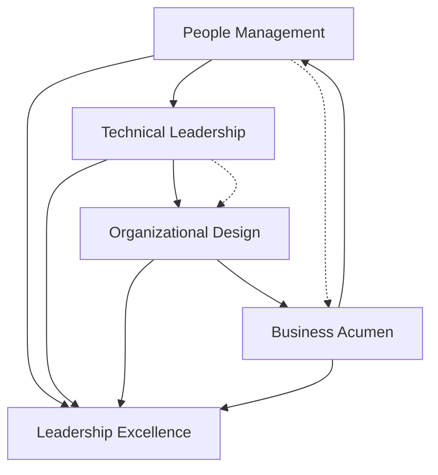

# Level III: Real-World Applications

## Overview

Level 3 Applications
description: Level 3 Applications overview and navigation
---

# Level III: Real-World Applications

## Table of Contents

- [The 4 Domains of Engineering Leadership Excellence](#the-4-domains-of-engineering-leadership-excellence)
- [Domain Integration Matrix](#domain-integration-matrix)
- [How to Use This Level](#how-to-use-this-level)
  - [1. Self-Assessment](#1-self-assessment)
  - [2.

**Reading time:** ~3 minutes

## Table of Contents

- [The 4 Domains of Engineering Leadership Excellence](#the-4-domains-of-engineering-leadership-excellence)
- [Domain Integration Matrix](#domain-integration-matrix)
- [How to Use This Level](#how-to-use-this-level)
  - [1. Self-Assessment](#1-self-assessment)
  - [2. Scenario Practice](#2-scenario-practice)
  - [3. Interview Preparation](#3-interview-preparation)
- [Cross-Domain Integration](#cross-domain-integration)
- [Success Patterns](#success-patterns)
  - [Domain Mastery Progression](#domain-mastery-progression)
- [Navigation Guide](#navigation-guide)
  - [:material-navigation: Your Learning Path](#material-navigation-your-learning-path)
- [Foundation in First Principles](#foundation-in-first-principles)
- [Powered by Business Concepts](#powered-by-business-concepts)
- [Quick Links](#quick-links)
  - [Domain Deep Dives](#domain-deep-dives)
  - [Practice & Preparation](#practice-preparation)
- [Next Steps](#next-steps)

## The 4 Domains of Engineering Leadership Excellence

Level III transforms theoretical knowledge into practical application through four critical domains that define engineering leadership success. Each domain requires mastery of specific competencies demonstrated through real-world scenarios.

-   :material-account-group: **People Management**
    
    Build and lead high-performing engineering teams through effective hiring, performance management, career development, and culture building.
    
    [Explore People Management →](../engineering-leadership/level-3-applications/people-management/)

-   :material-rocket-launch: **Technical Leadership**
    
    Drive technical excellence through architecture decisions, technology strategy, innovation management, and engineering best practices.
    
    [Explore Technical Leadership →](../engineering-leadership/level-3-applications/technical-leadership/)

-   :material-sitemap: **Organizational Design**
    
    Scale engineering organizations through effective team structures, communication systems, process optimization, and change management.
    
    [Explore Organizational Design →](../engineering-leadership/level-3-applications/organizational-design/)

-   :material-chart-line: **Business Acumen**
    
    Align engineering with business objectives through metrics, stakeholder management, resource allocation, and strategic planning.
    
    [Explore Business Acumen →](../engineering-leadership/level-3-applications/business-acumen/)

## Domain Integration Matrix

| Domain | Core Focus | Key Competencies | Interview Weight |
|--------|------------|------------------|------------------|
| **People Management** | Team Excellence | Hiring, Performance, Development, Culture | 30-40% |
| **Technical Leadership** | Technical Excellence | Architecture, Strategy, Innovation, Standards | 25-35% |
| **Organizational Design** | Structural Excellence | Scaling, Process, Communication, Change | 20-30% |
| **Business Acumen** | Business Alignment | Metrics, Stakeholders, Resources, Strategy | 15-25% |

## How to Use This Level

### 1. Self-Assessment
- Evaluate your current expertise in each domain
- Identify gaps and prioritize development areas
- Use domain-specific rubrics for objective assessment

### 2. Scenario Practice
- Work through real-world scenarios in each domain
- Practice cross-domain problem solving
- Build pattern recognition for common challenges

### 3. Interview Preparation
- Map job requirements to specific domains
- Prepare STAR stories for each competency area
- Practice domain-specific question types

## Cross-Domain Integration

Real engineering leadership requires seamless integration across all four domains:

## Success Patterns

### Domain Mastery Progression

1. **Foundation** (IC → TL)
   - Deep technical expertise
   - Mentoring individuals
   - Project leadership

2. **Expansion** (TL → EM)
   - Team management
   - Process development
   - Cross-team collaboration

3. **Scale** (EM → Director)
   - Multi-team leadership
   - Organizational design
   - Strategic planning

4. **Impact** (Director → VP)
   - Company-wide influence
   - Executive partnership
   - Culture transformation

## Navigation Guide

### :material-navigation: Your Learning Path

1. **Start**: Assess current strengths across domains
2. **Focus**: Deep dive into weakest domain first
3. **Practice**: Work through scenarios and case studies
4. **Integrate**: Apply cross-domain thinking
5. **Master**: Demonstrate expertise in interviews

## Foundation in First Principles

Each application domain is grounded in [Level I: First Principles](../engineering-leadership/level-1-first-principles/):

- **People Management** centers on [Human Behavior](../engineering-leadership/level-1-first-principles/human-behavior/)
- **Technical Leadership** maximizes [Value Creation](../engineering-leadership/level-1-first-principles/value-creation/)
- **Organizational Design** applies [Systems Thinking](../engineering-leadership/level-1-first-principles/systems-thinking/)
- **Business Acumen** integrates all principles for impact

## Powered by Business Concepts

Applications leverage [Level II: Core Business Concepts](../engineering-leadership/level-2-core-business/):

- **[Leadership](../engineering-leadership/level-2-core-business/leadership/)** frameworks guide people management
- **[Strategy](../engineering-leadership/level-2-core-business/strategy/)** informs technical direction
- **[Operations](../engineering-leadership/level-2-core-business/operations/)** enables organizational scale
- **[Finance](../engineering-leadership/level-2-core-business/finance/)** drives business acumen

## Quick Links

### Domain Deep Dives
- [People Management](../engineering-leadership/level-3-applications/people-management/) - Build high-performing teams
- [Technical Leadership](../engineering-leadership/level-3-applications/technical-leadership/) - Drive technical excellence
- [Organizational Design](../engineering-leadership/level-3-applications/organizational-design/) - Scale effectively
- [Business Acumen](../engineering-leadership/level-3-applications/business-acumen/) - Connect to business value

### Practice & Preparation
- [Cross-Domain Scenarios](../engineering-leadership/practice-scenarios/) - Real-world challenges
- [Interview Execution Guide](../engineering-leadership/level-4-interview-execution/) - Demonstrate mastery
- [Hard-Earned Wisdom](../engineering-leadership/hard-earned-wisdom/) - Learn from experience

## Next Steps

1. **Assess**: Identify your strongest and weakest domains
2. **Study**: Deep dive into your development areas
3. **Practice**: Work through scenarios that integrate domains
4. **Apply**: Use these concepts in your current role
5. **Prepare**: Map experiences to interview stories