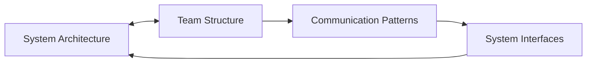

# Organizational Design

## Scaling Engineering Organizations for Maximum Impact

Organizational design encompasses the structures, processes, and systems that enable engineering teams to operate effectively at scale. It's about creating environments where teams can deliver value efficiently while maintaining autonomy and alignment.

## Core Competencies

### 1. Team Structure & Topology
- **Team Design**: Create effective team boundaries and interfaces
- **Scaling Models**: Choose between functional, cross-functional, or matrix structures
- **Conway's Law**: Align organization structure with system architecture
- **Team Autonomy**: Balance independence with coordination

[Team Topologies Guide →](team-topologies.md)

### 2. Process & Workflow Optimization
- **Development Methodology**: Implement appropriate agile practices
- **Release Management**: Design deployment and release processes
- **Incident Response**: Build effective on-call and incident systems
- **Change Management**: Navigate organizational transformations

[Process Excellence →](process-optimization.md)

### 3. Communication Systems
- **Information Flow**: Design effective communication channels
- **Meeting Culture**: Optimize meeting frequency and structure
- **Documentation**: Establish knowledge management practices
- **Transparency**: Create visibility into decisions and progress

[Communication Architecture →](communication-systems.md)

### 4. Scaling Engineering
- **Growth Planning**: Prepare organization for 2x, 5x, 10x scale
- **Hiring Strategy**: Build scalable recruiting processes
- **Onboarding**: Design efficient ramp-up programs
- **Culture Preservation**: Maintain values during growth

[Scaling Playbook →](scaling-engineering.md)

### 5. Organizational Change
- **Reorganization**: Execute team structure changes
- **Process Evolution**: Improve workflows incrementally
- **Cultural Transformation**: Shift organizational mindsets
- **Change Communication**: Lead through transitions

[Change Leadership →](organizational-change.md)

## Common Scenarios

### Scenario 1: Startup to Scale-up Transition
```
Context: 20-person engineering team growing to 100
Challenge: Maintain velocity while adding structure
Approach: Phased introduction of processes and specialization
```

### Scenario 2: Cross-Team Dependencies
```
Context: Feature delivery blocked by inter-team coordination
Challenge: Reduce dependencies without duplicating effort
Approach: Service ownership model with clear interfaces
```

### Scenario 3: Remote-First Transformation
```
Context: Transitioning from co-located to distributed teams
Challenge: Maintain collaboration and culture remotely
Approach: Asynchronous-first processes with intentional sync points
```

## Interview Question Patterns

### Organizational Design Questions
- "How would you structure a 200-person engineering org?"
- "Describe your approach to reducing cross-team dependencies"
- "How do you maintain startup agility at scale?"

### Process Questions
- "How would you improve a team's deployment velocity?"
- "What's your approach to technical decision-making?"
- "How do you balance standardization vs team autonomy?"

### Change Management Questions
- "How would you merge two engineering cultures?"
- "Describe leading a major process change"
- "How do you handle resistance to organizational change?"

## Excellence Indicators

| Level | Organizational Design Characteristics |
|-------|--------------------------------------|
| **L4** | Optimizes single team processes |
| **L5** | Designs multi-team interactions |
| **L6** | Architects organizational systems |
| **L7** | Transforms company-wide operations |

## Organizational Models Comparison

| Model | Best For | Pros | Cons |
|-------|----------|------|------|
| **Functional** | Specialized skills | Deep expertise | Coordination overhead |
| **Cross-functional** | Product delivery | Fast iteration | Skill duplication |
| **Matrix** | Complex projects | Resource flexibility | Unclear ownership |
| **Spotify Model** | Autonomous teams | High engagement | Requires maturity |

## Design Principles

### 1. Conway's Law Application


### 2. Dunbar's Number Constraints
- Keep teams 5-9 people
- Limit direct reports to 7±2
- Structure organizations in hierarchical groups

### 3. Autonomy vs Alignment Matrix
- High Autonomy + High Alignment = Peak Performance
- Balance through shared goals and clear boundaries

## Anti-Patterns to Avoid

1. **Premature Optimization**: Adding process before it's needed
2. **Copy-Paste Organization**: Blindly copying other companies
3. **Reorg Addiction**: Constant structural changes
4. **Process Theater**: Process for process's sake
5. **Communication Overload**: Too many meetings/channels

## Organizational Design Toolkit

### Assessment Tools
- [Organizational Health Check](tools/org-health.md)
- [Team Topology Mapper](tools/topology-mapper.md)
- [Process Maturity Model](tools/process-maturity.md)

### Templates
- [Team Charter Template](templates/team-charter.md)
- [RACI Matrix Builder](templates/raci-matrix.md)
- [Communication Plan](templates/comm-plan.md)

## Practice Exercises

1. **Org Design Challenge**: Restructure a dysfunctional organization
2. **Process Optimization**: Improve a broken workflow
3. **Scaling Simulation**: Plan growth from 50 to 500 engineers
4. **Change Scenario**: Lead a major transformation

## Resources

### Essential Reading
- "Team Topologies" by Skelton & Pais
- "Accelerate" by Forsgren, Humble, and Kim
- "The Five Dysfunctions of a Team" by Lencioni

### Case Studies
- [Spotify Engineering Culture](case-studies/spotify.md)
- [Amazon Two-Pizza Teams](case-studies/amazon.md)
- [Google's SRE Model](case-studies/google-sre.md)

## Next Steps

- Complete [Organizational Assessment](../../interactive-tools/self-assessment.md#organizational)
- Study [Scaling Patterns](scaling-engineering.md)
- Practice [Reorg Scenarios](../../practice-scenarios/reorg-scenario.md)