# Organizational Design


## Overview

Organizational Design
description: Organizational Design overview and navigation
---

# Organizational Design

## Table of Contents

- [Scaling Engineering Organizations for Maximum Impact](#scaling-engineering-organizations-for-maximum-impact)
- [Core Competencies](#core-competencies)
  - [1. Conway's Law as a Design Tool](#1-conways-law-as-a-design-tool)
  - [2.

**Reading time:** ~11 minutes

## Table of Contents

- [Scaling Engineering Organizations for Maximum Impact](#scaling-engineering-organizations-for-maximum-impact)
- [Core Competencies](#core-competencies)
  - [1. Conway's Law as a Design Tool](#1-conways-law-as-a-design-tool)
  - [2. Team Structure & Topology](#2-team-structure-topology)
  - [3. Cognitive Load Optimization](#3-cognitive-load-optimization)
  - [2. Process & Workflow Optimization](#2-process-workflow-optimization)
  - [3. Communication Systems](#3-communication-systems)
  - [4. Scaling Engineering](#4-scaling-engineering)
  - [5. Organizational Change](#5-organizational-change)
- [Common Scenarios](#common-scenarios)
  - [Scenario 1: Startup to Scale-up Transition](#scenario-1-startup-to-scale-up-transition)
  - [Scenario 2: Cross-Team Dependencies](#scenario-2-cross-team-dependencies)
  - [Scenario 3: Remote-First Transformation](#scenario-3-remote-first-transformation)
- [Interview Question Patterns](#interview-question-patterns)
  - [Organizational Design Questions](#organizational-design-questions)
  - [Process Questions](#process-questions)
  - [Change Management Questions](#change-management-questions)
- [Excellence Indicators](#excellence-indicators)
- [Organizational Models Comparison](#organizational-models-comparison)
- [Conway's Law as Design Tool](#conways-law-as-design-tool)
  - [The Inverse Conway Maneuver](#the-inverse-conway-maneuver)
  - [Organizational Design Strategies](#organizational-design-strategies)
  - [Practical Conway's Law Applications](#practical-conways-law-applications)
    - [Example 1: E-commerce Microservices](#example-1-e-commerce-microservices)
    - [Example 2: Monolith to Microservices Migration](#example-2-monolith-to-microservices-migration)
- [Team Topologies Framework](#team-topologies-framework)
  - [Four Fundamental Team Types](#four-fundamental-team-types)
    - [1. Stream-Aligned Teams](#1-stream-aligned-teams)
    - [2. Platform Teams](#2-platform-teams)
    - [3. Enabling Teams](#3-enabling-teams)
    - [4. Complicated Subsystem Teams](#4-complicated-subsystem-teams)
  - [Team Interaction Modes](#team-interaction-modes)
  - [When to Use Each Topology](#when-to-use-each-topology)
  - [Critical Insight: Over-reliance on Subsystem Teams](#critical-insight-over-reliance-on-subsystem-teams)
- [Cognitive Load Management](#cognitive-load-management)
  - [Understanding Cognitive Load Types](#understanding-cognitive-load-types)
    - [1. Intrinsic Load](#1-intrinsic-load)
    - [2. Extraneous Load](#2-extraneous-load)
    - [3. Germane Load](#3-germane-load)
  - [Cognitive Load Assessment Framework](#cognitive-load-assessment-framework)
  - [Strategies for Cognitive Load Reduction](#strategies-for-cognitive-load-reduction)
    - [1. Platform Engineering Approach](#1-platform-engineering-approach)
    - [2. Tool Standardization](#2-tool-standardization)
    - [3. Self-Service Capabilities](#3-self-service-capabilities)
  - [The Real Bottleneck: Human Cognitive Capacity](#the-real-bottleneck-human-cognitive-capacity)
- [Modern Tooling and Practices](#modern-tooling-and-practices)
  - [Team Topology Mapping Tools](#team-topology-mapping-tools)
    - [1. Organizational Network Analysis](#1-organizational-network-analysis)
    - [2. Dependency Mapping](#2-dependency-mapping)
    - [3. Cognitive Load Assessment](#3-cognitive-load-assessment)
  - [Metrics for Organizational Effectiveness](#metrics-for-organizational-effectiveness)
    - [Flow Metrics (DORA)](#flow-metrics-dora)
    - [Team Health Metrics](#team-health-metrics)
    - [Organizational Network Metrics](#organizational-network-metrics)
  - [AI-Assisted Organizational Design](#ai-assisted-organizational-design)
    - [1. Communication Pattern Analysis](#1-communication-pattern-analysis)
    - [2. Workload Distribution Optimization](#2-workload-distribution-optimization)
    - [3. Predictive Organizational Health](#3-predictive-organizational-health)
- [Design Principles](#design-principles)
  - [1. Conway's Law Application](#1-conways-law-application)
  - [2. Cognitive Load Optimization](#2-cognitive-load-optimization)
  - [3. Dunbar's Number Constraints](#3-dunbars-number-constraints)
  - [4. Autonomy vs Alignment Matrix](#4-autonomy-vs-alignment-matrix)
  - [5. Team-First Thinking](#5-team-first-thinking)
- [Anti-Patterns to Avoid](#anti-patterns-to-avoid)
  - [Traditional Anti-Patterns](#traditional-anti-patterns)
  - [Modern Anti-Patterns](#modern-anti-patterns)
- [Organizational Design Toolkit](#organizational-design-toolkit)
  - [Assessment Tools](#assessment-tools)
  - [Templates](#templates)
  - [Modern Tools](#modern-tools)
- [Practice Exercises](#practice-exercises)
- [Resources](#resources)
  - [Essential Reading](#essential-reading)
  - [Modern Resources](#modern-resources)
  - [Case Studies](#case-studies)
- [Next Steps](#next-steps)


## Scaling Engineering Organizations for Maximum Impact

Organizational design encompasses the structures, processes, and systems that enable engineering teams to operate effectively at scale. It's about creating environments where teams can deliver value efficiently while maintaining autonomy and alignment.

## Core Competencies

### 1. Conway's Law as a Design Tool
- **Inverse Conway Maneuver**: Design org structure to drive desired architecture
- **System-Team Co-evolution**: Align organizational design with technical goals
- **Architecture-First Reorganization**: Use intended system design to inform team structure
- **Communication Path Optimization**: Structure teams to minimize coordination overhead

[Conway's Law Deep Dive →](#conways-law-as-design-tool)

### 2. Team Structure & Topology
- **Team Design**: Create effective team boundaries and interfaces
- **Scaling Models**: Choose between functional, cross-functional, or matrix structures
- **Cognitive Load Management**: Optimize team responsibilities for human limitations
- **Team Autonomy**: Balance independence with coordination

[Team Topologies Guide →](../../architects-handbook/human-factors/team-topologies.md)

### 3. Cognitive Load Optimization
- **Load Assessment**: Measure and monitor team cognitive burden
- **Extraneous Load Reduction**: Eliminate unnecessary complexity and friction
- **Intrinsic Load Optimization**: Match work complexity to team capabilities
- **Platform Engineering**: Reduce operational cognitive load through abstraction

[Cognitive Load Management →](#cognitive-load-management)

### 2. Process & Workflow Optimization
- **Development Methodology**: Implement appropriate agile practices
- **Release Management**: Design deployment and release processes
- **Incident Response**: Build effective on-call and incident systems
- **Change Management**: Navigate organizational transformations

[Process Excellence →](#process-workflow-optimization)

### 3. Communication Systems
- **Information Flow**: Design effective communication channels
- **Meeting Culture**: Optimize meeting frequency and structure
- **Documentation**: Establish knowledge management practices
- **Transparency**: Create visibility into decisions and progress

[Communication Architecture →](#communication-systems)

### 4. Scaling Engineering
- **Growth Planning**: Prepare organization for 2x, 5x, 10x scale
- **Hiring Strategy**: Build scalable recruiting processes
- **Onboarding**: Design efficient ramp-up programs
- **Culture Preservation**: Maintain values during growth

[Scaling Playbook →](#scaling-engineering)

### 5. Organizational Change
- **Reorganization**: Execute team structure changes
- **Process Evolution**: Improve workflows incrementally
- **Cultural Transformation**: Shift organizational mindsets
- **Change Communication**: Lead through transitions

[Change Leadership →](#organizational-change)

## Common Scenarios

### Scenario 1: Startup to Scale-up Transition
```
Context: 20-person engineering team growing to 100
Challenge: Maintain velocity while adding structure
Approach: Phased introduction of processes and specialization
```

### Scenario 2: Cross-Team Dependencies
```
Context: Feature delivery blocked by inter-team coordination
Challenge: Reduce dependencies without duplicating effort
Approach: Service ownership model with clear interfaces
```

### Scenario 3: Remote-First Transformation
```
Context: Transitioning from co-located to distributed teams
Challenge: Maintain collaboration and culture remotely
Approach: Asynchronous-first processes with intentional sync points
```

## Interview Question Patterns

### Organizational Design Questions
- "How would you structure a 200-person engineering org?"
- "Describe your approach to reducing cross-team dependencies"
- "How do you maintain startup agility at scale?"

### Process Questions
- "How would you improve a team's deployment velocity?"
- "What's your approach to technical decision-making?"
- "How do you balance standardization vs team autonomy?"

### Change Management Questions
- "How would you merge two engineering cultures?"
- "Describe leading a major process change"
- "How do you handle resistance to organizational change?"

## Excellence Indicators

| Level | Organizational Design Characteristics |
|-------|--------------------------------------|
| **L4** | Optimizes single team processes |
| **L5** | Designs multi-team interactions |
| **L6** | Architects organizational systems |
| **L7** | Transforms company-wide operations |

## Organizational Models Comparison

| Model | Best For | Pros | Cons |
|-------|----------|------|------|
| **Functional** | Specialized skills | Deep expertise | Coordination overhead |
| **Cross-functional** | Product delivery | Fast iteration | Skill duplication |
| **Matrix** | Complex projects | Resource flexibility | Unclear ownership |
| **Spotify Model** | Autonomous teams | High engagement | Requires maturity |

## Conway's Law as Design Tool

### The Inverse Conway Maneuver

Most organizations accidentally create systems that mirror their communication structure. The Inverse Conway Maneuver deliberately designs organizational structure to produce the desired system architecture.

```mermaid
flowchart TD
    A["🎯 Target Architecture"] --> B["🏗️ Design Team Structure"]
    B --> C["📞 Enable Communication Paths"]
    C --> D["⚡ System Emerges"]
    D --> E["✅ Matches Target"]
    
    F["❌ Traditional Approach"] --> G["👥 Existing Teams"]
    G --> H["🗣️ Natural Communication"]
    H --> I["🏠 System Architecture"]
    I --> J["🎲 Random Result"]
    
    style A fill:#e1f5fe
    style E fill:#c8e6c9
    style J fill:#ffcdd2
```



### Organizational Design Strategies

| Strategy | When to Use | Implementation | Example |
|----------|-------------|----------------|----------|
| **Service-Oriented Teams** | Microservices architecture | One team per bounded context | Netflix's service teams |
| **Platform Teams** | Shared infrastructure needs | Centralized platform, distributed product teams | Spotify's Platform Engineering |
| **Stream-Aligned Teams** | Product-focused delivery | Teams aligned to user value streams | Amazon's two-pizza teams |
| **Enabling Teams** | Cross-cutting capabilities | Temporary teams that teach and move on | Google's SRE consulting model |

### Practical Conway's Law Applications

#### Example 1: E-commerce Microservices


#### Example 2: Monolith to Microservices Migration
1. **Phase 1**: Create service-aligned teams within monolith
2. **Phase 2**: Teams extract their services independently
3. **Phase 3**: Teams own their services end-to-end

## Team Topologies Framework

### Four Fundamental Team Types

#### 1. Stream-Aligned Teams
- **Purpose**: Deliver continuous value to users
- **Characteristics**: Cross-functional, long-lived, user/business outcome focused
- **Cognitive Load**: Optimized for fast flow of change
- **Examples**: Product teams, feature teams, customer journey teams

#### 2. Platform Teams
- **Purpose**: Reduce cognitive load for stream-aligned teams
- **Characteristics**: Internal products, self-service capabilities, developer experience focus
- **Cognitive Load**: High technical complexity, low domain complexity
- **Examples**: Cloud platform team, DevOps platform, data platform

#### 3. Enabling Teams
- **Purpose**: Help other teams overcome obstacles and adopt new technologies
- **Characteristics**: Temporary engagement, teaching and mentoring, specialists
- **Cognitive Load**: Deep technical expertise in specific areas
- **Examples**: Architecture team, security champions, SRE consultants

#### 4. Complicated Subsystem Teams
- **Purpose**: Own systems requiring specialized knowledge
- **Characteristics**: Deep technical expertise, stable interfaces, rare changes
- **Cognitive Load**: High technical complexity requiring specialized skills
- **Examples**: Machine learning platform, payment engine, search infrastructure

### Team Interaction Modes

| Mode | Purpose | Duration | Communication | Example |
|------|---------|----------|---------------|----------|
| **Collaboration** | Rapid innovation, problem-solving | Temporary | High-bandwidth, frequent | Two teams building new capability |
| **X-as-a-Service** | Predictable delivery | Ongoing | Minimal, well-defined interfaces | Platform team serving product teams |
| **Facilitating** | Knowledge transfer, capability building | Temporary | Teaching, mentoring | Enabling team helping adoption |

### When to Use Each Topology

```mermaid
decision-tree TD
    A["🤔 What type of work?"] 
    A --> B["🚀 Product Feature"]
    A --> C["🛠️ Internal Tool"]
    A --> D["🎓 Capability Gap"]
    A --> E["🔬 Complex System"]
    
    B --> F["Stream-Aligned Team"]
    C --> G["Platform Team"]
    D --> H["Enabling Team"]
    E --> I["Complicated Subsystem Team"]
    
    style F fill:#c8e6c9
    style G fill:#e1f5fe
    style H fill:#fff3e0
    style I fill:#f3e5f5
```

### Critical Insight: Over-reliance on Subsystem Teams

**Anti-pattern**: Creating complicated subsystem teams for every technical challenge
- **Problem**: Reduces other teams to "feature factories"
- **Solution**: Default to stream-aligned teams; use subsystem teams sparingly
- **Rule**: <20% of teams should be complicated subsystem teams

## Cognitive Load Management

### Understanding Cognitive Load Types

#### 1. Intrinsic Load
- **Definition**: Essential complexity of the problem domain
- **Examples**: Business logic, domain rules, user workflows
- **Management**: Cannot be reduced, only distributed appropriately

#### 2. Extraneous Load
- **Definition**: Unnecessary complexity that doesn't add value
- **Examples**: Complex deployment processes, inconsistent tooling, unclear documentation
- **Management**: Should be eliminated through platform engineering and standardization

#### 3. Germane Load
- **Definition**: Processing that contributes to learning and skill building
- **Examples**: Code reviews, architecture discussions, retrospectives
- **Management**: Should be optimized and encouraged

### Cognitive Load Assessment Framework

| Assessment Area | Questions | Red Flags |
|----------------|-----------|----------|
| **Technical Complexity** | How many technologies must the team master? | >5 core technologies |
| **Domain Complexity** | How many business domains does the team touch? | >2 domains |
| **Operational Load** | How much time spent on operations vs features? | >30% on operations |
| **Context Switching** | How often do team members switch between different contexts? | >3 major contexts/day |
| **Dependencies** | How many other teams must be coordinated with? | >5 regular dependencies |

### Strategies for Cognitive Load Reduction

#### 1. Platform Engineering Approach

```mermaid
graph TB
    subgraph "Before: High Cognitive Load"
        T1[Team A] --> Infra["☁️ AWS Config"]
        T1 --> Mon["📊 Monitoring Setup"]
        T1 --> Sec["🔒 Security Config"]
        T1 --> CI["🔄 CI/CD Pipeline"]
        
        T2[Team B] --> Infra
        T2 --> Mon
        T2 --> Sec
        T2 --> CI
    end
    
    subgraph "After: Platform Abstraction"
        T3[Team A] --> P["🚀 Platform API"]
        T4[Team B] --> P
        PT[Platform Team] --> P
        PT --> Infra2["☁️ AWS"]
        PT --> Mon2["📊 Monitoring"]
        PT --> Sec2["🔒 Security"]
        PT --> CI2["🔄 CI/CD"]
    end
```


#### 2. Tool Standardization
- **Problem**: Teams using different tools for same purpose
- **Solution**: Platform team provides opinionated, integrated toolchain
- **Benefit**: Reduces learning curve, improves interoperability

#### 3. Self-Service Capabilities
- **Deployment**: One-click deployments through standardized pipelines
- **Monitoring**: Auto-configured dashboards and alerts
- **Testing**: Integrated testing frameworks and environments

### The Real Bottleneck: Human Cognitive Capacity

**Key Insight**: Most scaling problems are actually cognitive load problems in disguise.

| Traditional Solution | Cognitive Load Solution | Result |
|---------------------|------------------------|--------|
| Add more people | Reduce complexity per person | Higher throughput |
| Better processes | Eliminate cognitive friction | Faster execution |
| More tools | Integrated, consistent tooling | Reduced context switching |
| Training programs | Self-service platforms | Reduced learning overhead |

## Modern Tooling and Practices

### Team Topology Mapping Tools

#### 1. Organizational Network Analysis
- **Tools**: OrgMapper, Polinode, Worklytics
- **Purpose**: Visualize actual communication patterns
- **Insights**: Identify bottlenecks, silos, and over-connected individuals

#### 2. Dependency Mapping
- **Tools**: Team Topologies Canvas, Miro templates
- **Purpose**: Map team interactions and dependencies
- **Insights**: Optimize team boundaries and interaction modes

#### 3. Cognitive Load Assessment
```mermaid
quadrant-chart
    title Team Cognitive Load Assessment
    x-axis Low Technical Complexity --> High Technical Complexity
    y-axis Low Domain Complexity --> High Domain Complexity
    
    quadrant-1 Platform Teams
    quadrant-2 Complicated Subsystems
    quadrant-3 Stream-Aligned Teams
    quadrant-4 Enabling Teams
    
    "Payment Engine": [0.9, 0.3]
    "User Onboarding": [0.3, 0.7]
    "DevOps Platform": [0.8, 0.2]
    "Security Champions": [0.7, 0.4]
```

### Metrics for Organizational Effectiveness

#### Flow Metrics (DORA)
- **Lead Time**: Time from code commit to production
- **Deployment Frequency**: How often deployments occur
- **Mean Time to Recovery**: Time to restore service after failure
- **Change Failure Rate**: Percentage of deployments causing failures

#### Team Health Metrics
- **Cognitive Load Score**: Self-reported team complexity burden
- **Dependency Wait Time**: Time blocked waiting for other teams
- **Context Switch Frequency**: Number of different contexts per day
- **Learning Investment**: Time spent on skill development

#### Organizational Network Metrics
- **Betweenness Centrality**: Individuals who are communication bottlenecks
- **Team Coupling**: Strength of inter-team dependencies
- **Information Flow Efficiency**: Speed of information propagation

### AI-Assisted Organizational Design

#### 1. Communication Pattern Analysis
- **Data Sources**: Slack/Teams messages, code commits, meeting attendance
- **Analysis**: Identify actual collaboration patterns vs. org chart
- **Insights**: Suggest team boundary optimizations

#### 2. Workload Distribution Optimization
- **Input**: Team capacity, task complexity, dependencies
- **Output**: Optimal work allocation across teams
- **Benefits**: Balanced cognitive load, reduced bottlenecks

#### 3. Predictive Organizational Health
- **Models**: Predict team burnout, productivity decline, attrition risk
- **Early Warnings**: Alert to organizational stress before it impacts delivery
- **Interventions**: Suggest specific actions to improve team health

## Design Principles

### 1. Conway's Law Application


### 2. Cognitive Load Optimization
- Limit team cognitive load to sustainable levels
- Use platform teams to reduce extraneous load
- Design for human limitations, not just technical constraints

### 3. Dunbar's Number Constraints
- Keep teams 5-9 people
- Limit direct reports to 7±2
- Structure organizations in hierarchical groups

### 4. Autonomy vs Alignment Matrix
- High Autonomy + High Alignment = Peak Performance
- Balance through shared goals and clear boundaries

### 5. Team-First Thinking
- Start with team needs, not individual roles
- Design systems that amplify team capabilities
- Optimize for team flow, not individual utilization

## Anti-Patterns to Avoid

### Traditional Anti-Patterns
1. **Premature Optimization**: Adding process before it's needed
2. **Copy-Paste Organization**: Blindly copying other companies
3. **Reorg Addiction**: Constant structural changes
4. **Process Theater**: Process for process's sake
5. **Communication Overload**: Too many meetings/channels

### Modern Anti-Patterns
6. **Subsystem Team Overuse**: Creating complicated subsystem teams for every technical challenge
7. **Cognitive Load Blindness**: Ignoring team mental capacity limitations
8. **Platform Neglect**: Failing to invest in reducing team operational burden
9. **Conway's Law Denial**: Ignoring the relationship between org structure and architecture
10. **Flow Metrics Ignorance**: Optimizing for utilization instead of flow
11. **Team Topology Rigidity**: Never evolving team structures as needs change
12. **Single Interaction Mode**: Using only collaboration or only X-as-a-Service

## Organizational Design Toolkit

### Assessment Tools
- **Team Cognitive Load Assessment**: Measure team complexity burden
- **Team Topology Mapper**: Visualize team types and interactions
- **Organizational Network Analysis**: Map actual communication patterns
- **Flow Metrics Dashboard**: Track DORA metrics and team health
- **Conway's Law Audit**: Assess org-architecture alignment

### Templates
- **Team API Template**: Define team interfaces and responsibilities
- **Platform Product Canvas**: Design internal platforms
- **Enabling Team Engagement Plan**: Structure temporary consulting engagements
- **Cognitive Load Reduction Playbook**: Systematic approach to simplification
- **Team Topology Evolution Plan**: Roadmap for organizational changes

### Modern Tools
- **Org Network Visualization**: OrgMapper, Worklytics, Humanyze
- **Team Health Monitoring**: Culture Amp, Glint, 15Five
- **Flow Metrics Platforms**: Sleuth, LinearB, Waydev
- **Communication Analysis**: Slack Analytics, Microsoft Viva Insights
- **Dependency Tracking**: Jira Advanced Roadmaps, Monday.com

## Practice Exercises

1. **Org Design Challenge**: Restructure a dysfunctional organization
2. **Process Optimization**: Improve a broken workflow
3. **Scaling Simulation**: Plan growth from 50 to 500 engineers
4. **Change Scenario**: Lead a major transformation

## Resources

### Essential Reading
- **"Team Topologies"** by Skelton & Pais - Modern team organization patterns
- **"Accelerate"** by Forsgren, Humble, and Kim - Flow metrics and organizational performance
- **"The Five Dysfunctions of a Team"** by Lencioni - Team psychology fundamentals
- **"Thinking, Fast and Slow"** by Kahneman - Cognitive load and decision-making
- **"How Complex Systems Fail"** by Richard Cook - System failure modes
- **"The Mythical Man-Month"** by Brooks - Conway's Law origins and team scaling

### Modern Resources
- **Team Topologies website** - Ongoing research and case studies
- **DORA Research** - Latest findings on organizational performance
- **Platform Engineering Community** - Best practices for reducing cognitive load
- **Cognitive Load Theory Research** - Academic foundations for team design

### Case Studies
- **Spotify Engineering Culture** (Case Study Coming Soon)
- **Amazon Two-Pizza Teams** (Case Study Coming Soon)
- **Google's SRE Model** (Case Study Coming Soon)

## Next Steps

- Complete [Self-Assessment](../../engineering-leadership/level-4-interview-execution/tools/interactive/self-assessment.md)
- Study [Team Topologies](../../architects-handbook/human-factors/team-topologies.md)
- Practice [Reorg Scenarios](../../engineering-leadership/practice-scenarios/reorg-scenario.md)