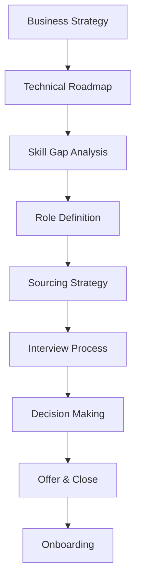

# Hiring & Interviewing Excellence

## Building World-Class Engineering Teams Through Strategic Hiring

Hiring is the highest-leverage activity for engineering leaders. Every hire shapes team culture, capability, and trajectory. This guide covers the full hiring lifecycle from defining needs through successful onboarding.

## Hiring Philosophy & Strategy

### The Multiplier Effect
- A-players hire A-players
- B-players hire C-players
- One bad hire costs 15x their salary
- Great hires elevate entire teams

### Strategic Hiring Framework



## Defining the Role

### Job Description Excellence
- **Impact Statement**: What will this person achieve?
- **Core Responsibilities**: 5-7 key areas
- **Required Skills**: Must-haves only
- **Growth Opportunities**: Career trajectory
- **Team Context**: Who they'll work with

### Level Calibration Matrix

| Level | Scope | Experience | Leadership | Impact |
|-------|-------|------------|------------|---------|
| L3/E3 | Task | 0-2 years | Individual | Team |
| L4/E4 | Project | 2-5 years | Mentoring | Product |
| L5/E5 | Multi-project | 5-8 years | Tech Lead | Organization |
| L6/E6 | Domain | 8-12 years | Multiple Teams | Company |

## Sourcing Strategies

### Multi-Channel Approach
1. **Internal Referrals** (40% success rate)
   - Incentivize quality over quantity
   - Track referral success metrics
   - Build referral culture

2. **Direct Sourcing** (25% success rate)
   - LinkedIn advanced search
   - GitHub contributor analysis
   - Conference speaker outreach

3. **Recruiter Partnership** (20% success rate)
   - Clear role requirements
   - Regular calibration
   - Fast feedback loops

4. **Community Building** (35% success rate)
   - Tech talks and meetups
   - Open source contributions
   - Blog and social presence

## Interview Process Design

### Phone Screen (45 minutes)
```
5 min: Introduction and rapport
10 min: Background and motivation
20 min: Technical discussion (no coding)
10 min: Questions from candidate
5 min: Next steps
```

### Technical Interview Structure

#### Coding Interview (60-90 minutes)
- **Problem Selection**: Real-world, not puzzles
- **Evaluation Criteria**: 
  - Problem solving approach
  - Code quality and structure
  - Communication skills
  - Debugging ability
- **Red Flags**: 
  - Can't explain their thinking
  - Doesn't ask clarifying questions
  - Writes code before understanding

#### System Design (60-90 minutes)
- **Focus Areas**:
  - Requirements gathering
  - High-level architecture
  - Data model design
  - Scale considerations
  - Trade-off analysis

### Behavioral Interview Framework

#### Using Structured Behavioral Interviewing
```
Situation: Context and background
Task: What needed to be done
Action: What they specifically did
Result: Outcome and learnings
```

#### Key Competencies to Assess
1. **Leadership**: Influencing without authority
2. **Collaboration**: Cross-functional success
3. **Innovation**: Creative problem solving
4. **Resilience**: Handling failure/adversity
5. **Growth Mindset**: Learning orientation

## Making the Hiring Decision

### Hiring Committee Best Practices
- Independent written feedback first
- Focus on evidence, not feelings
- Discuss edge cases thoroughly
- Document decision rationale

### The Hiring Bar
```
Strong Yes: Exceeds expectations, would fight for
Yes: Meets bar, would be happy to work with
No: Below bar or significant concerns
Strong No: Clear mismatch, red flags
```

### Common Biases to Avoid
- **Halo Effect**: One great trait overshadows weaknesses
- **Similar-to-me**: Favoring similar backgrounds
- **Recency Bias**: Over-weighting last impression
- **Confirmation Bias**: Seeking supporting evidence

## Closing Candidates

### The Art of the Sell
1. **Understand Motivations**
   - Career growth opportunities
   - Technical challenges
   - Team and culture
   - Compensation and benefits
   - Work-life balance

2. **Personalized Approach**
   - Connect role to their goals
   - Introduce future teammates
   - Share insider perspective
   - Address concerns directly

3. **Compelling Offer**
   - Competitive compensation
   - Meaningful equity
   - Growth trajectory
   - Flexible benefits

### Negotiation Best Practices
- Know your limits upfront
- Be transparent about constraints
- Find creative solutions
- Move quickly on decisions
- Always leave door open

## Onboarding Excellence

### First Day
- Equipment ready
- Accounts provisioned
- Buddy assigned
- Team introduction
- First task defined

### First Week
- Architecture overview
- Codebase walkthrough
- Development environment
- First code review
- 1:1 with manager

### First Month
- Ship first feature
- Present to team
- Define 90-day goals
- Feedback session
- Social integration

### First Quarter
- Own component/service
- Mentor new hires
- Contribute to planning
- Performance check-in
- Career discussion

## Interview Anti-Patterns

### What Not to Do
❌ Brain teasers or trick questions
❌ Whiteboard coding without context
❌ Aggressive or hostile questioning
❌ Irrelevant technical trivia
❌ Making assumptions about gaps

### What to Emphasize
✅ Real problems they'll solve
✅ Collaborative problem solving
✅ Growth potential assessment
✅ Cultural contribution
✅ Diverse perspectives value

## Metrics & Continuous Improvement

### Key Hiring Metrics
- Time to fill: 45-60 days target
- Offer acceptance rate: >80%
- Quality of hire: Performance after 1 year
- Diversity metrics: Track at each stage
- Cost per hire: Optimize spending

### Feedback Loops
- Candidate NPS surveys
- Interviewer calibration
- New hire feedback
- Manager satisfaction
- Performance correlation

## Special Considerations

### Remote Hiring
- Video interview best practices
- Timezone considerations
- Remote onboarding plan
- Communication assessment
- Self-direction evaluation

### Diversity & Inclusion
- Inclusive job descriptions
- Diverse interview panels
- Structured evaluation rubrics
- Unconscious bias training
- Pipeline diversity tracking

### Senior/Staff Hiring
- Longer evaluation process
- Reference checks critical
- Work sample reviews
- Leadership assessment
- Cultural impact consideration

## Red Flags in Candidates

### Technical Red Flags
- Can't explain past work clearly
- No curiosity about problems
- Rigid thinking patterns
- Outdated technical skills
- Poor code hygiene

### Behavioral Red Flags
- Badmouths previous employers
- Takes sole credit for team wins
- Blames others for failures
- Lacks self-awareness
- Shows disrespect to anyone

## Making Tough Decisions

### When to Pass on Good Candidates
- Culture mismatch risk
- Overqualified flight risk
- Narrow technical match
- Team dynamics concern
- Growth trajectory mismatch

### When to Take Calculated Risks
- High potential with gaps
- Non-traditional background
- Strong referral with concerns
- Technical spike in key area
- Exceptional culture add

---

**Remember**: Hiring is about building the future. Every hire either accelerates or impedes your team's trajectory. Invest the time to get it right.