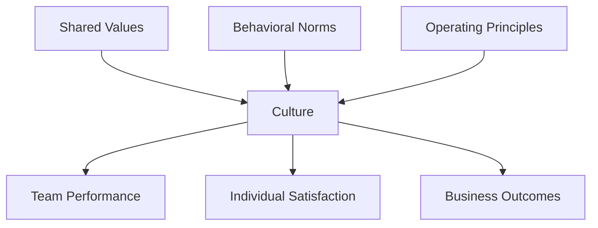
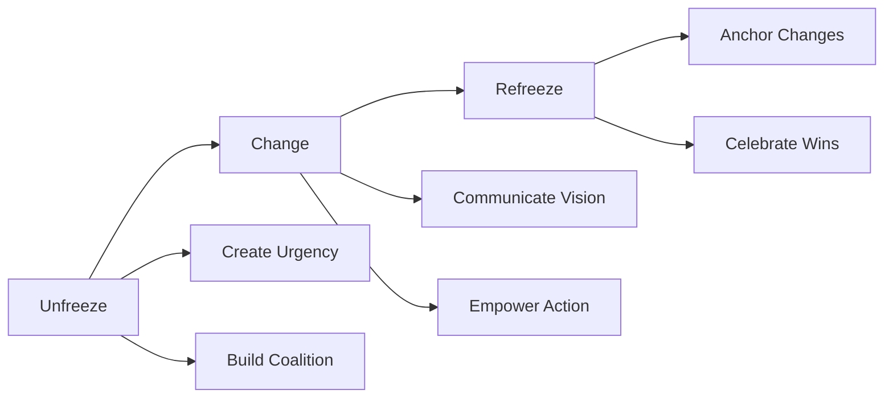

# Team Building & Culture Development

## Creating High-Performance Engineering Cultures

Culture isn't ping-pong tables and free snacks—it's the shared values, behaviors, and practices that determine how teams operate, innovate, and deliver results. This guide covers building and sustaining exceptional engineering cultures.

## Culture Fundamentals

### What Culture Actually Is


### The Culture Equation
**Culture = Values × Behaviors × Systems**
- **Values**: What we believe
- **Behaviors**: How we act
- **Systems**: How we operate

## Building Team Identity

### Core Elements of Team Identity

#### 1. Shared Purpose
- **Mission**: Why we exist
- **Vision**: Where we're going
- **Strategy**: How we'll get there
- **Metrics**: How we measure success

#### 2. Team Charter
```markdown
## [Team Name] Charter

### Our Mission
[One sentence describing team's purpose]

### Our Values
- [Value 1]: [What this means in practice]
- [Value 2]: [What this means in practice]
- [Value 3]: [What this means in practice]

### Our Commitments
- To each other: [How we work together]
- To the company: [What we deliver]
- To ourselves: [How we grow]

### Our Operating Principles
1. [Principle about decision making]
2. [Principle about communication]
3. [Principle about quality]
4. [Principle about innovation]
```

### Team Rituals That Build Culture

#### Daily Practices
- **Standup Format**: Problem-focused, not status
- **Code Reviews**: Learning opportunities, not gatekeeping
- **Pair Programming**: Knowledge sharing sessions
- **Tech Talks**: Weekly learning slots

#### Weekly Rhythms
- **Team Retrospectives**: Continuous improvement
- **Demo Days**: Celebrate progress
- **Office Hours**: Cross-team collaboration
- **Social Time**: Virtual coffee or games

#### Quarterly Traditions
- **Hackathons**: Innovation time
- **Team Offsites**: Strategic planning
- **Celebration Events**: Recognize achievements
- **Learning Days**: Skill development

## Psychological Safety

### Creating Safe Environments

#### The Four Stages
1. **Inclusion Safety**: Feel included
2. **Learner Safety**: Safe to learn
3. **Contributor Safety**: Safe to contribute
4. **Challenger Safety**: Safe to challenge

### Behaviors That Build Safety
```
Leader Behaviors:
✅ Admit mistakes openly
✅ Ask for feedback regularly
✅ Show curiosity before judgment
✅ Reward truth-telling
✅ Model vulnerability

Team Behaviors:
✅ Respectful disagreement
✅ Blameless postmortems
✅ Experiment celebration
✅ Failure sharing
✅ Help-seeking normalized
```

### Safety Killers to Avoid
- Public criticism
- Dismissive responses
- Punishment for mistakes
- Information hoarding
- Credit stealing

## Building High-Performance Teams

### The Five Dysfunctions Model

```mermaid
pyramid
    title Team Effectiveness Pyramid
    "Results" : Peak Performance
    "Accountability" : Peer Accountability
    "Commitment" : Clear Decisions
    "Conflict" : Healthy Debate
    "Trust" : Vulnerability-Based
```

### Team Development Stages

#### 1. Forming
- Focus on clarity
- Establish norms
- Define roles
- Build connections

#### 2. Storming
- Navigate conflicts
- Address concerns
- Clarify expectations
- Strengthen trust

#### 3. Norming
- Solidify processes
- Deepen relationships
- Increase collaboration
- Build momentum

#### 4. Performing
- High autonomy
- Shared leadership
- Continuous improvement
- Sustained excellence

## Remote Team Culture

### Unique Challenges
- Lack of casual interactions
- Timezone coordination
- Communication overhead
- Isolation risks
- Cultural differences

### Remote Culture Building

#### Intentional Connection
```
Daily:
- Virtual coffee chats
- Slack celebrations
- Emoji reactions
- Async standups

Weekly:
- Team social hour
- Gaming sessions
- Show and tell
- Virtual lunches

Monthly:
- Culture surveys
- Recognition ceremony
- Team challenges
- Learning together
```

#### Asynchronous Culture
- Document everything
- Record meetings
- Written updates
- Flexible schedules
- Outcome focus

## Diversity & Inclusion

### Building Inclusive Teams

#### Dimensions of Diversity
- **Demographic**: Age, gender, ethnicity
- **Experiential**: Background, education
- **Cognitive**: Thinking styles, perspectives
- **Cultural**: Values, communication styles

### Inclusion Practices
1. **Hiring**: Diverse panels, inclusive language
2. **Meetings**: Rotation facilitation, equal speaking
3. **Decisions**: Multiple perspectives sought
4. **Growth**: Equitable opportunity distribution
5. **Recognition**: Celebrate diverse contributions

### Measuring Inclusion
- Participation metrics
- Promotion rates
- Retention by demographic
- Engagement scores
- Psychological safety index

## Conflict Resolution

### Healthy vs Unhealthy Conflict

| Healthy Conflict | Unhealthy Conflict |
|-----------------|-------------------|
| Focus on ideas | Focus on people |
| Seeks understanding | Seeks winning |
| Builds trust | Destroys trust |
| Data-driven | Emotion-driven |
| Time-bounded | Ongoing tension |

### Conflict Resolution Framework

#### LEAP Method
- **Listen**: Understand all perspectives
- **Empathize**: Acknowledge feelings
- **Analyze**: Find root causes
- **Plan**: Create solutions together

### Common Team Conflicts
1. **Technical Disagreements**
   - Use data and experiments
   - Time-box decisions
   - Document rationale
   - Commit once decided

2. **Resource Allocation**
   - Transparent prioritization
   - Clear trade-offs
   - Shared ownership
   - Regular rebalancing

3. **Performance Disparities**
   - Individual coaching
   - Clear expectations
   - Skill development
   - Fair work distribution

## Culture Change

### Leading Cultural Transformation

#### Change Model


### Culture Change Tactics
1. **Model New Behaviors**: Leaders go first
2. **Reward Desired Behaviors**: Recognition systems
3. **Change Systems**: Align processes
4. **Tell Stories**: Share success examples
5. **Measure Progress**: Culture metrics

## Anti-Patterns in Culture Building

### Common Mistakes
❌ Copying other companies blindly
❌ Top-down culture mandates
❌ Ignoring subcultures
❌ Values-behavior misalignment
❌ One-time culture initiatives

### What Works Instead
✅ Organic culture evolution
✅ Bottom-up involvement
✅ Embrace team uniqueness
✅ Consistent reinforcement
✅ Continuous culture work

## Measuring Culture Health

### Quantitative Metrics
- Employee NPS
- Retention rates
- Engagement scores
- Productivity metrics
- Innovation index

### Qualitative Indicators
- Meeting energy
- Collaboration quality
- Risk-taking comfort
- Learning velocity
- Pride in work

### Culture Health Dashboard
```
Team: [Name]
Quarter: [Q1 2024]

Metrics:
- Team NPS: 72 (+5)
- Retention: 95% (+2%)
- Engagement: 4.2/5 (+0.3)
- Velocity: 45 pts/sprint (+5)
- Innovation: 3 experiments/month

Qualitative:
- Psychological Safety: High
- Collaboration: Improving
- Learning Culture: Strong
- Technical Excellence: Growing
```

## Sustaining Culture

### Culture Maintenance

#### Regular Rituals
- Quarterly culture retros
- Values reinforcement
- Story sharing
- New hire culture onboarding
- Culture ambassador program

#### Evolution Strategies
- Listen to team feedback
- Adapt to growth stages
- Integrate new perspectives
- Preserve core values
- Document culture artifacts

---

**Remember**: Culture is built daily through thousands of small actions. As a leader, every interaction either reinforces or undermines the culture you're trying to build. Be intentional.