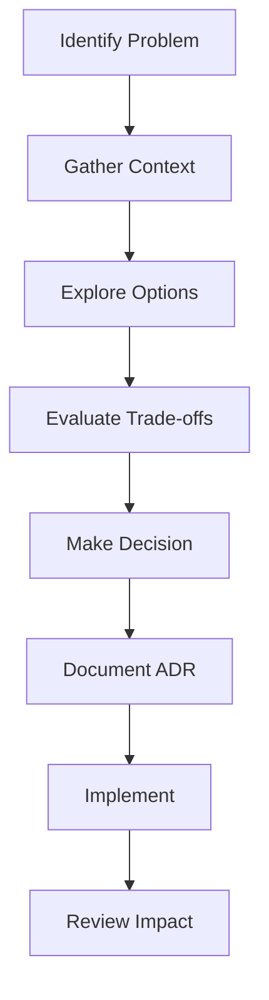

# Technical Leadership

## Driving Technical Excellence at Scale

Technical leadership transcends individual coding ability to encompass architecture vision, technology strategy, and the ability to guide teams toward technical excellence while balancing business constraints.

## Connection to Framework Levels

### First Principles Foundation
- **[Value Creation](../../level-1-first-principles/value-creation/)**: Technology decisions must create business value
- **[Decision-Making](../../level-1-first-principles/decision-making/)**: Architecture choices are high-impact decisions
- **[Systems Thinking](../../level-1-first-principles/systems-thinking/)**: Technical systems are complex adaptive systems
- **[Integrity & Ethics](../../level-1-first-principles/integrity-ethics/)**: Building secure, reliable systems users can trust
- **[Human Behavior](../../level-1-first-principles/human-behavior/)**: Technical decisions affect developer experience

### Business Concepts Applied
- **[Strategy](../../level-2-core-business/strategy/)**: Technical strategy enables business strategy
- **[Operations](../../level-2-core-business/operations/)**: Technical excellence drives operational excellence
- **[Risk & Governance](../../level-2-core-business/risk-governance/)**: Managing technical risks and compliance

## Core Competencies

### 1. Architecture & System Design
- **Architecture Vision**: Define long-term technical direction
- **System Design**: Create scalable, maintainable solutions
- **Trade-off Analysis**: Balance competing technical concerns
- **Technical Debt**: Manage and strategically reduce debt

[Architecture Patterns →](architecture-patterns.md)

### 2. Technology Strategy
- **Technology Selection**: Evaluate and choose technologies
- **Innovation Management**: Foster technical innovation
- **Platform Strategy**: Build reusable platforms and tools
- **Migration Planning**: Orchestrate major technical transitions

[Technical Strategy Guide →](technical-strategy.md)

### 3. Engineering Excellence
- **Code Quality**: Establish and maintain quality standards
- **Development Process**: Optimize engineering workflows
- **Technical Reviews**: Conduct effective design reviews
- **Best Practices**: Propagate engineering excellence

[Engineering Standards →](engineering-excellence.md)

### 4. Technical Mentorship
- **Knowledge Sharing**: Disseminate technical expertise
- **Skill Development**: Grow team technical capabilities
- **Technical Coaching**: Guide architectural decisions
- **Learning Culture**: Foster continuous learning

[Technical Mentorship →](technical-mentorship.md)

### 5. Cross-Functional Leadership
- **Product Partnership**: Align technical and product vision
- **Stakeholder Communication**: Translate technical complexity
- **Risk Management**: Identify and mitigate technical risks
- **Resource Planning**: Estimate and allocate technical resources

[Cross-Functional Excellence →](cross-functional.md)

## Common Scenarios

### Scenario 1: Legacy System Migration
```
Context: 10-year-old monolith needs microservices migration
Challenge: Maintain availability during 18-month transition
Approach: Strangler fig pattern with incremental migration
```

### Scenario 2: Technology Stack Decision
```
Context: Choosing between proven vs cutting-edge technology
Challenge: Balance innovation with reliability needs
Approach: Risk-weighted evaluation framework
```

### Scenario 3: Technical Debt Crisis
```
Context: 40% of sprint capacity consumed by bug fixes
Challenge: Convince business to invest in refactoring
Approach: Data-driven ROI analysis and phased approach
```

## Interview Question Patterns

### System Design Questions
- "Design a distributed task scheduling system"
- "How would you scale a real-time messaging platform?"
- "Architect a global content delivery network"

### Technical Leadership Questions
- "How do you balance technical debt vs feature delivery?"
- "Describe your approach to technology selection"
- "How do you drive technical standards across teams?"

### Strategic Questions
- "How would you modernize a legacy architecture?"
- "What's your approach to build vs buy decisions?"
- "How do you foster innovation while maintaining stability?"

## Excellence Indicators

| Level | Technical Leadership Characteristics |
|-------|-------------------------------------|
| **L4** | Technical lead for single team/project |
| **L5** | Architects multi-team systems |
| **L6** | Defines organizational technical strategy |
| **L7** | Drives company-wide technical vision |

## Architecture Decision Records

### Decision Framework


## Anti-Patterns to Avoid

1. **Ivory Tower Architecture**: Designing without implementation context
2. **Technology for Technology's Sake**: Choosing complexity over simplicity
3. **Not Invented Here**: Rejecting external solutions unnecessarily
4. **Analysis Paralysis**: Over-analyzing instead of iterating
5. **Ignoring Technical Debt**: Allowing debt to compound unchecked

## Technical Leadership Toolkit

### Key Resources
- Technology Radar Framework - Assess and communicate technology choices
- Architecture Review Process - Structured evaluation of design decisions  
- Technical Debt Assessment - Quantify and prioritize technical improvements
- Technical Proposal Templates - Document and communicate technical decisions
- Architecture Documentation Standards - Maintain clear system documentation

## Practice Exercises

1. **System Design**: Complete full architecture exercises
2. **Trade-off Analysis**: Evaluate competing solutions
3. **Technical Presentations**: Practice explaining complex systems
4. **Code Reviews**: Demonstrate review excellence

## Resources

### Books & Articles
- "Building Evolutionary Architectures"
- "Staff Engineer: Leadership Beyond the Management Track"
- "The Architecture of Open Source Applications"

### Online Resources
- [High Scalability](http://highscalability.com/)
- [Martin Fowler's Blog](https://martinfowler.com/)
- [AWS Architecture Center](https://aws.amazon.com/architecture/)

## Links to Other Applications

- **[People Management](../people-management/)**: Leading technical teams effectively
- **[Organizational Design](../organizational-design/)**: Conway's Law - architecture reflects organization
- **[Business Acumen](../business-acumen/)**: Translating technical decisions to business impact

## Interview Execution (Level IV)

- **[Technical Leadership Interviews](../../level-4-interview-execution/technical-leadership/)**: Demonstrating technical depth and breadth
- **[System Design](../../level-4-interview-execution/system-org-design/)**: Architectural thinking under pressure
- **[Behavioral Stories](../../level-4-interview-execution/behavioral/)**: Technical leadership impact stories

## Next Steps

### Immediate Actions
1. Map a recent technical decision to [Value Creation](../../level-1-first-principles/value-creation/) principles
2. Analyze your architecture using [Systems Thinking](../../level-1-first-principles/systems-thinking/)
3. Evaluate technical debt through [Decision-Making](../../level-1-first-principles/decision-making/) frameworks

### This Week
- Complete [Technical Leadership Assessment](../../level-4-interview-execution/tools/interactive/self-assessment.md)
- Study [Technical Strategy Guide](technical-strategy.md)
- Practice explaining technical decisions in business terms

### For Interviews
- Prepare 5-7 technical leadership stories
- Practice system design with business context
- Use [Decision Trees](../../level-4-interview-execution/tools/interactive/decision-trees.md) for architecture choices
- Review [Company-Specific Technical Bars](../../company-specific/)