# Technical Leadership

## Driving Technical Excellence at Scale

Technical leadership transcends individual coding ability to encompass architecture vision, technology strategy, and the ability to guide teams toward technical excellence while balancing business constraints.

## Connection to Framework Levels

### First Principles Foundation
- **[Value Creation](../../level-1-first-principles/value-creation/)**: Technology decisions must create business value
- **[Decision-Making](../../level-1-first-principles/decision-making/)**: Architecture choices are high-impact decisions
- **[Systems Thinking](../../level-1-first-principles/systems-thinking/)**: Technical systems are complex adaptive systems
- **[Integrity & Ethics](../../level-1-first-principles/integrity-ethics/)**: Building secure, reliable systems users can trust
- **[Human Behavior](../../level-1-first-principles/human-behavior/)**: Technical decisions affect developer experience

### Business Concepts Applied
- **[Strategy](../../level-2-core-business/strategy/)**: Technical strategy enables business strategy
- **[Operations](../../level-2-core-business/operations/)**: Technical excellence drives operational excellence
- **[Risk & Governance](../../level-2-core-business/risk-governance/)**: Managing technical risks and compliance

## Core Competencies

### 1. Architecture & System Design
- **Architecture Vision**: Define long-term technical direction
- **System Design**: Create scalable, maintainable solutions
- **Trade-off Analysis**: Balance competing technical concerns
- **Technical Debt Portfolio**: Manage debt as financial instruments with strategic intent

[Architecture Patterns →](architecture-patterns.md)

### 2. Technology Strategy
- **Technology Selection**: Evaluate and choose technologies
- **Innovation Management**: Foster technical innovation
- **Platform Strategy**: Build reusable platforms and tools
- **Migration Planning**: Orchestrate major technical transitions

[Technical Strategy Guide →](technical-strategy.md)

### 3. Engineering Excellence
- **Code Quality**: Establish and maintain quality standards
- **DORA Metrics**: Implement balanced delivery performance measurement
- **Development Process**: Optimize engineering workflows
- **Technical Reviews**: Conduct effective design reviews
- **Best Practices**: Propagate engineering excellence

[Engineering Standards →](engineering-excellence.md)

### 4. Technical Mentorship & Knowledge Systems
- **Knowledge Flywheel**: Create capture → synthesize → apply → feedback cycles
- **Skill Development**: Grow team technical capabilities with AI-accelerated learning
- **Technical Coaching**: Guide architectural decisions
- **Learning Culture**: Foster continuous learning and pattern recognition

[Technical Mentorship →](technical-mentorship.md)

### 5. Cross-Functional Leadership
- **Product Partnership**: Align technical and product vision
- **Stakeholder Communication**: Translate technical complexity
- **Risk Management**: Identify and mitigate technical risks
- **Resource Planning**: Estimate and allocate technical resources
- **Modern Toolchain Strategy**: Choose system-enabling tools for specific outcomes

[Cross-Functional Excellence →](cross-functional.md)

## Common Scenarios

### Scenario 1: Legacy System Migration
```
Context: 10-year-old monolith needs microservices migration
Challenge: Maintain availability during 18-month transition
Approach: Strangler fig pattern with incremental migration
```

### Scenario 2: Technology Stack Decision
```
Context: Choosing between proven vs cutting-edge technology
Challenge: Balance innovation with reliability needs
Approach: Risk-weighted evaluation framework
```

### Scenario 3: Technical Debt Crisis
```
Context: 40% of sprint capacity consumed by bug fixes
Challenge: Convince business to invest in refactoring
Approach: Portfolio management with health model and capacity allocation
```

## Modern Technical Leadership Practices

### Technical Debt as Portfolio Management

**Shift from Moral to Financial View**: Technical debt isn't "bad code" - it's a financial instrument with intentional trade-offs and measurable interest payments.

#### Strategic vs. Accidental Debt

| Type | Definition | Management Approach |
|------|------------|-------------------|
| **Strategic Debt** | Deliberate shortcuts for speed/market timing | Track explicitly, plan paydown |
| **Accidental Debt** | Unintended complexity from poor decisions | Remediate immediately, improve processes |
| **Environmental Debt** | Changes in landscape (security, compliance) | Systematic assessment, roadmap integration |

#### Health Model Framework

```mermaid
graph TD
    A[Code/System Component] --> B{Health Assessment}
    B --> C[🟢 Healthy]
    B --> D[🟡 Needs Attention]
    B --> E[🔴 Critical]
    
    C --> F[Monitor Only]
    D --> G[Include in Next Sprint]
    E --> H[Immediate Action Required]
    
    F --> I[Regular Health Checks]
    G --> J[Planned Remediation]
    H --> K[Emergency Response]
```



#### Quantifying Interest Payments

**Formula**: `Technical Debt Interest = (Additional Development Time + Incident Response + Opportunity Cost) / Sprint`

**Example Calculation**:
```
Legacy Payment System:
- Extra dev time per feature: 2 days
- Monthly incidents: 4 hours
- Delayed features: 1 per quarter
= 25% productivity tax
```

#### Dedicated Capacity Allocation

**The 20% Rule**: Allocate consistent capacity for system health
- **Week 1-4**: Feature development (80%) + Health work (20%)
- **Week 5**: Health-focused sprint (major refactoring/upgrades)
- **Quarterly**: Architecture review and debt portfolio assessment

### DORA Metrics Implementation

**Four Key Metrics with Engineering Context**:

| Metric | Definition | Engineering Focus | Measurement Approach |
|--------|------------|------------------|---------------------|
| **Deployment Frequency** | How often code goes to production | Pipeline automation, feature flags | Automated tracking, trend analysis |
| **Lead Time for Changes** | Code commit to production deployment | Batch size optimization, review efficiency | End-to-end pipeline measurement |
| **Change Failure Rate** | % of deployments causing production issues | Testing strategy, deployment practices | Incident correlation with deployments |
| **Time to Recovery** | Mean time to restore service after incidents | Observability, rollback capabilities | Incident response timeline tracking |

#### Implementation Without Weaponization

**Do's**:
- Measure at team/system level, not individual
- Use for systemic improvement identification
- Combine with context (complexity, risk, business impact)
- Focus on trends over absolute values

**Don'ts**:
- Compare teams with different contexts
- Set arbitrary targets without understanding constraints
- Use metrics for performance reviews
- Ignore external factors (dependencies, compliance)

#### Creating Balanced Systems


### Knowledge Flywheel Concept

**Four-Stage Acceleration Cycle**:

#### 1. Capture
- **Real-time Documentation**: AI-assisted commit message enhancement
- **Decision Recording**: Automated ADR generation from discussions
- **Pattern Recognition**: ML-based code pattern extraction
- **Context Preservation**: Link decisions to business outcomes

#### 2. Synthesize
- **AI-Powered Analysis**: LLM-based pattern synthesis across codebases
- **Cross-Team Learning**: Automated sharing of similar problem solutions
- **Trend Identification**: Predictive analysis of technical directions
- **Knowledge Graphs**: Relationship mapping between concepts and implementations

#### 3. Apply
- **Template Generation**: Automated scaffolding from successful patterns
- **Guided Implementation**: AI copilots with organizational context
- **Real-time Coaching**: Contextual suggestions during development
- **Risk Assessment**: Automated evaluation of architectural decisions

#### 4. Feedback Loop
- **Outcome Tracking**: Link implementations to business metrics
- **Pattern Validation**: Measure success of applied learnings
- **Continuous Refinement**: Update knowledge base with results
- **Predictive Modeling**: Forecast impact of similar decisions

#### Pattern Hubs and Documentation

**Living Documentation Strategy**:


**Pattern Hub Components**:
- **Architecture Patterns**: Proven solutions with success metrics
- **Anti-patterns**: Failed approaches with post-mortems
- **Decision Trees**: Guided selection based on constraints
- **Implementation Guides**: Step-by-step with checkpoints

### Modern Toolchain as System Enabler

#### Systems Visualization Tools

| Tool Category | Purpose | Examples | Systemic Change |
|---------------|---------|----------|-----------------|
| **Architecture Mapping** | Visualize system relationships | Structurizr, PlantUML | Reduce cognitive load |
| **Dependency Analysis** | Track coupling and cohesion | NDepend, SonarQube | Enable safe refactoring |
| **Performance Profiling** | Identify bottlenecks | Datadog APM, New Relic | Data-driven optimization |
| **Security Scanning** | Automated vulnerability detection | Snyk, GitLab Security | Shift-left security culture |

#### Telemetry and Feedback Automation

**Observability-Driven Development**:


**Key Automation Areas**:
- **Performance Regression Detection**: Automated alerts on latency increases
- **Error Pattern Analysis**: ML-based grouping and root cause suggestions
- **Resource Usage Optimization**: Auto-scaling recommendations
- **User Experience Monitoring**: Real user metrics feeding back to development

#### AI Assistants for Synthesis

**Beyond Code Completion**:
- **Architecture Review**: AI analysis of design documents
- **Impact Assessment**: Predict change effects across systems
- **Testing Strategy**: Generate test scenarios from requirements
- **Documentation Synthesis**: Auto-create runbooks from code and incidents

#### Tool Selection Framework

**Choosing Tools for Specific Systemic Changes**:

1. **Identify Systemic Problem**
   - Communication gaps between teams
   - Slow feedback loops
   - Knowledge silos
   - Technical debt accumulation

2. **Map Tool Capabilities to Outcomes**
   - Communication → Slack workflows, Notion databases
   - Feedback → CI/CD metrics, monitoring dashboards  
   - Knowledge → Wiki systems, code documentation tools
   - Debt → Static analysis, architecture visualization

3. **Evaluate Integration Impact**
   - Workflow disruption minimization
   - Learning curve vs. benefit ratio
   - Long-term maintenance overhead
   - Vendor lock-in considerations

## Interview Question Patterns

### System Design Questions
- "Design a distributed task scheduling system"
- "How would you scale a real-time messaging platform?"
- "Architect a global content delivery network"

### Technical Leadership Questions
- "How do you manage technical debt as a portfolio with measurable ROI?"
- "Describe your approach to implementing DORA metrics without creating negative behaviors"
- "How do you create knowledge flywheel effects across engineering teams?"
- "What's your framework for selecting tools that enable specific systemic changes?"

### Strategic Questions
- "How would you modernize a legacy architecture?"
- "What's your approach to build vs buy decisions?"
- "How do you foster innovation while maintaining stability?"

## Excellence Indicators

| Level | Technical Leadership Characteristics |
|-------|-------------------------------------|
| **L4** | Technical lead for single team/project |
| **L5** | Architects multi-team systems |
| **L6** | Defines organizational technical strategy |
| **L7** | Drives company-wide technical vision |

## Architecture Decision Records

### Decision Framework


## Anti-Patterns to Avoid

1. **Ivory Tower Architecture**: Designing without implementation context
2. **Technology for Technology's Sake**: Choosing complexity over simplicity
3. **Not Invented Here**: Rejecting external solutions unnecessarily
4. **Analysis Paralysis**: Over-analyzing instead of iterating
5. **Debt Moralization**: Treating technical debt as "bad" rather than managed trade-offs
6. **Metrics Weaponization**: Using DORA metrics for individual performance evaluation
7. **Knowledge Hoarding**: Creating information silos instead of flywheel systems
8. **Tool Proliferation**: Adding tools without clear systemic improvement goals

## Technical Leadership Toolkit

### Key Resources
- **Technology Radar Framework** - Assess and communicate technology choices
- **Architecture Review Process** - Structured evaluation of design decisions  
- **Technical Debt Portfolio Dashboard** - Financial view of debt with health models
- **DORA Metrics Implementation Guide** - Balanced measurement without weaponization
- **Knowledge Flywheel Playbook** - Create and accelerate organizational learning
- **Modern Toolchain Selection Matrix** - Map tools to specific systemic improvements
- **Technical Proposal Templates** - Document and communicate technical decisions
- **Architecture Documentation Standards** - Living documentation with AI assistance

## Practice Exercises

1. **System Design**: Complete full architecture exercises with modern observability
2. **Technical Debt Portfolio**: Create health model for a real codebase with ROI calculations
3. **DORA Implementation**: Design metrics collection without creating perverse incentives
4. **Knowledge Flywheel**: Build a learning system for a specific technical domain
5. **Tool Selection**: Map current toolchain gaps to specific systemic improvements
6. **Technical Presentations**: Practice explaining complex systems with business context

## Resources

### Books & Articles
- "Building Evolutionary Architectures"
- "Staff Engineer: Leadership Beyond the Management Track"
- "The Architecture of Open Source Applications"

### Online Resources
- [High Scalability](http://highscalability.com/)
- [Martin Fowler's Blog](https://martinfowler.com/)
- [AWS Architecture Center](https://aws.amazon.com/architecture/)

## Links to Other Applications

- **[People Management](../people-management/)**: Leading technical teams effectively
- **[Organizational Design](../organizational-design/)**: Conway's Law - architecture reflects organization
- **[Business Acumen](../business-acumen/)**: Translating technical decisions to business impact

## Interview Execution (Level IV)

- **[Technical Leadership Interviews](../../level-4-interview-execution/technical-leadership/)**: Demonstrating technical depth and breadth
- **[System Design](../../level-4-interview-execution/system-org-design/)**: Architectural thinking under pressure
- **[Behavioral Stories](../../level-4-interview-execution/behavioral/)**: Technical leadership impact stories

## Next Steps

### Immediate Actions
1. **Debt Portfolio Audit**: Categorize current technical debt into strategic/accidental/environmental
2. **DORA Baseline**: Measure current deployment frequency and lead times (without individual tracking)  
3. **Knowledge Assessment**: Identify where your team's learning cycle breaks down (capture/synthesize/apply/feedback)
4. **Tool Inventory**: Map current toolchain to specific systemic problems they solve

### This Week
- **Health Model Design**: Create traffic light system for critical code components
- **Flywheel Experiment**: Implement one knowledge capture → synthesis → apply cycle
- **Metrics Workshop**: Plan DORA implementation with team focus on improvement, not judgment
- **Modern Architecture Review**: Include observability and AI-assisted development in next design session

### For Interviews
- Prepare 5-7 technical leadership stories
- Practice system design with business context
- Use [Decision Trees](../../level-4-interview-execution/tools/interactive/decision-trees.md) for architecture choices
- Review [Company-Specific Technical Bars](../../company-specific/)