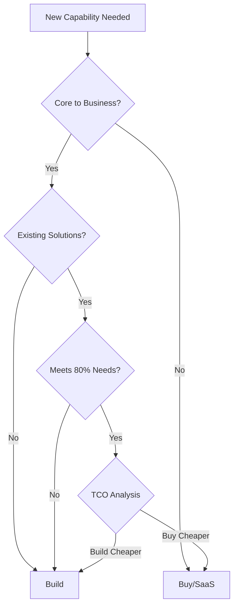

# Technical Strategy for Engineering Leaders

## Overview

As an engineering leader at L6+, you must balance staying technical enough to make informed decisions while operating at a strategic level. This guide covers how to demonstrate technical leadership in interviews.

## The Technical Leadership Paradox

### The Challenge
- Too technical → "Why aren't you an IC?"
- Too high-level → "Do you still understand the tech?"
- Just right → Strategic thinking grounded in technical reality

### The Sweet Spot
Show you can:
1. Understand technical implications of business decisions
2. Translate between engineering and business stakeholders  
3. Make architectural decisions with long-term thinking
4. Guide technical direction without micromanaging

## Core Technical Strategy Topics

### 1. Platform vs Product Thinking

**Key Interview Question**: "How do you decide when to build a platform?"

**Framework Answer**:
```
1. Current State Analysis
   - 3+ teams solving similar problems
   - 30%+ duplicate effort across teams
   - Inconsistent user experience

2. Platform Investment Criteria  
   - ROI positive within 18 months
   - Enables 5x velocity after adoption
   - Reduces operational overhead 50%

3. Migration Strategy
   - Start with willing early adopters
   - Build migration tools, not mandates
   - Measure adoption and satisfaction
```

**Real Example Structure**:
"At [Company], 5 teams were building separate authentication systems. I led the platform initiative that consolidated into a single identity platform, reducing authentication bugs by 70% and enabling SSO across all products. The 6-month investment paid back in 8 months through reduced duplicate work."

### 2. Technical Debt Strategy

**Leadership Approach to Tech Debt**:

#### Classification Framework
1. **Critical**: Security vulnerabilities, data corruption risks
2. **High**: Performance degradation, maintenance burden
3. **Medium**: Developer experience, minor inefficiencies  
4. **Low**: Code cleanup, nice-to-haves

#### Investment Strategy
- Allocate 20% of capacity to debt reduction
- Tie debt work to business outcomes
- Create "Tech Debt Friday" culture
- Measure debt impact in dollars

#### Story Example
"I inherited a team where deployment took 4 hours due to technical debt. Rather than a big rewrite, I implemented a quarterly 'Tech Debt Sprint' where we'd fix the highest-ROI items. After 1 year, deployment time dropped to 15 minutes, saving 100 engineering hours/month."

### 3. Build vs Buy Decisions

**Decision Framework**:



**Interview Answer Template**:
"When evaluating [specific technology], I consider:
1. Strategic importance (is this our differentiator?)
2. Total cost of ownership over 3 years
3. Opportunity cost of engineering time
4. Vendor lock-in risks
5. Security and compliance requirements"

### 4. Architecture Reviews

**How to Run Effective Architecture Reviews**:

#### Pre-Review (L6+ Leader Actions)
- Set clear decision criteria
- Ensure right stakeholders included
- Pre-read documents
- Identify key risks

#### During Review
- Ask probing questions, don't prescribe solutions
- Focus on non-functional requirements
- Challenge assumptions respectfully
- Document decisions and rationale

#### Post-Review
- Clear action items with owners
- Follow-up on implementation
- Share learnings broadly
- Update architecture guidelines

### 5. Innovation Framework

**Creating Space for Innovation**:

#### 20% Time Reality
"I implemented 'Innovation Fridays' where engineers could work on anything that might benefit the company. Rules: Demo monthly, measure impact, ship if successful. Result: 3 major features came from this, including our ML-based error detection saving $2M annually."

#### Hackathon Strategy  
- Theme-based (e.g., "Developer Productivity")
- Cross-functional teams required
- Executive judging panel
- Winner gets resourced for production

#### Innovation Metrics
- Ideas generated per quarter
- % of ideas reaching production
- Revenue from innovation projects
- Patent applications filed

## System Design for Leaders

### Different Focus Areas

#### IC System Design
- API design
- Database schemas  
- Algorithm efficiency
- Caching strategies

#### Leadership System Design
- Team boundaries (Conway's Law)
- Service ownership models
- Cross-team dependencies
- Organizational scaling

### Example: Designing a Notification System

**IC Approach**:
"I'd use Redis for queuing, PostgreSQL for templates, and websockets for real-time delivery..."

**Leadership Approach**:
"I'd first identify which teams need notifications - likely 5-6 teams. Rather than each building their own, I'd create a platform team owning a notification service. Key decisions:
- API design that prevents abuse
- SLA guarantees for different priority levels
- Cost model for internal charging
- Migration path for existing systems
- Team size: 4 engineers, 1 PM, 1 designer"

## Technical Competency Demonstrations

### 1. Staying Current

**Interview Question**: "How do you stay technical as a leader?"

**Strong Answer**:
"I maintain technical relevance through:
- Monthly architecture reviews where I ask deep questions
- Quarterly hack days where I code alongside the team
- Reading one technical paper/week in our domain
- Maintaining a side project in emerging tech
- Regular 1:1s with principal engineers"

### 2. Technical Decision Making

**Framework for Technical Decisions**:
1. **Gather Context**: Understand problem space
2. **Identify Options**: Usually 3-4 viable approaches
3. **Evaluate Trade-offs**: Performance vs cost vs time
4. **Prototype if Needed**: Spike highest-risk elements
5. **Decide and Document**: Clear rationale for future
6. **Measure Results**: Did we achieve intended outcomes?

### 3. Managing Technical Leaders

**Challenge**: Leading senior engineers who know more than you

**Approach**:
- Leverage their expertise, don't compete
- Focus on removing obstacles
- Connect their work to business impact
- Create growth opportunities
- Be the umbrella, not the expert

## Red Flags to Avoid

### In Technical Discussions
- ❌ Pretending to know technologies you don't
- ❌ Making decisions without consulting experts
- ❌ Using outdated technical references
- ❌ Micromanaging implementation details

### In Leadership Context  
- ❌ "I told the team exactly how to build it"
- ❌ "I don't need to understand the technical details"
- ❌ "We always use [specific technology]"
- ❌ "Technical debt isn't a priority"

## Practice Scenarios

### Scenario 1: Platform Migration
"Your company has 50 microservices on a deprecated platform. How do you lead the migration?"

### Scenario 2: AI/ML Investment  
"The CEO wants every team using AI. How do you implement this directive responsibly?"

### Scenario 3: Security Incident
"A critical vulnerability is discovered on Friday afternoon. Walk through your response."

### Scenario 4: Technical Hiring
"You need to hire 5 senior engineers in a competitive market. What's your strategy?"

---

**Key Takeaway**: Technical leadership isn't about being the best coder—it's about making informed decisions, creating the right environment for technical excellence, and translating between technology and business value.