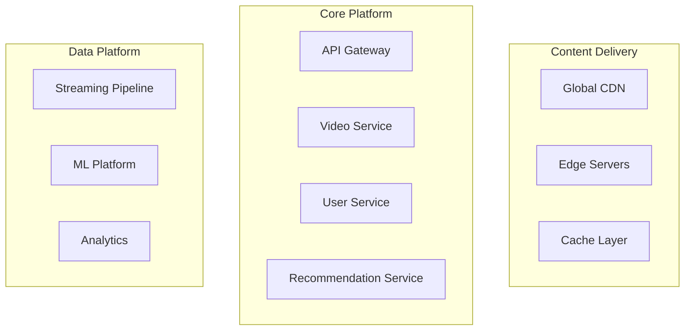
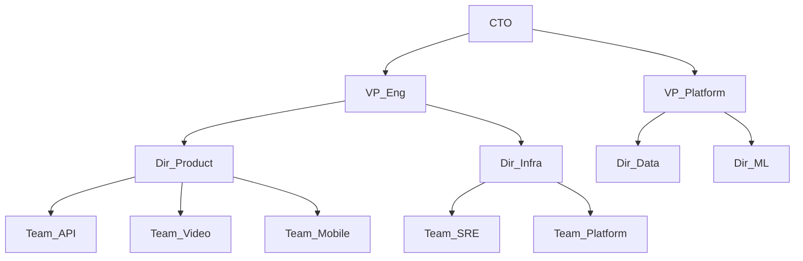
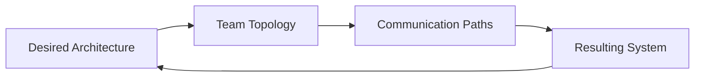

# System & Organizational Design Interview Guide

## Overview

System & Organizational Design interviews evaluate your ability to architect both technical systems and human organizations that scale. This unique interview type assesses how you design socio-technical systems where Conway's Law meets distributed systems.

## The Socio-Technical Lens

### Conway's Law in Practice
> "Organizations which design systems are constrained to produce designs which are copies of the communication structures of these organizations."

**Interview Implications**:
- System architecture reflects org structure
- Team boundaries become API boundaries  
- Communication patterns determine integration patterns
- Organizational design IS system design

## Interview Format

### Structure
- **Duration**: 60-90 minutes
- **Format**: Whiteboard + discussion
- **Evaluators**: Directors, VPs, CTOs
- **Split**: 40% system design, 40% org design, 20% integration

### Assessment Framework

| Dimension | System Design | Org Design | Integration |
|-----------|--------------|------------|-------------|
| **Scale** | 100M+ users, PB data | 100+ engineers | Cognitive load limits |
| **Complexity** | Distributed, multi-region | Matrix structures | Bounded contexts |
| **Evolution** | Migration strategy | Growth planning | Co-evolution |
| **Trade-offs** | CAP, latency, cost | Autonomy vs alignment | Conway's balance |

## Core Interview Scenarios

### 1. Greenfield Platform + Team
**Prompt**: "Build a video streaming platform and the engineering organization to support it"

**System Architecture**:


**Organizational Design**:


**Integration Points**:
- Team interfaces mirror service interfaces
- Platform teams enable product teams
- Clear ownership boundaries align with service boundaries

### 2. Monolith to Microservices Migration
**Prompt**: "Lead the transformation of a monolithic e-commerce platform to microservices"

**Migration Strategy**:
```
Phase 1: Strangler Fig Pattern (Q1-Q2)
- Extract user service
- Extract inventory service  
- Teams: 2 pods of 6 engineers each

Phase 2: Core Extraction (Q3-Q4)
- Order management service
- Payment service
- Teams: Form domain teams around services

Phase 3: Platform Services (Q1-Q2 Year 2)
- Messaging platform
- Service mesh
- Teams: Platform team of 10 engineers

Phase 4: Innovation Layer (Q3-Q4 Year 2)
- ML recommendations
- Real-time personalization
- Teams: Data science + engineering pods
```

**Organizational Evolution**:
| Phase | Team Structure | Leadership Needs | Communication |
|-------|---------------|------------------|---------------|
| **1** | Feature teams | Technical leads | Weekly syncs |
| **2** | Service teams | Domain experts | API contracts |
| **3** | Platform + Product | Platform director | Service mesh |
| **4** | Full autonomy | Distributed leadership | Event-driven |

### 3. Global Scale Challenge
**Prompt**: "Design system and org for a globally distributed social network"

**System Constraints**:
- 1B+ daily active users
- <100ms latency globally
- 99.99% availability
- Strong consistency for critical paths

**Multi-Region Architecture**:
```yaml
Regions:
  US-East:
    - User shards: 1-1000
    - Full stack deployment
    - DR: US-West
    
  EU-West:
    - User shards: 1001-2000
    - GDPR compliant
    - DR: EU-East
    
  APAC:
    - User shards: 2001-3000
    - Local regulations
    - DR: APAC-2

Cross-Region:
  - Global user graph
  - Eventual consistency
  - Conflict resolution
```

**Distributed Organization**:
```
Hub Model:
- US (HQ): Core platform, strategy
- Dublin: EU platform, privacy
- Singapore: APAC platform, growth
- Tel Aviv: Security, ML research

Follow-the-Sun:
- 24/7 on-call rotation
- Regional autonomy
- Global architecture council
- Quarterly all-hands syncs
```

## Advanced Design Patterns

### 1. Inverse Conway Maneuver
Design the organization to create desired architecture:



**Example Application**:
- Want: Decoupled services
- Create: Autonomous teams
- Enforce: API-only communication
- Result: Natural service boundaries

### 2. Team Topologies Patterns

**Stream-Aligned Teams**:
- Own full stack of features
- Direct customer value
- 5-9 engineers
- Example: Checkout team owns entire purchase flow

**Platform Teams**:
- Enable stream-aligned teams
- Self-service platforms
- 8-12 engineers
- Example: Kubernetes platform team

**Enabling Teams**:
- Spread expertise
- Temporary engagements
- 3-5 specialists
- Example: SRE enablement team

**Complicated Subsystem Teams**:
- Deep expertise required
- Cognitive load reduction
- 4-8 experts
- Example: ML infrastructure team

### 3. Scaling Patterns

**Dunbar's Number Application**:
```
5: Core team size
15: Extended team with regular interaction
50: Tribe/division with shared context
150: Department with cultural cohesion
500: Business unit limit
```

**Communication Patterns by Scale**:
| Team Size | Communication | Coordination | Decision Making |
|-----------|---------------|--------------|-----------------|
| 5-15 | Ad-hoc, direct | Standup | Consensus |
| 15-50 | Structured, async | Scrum of scrums | Team leads |
| 50-150 | Documented, APIs | OKR alignment | Directors |
| 150-500 | Formal, contracts | Executive reviews | VP council |

## System-Org Design Trade-offs

### Centralization vs Decentralization

**System Trade-offs**:
```
Centralized:
✓ Consistency
✓ Efficiency  
✗ Single point of failure
✗ Scaling bottleneck

Decentralized:
✓ Resilience
✓ Local optimization
✗ Coordination overhead
✗ Duplication
```

**Org Trade-offs**:
```
Centralized:
✓ Clear decision rights
✓ Resource efficiency
✗ Slow decision making
✗ Limited innovation

Decentralized:
✓ Fast local decisions
✓ Innovation friendly
✗ Alignment challenges
✗ Resource duplication
```

### Coupling Patterns

**Tight Coupling Indicators**:
- Synchronous APIs everywhere
- Teams blocked on each other
- Coordinated deployments
- Shared databases

**Loose Coupling Enablers**:
- Event-driven architecture
- Team API contracts
- Independent deployments
- Bounded contexts

## Interview Execution Strategy

### Opening Questions to Ask
1. "What's the current scale and growth trajectory?"
2. "What are the main business constraints?"
3. "What's the engineering culture like?"
4. "Are there regulatory requirements?"
5. "What's the talent pool situation?"

### Whiteboarding Approach

**System Side** (Left):
- High-level components
- Data flow
- Scale numbers
- Key technologies

**Org Side** (Right):
- Team structure
- Reporting lines
- Communication paths
- Growth plan

**Center** (Integration):
- Service ownership
- On-call rotation
- Decision rights
- API contracts

### Time Management
```
0-10 min: Problem clarification and constraints
10-25 min: System architecture design
25-40 min: Organizational design
40-50 min: Integration and trade-offs
50-60 min: Evolution and scaling plan
60-70 min: Deep dive on challenging aspects
70-80 min: Q&A and cultural fit
```

## Level-Specific Expectations

### Senior Manager (L5)
- Design for 10-50 engineers
- Single product area
- 1-2 year evolution
- Regional scale

### Director (L6)
- Design for 50-200 engineers
- Multiple products
- 2-3 year roadmap
- Multi-region scale

### VP+ (L7+)
- Design for 200+ engineers
- Entire platform/company
- 3-5 year vision
- Global scale

## Red Flags to Avoid

### System Design Mistakes
- ❌ Over-engineering for day 1
- ❌ Ignoring data consistency
- ❌ No migration strategy
- ❌ Forgetting operational aspects

### Org Design Mistakes
- ❌ Too many direct reports
- ❌ Unclear ownership
- ❌ No growth planning
- ❌ Ignoring Conway's Law

### Integration Mistakes
- ❌ Misaligned boundaries
- ❌ No feedback loops
- ❌ Rigid structures
- ❌ Culture misfit

## Practice Scenarios

### Scenario Bank
1. **Social Gaming Platform**: Real-time multiplayer + social features
2. **FinTech Unicorn**: Payments + lending + investing
3. **Healthcare Platform**: HIPAA compliance + multi-tenant
4. **IoT Platform**: Edge computing + millions of devices
5. **B2B SaaS**: Enterprise features + startup velocity

### Mock Interview Template
```yaml
Company Context:
  - Current size: X engineers
  - Growth rate: Y% per year
  - Key challenges: [list]

Design Requirements:
  - Scale: [users, data, transactions]
  - Performance: [latency, throughput]
  - Compliance: [regulations]
  - Timeline: [constraints]

Deliverables:
  - System architecture diagram
  - Org chart for 2x and 5x scale
  - Migration/evolution plan
  - Key trade-off decisions
```

---

**Next Steps**: Practice with real scenarios from [Company-Specific Guides](../../company-specific/), and use [Interactive Tools](../tools/interactive/) for timed practice.