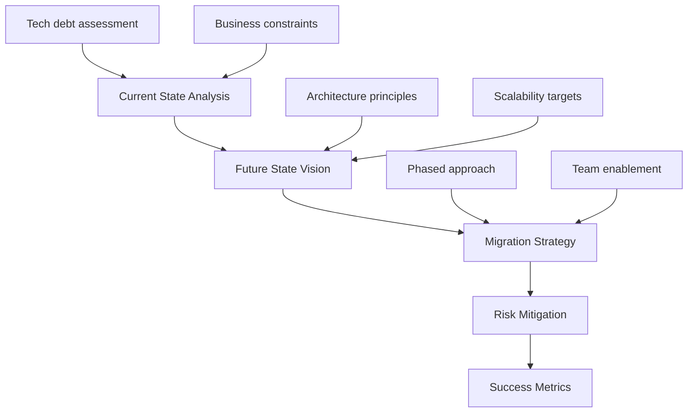
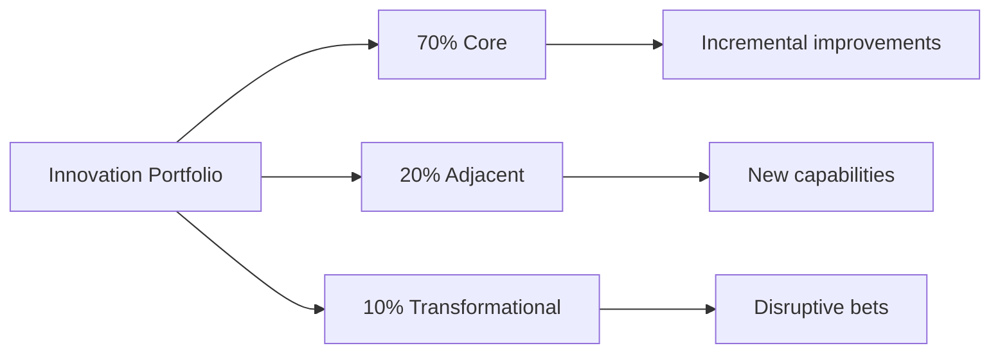

# Technical Leadership Interview Guide

## Overview

Technical leadership interviews assess your ability to make sound architectural decisions, guide technical strategy, and maintain technical excellence while scaling teams and systems. Unlike pure system design, these interviews focus on the intersection of technology leadership and business impact.

## Interview Format & Expectations

### Structure
- **Duration**: 60-90 minutes
- **Format**: Whiteboard/virtual collaboration tool
- **Evaluators**: Senior/Staff engineers, Technical directors, CTOs
- **Focus**: Technical judgment + leadership impact

### Assessment Dimensions

| Dimension | What They Evaluate | Evidence They Seek |
|-----------|-------------------|-------------------|
| **Technical Depth** | Current expertise, learning agility | Can dive deep into implementation details |
| **Architectural Vision** | System thinking, future-proofing | Designs that scale 10x-100x |
| **Technical Strategy** | Alignment with business goals | ROI-driven technical decisions |
| **Innovation Leadership** | Driving technical excellence | Patents, papers, industry influence |
| **Technical Mentorship** | Growing technical talent | Building strong engineering cultures |
| **Risk Management** | Technical debt, reliability | Balancing speed vs. sustainability |

## Technical Leadership Scenarios

### 1. Architecture Evolution
**Common Prompts**:
- "How would you migrate from monolith to microservices?"
- "Design a strategy to improve system reliability from 99.9% to 99.99%"
- "Lead a platform modernization while maintaining business velocity"

**Response Framework**:


### 2. Technical Decision Making
**Common Prompts**:
- "Choose between building vs buying for a critical component"
- "Evaluate adopting a new technology stack"
- "Decide on consistency model for global distributed system"

**Decision Framework**:
```
1. Problem Definition
   - Business requirements
   - Technical constraints
   - Success criteria

2. Option Analysis
   - Solution alternatives
   - Trade-off matrix
   - Risk assessment

3. Stakeholder Alignment
   - Engineering team buy-in
   - Business stakeholder impact
   - Customer implications

4. Execution Plan
   - Proof of concept
   - Phased rollout
   - Rollback strategy

5. Success Measurement
   - Technical metrics
   - Business KPIs
   - Team productivity
```

### 3. Technical Crisis Leadership
**Common Prompts**:
- "Your platform is down during Black Friday"
- "Critical security vulnerability discovered"
- "Major cloud provider outage affecting your services"

**Crisis Response Framework**:
```yaml
Immediate (0-1 hour):
  - Incident command structure
  - Communication channels
  - Triage and stabilization
  
Short-term (1-24 hours):
  - Root cause identification
  - Temporary mitigations
  - Customer communication
  
Long-term (1-4 weeks):
  - Permanent fixes
  - Process improvements
  - Postmortem and learnings
```

### 4. Innovation & R&D Leadership
**Common Prompts**:
- "How do you foster innovation while delivering on roadmap?"
- "Build a technical research function"
- "Introduce ML/AI capabilities to traditional product"

**Innovation Framework**:


## Technical Leadership Competencies

### 1. System Design at Scale

**Key Topics to Master**:
- Distributed systems principles (CAP, consensus, coordination)
- Data systems (OLTP, OLAP, streaming, caching)
- Infrastructure (containers, orchestration, service mesh)
- Observability (metrics, logging, tracing, SLOs)
- Security (zero trust, encryption, compliance)

**Leadership Angle**:
- Building vs buying decisions
- Technology standardization
- Platform team strategy
- Developer productivity

### 2. Technical Strategy

**Strategic Frameworks**:
```
Technology Radar:
- Adopt: Proven technologies for broad use
- Trial: Promising tech for specific cases  
- Assess: Worth investigating
- Hold: Avoid new investments

Technical Debt Management:
- Measure: Debt ratio, maintenance burden
- Prioritize: Risk vs. business impact
- Allocate: 20% capacity for debt reduction
- Track: Debt burndown metrics
```

### 3. Engineering Excellence

**Culture Building**:
- Code review practices
- Testing philosophy (unit, integration, E2E)
- CI/CD maturity
- Operational excellence
- Documentation standards

**Metrics-Driven Approach**:
| Metric Category | Example KPIs | Leadership Actions |
|----------------|--------------|-------------------|
| **Velocity** | Deployment frequency, lead time | Remove bottlenecks, automate |
| **Quality** | Defect rate, MTTR, test coverage | Invest in testing, monitoring |
| **Efficiency** | Build time, resource utilization | Optimize pipelines, right-size |
| **Innovation** | Experimentation rate, tech debt ratio | Allocate innovation time |

## Technical Communication

### Explaining Complex Concepts

**The Ladder of Abstraction**:
1. **Executive**: Business impact and ROI
2. **Director**: Strategic alignment and risks
3. **Manager**: Resource needs and timeline
4. **Engineer**: Technical implementation details

**Example - Explaining Microservices**:
```
To CEO: "Enables faster feature delivery and team autonomy"
To CFO: "Reduces time-to-market by 40%, requires 20% more infrastructure"
To VP Eng: "Allows teams to deploy independently with clear boundaries"
To Engineers: "Service mesh handles routing, circuit breakers prevent cascading failures"
```

### Whiteboarding Best Practices

**Structure**:
1. **Problem Space** (5 min)
   - Clarify requirements
   - Define constraints
   - Identify success criteria

2. **High-Level Design** (15 min)
   - Box and arrow diagram
   - Data flow
   - Key components

3. **Deep Dives** (30 min)
   - Critical path analysis
   - Scaling bottlenecks
   - Failure scenarios

4. **Trade-offs** (10 min)
   - Alternative approaches
   - Pros and cons
   - Decision rationale

**Visual Elements**:
```
Components: □ Rectangles for services
Data Stores: ⬭ Cylinders for databases
Queues: ≡ Parallel lines for messaging
Load Balancers: ⬟ Hexagons for LBs
Users: ☺ Stick figures for actors
```

## Level-Specific Technical Expectations

### Senior Manager (L5/IC6)
- **Scope**: Single product/platform
- **Depth**: Can code review critical changes
- **Strategy**: 6-12 month technical roadmap
- **Innovation**: Incremental improvements

### Director (L6/IC7)
- **Scope**: Multiple products/platforms
- **Depth**: Architecture review and guidance
- **Strategy**: 1-2 year technical vision
- **Innovation**: Adjacent capabilities

### VP+ (L7+/IC8+)
- **Scope**: Entire engineering organization
- **Depth**: Strategic technical decisions
- **Strategy**: 3-5 year transformation
- **Innovation**: Industry leadership

## Common Technical Leadership Questions

### Architecture & Scale
1. "How would you scale our service from 1M to 100M users?"
2. "Design a global deployment strategy for 50ms latency anywhere"
3. "Migrate legacy system without downtime"

### Technical Debt & Quality
1. "How do you balance feature delivery with technical debt?"
2. "What's your approach to improving code quality?"
3. "How do you make the business case for refactoring?"

### Team & Culture
1. "How do you maintain technical excellence while scaling the team?"
2. "What's your philosophy on technical documentation?"
3. "How do you handle technical disagreements?"

### Innovation & Future
1. "How do you stay current with technology trends?"
2. "What emerging technologies excite you?"
3. "How do you build an innovation culture?"

## Preparation Strategies

### Technical Deep Dives
Pick 3-5 technical initiatives to discuss in detail:
- Problem statement and constraints
- Technical alternatives considered
- Architecture decisions and trade-offs
- Implementation challenges
- Results and learnings

### Industry Knowledge
- Follow key engineering blogs (High Scalability, InfoQ)
- Read system design papers (Google, Amazon, Facebook)
- Understand current trends (K8s, service mesh, edge computing)
- Know competitor architectures

### Mock Interview Practice
```yaml
Week 1-2: Foundation
  - Review distributed systems concepts
  - Practice basic system design
  - Prepare technical stories

Week 3-4: Leadership Layer
  - Add business context to designs
  - Practice technical trade-off discussions
  - Refine communication style

Week 5-6: Integration
  - Full mock interviews
  - Mix technical and behavioral
  - Get feedback from senior engineers
```

---

**Next Steps**: Review [System & Org Design](../system-org-design/) for organizational aspects, and practice with the [Interactive Tools](../tools/interactive/).