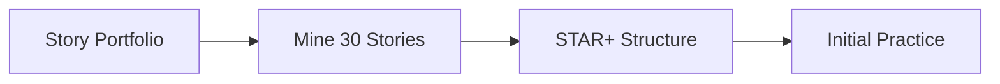
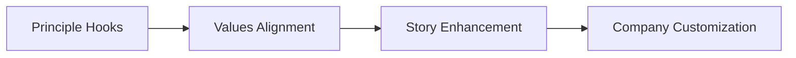
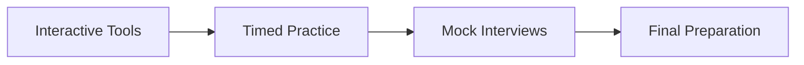

# Interview Execution Tools

## Table of Contents

- [Overview](#overview)
- [Core Frameworks](#core-frameworks)
  - [1. [STAR+ Framework](../../engineering-leadership/level-4-interview-execution/tools/star-framework/)](#1-star-frameworkengineering-leadershiplevel-4-interview-executiontoolsstar-framework)
  - [2. [Story Portfolio](../../engineering-leadership/level-4-interview-execution/tools/story-portfolio/)](#2-story-portfolioengineering-leadershiplevel-4-interview-executiontoolsstory-portfolio)
  - [3. [Principle Hooks](../../engineering-leadership/level-4-interview-execution/tools/principle-hooks/)](#3-principle-hooksengineering-leadershiplevel-4-interview-executiontoolsprinciple-hooks)
  - [4. [Mock Interview Guide](../../engineering-leadership/level-4-interview-execution/tools/mock-interview-guide.md)](#4-mock-interview-guideengineering-leadershiplevel-4-interview-executiontoolsmock-interview-guidemd)
- [Interactive Tools](#interactive-tools)
  - [5. [Interactive Practice Tools](../../engineering-leadership/level-4-interview-execution/tools/interactive/)](#5-interactive-practice-toolsengineering-leadershiplevel-4-interview-executiontoolsinteractive)
    - [Question Bank](#question-bank)
    - [STAR Matcher](#star-matcher)
    - [Interview Timer](#interview-timer)
    - [Decision Trees](#decision-trees)
    - [Self-Assessment](#self-assessment)
- [Tool Integration Workflow](#tool-integration-workflow)
  - [Phase 1: Foundation (Weeks 1-2)](#phase-1-foundation-weeks-1-2)
  - [Phase 2: Refinement (Weeks 3-4)](#phase-2-refinement-weeks-3-4)
  - [Phase 3: Execution (Weeks 5-6)](#phase-3-execution-weeks-5-6)
- [Quick Start Guide](#quick-start-guide)
  - [For Behavioral Interviews](#for-behavioral-interviews)
  - [For Culture Interviews](#for-culture-interviews)
  - [For Technical Leadership](#for-technical-leadership)
- [Tool Selection Matrix](#tool-selection-matrix)
- [Best Practices](#best-practices)
  - [Daily Practice Routine (30 minutes)](#daily-practice-routine-30-minutes)
  - [Weekly Deep Dives (2 hours)](#weekly-deep-dives-2-hours)
- [Common Pitfalls](#common-pitfalls)
  - [Tool Misuse](#tool-misuse)
  - [Integration Failures](#integration-failures)
- [Success Metrics](#success-metrics)
- [Advanced Usage](#advanced-usage)
  - [Creating Custom Tools](#creating-custom-tools)
  - [Peer Practice Groups](#peer-practice-groups)


## Overview

This toolkit provides practical frameworks and interactive tools to transform your interview preparation from theoretical knowledge to flawless execution. Each tool is designed to address specific aspects of the leadership interview process.

## Core Frameworks

### 1. [STAR+ Framework](../../engineering-leadership/level-4-interview-execution/tools/star-framework/)
The enhanced STAR method specifically designed for leadership interviews, adding Scale, Learning, and Impact dimensions.

**Use When**:
- Structuring any behavioral response
- Demonstrating leadership scope
- Showing growth mindset
- Quantifying impact

**Key Features**:
- Traditional STAR + leadership dimensions
- Level-specific examples
- Power phrases for impact
- Practice templates

### 2. [Story Portfolio](../../engineering-leadership/level-4-interview-execution/tools/story-portfolio/)
A comprehensive system for building, organizing, and deploying 20-30 leadership stories that demonstrate your full range.

**Use When**:
- Building interview preparation foundation
- Ensuring comprehensive coverage
- Mapping stories to competencies
- Preparing for specific companies

**Key Features**:
- Story mining techniques
- Portfolio organization matrix
- Company values mapping
- Story refinement process

### 3. [Principle Hooks](../../engineering-leadership/level-4-interview-execution/tools/principle-hooks/)
Strategic techniques for authentically connecting your experiences to company values and principles.

**Use When**:
- Preparing for culture interviews
- Demonstrating values alignment
- Enhancing story impact
- Differentiating yourself

**Key Features**:
- Company-specific hooks
- Natural integration techniques
- Authenticity framework
- Advanced hook patterns

### 4. [Mock Interview Guide](../../engineering-leadership/level-4-interview-execution/tools/mock-interview-guide.md)
Complete mock interview experience with questions, answers, and evaluation rubrics.

**Use When**:
- Conducting practice interviews
- Self-assessment with realistic scenarios
- Understanding interviewer perspectives
- Final preparation before interviews

**Key Features**:
- Full 6-round interview structure
- Sample questions and strong answers
- Evaluation rubrics by level
- Red flags to avoid

## Interactive Tools

### 5. [Interactive Practice Tools](../../engineering-leadership/level-4-interview-execution/tools/interactive/)
Digital tools for hands-on interview preparation and practice.

**Available Tools**:

#### Question Bank
- **Purpose**: Comprehensive database of leadership interview questions
- **Features**: Categorized by competency, level, and company
- **Use**: Daily practice, mock interviews

#### STAR Matcher
- **Purpose**: Match your stories to specific questions
- **Features**: AI-powered story-question mapping
- **Use**: Optimize story selection

#### Interview Timer
- **Purpose**: Practice time management
- **Features**: Customizable alerts, pacing guidance
- **Use**: Mock interview practice

#### Decision Trees
- **Purpose**: Navigate complex interview scenarios
- **Features**: Interactive decision paths
- **Use**: Prepare for edge cases

#### Self-Assessment
- **Purpose**: Evaluate interview readiness
- **Features**: Competency scoring, gap analysis
- **Use**: Focus preparation efforts

## Tool Integration Workflow

### Phase 1: Foundation (Weeks 1-2)


### Phase 2: Refinement (Weeks 3-4)


### Phase 3: Execution (Weeks 5-6)


## Quick Start Guide

### For Behavioral Interviews
1. Start with [Story Portfolio](../../engineering-leadership/level-4-interview-execution/tools/story-portfolio/) - Build your story bank
2. Apply [STAR+ Framework](../../engineering-leadership/level-4-interview-execution/tools/star-framework/) - Structure responses
3. Use [Question Bank](../../engineering-leadership/level-4-interview-execution/tools/interactive/question-bank.md) - Practice variety

### For Culture Interviews
1. Study [Principle Hooks](../../engineering-leadership/level-4-interview-execution/tools/principle-hooks/) - Understand alignment
2. Map stories to values using [Story Portfolio](../../engineering-leadership/level-4-interview-execution/tools/story-portfolio/)
3. Practice with [Self-Assessment](../../engineering-leadership/level-4-interview-execution/tools/interactive/self-assessment.md)

### For Technical Leadership
1. Review [STAR+ Framework](../../engineering-leadership/level-4-interview-execution/tools/star-framework/) for technical stories
2. Use [Decision Trees](../../engineering-leadership/level-4-interview-execution/tools/interactive/decision-trees.md) for scenarios
3. Time management with [Interview Timer](../../engineering-leadership/level-4-interview-execution/tools/interactive/interview-timer.md)

## Tool Selection Matrix

| Interview Type | Primary Tool | Secondary Tools | Practice Tools |
|---------------|--------------|-----------------|----------------|
| **Behavioral** | STAR+ Framework | Story Portfolio | Question Bank, Timer |
| **Technical** | STAR+ Framework | Principle Hooks | Decision Trees |
| **Culture** | Principle Hooks | Story Portfolio | Self-Assessment |
| **Executive** | Story Portfolio | All Frameworks | All Interactive |

## Best Practices

### Daily Practice Routine (30 minutes)
```yaml
Week 1-2:
  - 10 min: Story development (Portfolio)
  - 10 min: STAR+ structure practice
  - 10 min: Question bank review

Week 3-4:
  - 10 min: Principle integration
  - 10 min: Timed responses
  - 10 min: Self-assessment

Week 5-6:
  - 15 min: Mock scenarios
  - 15 min: Weak area focus
```

### Weekly Deep Dives (2 hours)
- **Monday**: New story development
- **Wednesday**: Mock interview with tools
- **Friday**: Company-specific customization

## Common Pitfalls

### Tool Misuse
❌ Over-scripting responses
✅ Use frameworks as guides

❌ Memorizing without understanding
✅ Internalize principles

❌ One-size-fits-all approach
✅ Customize for each company

### Integration Failures
❌ Using tools in isolation
✅ Combine for maximum impact

❌ Last-minute preparation
✅ 6-week structured approach

❌ Ignoring feedback
✅ Iterate based on practice

## Success Metrics

Track your progress:
- [ ] 20+ stories developed and structured
- [ ] All stories mapped to values
- [ ] 3+ mock interviews completed
- [ ] Response time consistently 2-3 minutes
- [ ] Natural delivery without notes
- [ ] Positive mock interview feedback

## Advanced Usage

### Creating Custom Tools
Extend the frameworks for your specific needs:
- Industry-specific story templates
- Company-specific value mappings
- Personal weakness mitigation plans

### Peer Practice Groups
Form study groups to:
- Exchange mock interviews
- Share story feedback
- Practice tool usage
- Calibrate responses

---

**Next Steps**: Begin with the [Story Portfolio](../../engineering-leadership/level-4-interview-execution/tools/story-portfolio/) to build your foundation, then layer in other tools as you progress through your preparation journey.