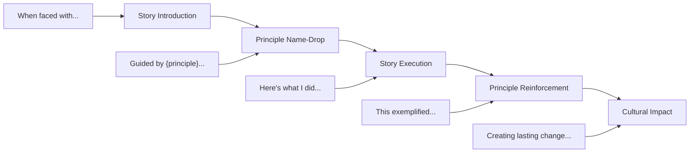

# Principle Hooks: Aligning Stories with Company Values

## Overview

Principle Hooks are strategic techniques for explicitly connecting your leadership stories to company values and principles. This framework helps you demonstrate deep cultural alignment while maintaining authenticity.

## The Hook Framework

### Structure of a Principle Hook



## Company-Specific Principle Hooks

### Amazon Leadership Principles

#### Customer Obsession
**Hook Phrases**:
- "Starting from the customer and working backwards..."
- "When I put myself in the customer's shoes..."
- "The customer pain point that drove this decision..."

**Story Integration**:
```
"When our NPS dropped to 42, I knew we had lost sight of customer 
obsession. Rather than optimizing for internal metrics, I embedded 
myself with support for a week, personally handling 50+ tickets..."
```

#### Ownership
**Hook Phrases**:
- "I took complete ownership of..."
- "The buck stopped with me on..."
- "Acting like an owner, not a renter..."

**Story Integration**:
```
"Despite it being outside my team's scope, I took ownership of the 
platform stability issue because customers don't care about org 
boundaries. I formed a virtual tiger team..."
```

#### Invent and Simplify
**Hook Phrases**:
- "We challenged the assumption that..."
- "By simplifying from first principles..."
- "The innovation came from removing, not adding..."

**Story Integration**:
```
"Everyone accepted that deployments took 4 hours. But by returning 
to first principles and asking 'what if we could deploy in 4 minutes?' 
we invented a new approach that eliminated 7 legacy systems..."
```

### Google Values

#### Focus on the User
**Hook Phrases**:
- "Users don't care about our internal complexity..."
- "By obsessing over user latency..."
- "Making the user journey frictionless..."

**Story Integration**:
```
"When choosing between a technically elegant solution and user 
experience, I always focus on the user. In this case, we chose 
the 'messier' architecture that gave users 10x faster load times..."
```

#### Democracy on the Web
**Hook Phrases**:
- "Making information universally accessible..."
- "Breaking down data silos..."
- "Democratizing access to..."

**Story Integration**:
```
"Our analytics tools were only available to data scientists. By 
democratizing this capability, we enabled every PM and engineer 
to make data-driven decisions, increasing experimentation by 300%..."
```

### Meta Values

#### Move Fast
**Hook Phrases**:
- "Perfect is the enemy of shipped..."
- "We optimized for learning velocity..."
- "Speed as a habitual practice..."

**Story Integration**:
```
"Rather than spending 6 months on the perfect solution, we shipped 
an MVP in 2 weeks. This 'move fast' approach let us learn that our 
initial hypothesis was wrong, saving 5 months of wasted effort..."
```

#### Be Bold  
**Hook Phrases**:
- "The bold bet was to..."
- "Risking short-term pain for long-term gain..."
- "When everyone said it couldn't be done..."

**Story Integration**:
```
"The safe choice was to patch the legacy system. The bold choice was 
to rebuild it during peak season. By being bold and meticulous about 
risk mitigation, we transformed our architecture with zero downtime..."
```

## Advanced Hook Techniques

### The Triple Hook
Weave multiple principles into one story:

```
"This situation required me to [Principle 1] while also [Principle 2], 
ultimately demonstrating [Principle 3]."

Example: "I had to Dive Deep into the technical details while maintaining 
Ownership of the business outcome, all while being Customer Obsessed 
about the user experience during the migration."
```

### The Counter-Principle Hook
Show nuanced understanding by acknowledging tension:

```
"While [Principle A] would suggest X, I recognized that [Principle B] 
was more important here because..."

Example: "While 'Move Fast' would suggest shipping immediately, 
'Focus on the User' made it clear that data integrity was paramount, 
so we added 2 weeks for additional testing..."
```

### The Evolution Hook
Show growth in understanding principles:

```
"Early in my career, I interpreted [Principle] as X, but I've learned 
it really means Y..."

Example: "I used to think 'Ownership' meant doing everything myself. 
Now I understand it means ensuring things get done, often by empowering 
others to own their pieces..."
```

## Principle Hook Patterns by Interview Stage

### Phone Screen
- Light touches: 1-2 principle mentions
- Focus on action alignment, not explicit naming
- Natural integration over forced references

### Behavioral Rounds
- Explicit principle naming: 2-3 per story
- Deep demonstration through actions
- Connect to larger cultural themes

### Executive Rounds
- Sophisticated understanding of principle tensions
- Show how you've taught/scaled principles
- Demonstrate principle evolution at company level

## Authenticity Framework

### Do's and Don'ts

✅ **DO**:
- Internalize principles before interviews
- Use principles as decision frameworks
- Show how principles guided real decisions
- Acknowledge when principles conflict
- Demonstrate nuanced understanding

❌ **DON'T**:
- Force principles into every sentence
- Use principles as buzzwords
- Claim perfect alignment always
- Ignore principle complexity
- Recite principles robotically

### Natural Integration Techniques

**Subtle Introduction**:
- "This reminded me of an important principle..."
- "The framework I used was inspired by..."
- "This situation called for..."

**Organic Weaving**:
- Let actions demonstrate principles
- Use principle language naturally
- Connect to company mission implicitly

**Authentic Reflection**:
- "Looking back, this really embodied..."
- "I didn't realize it then, but this was..."
- "This experience shaped my view of..."

## Practice Exercises

### Exercise 1: Principle Mapping
For each story in your portfolio:
1. List 3-5 relevant principles
2. Identify the primary principle
3. Find natural connection points
4. Practice both explicit and implicit versions

### Exercise 2: Principle Tensions
Create scenarios where principles conflict:
1. Speed vs Quality
2. Individual vs Team
3. Short-term vs Long-term
4. Data vs Intuition

### Exercise 3: Cultural Translation
Take one story and adapt it for:
1. Amazon (Leadership Principles)
2. Google (User focus, Innovation)
3. Meta (Speed, Bold, Open)
4. Apple (Quality, Simplicity, Privacy)
5. Netflix (Context not control, Freedom & Responsibility)

## Company Deep Dives

### Amazon's Hidden Principles
Beyond the official 16:
- **Frugality** → "Constraints breed resourcefulness"
- **Think Big** → "10x thinking changes solutions"
- **Bias for Action** → "Reversible decisions need speed"

### Google's Unwritten Rules
- **Data Wins Arguments** → "Let the data speak"
- **Technical Excellence** → "Code quality matters"
- **Global Scale** → "Build for billions"

### Meta's Cultural Nuances
- **Hack Culture** → "Ship to learn"
- **Bottom-up Innovation** → "Best ideas win"
- **Open Communication** → "Respectful directness"

## Red Flags to Avoid

### Over-Indexing
❌ "In the spirit of Customer Obsession, and demonstrating Ownership while Diving Deep..."
✅ "The customer feedback was clear, so I took responsibility for fixing it..."

### Misunderstanding Principles  
❌ "I demonstrated Frugality by cutting the testing budget"
✅ "Frugality drove us to find a creative solution using existing tools"

### Performative Alignment
❌ "I always perfectly embody all 16 principles"
✅ "This principle particularly resonates with my leadership style"

## Integration Worksheet

For each target company:

**Company**: ________________

**Core Principles/Values**:
1. ________________
2. ________________
3. ________________

**My Strongest Alignment**:
- Principle: ________________
- Evidence: ________________
- Story: ________________

**My Growth Area**:
- Principle: ________________
- Learning: ________________
- Development: ________________

---

**Next Steps**: Practice integrating principle hooks with your [Story Portfolio](../../engineering-leadership/level-4-interview-execution/tools/story-portfolio/index.md), then test authenticity with mock interviews.