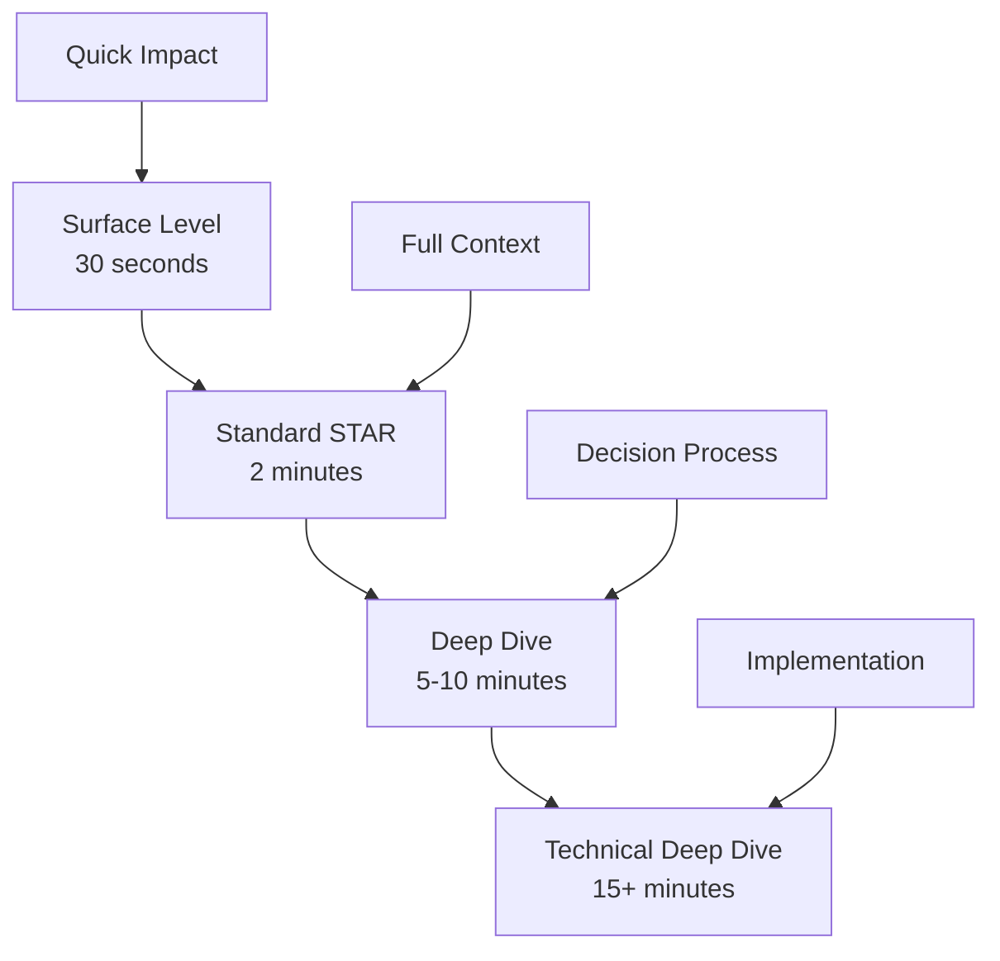
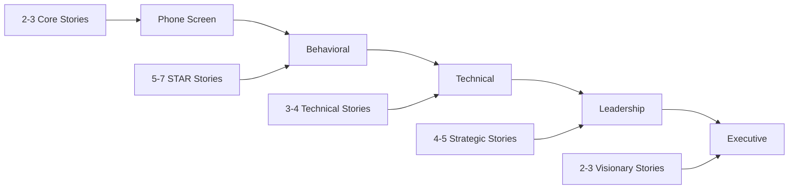

# Leadership Story Portfolio Framework

## Overview

A well-crafted story portfolio is your strategic asset for leadership interviews. This framework helps you build, organize, and deploy 20-30 compelling stories that demonstrate your leadership range and impact.

## Story Portfolio Architecture

### Core Story Categories

| Category | Story Count | Example Scenarios | Key Metrics |
|----------|-------------|-------------------|-------------|
| **People Leadership** | 5-6 stories | Hiring, firing, coaching, team building | Team size, retention, performance improvement |
| **Technical Leadership** | 4-5 stories | Architecture decisions, migrations, innovations | Scale, performance gains, cost savings |
| **Business Impact** | 4-5 stories | Revenue growth, cost reduction, new products | $$$ impact, user growth, market share |
| **Crisis Management** | 3-4 stories | Outages, conflicts, pivots, failures | Recovery time, impact mitigation, lessons |
| **Organizational Change** | 3-4 stories | Reorgs, M&A, culture shifts, process changes | Team affected, efficiency gains, adoption |
| **Cross-functional** | 2-3 stories | Partnerships, influence without authority | Stakeholders, alignment achieved, outcomes |

### Story Depth Levels



## Story Development Process

### Step 1: Story Mining
**Brainstorming Prompts**:
- Biggest failure that taught you the most?
- Time you influenced without authority?
- Most complex technical decision?
- Hardest people decision?
- Project you're most proud of?
- Time you changed company direction?

### Step 2: Story Structuring

**Enhanced STAR+ Template**:
```markdown
# Story Title: [Descriptive Name]
**Category**: [Primary] | [Secondary]
**Level**: [IC/Manager/Director/VP]
**Company Context**: [Size, Stage, Industry]

## Situation (20-30 seconds)
- Company state and challenge
- Your role and scope
- Key constraints and timeline

## Task (10-15 seconds)  
- Specific objective
- Success criteria
- Stakeholders involved

## Action (60-90 seconds)
1. **Analysis Phase**
   - Data gathered
   - Options considered
   - Trade-offs evaluated

2. **Decision Phase**
   - Framework used
   - Stakeholders aligned
   - Risks mitigated

3. **Execution Phase**
   - Team mobilization
   - Progress tracking
   - Course corrections

## Result (20-30 seconds)
- Quantified outcomes
- Business impact
- Team/org impact

## Learning (10-15 seconds)
- Personal insight
- Applied elsewhere
- Would do differently

## Scale & Impact
- Direct: [immediate metrics]
- Indirect: [long-term effects]
- Strategic: [company-level impact]
```

### Step 3: Story Quantification

**Metrics Checklist**:
- [ ] Team size (direct/indirect reports)
- [ ] Timeline (project duration, deadline)
- [ ] Budget (managed, saved, generated)
- [ ] Performance (latency, throughput, uptime)
- [ ] Business (revenue, users, market share)
- [ ] Efficiency (time saved, automation %)
- [ ] Quality (defect reduction, NPS)
- [ ] People (retention, engagement, promotion)

## Story Portfolio Matrix

### Mapping Stories to Competencies

| Story | People | Technical | Business | Strategy | Execution | Innovation | Culture |
|-------|--------|-----------|----------|----------|-----------|------------|---------|
| Platform Migration | ✓ | ✓✓✓ | ✓✓ | ✓✓ | ✓✓✓ | ✓ | |
| Team Scaling 10→50 | ✓✓✓ | ✓ | ✓ | ✓✓ | ✓✓ | | ✓✓ |
| Product Pivot | ✓✓ | ✓ | ✓✓✓ | ✓✓✓ | ✓✓ | ✓✓ | ✓ |
| Performance Crisis | ✓ | ✓✓ | ✓✓ | ✓ | ✓✓✓ | | |

### Company Values Alignment

**Amazon Leadership Principles Mapping**:
| Story | Ownership | Deliver Results | Customer Obsession | Dive Deep | Invent & Simplify |
|-------|-----------|-----------------|-------------------|-----------|-------------------|
| Story 1 | ✓✓✓ | ✓✓ | ✓ | ✓✓ | |
| Story 2 | ✓ | ✓✓✓ | ✓✓✓ | | ✓✓ |

## Story Deployment Strategy

### Interview Stage Mapping



### Dynamic Story Selection

**Selection Criteria**:
1. **Interviewer Background**: Technical vs Business vs HR
2. **Role Level**: Scope expectations (team vs org vs company)
3. **Company Stage**: Startup vs growth vs mature
4. **Recent Events**: Related to company challenges
5. **Previous Rounds**: Avoid repetition, show range

## Story Practice Framework

### Solo Practice Routine
```yaml
Daily (10 minutes):
  - Practice one story out loud
  - Time yourself (aim for 2 minutes)
  - Record and review

Weekly (30 minutes):
  - Deep dive into one story
  - Add new metrics/details
  - Practice variations

Monthly (2 hours):
  - Full portfolio review
  - Update with recent accomplishments
  - Mock interview with all stories
```

### Peer Practice Sessions
```yaml
Format: 60-minute session
  - Warm-up: 5 minutes
  - Story rounds: 40 minutes (4-5 stories)
  - Feedback: 15 minutes

Feedback Framework:
  - Clarity: Was the story easy to follow?
  - Impact: Was the impact compelling?
  - Authenticity: Did it feel genuine?
  - Relevance: Did it address the question?
```

## Story Refinement Techniques

### Power Moves
- **The Hook**: Start with surprising outcome
- **The Pivot**: Show adaptability mid-story
- **The Scale**: Zoom from tactical to strategic
- **The Learning**: Vulnerable but growth-minded

### Common Story Upgrades

| Before | After |
|--------|-------|
| "I led a team" | "I led 12 engineers across 3 time zones" |
| "We improved performance" | "We reduced p99 latency by 73% (450ms → 122ms)" |
| "It was successful" | "Generated $3.2M ARR in first 6 months, exceeding target by 28%" |
| "I learned a lot" | "This experience fundamentally changed how I approach X, which I later applied to Y with Z result" |

## Story Portfolio Maintenance

### Quarterly Review Checklist
- [ ] Add 2-3 new stories from recent quarter
- [ ] Retire outdated stories (>3 years unless exceptional)
- [ ] Update metrics with latest data
- [ ] Refresh company context for accuracy
- [ ] Practice with someone from target company
- [ ] Align with current market trends

### Story Documentation Template
```markdown
## Quick Reference Card
**Story**: [One-line summary]
**Best For**: [Interview types/questions]
**Avoid When**: [Situations where less relevant]
**Key Numbers**: [Top 3 metrics]
**Unique Angle**: [What makes this special]
**Time**: [30s | 2m | 5m | 10m versions]
```

## Red Flags in Story Portfolio

### Portfolio-Level Issues
- ❌ All stories from same time period
- ❌ No failure or learning stories
- ❌ Only technical or only people stories
- ❌ No stories showing executive interaction
- ❌ All hero narratives (no team success)

### Story-Level Issues
- ❌ Vague metrics ("significantly improved")
- ❌ Blaming others for failures
- ❌ Taking credit for team's work
- ❌ No clear personal contribution
- ❌ Outcome doesn't match buildup

## Advanced Techniques

### Story Chaining
Link stories for deeper impact:
- "This reminds me of another situation where..."
- "The learning from X helped me handle Y..."
- "This built the foundation for [bigger story]..."

### Meta-Narratives
Weave stories into larger themes:
- Innovation thread across multiple stories
- Leadership evolution journey
- Building and scaling excellence

### Defensive Storytelling
Prepare for tough follow-ups:
- "What would you do differently?"
- "Why did it take so long?"
- "Seems like you should have seen that coming?"

---

**Next Steps**: Use the [Story Mining Worksheet](./story-mining-worksheet.md) to brainstorm your stories, then organize them using the [Portfolio Tracker](./portfolio-tracker.md).