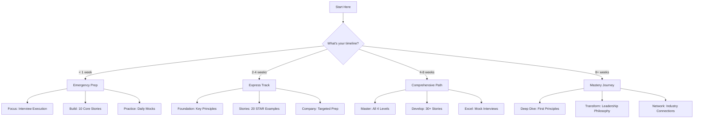

# 🧭 Engineering Leadership Framework Navigation Guide

Your personalized roadmap to mastering engineering leadership interviews

## Quick Navigation Decision Tree

## 🎯 Navigation by Role Transition

### IC to Engineering Manager (L5→L6)
**Your Challenge**: Shifting from code to people

#### One-Week Prep
**Emergency Mode - Interview Tomorrow**
1. **Day 1-2**: [People Management Basics](level-3-applications/people-management/index.md)
2. **Day 3-4**: Build 10 STAR stories focused on:
   - Leading without authority
   - Mentoring/coaching
   - Project leadership
3. **Day 5-6**: [Company-specific values](company-specific/index.md)
4. **Day 7**: Mock interviews with [timer](level-4-interview-execution/tools/interactive/interview-timer.md)

#### Two-Week Prep
**Focused Preparation**

| Week | Focus | Daily Activities |
|------|-------|------------------|
| **Week 1** | Foundation | • 2hr: [People Management](level-3-applications/people-management/index.md) • 1hr: Story development • 30min: Practice scenarios |
| **Week 2** | Execution | • 1hr: Company research • 1hr: Mock interviews • 1hr: Story refinement |

#### Four-Week Prep
**Comprehensive Path**

| Week | Theme | Key Activities |
|------|-------|---------------|
| **1** | People Skills | Team building, conflict resolution, performance management |
| **2** | Technical Leadership | Architecture decisions, tech debt, scaling systems |
| **3** | Business Acumen | Metrics, stakeholder management, resource allocation |
| **4** | Interview Polish | Mock interviews, story refinement, company alignment |

#### Eight-Week Mastery Path
**Complete Transformation**

| Phase | Weeks | Focus | Outcomes |
|-------|-------|-------|----------|
| **Foundation** | 1-2 | First Principles + Core Business | Understand the "why" behind leadership |
| **Application** | 3-4 | People + Technical Leadership | Build practical skills |
| **Integration** | 5-6 | Story Development + Practice | Create compelling narratives |
| **Excellence** | 7-8 | Mock Interviews + Polish | Interview-ready confidence |

### Engineering Manager to Senior Manager (L6→L7)
**Your Challenge**: Scaling from team to teams

#### Two-Week Sprint
1. **Week 1**: [Organizational Design](level-3-applications/organizational-design/index.md) + [Business Strategy](level-2-core-business/strategy/index.md)
2. **Week 2**: Multi-team stories + Cross-functional leadership examples

#### Four-Week Comprehensive
- **Weeks 1-2**: Master [First Principles](level-1-first-principles/index.md) - especially Systems Thinking
- **Week 3**: [Managing Managers](hard-earned-wisdom/managing-up-dark-art.md) + Org Politics
- **Week 4**: Executive communication + Strategic initiatives stories

### Senior Manager to Director (L7→L8)
**Your Challenge**: Business leadership with P&L responsibility

#### Two-Week Executive Prep
- **Week 1**: [Finance](level-2-core-business/finance/index.md) + [Strategy](level-2-core-business/strategy/index.md) + ROI stories
- **Week 2**: Board-level communication + Transformation narratives

#### Four-Week Strategic Path
1. **Business Mastery** (Week 1-2): All Level 2 concepts
2. **Executive Presence** (Week 3): Vision, strategy, culture stories
3. **Interview Excellence** (Week 4): C-suite mock interviews

## ⏱️ Time-Based Learning Paths

### 🚨 Emergency Prep (< 1 week)

**Day-by-Day Plan**:

| Day | Morning (2hr) | Afternoon (2hr) | Evening (1hr) |
|-----|---------------|-----------------|----------------|
| **1** | [Self-assessment](level-4-interview-execution/tools/interactive/self-assessment.md) | Identify 20 experiences | Write 5 STAR stories |
| **2** | [STAR framework](level-4-interview-execution/tools/star-framework/index.md) | Write 5 more stories | Practice delivery |
| **3** | Company research | Align stories to values | Mock interview |
| **4** | Weak area focus | Polish top 10 stories | Practice scenarios |
| **5** | Final review | Last mock interview | Confidence building |

### 🏃 Express Track (2-4 weeks)

**Week-by-Week Focus**:

| Week | Primary Focus | Secondary Focus | Practice |
|------|--------------|-----------------|----------|
| **1** | Story Mining | Framework basics | 2 stories/day |
| **2** | First Principles | Business concepts | Refine stories |
| **3** | Company alignment | Technical refresh | Mock interviews |
| **4** | Polish & Practice | Weak areas | Daily mocks |

### 📚 Comprehensive Track (4-8 weeks)

**Bi-Weekly Milestones**:

| Weeks | Learning Goals | Practice Goals | Deliverables |
|-------|---------------|----------------|--------------|
| **1-2** | Complete Level 1 & 2 | Daily story writing | 15 rough stories |
| **3-4** | Master Level 3 | Practice scenarios | 20 polished stories |
| **5-6** | Company deep dive | Mock interviews | Company-aligned stories |
| **7-8** | Level 4 execution | Polish presence | Interview ready |

### 🎓 Mastery Track (8+ weeks)

**Monthly Themes**:

| Month | Theme | Deep Dive Topics | Outcomes |
|-------|-------|------------------|----------|
| **1** | Foundations | All first principles, business strategy | Mental models mastery |
| **2** | Applications | People, technical, org design | Practical expertise |
| **3** | Excellence | Executive presence, industry knowledge | Thought leadership |

## 🗺️ Topic Navigation Map

### Quick Topic Finder

#### "I need help with..."

**People & Culture**
- [Hiring](level-3-applications/people-management/hiring-interviewing.md)
- [Performance Management](level-3-applications/people-management/performance-management.md)
- [Team Building](level-3-applications/people-management/team-building-culture.md)
- [Conflict Resolution](practice-scenarios/team-conflict-scenario.md)
- [Diversity & Inclusion](level-3-applications/people-management/index.md#diversity-inclusion)

**Technical & Architecture**
- [Technical Strategy](level-3-applications/technical-leadership/technical-strategy.md)
- [System Design for Leaders](level-4-interview-execution/system-org-design/index.md)
- [Platform Thinking](level-3-applications/technical-leadership/index.md#platform-thinking)
- [Tech Debt Management](level-3-applications/technical-leadership/index.md#tech-debt)

**Business & Strategy**
- [Business Metrics](level-3-applications/business-acumen/business-metrics.md)
- [Financial Planning](level-2-core-business/finance/index.md)
- [Strategic Thinking](level-2-core-business/strategy/index.md)
- [Stakeholder Management](level-3-applications/business-acumen/index.md#stakeholders)

**Organizational**
- [Team Topologies](level-3-applications/organizational-design/team-topologies.md)
- [Scaling Organizations](level-3-applications/organizational-design/index.md)
- [Reorg Planning](practice-scenarios/reorg-scenario.md)
- [Conway's Law](level-3-applications/organizational-design/index.md#conways-law)

## 🏢 Company-Specific Navigation

### Company Preparation Matrix

| Company | Must Study | Interview Format | Success Factors |
|---------|------------|------------------|-----------------|
| **Amazon** | [16 Leadership Principles](company-specific/amazon/index.md) | • 5-6 rounds • Bar raiser • Deep dive STAR | Data-driven decisions, customer obsession |
| **Google** | [Googleyness](company-specific/google/index.md) | • 4-5 rounds • Technical depth • Leadership craft | Technical excellence, collaboration |
| **Meta** | [Move Fast](company-specific/meta/index.md) | • 4-5 rounds • Impact focus • Rapid iteration | Bold bets, data-driven, impact |
| **Apple** | [Functional Excellence](company-specific/apple/index.md) | • 6-8 rounds • Deep expertise • Cross-functional | Quality obsession, attention to detail |
| **Microsoft** | [Growth Mindset](company-specific/microsoft/index.md) | • 4-5 rounds • Inclusive hiring • Learn-it-all | Customer focus, diverse & inclusive |
| **Netflix** | [Culture Deck](company-specific/netflix/index.md) | • 4-6 rounds • Culture fit critical • Candor expected | Freedom & responsibility, context not control |

## 💡 Learning Style Paths

### Visual Learners
1. Start with all **Mermaid diagrams** in framework
2. Use [Decision Trees](level-4-interview-execution/tools/interactive/decision-trees.md)
3. Create mind maps of concepts
4. Watch framework overview videos

### Reading/Writing Learners
1. Begin with [First Principles](level-1-first-principles/index.md) texts
2. Write detailed [STAR stories](level-4-interview-execution/tools/story-portfolio/index.md)
3. Create personal notes and summaries
4. Journal leadership reflections

### Kinesthetic Learners
1. Jump into [Practice Scenarios](practice-scenarios/index.md)
2. Use [Interactive Tools](level-4-interview-execution/tools/interactive/index.md)
3. Do mock interviews early
4. Learn by teaching others

### Auditory Learners
1. Practice stories out loud daily
2. Record and listen to yourself
3. Find a study partner for discussions
4. Use voice memos for concepts

## 📊 Progress Tracking System

### Weekly Scorecard

| Metric | Week 1 | Week 2 | Week 3 | Week 4 | Target |
|--------|--------|--------|--------|--------|--------|
| Stories Written | ___ | ___ | ___ | ___ | 20+ |
| Mock Interviews | ___ | ___ | ___ | ___ | 4+ |
| Principles Mastered | ___ | ___ | ___ | ___ | 5/5 |
| Weak Areas Fixed | ___ | ___ | ___ | ___ | 3+ |
| Confidence (1-10) | ___ | ___ | ___ | ___ | 8+ |

### Daily Habits for Success

**Morning Routine (30 min)**
- [ ] Review one first principle
- [ ] Practice one STAR story aloud
- [ ] Read one leadership article

**Lunch Break (15 min)**
- [ ] Quick scenario practice
- [ ] Review company values
- [ ] Network coffee chat

**Evening Session (45 min)**
- [ ] Write/refine one story
- [ ] Mock interview question
- [ ] Reflect on learnings

## 🚀 Quick Start by Urgency

### "My interview is tomorrow!"
1. **Now**: Read [company values](company-specific/index.md)
2. **2 hours**: Write 5 STAR stories
3. **Tonight**: Practice with [timer](level-4-interview-execution/tools/interactive/interview-timer.md)
4. **Morning**: Review and confidence meditation

### "I have 3 days"
- **Day 1**: [Self-assessment](level-4-interview-execution/tools/interactive/self-assessment.md) + 10 stories
- **Day 2**: Company research + story alignment
- **Day 3**: Mock interviews + polish

### "I have 1 week"
Follow the [Emergency Prep](#emergency-prep--1-week) plan above

### "I have 1 month"
Follow the [Express Track](#express-track-2-4-weeks) plan above

## 🎯 Success Indicators

### You're Ready When...

**Behavioral Readiness**
- [ ] 20+ polished STAR stories
- [ ] Stories map to company values
- [ ] Natural delivery without memorization
- [ ] Handle follow-up questions smoothly

**Technical Readiness**
- [ ] Can design systems and organizations
- [ ] Explain technical decisions to non-technical audience
- [ ] Balance technical debt vs. features
- [ ] Demonstrate platform thinking

**Leadership Readiness**
- [ ] Clear leadership philosophy
- [ ] Examples across all leadership dimensions
- [ ] Can navigate difficult conversations
- [ ] Show executive presence

**Business Readiness**
- [ ] Understand P&L responsibility
- [ ] Can make ROI arguments
- [ ] Connect engineering to business outcomes
- [ ] Think strategically about resources

## 📚 Essential Resources Priority

### 🔴 Critical (Must Read)
1. [Framework Overview](framework-index.md)
2. Your role-specific section in Level 3
3. [STAR Framework](level-4-interview-execution/tools/star-framework/index.md)
4. Target company guide

### 🟡 Important (Should Read)
1. [First Principles](level-1-first-principles/index.md)
2. [Practice Scenarios](practice-scenarios/index.md)
3. [Self-Assessment](level-4-interview-execution/tools/interactive/self-assessment.md)
4. Relevant [Hard-Earned Wisdom](hard-earned-wisdom/index.md)

### 🟢 Valuable (Nice to Have)
1. Complete [Business Concepts](level-2-core-business/index.md)
2. All [Interactive Tools](level-4-interview-execution/tools/interactive/index.md)
3. Extended reading list
4. Industry case studies

## ✨ Pro Navigation Tips

### Maximize Your Time
1. **80/20 Rule**: Focus on your weakest areas first
2. **Story First**: Develop stories while learning concepts
3. **Practice Daily**: Even 15 minutes makes a difference
4. **Get Feedback**: Mock interviews reveal blind spots
5. **Company Focus**: Tailor everything to target company

### Common Pitfalls to Avoid
- ❌ Reading everything without practicing
- ❌ Memorizing stories word-for-word
- ❌ Ignoring company culture fit
- ❌ Skipping mock interviews
- ❌ Not preparing for follow-up questions

---

> 💡 **Remember**: This framework is your toolkit, not a checklist. Use what you need based on your timeline and goals. The key is consistent practice until the principles become second nature.

**Next Step**: Choose your timeline above and follow the recommended path. Start with the [Self-Assessment](level-4-interview-execution/tools/interactive/self-assessment.md) to identify your specific gaps.