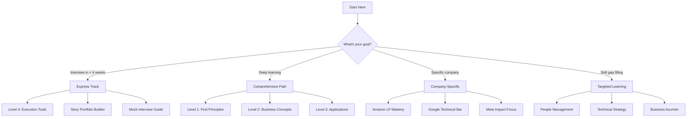

# 🧭 Engineering Leadership Framework Navigation Guide

> Your personalized roadmap to mastering engineering leadership interviews

## Quick Navigation Decision Tree



## 🎯 Navigation by Experience Level

### New Engineering Manager (IC → L6/M1)
**Your Challenge**: Transitioning from individual contributor to people leader

#### Recommended 12-Week Path
```
Weeks 1-3: Foundation
├── Level 3: People Management basics
├── Level 3: Team building & culture
└── Practice: Conflict resolution scenarios

Weeks 4-6: Core Skills
├── Level 2: Leadership concepts
├── Level 2: Operations fundamentals
└── Practice: Performance management cases

Weeks 7-9: Technical Leadership
├── Level 3: Technical strategy
├── Level 3: Architecture decisions
└── Practice: Tech debt prioritization

Weeks 10-12: Interview Prep
├── Level 4: STAR story development
├── Level 4: Behavioral practice
└── Company-specific preparation
```

**Essential Resources**:
- [People Management Fundamentals](level-3-applications/people-management/)
- [New Manager Transition Guide](level-3-applications/people-management/team-building-culture.md)
- [First 90 Days Playbook](hard-earned-wisdom/index.md)

### Senior Manager (L6 → L7/M2)
**Your Challenge**: Scaling from team to organization leadership

#### Recommended 8-Week Path
```
Weeks 1-2: Strategic Foundation
├── Level 1: All first principles
├── Level 2: Strategy & finance
└── Practice: Business case development

Weeks 3-4: Organizational Excellence
├── Level 3: Org design patterns
├── Level 3: Scaling playbooks
└── Practice: Reorg scenarios

Weeks 5-6: Executive Skills
├── Level 2: Leadership at scale
├── Hard-earned wisdom section
└── Practice: Executive communication

Weeks 7-8: Interview Excellence
├── Level 4: System design (org focus)
├── Level 4: Advanced behavioral
└── Mock interviews with L8+ leaders
```

**Essential Resources**:
- [Organizational Design](level-3-applications/organizational-design/)
- [Managing Managers](level-2-core-business/leadership/)
- [Political Navigation](hard-earned-wisdom/organizational-politics-mastery.md)

### Director (L7 → L8+)
**Your Challenge**: Operating at executive level with P&L responsibility

#### Recommended 6-Week Path
```
Weeks 1-2: Executive Mindset
├── Level 1: Deep dive on value creation
├── Level 2: Finance & risk governance
└── Business acumen mastery

Weeks 3-4: Transformation Leadership
├── Organizational transformation cases
├── M&A and integration scenarios
└── Board-level communication

Weeks 5-6: Interview Mastery
├── Executive presence coaching
├── Vision & strategy presentations
└── C-suite mock interviews
```

**Essential Resources**:
- [Executive Decision Making](level-1-first-principles/decision-making/)
- [Business Strategy](level-2-core-business/strategy/)
- [Crisis Leadership](hard-earned-wisdom/crisis-leadership-reality.md)

## ⏱️ Time-Based Preparation Plans

### 🚀 4-Week Express Track
**For**: Experienced leaders with immediate interview needs

| Week | Focus | Daily Activities |
|------|-------|------------------|
| **Week 1** | Story Mining | • Identify 20-30 experiences<br>• Map to STAR format<br>• Practice 2 stories/day |
| **Week 2** | Framework Integration | • Study first principles<br>• Add framework language<br>• Refine top 10 stories |
| **Week 3** | Company Specific | • Research culture & values<br>• Tailor stories<br>• Mock interviews |
| **Week 4** | Polish & Practice | • Address weak areas<br>• Executive presence<br>• Final preparation |

**Daily Schedule**:
- Morning (1hr): Framework study
- Lunch (30min): Story practice
- Evening (1hr): Mock questions
- Weekend: Full mock interviews

### 📚 8-Week Comprehensive Track
**For**: Systematic preparation with depth

| Phase | Weeks | Focus Areas |
|-------|-------|-------------|
| **Foundation** | 1-2 | • First principles mastery<br>• Business concepts deep dive<br>• Self-assessment |
| **Application** | 3-4 | • People management<br>• Technical leadership<br>• Organizational design |
| **Integration** | 5-6 | • Story development<br>• Company research<br>• Practice scenarios |
| **Excellence** | 7-8 | • Mock interviews<br>• Feedback integration<br>• Final preparation |

**Weekly Milestones**:
- Week 2: Complete framework understanding
- Week 4: 15+ polished stories
- Week 6: Company-specific preparation done
- Week 8: Interview ready with confidence

### 🎓 12-Week Mastery Track
**For**: Career transition or level jump preparation

| Month | Focus | Outcomes |
|-------|-------|----------|
| **Month 1** | Foundational Learning | • Master all principles<br>• Understand business concepts<br>• Build knowledge base |
| **Month 2** | Practical Application | • Develop experiences<br>• Practice scenarios<br>• Get feedback |
| **Month 3** | Interview Excellence | • Polish execution<br>• Company specific<br>• Multiple mock interviews |

**Monthly Goals**:
1. Read 2 leadership books
2. Complete 10 practice scenarios
3. Conduct 5 mock interviews
4. Develop 30 STAR stories

## 🗺️ Topic-Based Navigation

### Finding What You Need

#### People & Culture Topics
```
Level 3: Applications
├── People Management/
│   ├── Hiring & Interviewing
│   ├── Performance Management
│   ├── Team Building & Culture
│   └── Diversity & Inclusion
└── Hard-Earned Wisdom/
    ├── Performance Management Reality
    └── Human Cost of Leadership
```

#### Technical & Architecture Topics
```
Level 3: Applications
├── Technical Leadership/
│   ├── Technical Strategy
│   ├── Architecture Decisions
│   ├── Platform Thinking
│   └── Innovation Models
└── Level 4: System Design/
    └── Organizational Systems
```

#### Business & Strategy Topics
```
Level 2: Core Business/
├── Strategy/
├── Finance/
├── Operations/
└── Risk & Governance/

Level 3: Applications/
└── Business Acumen/
    ├── Business Metrics
    └── Stakeholder Management
```

#### Interview Execution Topics
```
Level 4: Interview Execution/
├── Behavioral/
├── Technical Leadership/
├── System & Org Design/
├── Culture & Values/
└── Tools/
    ├── STAR Framework
    ├── Story Portfolio
    ├── Principle Hooks
    └── Interactive Tools
```

## 🏢 Company-Specific Navigation

### How to Use Company Guides

1. **Start with Culture**: Read company-specific values and principles
2. **Map Your Stories**: Align experiences to company framework
3. **Practice Format**: Use company's interview style
4. **Network Insights**: Connect with current employees

### Company Quick Links

| Company | Focus Areas | Key Resources |
|---------|-------------|---------------|
| **Amazon** | Leadership Principles | • [14 LPs mapping](company-specific/amazon/)<br>• Bar raiser prep<br>• STAR examples |
| **Google** | Technical excellence | • [Googleyness guide](company-specific/google/)<br>• System design<br>• Leadership craft |
| **Meta** | Impact & speed | • [Move fast culture](company-specific/meta/)<br>• Data-driven stories<br>• Scale examples |
| **Apple** | Quality & craft | • [Functional excellence](company-specific/apple/)<br>• Attention to detail<br>• Cross-functional |
| **Microsoft** | Growth mindset | • [Transformation stories](company-specific/microsoft/)<br>• Learn-it-all<br>• Customer obsession |
| **Netflix** | Freedom & responsibility | • [Culture deck](company-specific/netflix/)<br>• Context not control<br>• Stunning colleague |

## 💡 Hard-Earned Wisdom Integration

### When to Deep Dive

The [Hard-Earned Wisdom](hard-earned-wisdom/) section provides unvarnished truth about leadership challenges. Use it when:

- **Before L7+ interviews**: Understanding organizational politics
- **Struggling with specific scenarios**: Real-world navigation
- **Building authentic stories**: Adding nuance and depth
- **Post-interview reflection**: Understanding feedback

### Key Wisdom Areas

1. **[Managing Up & Politics](hard-earned-wisdom/managing-up-dark-art.md)**
   - When: Director+ roles
   - Why: Executive influence critical

2. **[Performance Management Reality](hard-earned-wisdom/performance-management-reality.md)**
   - When: All manager levels
   - Why: Most challenging aspect

3. **[Crisis Leadership](hard-earned-wisdom/crisis-leadership-reality.md)**
   - When: Senior roles
   - Why: Differentiates great leaders

4. **[Impossible Decisions](hard-earned-wisdom/impossible-decisions.md)**
   - When: L7+ preparation
   - Why: Executive decision making

## 📊 Progress Tracking

### Weekly Checklist

#### Week 1-2 Foundation
- [ ] Read all Level 1 first principles
- [ ] Complete self-assessment
- [ ] Identify experience gaps
- [ ] Start story brainstorming

#### Week 3-4 Building
- [ ] Study Level 2 concepts
- [ ] Develop 10 STAR stories
- [ ] Practice with timer
- [ ] Get peer feedback

#### Week 5-6 Applying
- [ ] Complete Level 3 applications
- [ ] Expand to 20 stories
- [ ] Do mock interviews
- [ ] Research target companies

#### Week 7-8 Mastering
- [ ] Polish top stories
- [ ] Company-specific prep
- [ ] Executive presence
- [ ] Final mock interviews

### Success Metrics

Track your readiness:

| Area | Beginner | Intermediate | Advanced | Expert |
|------|----------|--------------|----------|--------|
| **First Principles** | Aware | Can explain | Natural usage | Teaches others |
| **Business Concepts** | Basic | Conversant | Fluent | Strategic |
| **STAR Stories** | 5-10 stories | 15-20 stories | 25-30 stories | 30+ polished |
| **Mock Performance** | Nervous | Competent | Confident | Inspiring |

## 🚀 Quick Start Actions

### If you have 30 minutes:
1. Complete [self-assessment](level-4-interview-execution/tools/interactive/self-assessment.md)
2. Read [framework overview](framework-index.md)
3. Identify your top 3 gaps

### If you have 2 hours:
1. Study relevant first principles
2. Build 3 STAR stories
3. Practice with [interview timer](level-4-interview-execution/tools/interactive/interview-timer.md)

### If you have 1 day:
1. Complete Level 1 & 2 overview
2. Develop 10 stories
3. Do 2 mock interviews
4. Create study plan

## 🎯 Navigation Tips

### Do's:
- ✅ Start with your experience level guide
- ✅ Use the decision tree for quick navigation
- ✅ Combine multiple learning paths
- ✅ Practice while you learn
- ✅ Iterate based on feedback

### Don'ts:
- ❌ Try to read everything at once
- ❌ Skip the fundamentals
- ❌ Ignore company-specific prep
- ❌ Practice without framework
- ❌ Forget the wisdom section

## 📚 Resource Prioritization

### Must Read (All Levels)
1. [Framework Overview](framework-index.md)
2. [First Principles](level-1-first-principles/)
3. [STAR Framework](level-4-interview-execution/tools/star-framework/)
4. Your level-specific guide

### Should Read (Time Permitting)
1. [Business Concepts](level-2-core-business/)
2. [Practice Scenarios](practice-scenarios/)
3. [Hard-Earned Wisdom](hard-earned-wisdom/)
4. Company-specific guides

### Nice to Have (Deep Dive)
1. All interactive tools
2. Complete story portfolio
3. Extended reading list
4. Industry case studies

---

**Remember**: This framework is comprehensive by design. You don't need to master everything—focus on what's most relevant to your goals and timeline. The key is consistent practice with the framework principles until they become natural in your communication.

**Next Step**: Use the decision tree above to identify your starting point, then follow the recommended path for your situation.