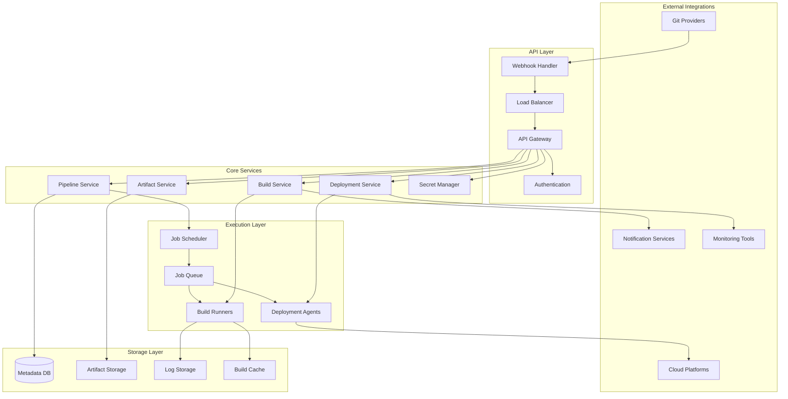
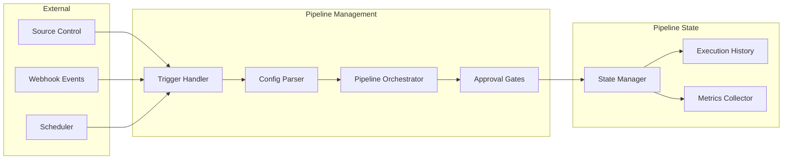
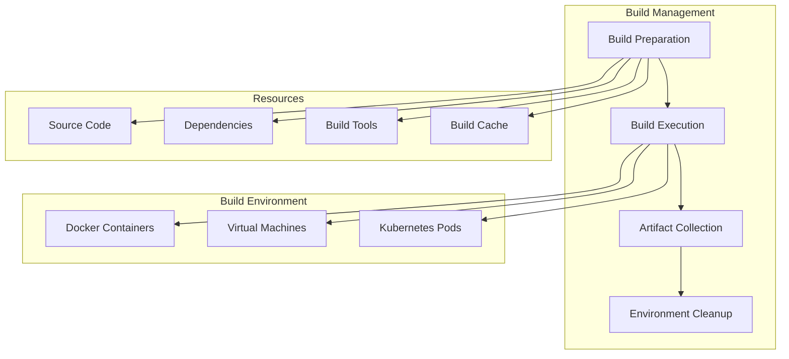
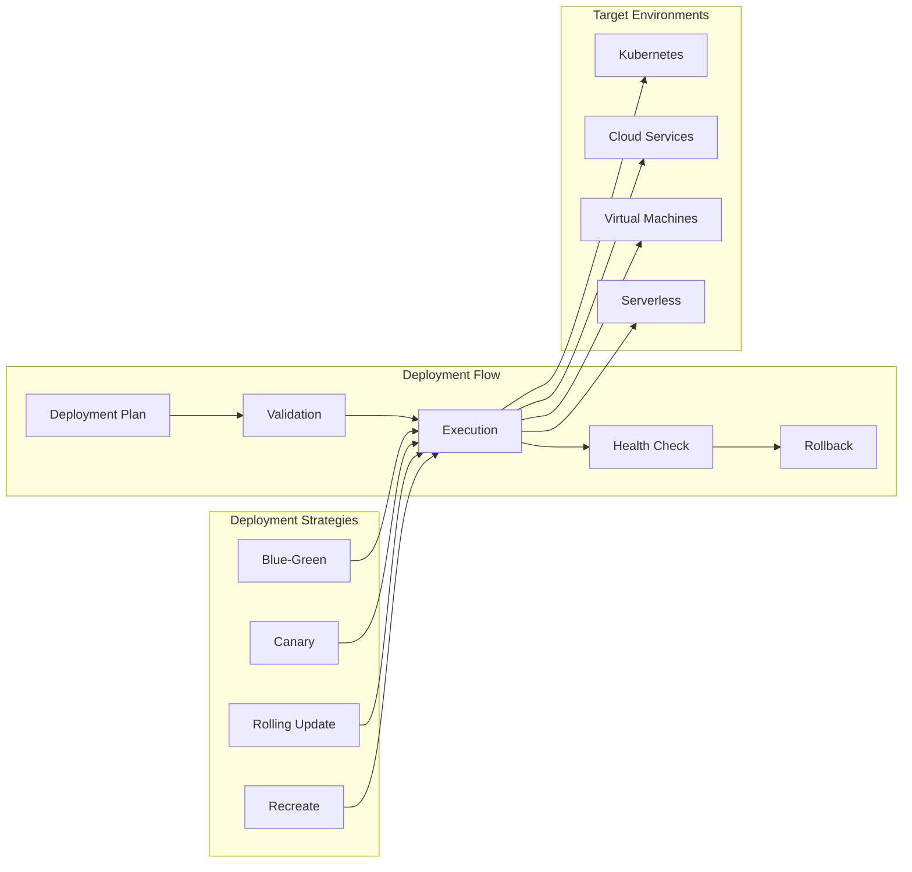
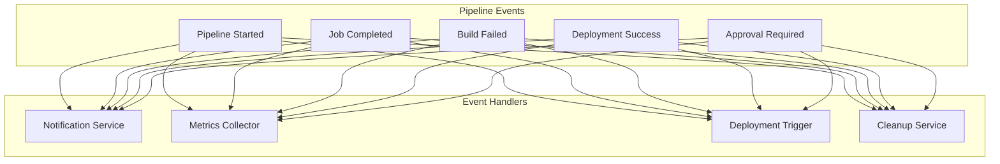

# Design a CI/CD Pipeline System


## Overview

Design a CI/CD Pipeline System
description: Build a scalable continuous integration and deployment platform
type: system-design-problem
difficulty: intermediate
reading_time: 50 min
prerequisites:
- pattern-library/event-driven-architecture
- pattern-library/containerization
- pattern-library/distributed-queues
status: complete
last_updated: 2025-08-04
---

# Design a CI/CD Pipeline System

## Table of Contents

- [Problem Statement](#problem-statement)
  - [Functional Requirements](#functional-requirements)
  - [Non-Functional Requirements](#non-functional-requirements)
- [Key Considerations & Constraints](#key-considerations-constraints)
  - [Scalability Challenges](#scalability-challenges)
  - [Security Requirements](#security-requirements)
  - [Multi-Environment Complexity](#multi-environment-complexity)
  - [Integration Requirements](#integration-requirements)
- [High-Level Architecture Approach](#high-level-architecture-approach)
  - [System Architecture](#system-architecture)
  - [Core Services Architecture](#core-services-architecture)
    - [1. Pipeline Service](#1-pipeline-service)
    - [2.

**Reading time:** ~10 minutes

## Table of Contents

- [Problem Statement](#problem-statement)
  - [Functional Requirements](#functional-requirements)
  - [Non-Functional Requirements](#non-functional-requirements)
- [Key Considerations & Constraints](#key-considerations-constraints)
  - [Scalability Challenges](#scalability-challenges)
  - [Security Requirements](#security-requirements)
  - [Multi-Environment Complexity](#multi-environment-complexity)
  - [Integration Requirements](#integration-requirements)
- [High-Level Architecture Approach](#high-level-architecture-approach)
  - [System Architecture](#system-architecture)
  - [Core Services Architecture](#core-services-architecture)
    - [1. Pipeline Service](#1-pipeline-service)
    - [2. Build Service](#2-build-service)
    - [3. Deployment Service](#3-deployment-service)
  - [Data Models](#data-models)
    - [Pipeline Configuration Schema](#pipeline-configuration-schema)
    - [Build and Deployment Schema](#build-and-deployment-schema)
    - [Monitoring and Metrics Schema](#monitoring-and-metrics-schema)
- [Relevant Patterns from Pattern Library](#relevant-patterns-from-pattern-library)
  - [Core Patterns](#core-patterns)
    - [1. Event-Driven Architecture](#1-event-driven-architecture)
    - [2. Job Queue Pattern](#2-job-queue-pattern)
    - [3. Circuit Breaker](#3-circuit-breaker)
    - [4. Bulkhead Pattern](#4-bulkhead-pattern)
  - [Supporting Patterns](#supporting-patterns)
    - [5. Saga Pattern](#5-saga-pattern)
    - [6. Database Sharding](#6-database-sharding)
    - [7. Caching](#7-caching)
- [Common Pitfalls to Avoid](#common-pitfalls-to-avoid)
  - [1. Build Queue Bottlenecks](#1-build-queue-bottlenecks)
  - [2. Artifact Storage Explosion](#2-artifact-storage-explosion)
  - [3. Secrets Management Security](#3-secrets-management-security)
  - [4. Pipeline Configuration Complexity](#4-pipeline-configuration-complexity)
  - [5. Deployment Rollback Challenges](#5-deployment-rollback-challenges)
- [What Interviewers Look For](#what-interviewers-look-for)
  - [System Design Fundamentals (30%)](#system-design-fundamentals-30)
  - [CI/CD Domain Knowledge (25%)](#cicd-domain-knowledge-25)
  - [Operational Excellence (25%)](#operational-excellence-25)
  - [Integration Complexity (20%)](#integration-complexity-20)
- [Advanced Follow-up Questions](#advanced-follow-up-questions)
  - [Multi-Cloud Deployments](#multi-cloud-deployments)
  - [Pipeline Security](#pipeline-security)
  - [Large-Scale Build Optimization](#large-scale-build-optimization)
  - [GitOps Integration](#gitops-integration)
- [Key Metrics to Monitor](#key-metrics-to-monitor)
  - [Pipeline Performance Metrics](#pipeline-performance-metrics)
  - [Resource Utilization Metrics](#resource-utilization-metrics)
  - [Quality and Reliability Metrics](#quality-and-reliability-metrics)
  - [Business Impact Metrics](#business-impact-metrics)


## Problem Statement

Design a comprehensive CI/CD (Continuous Integration/Continuous Deployment) platform that can handle thousands of code repositories, run parallel build and test jobs, and deploy applications to various environments with high reliability and scalability.

### Functional Requirements

1. **Source Code Integration**
   - Git repository integration (GitHub, GitLab, Bitbucket)
   - Webhook-based trigger system
   - Branch and tag-based pipeline triggers
   - Pull request and merge request builds

2. **Build & Test Pipeline**
   - Multi-language support (Java, Python, Node.js, Go, etc.)
   - Parallel job execution and dependencies
   - Custom build environments and Docker support
   - Artifact management and storage
   - Test result aggregation and reporting

3. **Deployment Management**
   - Multi-environment deployments (dev, staging, prod)
   - Blue-green and canary deployment strategies
   - Rollback capabilities and deployment history
   - Infrastructure as Code (IaC) integration

4. **Pipeline Management**
   - Pipeline configuration as code (YAML/JSON)
   - Conditional execution and approval gates
   - Scheduled builds and recurring jobs
   - Pipeline templates and reusability

5. **Monitoring & Observability**
   - Build and deployment metrics
   - Log aggregation and analysis
   - Alert and notification system
   - Performance and cost tracking

### Non-Functional Requirements

1. **Scale**: 10K repositories, 100K builds/day, 1K concurrent jobs
2. **Performance**: 
   - Build start time: <30 seconds
   - Small build completion: <5 minutes
   - Pipeline trigger latency: <10 seconds
3. **Availability**: 99.9% uptime with graceful degradation
4. **Reliability**: No lost builds, reliable artifact storage
5. **Security**: Secure secrets management, isolated build environments

## Key Considerations & Constraints

### Scalability Challenges
- **Concurrent Builds**: Thousands of simultaneous build jobs
- **Resource Management**: Efficient allocation of compute resources
- **Queue Management**: Fair scheduling and priority handling
- **Storage Growth**: Build artifacts and logs accumulation

### Security Requirements
- **Secrets Management**: Secure storage and injection of credentials
- **Build Isolation**: Prevent cross-contamination between builds
- **Access Control**: Fine-grained permissions for users and services
- **Audit Trail**: Complete tracking of all pipeline activities

### Multi-Environment Complexity
- **Environment Management**: Dev, staging, production environments
- **Configuration Management**: Environment-specific configurations
- **Promotion Workflows**: Safe progression through environments
- **Rollback Capabilities**: Quick recovery from failed deployments

### Integration Requirements
- **Version Control**: Multiple Git providers and self-hosted
- **Cloud Platforms**: AWS, GCP, Azure deployment targets
- **Notification Systems**: Slack, email, webhooks for status updates
- **Monitoring Tools**: Integration with observability platforms

## High-Level Architecture Approach

### System Architecture



### Core Services Architecture

#### 1. Pipeline Service


#### 2. Build Service


#### 3. Deployment Service


### Data Models

#### Pipeline Configuration Schema
```sql
-- Pipelines table
CREATE TABLE pipelines (
    pipeline_id UUID PRIMARY KEY,
    repository_id UUID NOT NULL,
    name VARCHAR(255) NOT NULL,
    description TEXT,
    config_content TEXT NOT NULL, -- YAML/JSON configuration
    config_version VARCHAR(50),
    branch_filters JSON, -- Which branches trigger this pipeline
    enabled BOOLEAN DEFAULT TRUE,
    created_by UUID NOT NULL,
    created_at TIMESTAMP,
    updated_at TIMESTAMP,
    
    UNIQUE KEY (repository_id, name),
    INDEX idx_repository (repository_id),
    INDEX idx_enabled (enabled)
);

-- Pipeline executions
CREATE TABLE pipeline_executions (
    execution_id UUID PRIMARY KEY,
    pipeline_id UUID NOT NULL,
    trigger_type ENUM('push', 'pull_request', 'schedule', 'manual'),
    commit_sha VARCHAR(40),
    branch VARCHAR(255),
    status ENUM('pending', 'running', 'success', 'failed', 'cancelled'),
    started_at TIMESTAMP,
    completed_at TIMESTAMP,
    triggered_by UUID,
    trigger_metadata JSON, -- Webhook payload, manual trigger info
    
    INDEX idx_pipeline_status (pipeline_id, status),
    INDEX idx_started (started_at),
    INDEX idx_commit (commit_sha)
);

-- Jobs within pipelines
CREATE TABLE jobs (
    job_id UUID PRIMARY KEY,
    execution_id UUID NOT NULL,
    name VARCHAR(255) NOT NULL,
    job_type ENUM('build', 'test', 'deploy', 'custom'),
    depends_on JSON, -- Job dependencies
    config JSON NOT NULL, -- Job-specific configuration
    status ENUM('pending', 'running', 'success', 'failed', 'skipped'),
    runner_id VARCHAR(100), -- Which runner executed this job
    started_at TIMESTAMP,
    completed_at TIMESTAMP,
    logs_location VARCHAR(500),
    artifacts_location VARCHAR(500),
    
    INDEX idx_execution_status (execution_id, status),
    INDEX idx_job_type (job_type),
    INDEX idx_runner (runner_id)
);
```

#### Build and Deployment Schema
```sql
-- Build artifacts
CREATE TABLE artifacts (
    artifact_id UUID PRIMARY KEY,
    job_id UUID NOT NULL,
    name VARCHAR(255) NOT NULL,
    file_path VARCHAR(500) NOT NULL,
    size_bytes BIGINT NOT NULL,
    checksum VARCHAR(64),
    content_type VARCHAR(100),
    created_at TIMESTAMP,
    expires_at TIMESTAMP,
    
    INDEX idx_job (job_id),
    INDEX idx_name (name),
    INDEX idx_expires (expires_at)
);

-- Deployments
CREATE TABLE deployments (
    deployment_id UUID PRIMARY KEY,
    job_id UUID NOT NULL,
    environment VARCHAR(100) NOT NULL,
    application_name VARCHAR(255) NOT NULL,
    version VARCHAR(100) NOT NULL,
    deployment_strategy ENUM('blue_green', 'canary', 'rolling', 'recreate'),
    status ENUM('pending', 'deploying', 'success', 'failed', 'rolled_back'),
    target_config JSON, -- Target environment configuration
    rollback_version VARCHAR(100),
    started_at TIMESTAMP,
    completed_at TIMESTAMP,
    
    INDEX idx_job (job_id),
    INDEX idx_environment (environment),
    INDEX idx_application (application_name),
    INDEX idx_status (status)
);

-- Secrets management
CREATE TABLE secrets (
    secret_id UUID PRIMARY KEY,
    name VARCHAR(255) NOT NULL,
    scope ENUM('global', 'repository', 'environment'),
    scope_id UUID, -- Repository ID or environment ID
    encrypted_value TEXT NOT NULL,
    created_by UUID NOT NULL,
    created_at TIMESTAMP,
    updated_at TIMESTAMP,
    last_accessed TIMESTAMP,
    
    UNIQUE KEY (name, scope, scope_id),
    INDEX idx_scope (scope, scope_id)
);
```

#### Monitoring and Metrics Schema
```sql
-- Build metrics
CREATE TABLE build_metrics (
    metric_id UUID PRIMARY KEY,
    execution_id UUID NOT NULL,
    job_id UUID,
    metric_name VARCHAR(100) NOT NULL,
    metric_value FLOAT NOT NULL,
    metric_unit VARCHAR(50),
    recorded_at TIMESTAMP,
    
    INDEX idx_execution (execution_id),
    INDEX idx_metric_name (metric_name),
    INDEX idx_recorded (recorded_at)
);

-- System health
CREATE TABLE runner_health (
    runner_id VARCHAR(100) PRIMARY KEY,
    status ENUM('online', 'offline', 'busy'),
    capacity INT NOT NULL, -- Max concurrent jobs
    current_load INT DEFAULT 0,
    last_heartbeat TIMESTAMP,
    metadata JSON, -- System specs, location, etc.
    
    INDEX idx_status (status),
    INDEX idx_heartbeat (last_heartbeat)
);
```

## Relevant Patterns from Pattern Library

### Core Patterns

#### 1. Event-Driven Architecture
**Pattern**: [Event-Driven Architecture](../../pattern-library/architecture/event-driven.md)
- Pipeline events trigger downstream actions
- Loose coupling between pipeline stages
- Asynchronous processing for scalability



#### 2. Job Queue Pattern
**Pattern**: [Message Queue](../../pattern-library/coordination/distributed-queue.md)
- Reliable job scheduling and execution
- Priority-based job processing
- Load balancing across build runners

#### 3. Circuit Breaker
**Pattern**: [Circuit Breaker](../../pattern-library/resilience/circuit-breaker.md)
- Protect against external service failures
- Graceful degradation when Git providers fail
- Fast failure detection and recovery

#### 4. Bulkhead Pattern
**Pattern**: [Bulkhead](../../pattern-library/resilience/bulkhead.md)
- Isolate different types of builds
- Prevent resource starvation
- Separate critical and non-critical workloads

### Supporting Patterns

#### 5. Saga Pattern
**Pattern**: [Saga](../../pattern-library/data-management/saga.md)
- Multi-stage deployment workflows
- Compensation for failed deployments
- Distributed transaction management

#### 6. Database Sharding
**Pattern**: [Database Sharding](../../pattern-library/scaling/sharding.md)
- Partition pipeline data by repository or organization
- Scale metadata storage horizontally
- Improve query performance

#### 7. Caching
**Pattern**: [Caching](../../pattern-library/scaling/caching-strategies.md)
- Cache build dependencies and artifacts
- Reduce build times through intelligent caching
- Cache pipeline configurations and metadata

## Common Pitfalls to Avoid

### 1. Build Queue Bottlenecks
**Problem**: Limited build runners create long queues
**Solution**:
- Implement auto-scaling for build runners
- Use priority queues for critical builds
- Optimize resource allocation algorithms

### 2. Artifact Storage Explosion
**Problem**: Build artifacts consume excessive storage
**Solution**:
- Implement retention policies with automatic cleanup
- Use artifact deduplication and compression
- Tier storage based on access patterns

### 3. Secrets Management Security
**Problem**: Insecure handling of sensitive credentials
**Solution**:
- Use dedicated secret management services
- Implement secret rotation and access auditing
- Encrypt secrets at rest and in transit

### 4. Pipeline Configuration Complexity
**Problem**: Complex YAML configurations become unmaintainable
**Solution**:
- Provide pipeline templates and reusable components
- Implement configuration validation and linting
- Use visual pipeline editors where appropriate

### 5. Deployment Rollback Challenges
**Problem**: Difficult to rollback complex multi-service deployments
**Solution**:
- Implement atomic deployment strategies
- Maintain deployment state and version tracking
- Provide automated rollback triggers

## What Interviewers Look For

### System Design Fundamentals (30%)
- **Service decomposition**: Clear separation of pipeline, build, and deployment concerns
- **Scalability planning**: How to handle thousands of concurrent builds
- **Data modeling**: Efficient schemas for pipeline metadata and execution history
- **API design**: Clean interfaces for pipeline management and monitoring

### CI/CD Domain Knowledge (25%)
- **Pipeline orchestration**: Understanding of dependency management and parallel execution
- **Build environments**: Containerization and isolation strategies
- **Deployment strategies**: Blue-green, canary, rolling deployments
- **Artifact management**: Storage, versioning, and lifecycle management

### Operational Excellence (25%)
- **Monitoring and observability**: Pipeline metrics, logging, and alerting
- **Security**: Secrets management, access control, audit trails
- **Reliability**: Handling failures, retries, and recovery scenarios
- **Performance optimization**: Build time optimization and resource efficiency

### Integration Complexity (20%)
- **Multi-cloud deployments**: Supporting various deployment targets
- **Tool ecosystem**: Integration with existing development tools
- **Notification systems**: Status updates and alert mechanisms
- **Version control**: Support for different Git providers and workflows

## Advanced Follow-up Questions

### Multi-Cloud Deployments
**Q**: "How would you handle deployments across multiple cloud providers?"
**Expected Discussion**:
- Deployment agent architecture per cloud
- Infrastructure as Code integration (Terraform, CloudFormation)
- Cross-cloud networking and service mesh
- Cloud-specific optimization strategies

### Pipeline Security
**Q**: "How would you implement security scanning in the CI/CD pipeline?"
**Expected Discussion**:
- Static Application Security Testing (SAST) integration
- Container image vulnerability scanning
- Dependency vulnerability checking
- Security gates and approval workflows

### Large-Scale Build Optimization
**Q**: "How would you optimize build times for a monorepo with thousands of developers?"
**Expected Discussion**:
- Incremental builds and change detection
- Distributed build systems and caching
- Build graph optimization and parallelization
- Smart test selection and execution

### GitOps Integration
**Q**: "How would you implement GitOps workflows in your CI/CD system?"
**Expected Discussion**:
- Git-based configuration management
- Automated sync between Git state and deployed state
- Drift detection and reconciliation
- Multi-environment promotion workflows

## Key Metrics to Monitor

### Pipeline Performance Metrics
- **Build duration**: Average and P95 build completion times
- **Queue wait time**: Time from trigger to build start
- **Success rate**: Percentage of successful pipeline executions
- **Deployment frequency**: Number of deployments per day/week

### Resource Utilization Metrics
- **Runner utilization**: Percentage of time runners are active
- **Queue depth**: Number of pending jobs in various queues
- **Resource costs**: Compute and storage costs per build
- **Cache hit rate**: Build cache effectiveness

### Quality and Reliability Metrics
- **Test coverage**: Code coverage across repositories
- **Flaky test rate**: Percentage of tests with inconsistent results
- **Rollback rate**: Percentage of deployments that require rollback
- **Mean time to recovery**: Time to fix failed deployments

### Business Impact Metrics
- **Developer productivity**: Lead time from commit to production
- **Pipeline adoption**: Number of active repositories and pipelines
- **Cost per deployment**: Total cost divided by number of deployments
- **Security compliance**: Percentage of builds passing security scans

---

*This system design problem tests understanding of CI/CD workflows, distributed job processing, deployment strategies, and the operational complexity of development tooling at scale. Focus on trade-offs between build speed, resource efficiency, security, and developer experience.*