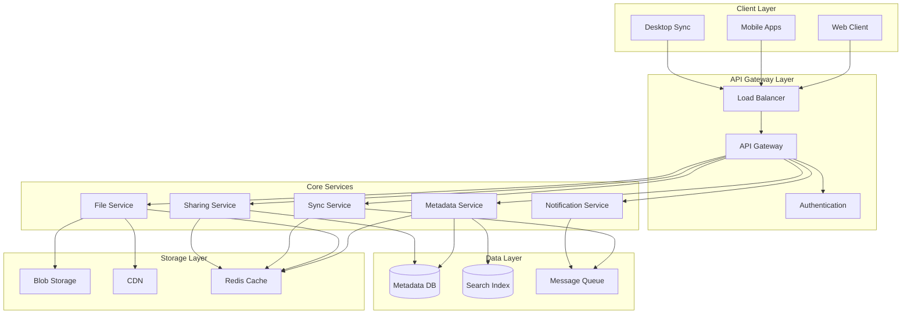
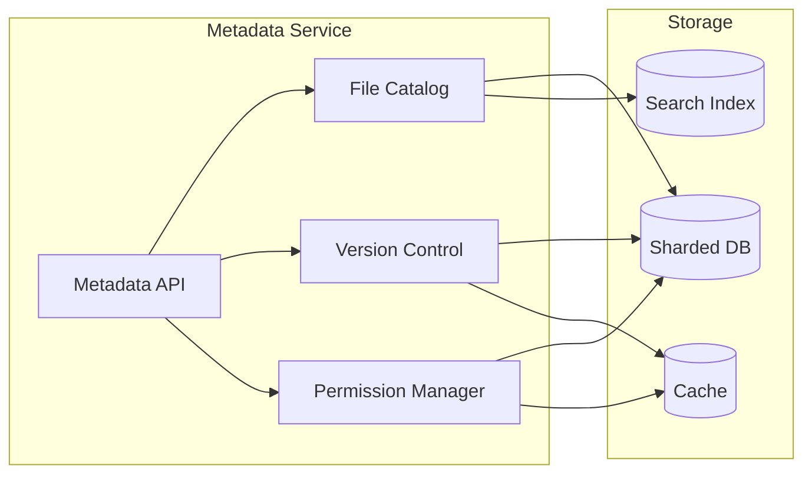
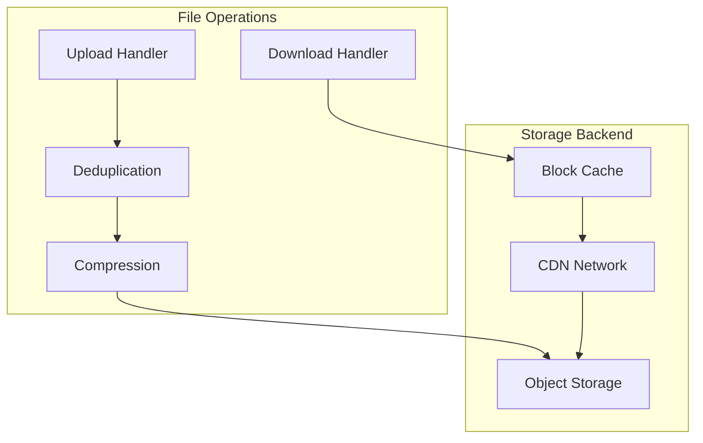
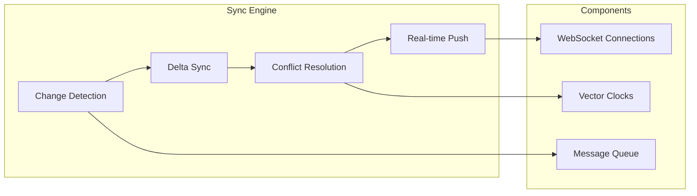
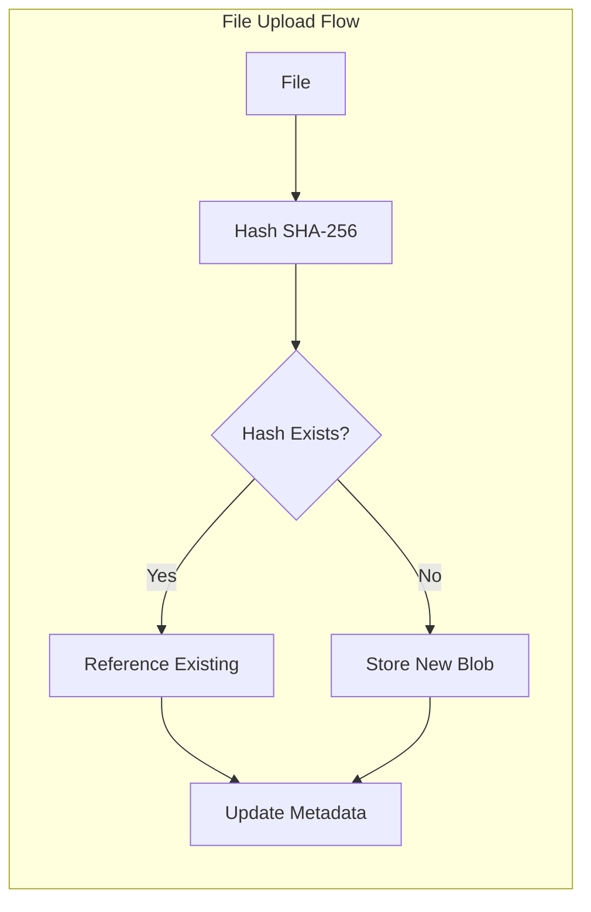
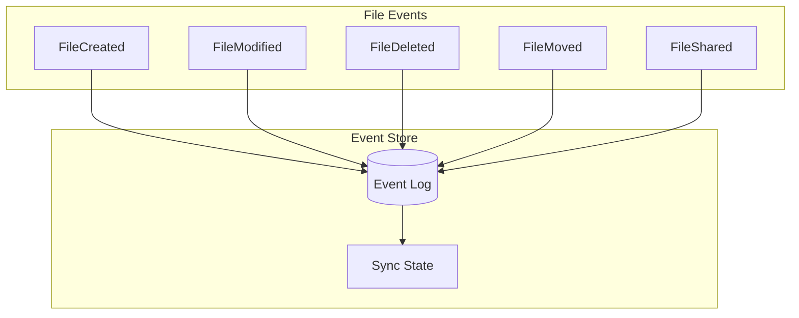

# Design a Cloud Storage System


## Overview

Design a Cloud Storage System
description: Build a scalable cloud storage service like Dropbox or Google Drive
type: system-design-problem
difficulty: intermediate
reading_time: 45 min
prerequisites:
- pattern-library/sharding
- pattern-library/caching
- pattern-library/event-sourcing
status: complete
last_updated: 2025-08-04
---

# Design a Cloud Storage System

## Table of Contents

- [Problem Statement](#problem-statement)
  - [Functional Requirements](#functional-requirements)
  - [Non-Functional Requirements](#non-functional-requirements)
- [Key Considerations & Constraints](#key-considerations-constraints)
  - [Storage Challenges](#storage-challenges)
  - [Synchronization Challenges](#synchronization-challenges)
  - [Security & Privacy](#security-privacy)
- [High-Level Architecture Approach](#high-level-architecture-approach)
  - [System Architecture](#system-architecture)
  - [Core Components](#core-components)
    - [1. Metadata Service](#1-metadata-service)
    - [2.

**Reading time:** ~7 minutes

## Table of Contents

- [Problem Statement](#problem-statement)
  - [Functional Requirements](#functional-requirements)
  - [Non-Functional Requirements](#non-functional-requirements)
- [Key Considerations & Constraints](#key-considerations-constraints)
  - [Storage Challenges](#storage-challenges)
  - [Synchronization Challenges](#synchronization-challenges)
  - [Security & Privacy](#security-privacy)
- [High-Level Architecture Approach](#high-level-architecture-approach)
  - [System Architecture](#system-architecture)
  - [Core Components](#core-components)
    - [1. Metadata Service](#1-metadata-service)
    - [2. File Service](#2-file-service)
    - [3. Sync Service](#3-sync-service)
  - [Data Models](#data-models)
    - [File Metadata Schema](#file-metadata-schema)
    - [Storage Schema](#storage-schema)
- [Relevant Patterns from Pattern Library](#relevant-patterns-from-pattern-library)
  - [Core Patterns](#core-patterns)
    - [1. Content Addressable Storage](#1-content-addressable-storage)
    - [2. Event Sourcing for Sync](#2-event-sourcing-for-sync)
    - [3. CQRS for Read/Write Separation](#3-cqrs-for-readwrite-separation)
    - [4. Database Sharding](#4-database-sharding)
  - [Supporting Patterns](#supporting-patterns)
    - [5. Circuit Breaker](#5-circuit-breaker)
    - [6. Rate Limiting](#6-rate-limiting)
    - [7. Publish-Subscribe](#7-publish-subscribe)
- [Common Pitfalls to Avoid](#common-pitfalls-to-avoid)
  - [1. Synchronization Race Conditions](#1-synchronization-race-conditions)
  - [2. Storage Cost Explosion](#2-storage-cost-explosion)
  - [3. Metadata Hotspots](#3-metadata-hotspots)
  - [4. Sync Performance Issues](#4-sync-performance-issues)
  - [5. Global Consistency Challenges](#5-global-consistency-challenges)
- [What Interviewers Look For](#what-interviewers-look-for)
  - [Architecture Design (40%)](#architecture-design-40)
  - [Trade-off Analysis (30%)](#trade-off-analysis-30)
  - [Scale Considerations (20%)](#scale-considerations-20)
  - [Operational Excellence (10%)](#operational-excellence-10)
- [Advanced Follow-up Questions](#advanced-follow-up-questions)
  - [Conflict Resolution Deep Dive](#conflict-resolution-deep-dive)
  - [Global Distribution](#global-distribution)
  - [Advanced Features](#advanced-features)
  - [Performance Optimization](#performance-optimization)
- [Key Metrics to Monitor](#key-metrics-to-monitor)
  - [User Experience Metrics](#user-experience-metrics)
  - [System Performance Metrics](#system-performance-metrics)
  - [Business Metrics](#business-metrics)


## Problem Statement

Design a cloud storage service like Dropbox or Google Drive that allows users to upload, download, synchronize, and share files across multiple devices.

### Functional Requirements

1. **File Operations**
   - Upload files and folders
   - Download files and folders
   - Create, rename, delete files/folders
   - Move and copy operations

2. **Synchronization**
   - Real-time sync across devices
   - Conflict resolution for simultaneous edits
   - Offline support with sync when online

3. **Sharing & Collaboration**
   - Share files/folders with permissions (read, write, admin)
   - Public links with expiration
   - Access control and user management

4. **Version Control**
   - File version history
   - Restore previous versions
   - Track changes and metadata

### Non-Functional Requirements

1. **Scale**: 500M users, 100M DAU, 50PB total storage
2. **Performance**: 
   - File upload/download: 100MB/s per user
   - Sync latency: <2 seconds for small files
   - Search latency: <500ms
3. **Availability**: 99.9% uptime
4. **Consistency**: Strong consistency for metadata, eventual consistency for file content
5. **Storage**: Support files up to 50GB, avg file size 10MB

## Key Considerations & Constraints

### Storage Challenges
- **Scale**: Petabytes of data across billions of files
- **Deduplication**: Reduce storage costs by eliminating duplicates
- **Geographic Distribution**: CDN for global access
- **Durability**: 99.999999999% (11 9's) data durability

### Synchronization Challenges
- **Conflict Resolution**: Multiple users editing same file
- **Network Partitions**: Offline editing and merge
- **Bandwidth Optimization**: Delta sync for large files
- **Real-time Updates**: Push notifications for changes

### Security & Privacy
- **Encryption**: End-to-end encryption options
- **Access Control**: Fine-grained permissions
- **Audit Logs**: Track all file operations
- **Compliance**: GDPR, HIPAA compliance

## High-Level Architecture Approach

### System Architecture



### Core Components

#### 1. Metadata Service


**Responsibilities:**
- File/folder hierarchy and metadata
- Version tracking and history
- User permissions and sharing
- Search indexing

#### 2. File Service


**Responsibilities:**
- File upload/download with chunking
- Deduplication and compression
- CDN integration for global access
- Thumbnail generation

#### 3. Sync Service


**Responsibilities:**
- Detect file changes across devices
- Resolve edit conflicts intelligently
- Push real-time updates
- Handle offline synchronization

### Data Models

#### File Metadata Schema
```sql
-- Files table
CREATE TABLE files (
    file_id UUID PRIMARY KEY,
    user_id UUID NOT NULL,
    parent_folder_id UUID,
    name VARCHAR(255) NOT NULL,
    size BIGINT NOT NULL,
    content_hash CHAR(64) NOT NULL, -- SHA-256
    mime_type VARCHAR(100),
    created_at TIMESTAMP,
    updated_at TIMESTAMP,
    version_id UUID NOT NULL,
    is_deleted BOOLEAN DEFAULT FALSE,
    
    INDEX idx_user_parent (user_id, parent_folder_id),
    INDEX idx_content_hash (content_hash),
    INDEX idx_updated (updated_at)
);

-- File versions table
CREATE TABLE file_versions (
    version_id UUID PRIMARY KEY,
    file_id UUID NOT NULL,
    version_number INT NOT NULL,
    content_hash CHAR(64) NOT NULL,
    size BIGINT NOT NULL,
    created_at TIMESTAMP,
    created_by UUID,
    
    UNIQUE KEY (file_id, version_number),
    INDEX idx_file_versions (file_id, version_number DESC)
);

-- Sharing permissions
CREATE TABLE file_shares (
    share_id UUID PRIMARY KEY,
    file_id UUID NOT NULL,
    shared_by UUID NOT NULL,
    shared_with UUID, -- NULL for public links
    permission ENUM('read', 'write', 'admin'),
    expires_at TIMESTAMP,
    created_at TIMESTAMP,
    
    INDEX idx_file_shares (file_id),
    INDEX idx_shared_with (shared_with)
);
```

#### Storage Schema
```sql
-- Blob storage mapping
CREATE TABLE blob_storage (
    content_hash CHAR(64) PRIMARY KEY,
    storage_provider VARCHAR(50), -- s3, gcs, azure
    storage_region VARCHAR(50),
    storage_key VARCHAR(500),
    size BIGINT NOT NULL,
    ref_count INT DEFAULT 1, -- For deduplication
    created_at TIMESTAMP,
    
    INDEX idx_provider_region (storage_provider, storage_region)
);

-- Sync state tracking
CREATE TABLE device_sync_state (
    device_id UUID,
    user_id UUID,
    last_sync_timestamp TIMESTAMP,
    sync_cursor VARCHAR(100), -- For incremental sync
    device_info JSON,
    
    PRIMARY KEY (device_id, user_id),
    INDEX idx_user_sync (user_id, last_sync_timestamp)
);
```

## Relevant Patterns from Pattern Library

### Core Patterns

#### 1. Content Addressable Storage
**Pattern**: [Content Addressable Storage](../../pattern-library/data-management/merkle-trees.md)
- Store files by content hash (SHA-256)
- Enables deduplication automatically
- Immutable storage with versioning



#### 2. Event Sourcing for Sync
**Pattern**: [Event Sourcing](../../pattern-library/data-management/event-sourcing.md)
- Track all file operations as events
- Enables conflict resolution and audit trails
- Supports offline synchronization



#### 3. CQRS for Read/Write Separation
**Pattern**: [CQRS](../../pattern-library/data-management/cqrs.md)
- Separate read and write models
- Optimize reads for file browsing
- Optimize writes for file operations

#### 4. Database Sharding
**Pattern**: [Database Sharding](../../pattern-library/scaling/sharding.md)
- Shard by user_id for data locality
- Ensures user data stays together
- Scales metadata operations

### Supporting Patterns

#### 5. Circuit Breaker
**Pattern**: [Circuit Breaker](../../pattern-library/resilience/circuit-breaker.md)
- Protect against storage provider failures
- Graceful degradation when services unavailable

#### 6. Rate Limiting
**Pattern**: [Rate Limiting](../../pattern-library/scaling/rate-limiting.md)
- Prevent abuse of upload/download APIs
- Per-user and per-API endpoint limits

#### 7. Publish-Subscribe
**Pattern**: [Pub/Sub](../../pattern-library/communication/publish-subscribe.md)
- Real-time file change notifications
- Device synchronization events

## Common Pitfalls to Avoid

### 1. Synchronization Race Conditions
**Problem**: Multiple devices editing same file simultaneously
**Solution**: 
- Use vector clocks for conflict detection
- Implement operational transforms for text files
- Last-writer-wins with user notification for conflicts

### 2. Storage Cost Explosion
**Problem**: Storing duplicate files wastes money
**Solution**:
- Content-addressable storage with deduplication
- Block-level deduplication for large files
- Compression before storage

### 3. Metadata Hotspots
**Problem**: Popular files create database hotspots
**Solution**:
- Cache popular file metadata
- Shard metadata by user, not file
- Use read replicas for browsing operations

### 4. Sync Performance Issues
**Problem**: Full file transfers for small changes
**Solution**:
- Delta sync using binary diffs (rsync algorithm)
- Block-level synchronization
- Compress deltas before transfer

### 5. Global Consistency Challenges
**Problem**: Strong consistency across regions is slow
**Solution**:
- Eventual consistency for file content
- Strong consistency for metadata operations
- Conflict-free replicated data types (CRDTs)

## What Interviewers Look For

### Architecture Design (40%)
- **Service decomposition**: Clear separation of concerns
- **Scalability planning**: How to handle growth
- **Data modeling**: Efficient schemas for metadata and content
- **API design**: RESTful endpoints with proper semantics

### Trade-off Analysis (30%)
- **Consistency vs Availability**: When to choose each
- **Storage vs Performance**: Compression and caching decisions
- **Cost vs Feature richness**: Premium features and tiering
- **Security vs Usability**: Encryption and sharing balance

### Scale Considerations (20%)
- **Database scaling**: Sharding and replication strategies
- **Storage scaling**: Multi-region and CDN usage
- **Bandwidth optimization**: Delta sync and compression
- **Caching strategies**: Multiple cache layers

### Operational Excellence (10%)
- **Monitoring**: Key metrics and alerting
- **Disaster recovery**: Backup and restore procedures
- **Security**: Encryption, access control, audit logs
- **Performance optimization**: Bottleneck identification

## Advanced Follow-up Questions

### Conflict Resolution Deep Dive
**Q**: "How would you handle simultaneous edits to a text document?"
**Expected Discussion**:
- Operational transforms (Google Docs approach)
- Conflict-free replicated data types (CRDTs)
- Three-way merge algorithms
- User experience during conflicts

### Global Distribution
**Q**: "How would you optimize for users in different regions?"
**Expected Discussion**:
- Multi-region deployment strategies
- CDN and edge caching
- Data sovereignty and compliance
- Cross-region replication lag

### Advanced Features
**Q**: "How would you implement real-time collaborative editing?"
**Expected Discussion**:
- WebSocket connections for real-time updates
- Operational transforms for conflict resolution
- Presence awareness (who's editing what)
- Cursor position synchronization

### Performance Optimization
**Q**: "A user complains that sync is slow for large files. How do you optimize?"
**Expected Discussion**:
- Delta sync algorithms (rsync, block-level)
- Compression strategies
- Parallel chunk uploads/downloads
- Progressive sync (metadata first, content later)

## Key Metrics to Monitor

### User Experience Metrics
- **Sync latency**: Time from file change to sync completion
- **Upload/download throughput**: MB/s per user
- **Conflict resolution rate**: Percentage of conflicts auto-resolved
- **Search response time**: Query latency for file search

### System Performance Metrics
- **API response times**: P99 latency for all endpoints
- **Storage efficiency**: Deduplication ratio achieved
- **Cache hit rates**: Metadata and content cache effectiveness
- **Error rates**: Failed uploads, sync errors, API errors

### Business Metrics
- **Storage per user**: Average storage consumption
- **Active sync devices**: Number of connected devices per user
- **Sharing activity**: Files shared per user per day
- **Feature adoption**: Usage of advanced features

---

*This system design problem tests understanding of distributed storage, synchronization algorithms, conflict resolution, and large-scale data management. Focus on trade-offs between consistency, performance, and user experience.*