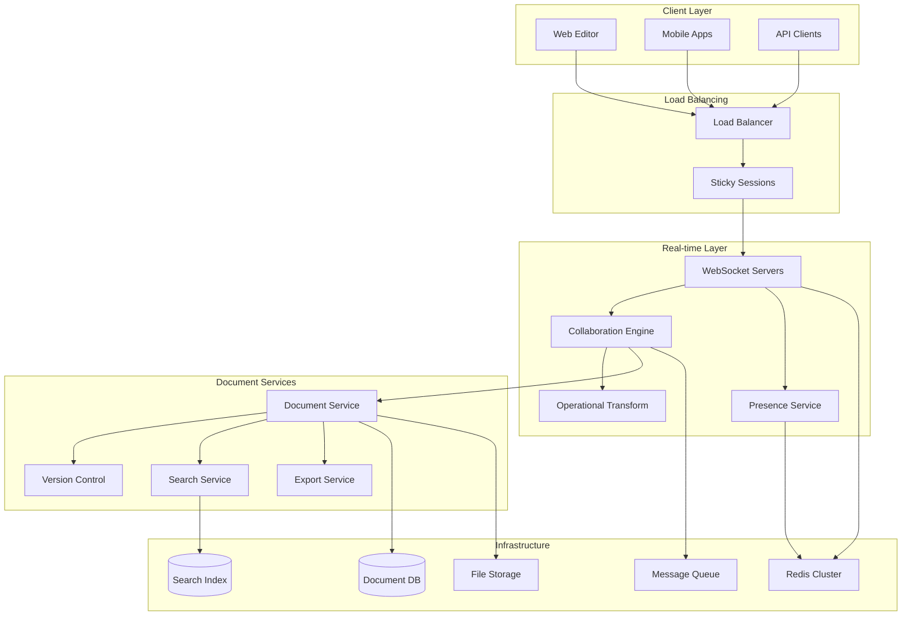
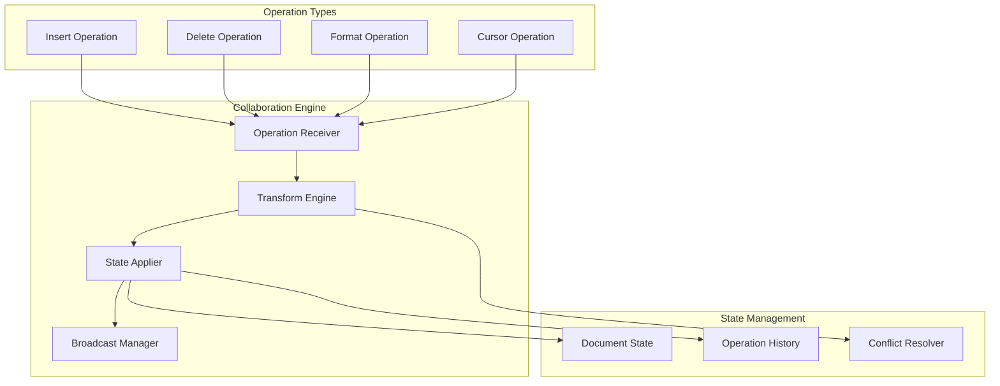
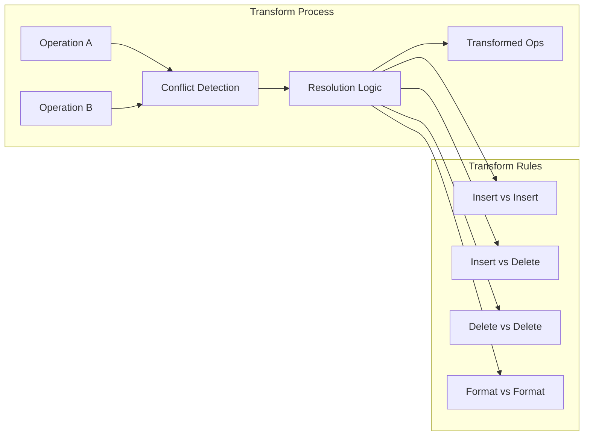
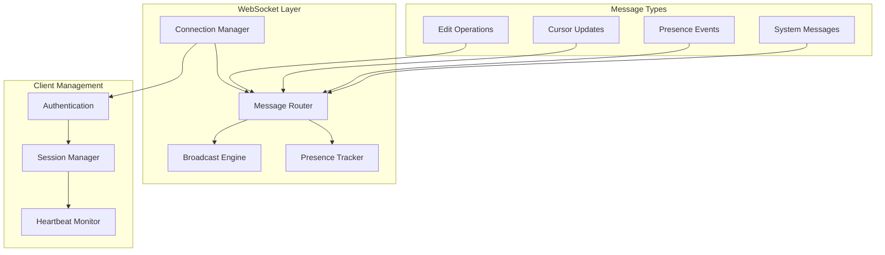

# Design a Collaborative Document Editor

## Problem Statement

Design a collaborative document editor like Google Docs or Notion that allows multiple users to edit the same document simultaneously with real-time synchronization, conflict resolution, and rich text formatting.

### Functional Requirements

1. **Real-time Collaboration**
   - Multiple users editing simultaneously
   - Real-time cursor and selection tracking
   - Live user presence indicators
   - Instant change synchronization (<200ms)

2. **Document Management**
   - Create, edit, delete documents
   - Document versioning and history
   - Rich text formatting (bold, italic, lists, etc.)
   - Comments and suggestions

3. **Sharing & Permissions**
   - Share documents with view/edit/comment permissions
   - Public sharing with links
   - Organization-level access controls
   - Guest user support

4. **Offline Support**
   - Offline editing with local storage
   - Conflict resolution when reconnecting
   - Sync queue for pending changes
   - Graceful network failure handling

5. **Advanced Features**
   - Document templates and formatting
   - Export to various formats (PDF, Word, etc.)
   - Search within documents
   - Integration with external services

### Non-Functional Requirements

1. **Scale**: 100M documents, 10M concurrent users, 1M concurrent editors
2. **Performance**: 
   - Change propagation: <200ms P99
   - Document load time: <1 second
   - Search latency: <500ms
3. **Availability**: 99.95% uptime with graceful degradation
4. **Consistency**: Strong consistency for document state, eventual consistency for presence
5. **Storage**: Support documents up to 10MB, avg document size 100KB

## Key Considerations & Constraints

### Real-time Synchronization Challenges
- **Conflict Resolution**: Simultaneous edits to same text region
- **Operation Ordering**: Ensure consistent document state across clients
- **Network Latency**: Handle varying connection speeds
- **Connection Management**: WebSocket scaling and failover

### Document State Management
- **Rich Text Representation**: Complex document structure with formatting
- **Version Control**: Track changes and enable history browsing
- **Undo/Redo**: Multi-user undo operations
- **Large Documents**: Performance with very long documents

### Scalability Concerns
- **Connection Scaling**: Millions of concurrent WebSocket connections
- **Document Hotspots**: Popular documents with many simultaneous editors
- **Global Distribution**: Low latency across different regions
- **Storage Growth**: Efficient storage of document history

### User Experience Requirements
- **Responsiveness**: Immediate feedback for user actions
- **Conflict Visualization**: Show conflicts and resolution options
- **Presence Awareness**: Show who's editing what
- **Offline Experience**: Seamless offline-to-online transition

## High-Level Architecture Approach

### System Architecture



### Core Components Architecture

#### 1. Collaboration Engine


#### 2. Operational Transform Engine


#### 3. Real-time Communication


### Data Models

#### Document Schema
```sql
-- Documents table
CREATE TABLE documents (
    document_id UUID PRIMARY KEY,
    title VARCHAR(255) NOT NULL,
    owner_id UUID NOT NULL,
    content JSONB NOT NULL, -- Rich document content
    content_text TEXT, -- Plain text for search
    content_hash CHAR(64), -- For change detection
    version_number BIGINT DEFAULT 1,
    created_at TIMESTAMP,
    updated_at TIMESTAMP,
    last_edited_by UUID,
    status ENUM('active', 'archived', 'deleted'),
    metadata JSONB, -- Document settings, templates
    
    INDEX idx_owner (owner_id),
    INDEX idx_updated (updated_at),
    INDEX idx_status (status),
    FULLTEXT INDEX idx_content (content_text)
);

-- Document permissions
CREATE TABLE document_permissions (
    permission_id UUID PRIMARY KEY,
    document_id UUID NOT NULL,
    user_id UUID, -- NULL for public access
    permission_type ENUM('owner', 'editor', 'commenter', 'viewer'),
    granted_by UUID NOT NULL,
    granted_at TIMESTAMP,
    expires_at TIMESTAMP,
    
    UNIQUE KEY (document_id, user_id),
    INDEX idx_document (document_id),
    INDEX idx_user (user_id)
);

-- Document operations (for operational transform)
CREATE TABLE document_operations (
    operation_id UUID PRIMARY KEY,
    document_id UUID NOT NULL,
    user_id UUID NOT NULL,
    operation_type ENUM('insert', 'delete', 'format', 'move'),
    operation_data JSONB NOT NULL, -- Operation details
    position_start INT NOT NULL,
    position_end INT,
    parent_operation_id UUID, -- For operation dependencies
    timestamp TIMESTAMP DEFAULT NOW(),
    applied BOOLEAN DEFAULT FALSE,
    
    INDEX idx_document_time (document_id, timestamp),
    INDEX idx_user_time (user_id, timestamp),
    INDEX idx_applied (applied)
);
```

#### Version Control Schema
```sql
-- Document versions/snapshots
CREATE TABLE document_versions (
    version_id UUID PRIMARY KEY,
    document_id UUID NOT NULL,
    version_number BIGINT NOT NULL,
    content JSONB NOT NULL,
    content_hash CHAR(64) NOT NULL,
    created_by UUID NOT NULL,
    created_at TIMESTAMP,
    change_summary TEXT,
    parent_version_id UUID,
    
    UNIQUE KEY (document_id, version_number),
    INDEX idx_document_version (document_id, version_number DESC),
    INDEX idx_hash (content_hash)
);

-- Comments and suggestions
CREATE TABLE document_comments (
    comment_id UUID PRIMARY KEY,
    document_id UUID NOT NULL,
    user_id UUID NOT NULL,
    content TEXT NOT NULL,
    position_start INT,
    position_end INT,
    comment_type ENUM('comment', 'suggestion'),
    status ENUM('active', 'resolved', 'deleted'),
    parent_comment_id UUID, -- For threaded comments
    created_at TIMESTAMP,
    updated_at TIMESTAMP,
    
    INDEX idx_document_status (document_id, status),
    INDEX idx_user (user_id),
    INDEX idx_position (position_start, position_end)
);
```

#### Real-time State Schema
```sql
-- Active editing sessions (typically in Redis)
CREATE TABLE active_sessions (
    session_id VARCHAR(64) PRIMARY KEY,
    document_id UUID NOT NULL,
    user_id UUID NOT NULL,
    websocket_server VARCHAR(100),
    cursor_position INT,
    selection_start INT,
    selection_end INT,
    last_activity TIMESTAMP,
    
    INDEX idx_document (document_id),
    INDEX idx_user (user_id),
    INDEX idx_activity (last_activity)
);

-- Operation queue (for reliability)
CREATE TABLE operation_queue (
    queue_id UUID PRIMARY KEY,
    document_id UUID NOT NULL,
    operation_data JSONB NOT NULL,
    created_at TIMESTAMP,
    processed BOOLEAN DEFAULT FALSE,
    retry_count INT DEFAULT 0,
    
    INDEX idx_document_processed (document_id, processed),
    INDEX idx_created (created_at)
);
```

## Relevant Patterns from Pattern Library

### Core Patterns

#### 1. Operational Transforms (OT)
**Pattern**: [Operational Transforms](../../../../pattern-library/data-management/crdt.md)
- Transform conflicting operations to maintain consistency
- Preserve user intent across concurrent edits
- Handle complex document structures

```mermaid
graph TB
    subgraph "OT Example"
        DOC1[Document: "Hello World"]
        USER1[User 1: Insert "!" at pos 11]
        USER2[User 2: Insert "Beautiful " at pos 6]
        
        TRANSFORM[Transform Operations]
        RESULT[Result: "Hello Beautiful World!"]
    end
    
    DOC1 --> USER1 & USER2
    USER1 & USER2 --> TRANSFORM --> RESULT
```

#### 2. Conflict-Free Replicated Data Types (CRDTs)
**Pattern**: [CRDTs](../../../../pattern-library/data-management/crdt.md)
- Alternative to OT for simpler conflict resolution
- Mathematically guaranteed convergence
- Better for peer-to-peer scenarios

#### 3. WebSocket Scaling
**Pattern**: [WebSocket Scaling](../../../../pattern-library/communication/websocket.md)
- Scale real-time connections across servers
- Sticky sessions and connection routing
- Message broadcasting across server instances

#### 4. Event Sourcing
**Pattern**: [Event Sourcing](../../../../pattern-library/data-management/event-sourcing.md)
- Store all document operations as events
- Enable perfect audit trails and replay
- Support complex undo/redo scenarios

### Supporting Patterns

#### 5. Publish-Subscribe
**Pattern**: [Pub/Sub](../../../../pattern-library/communication/publish-subscribe.md)
- Real-time change notifications
- Presence and cursor updates
- Comment and suggestion notifications

#### 6. Caching
**Pattern**: [Caching](../../../../pattern-library/scaling/caching-strategies.md)
- Cache frequently accessed documents
- Cache user permissions and sessions
- Cache search results and metadata

#### 7. Rate Limiting
**Pattern**: [Rate Limiting](../../../../pattern-library/scaling/rate-limiting.md)
- Prevent abuse of editing operations
- Limit WebSocket message rates
- Protect against spam comments

## Common Pitfalls to Avoid

### 1. Operational Transform Complexity
**Problem**: OT becomes complex with rich text formatting
**Solution**:
- Use established OT libraries (ShareJS, Yjs)
- Consider CRDTs for simpler conflict resolution
- Implement comprehensive test coverage

### 2. WebSocket Connection Scaling
**Problem**: Connection limits and memory usage
**Solution**:
- Use connection pooling and efficient servers
- Implement sticky sessions with load balancers
- Graceful fallback to polling for scale

### 3. Large Document Performance
**Problem**: Slow rendering and sync for large documents
**Solution**:
- Implement virtual scrolling for long documents
- Use incremental loading and lazy rendering
- Optimize DOM manipulation and change detection

### 4. Offline-Online Synchronization
**Problem**: Complex conflict resolution after offline editing
**Solution**:
- Queue operations locally during offline periods
- Use vector clocks for conflict detection
- Provide clear conflict resolution UI

### 5. Real-time Memory Leaks
**Problem**: Memory growth from WebSocket connections and state
**Solution**:
- Implement proper connection cleanup
- Use weak references for cached state
- Monitor and alert on memory usage

## What Interviewers Look For

### Real-time Systems Design (35%)
- **Operational transforms**: Understanding of conflict resolution algorithms
- **WebSocket architecture**: Scaling real-time connections
- **State synchronization**: Maintaining consistency across clients
- **Network handling**: Dealing with latency and connection issues

### Collaboration Features (25%)
- **Presence awareness**: User cursor and selection tracking
- **Conflict resolution**: Handling simultaneous edits gracefully
- **Version control**: Document history and change tracking
- **Permission systems**: Fine-grained access control

### Performance & Scale (25%)
- **Large document handling**: Performance with complex documents
- **Connection scaling**: Supporting millions of concurrent users
- **Caching strategies**: Optimizing document and metadata access
- **Search performance**: Fast full-text search across documents

### User Experience (15%)
- **Responsiveness**: Immediate feedback for user actions
- **Offline support**: Graceful handling of network issues
- **Conflict visualization**: Clear presentation of editing conflicts
- **Error handling**: Recovery from various failure scenarios

## Advanced Follow-up Questions

### Complex Document Structures
**Q**: "How would you handle collaborative editing of tables, images, and embedded content?"
**Expected Discussion**:
- Rich document model design
- Operational transforms for complex structures
- Atomic operations for multi-element changes
- Conflict resolution for structured content

### Cross-Document References
**Q**: "How would you implement features like linking between documents or shared templates?"
**Expected Discussion**:
- Document relationship modeling
- Reference integrity and updates
- Template instantiation and updates
- Cross-document change propagation

### Real-time Performance Optimization
**Q**: "How would you optimize for very active documents with 50+ simultaneous editors?"
**Expected Discussion**:
- Operation batching and throttling
- Priority-based change propagation
- Client-side optimization techniques
- Server-side resource management

### Mobile Collaboration
**Q**: "How would you adapt the system for mobile clients with intermittent connectivity?"
**Expected Discussion**:
- Mobile-optimized protocols
- Aggressive caching strategies
- Simplified UI for small screens
- Battery-efficient synchronization

## Key Metrics to Monitor

### Real-time Performance Metrics
- **Change propagation latency**: Time from edit to all clients receiving change
- **WebSocket connection health**: Connection drops, reconnections, failures
- **Operation throughput**: Operations processed per second per document
- **Conflict resolution rate**: Percentage of conflicts automatically resolved

### User Experience Metrics
- **Document load time**: Time to render and make editable
- **Search response time**: Full-text search latency
- **Offline sync time**: Time to sync changes after reconnection
- **Error rates**: Failed operations, sync failures, connection errors

### System Performance Metrics
- **Memory usage**: Per-connection and per-document memory consumption
- **CPU utilization**: Operational transform processing load
- **Database performance**: Query latency for document operations
- **Cache hit rates**: Document content and metadata cache effectiveness

### Business Metrics
- **Collaboration activity**: Number of multi-user editing sessions
- **Document creation rate**: New documents created per day
- **Feature adoption**: Usage of comments, suggestions, formatting
- **User retention**: Active users and session duration

---

*This system design problem tests understanding of real-time systems, conflict resolution algorithms, collaborative software patterns, and the challenges of building responsive multi-user applications. Focus on trade-offs between consistency, performance, and user experience.*