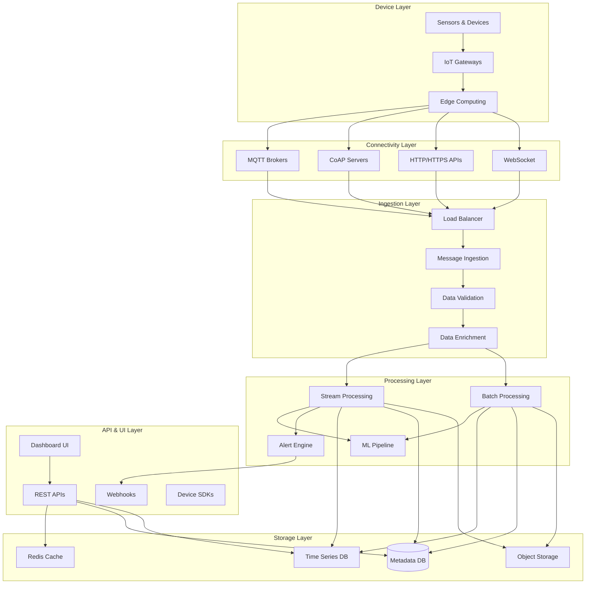
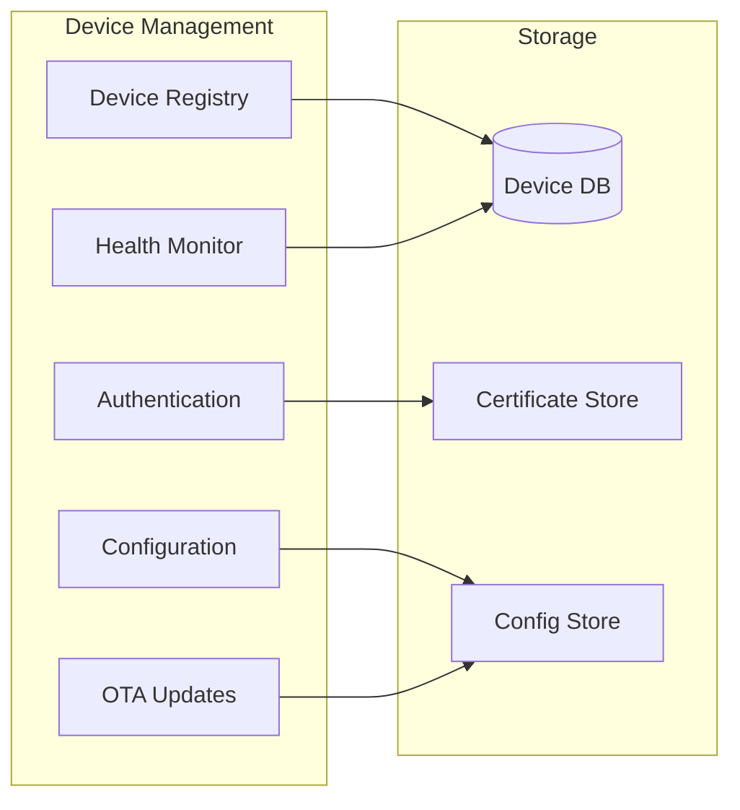
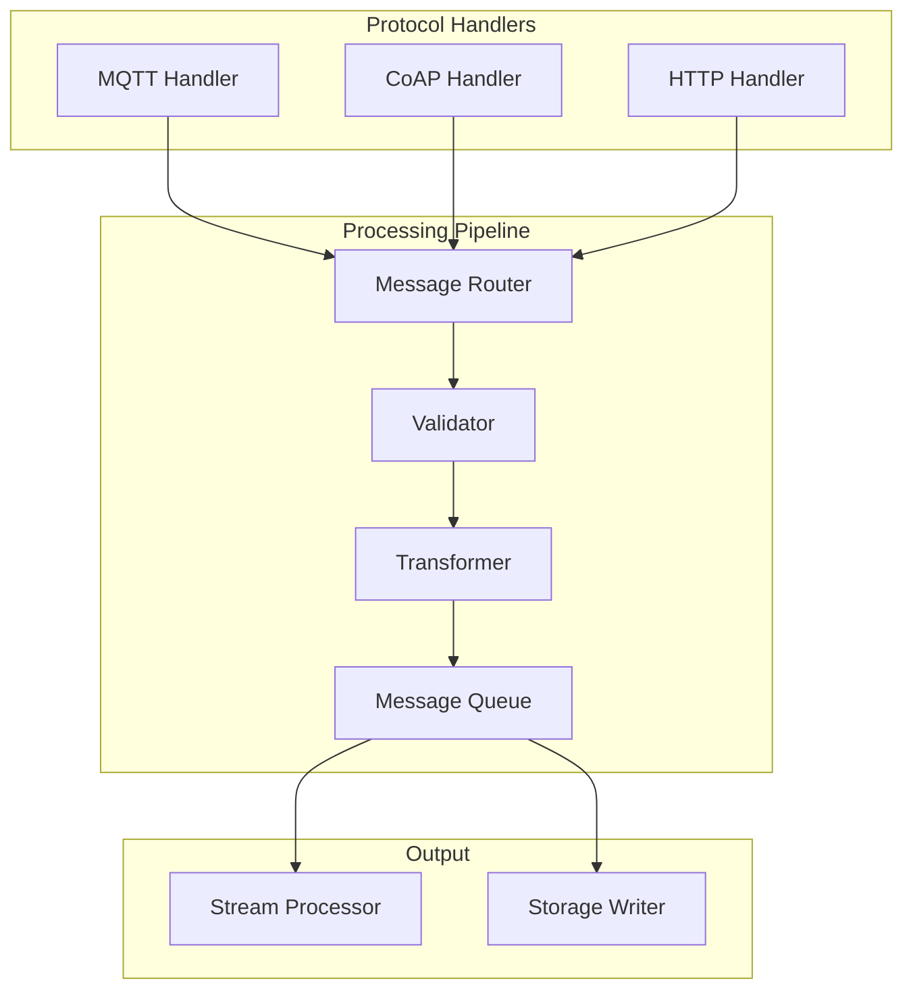
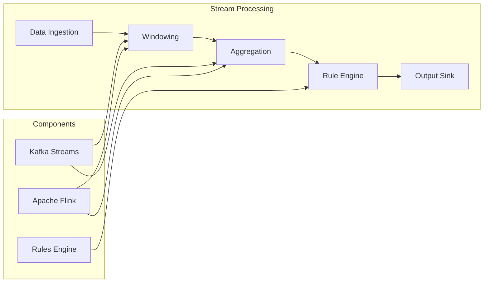
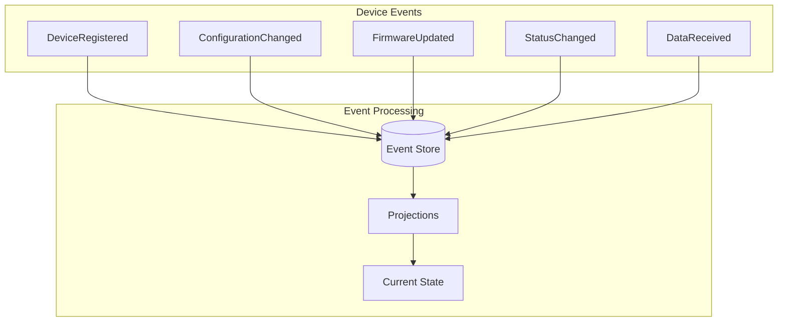

# Design an IoT Platform

## Problem Statement

Design a comprehensive IoT platform that can handle millions of connected devices, process real-time sensor data, provide device management capabilities, and enable analytics and alerting.

### Functional Requirements

1. **Device Management**
   - Device registration and authentication
   - Over-the-air (OTA) firmware updates
   - Device configuration and remote control
   - Device health monitoring and diagnostics

2. **Data Ingestion & Processing**
   - Real-time data collection from sensors
   - Data validation and enrichment
   - Stream processing for real-time analytics
   - Batch processing for historical analysis

3. **Communication Protocols**
   - Support MQTT, CoAP, HTTP/HTTPS
   - Handle intermittent connectivity
   - Message queuing and delivery guarantees
   - Protocol translation and adaptation

4. **Analytics & Alerting**
   - Real-time dashboards and visualization
   - Anomaly detection and alerting
   - Historical reporting and trends
   - Machine learning model deployment

5. **API & Integration**
   - REST APIs for external integrations
   - Webhook support for event notifications
   - SDK for different platforms
   - Third-party service integrations

### Non-Functional Requirements

1. **Scale**: 10M devices, 1B messages/day, 100K messages/second peak
2. **Latency**: 
   - Message ingestion: <100ms P99
   - Real-time alerts: <5 seconds
   - Dashboard queries: <2 seconds
3. **Availability**: 99.95% uptime with graceful degradation
4. **Reliability**: Message delivery guarantees, no data loss
5. **Security**: End-to-end encryption, device authentication, authorization

## Key Considerations & Constraints

### Device Diversity Challenges
- **Hardware Variations**: Different CPU, memory, network capabilities
- **Protocol Support**: MQTT, CoAP, HTTP, custom protocols
- **Power Constraints**: Battery-powered devices need efficient protocols
- **Network Conditions**: Intermittent connectivity, low bandwidth

### Data Volume & Velocity
- **High Throughput**: Millions of messages per second
- **Variable Load**: Burst traffic patterns from device fleets
- **Data Retention**: Long-term storage for compliance and analytics
- **Real-time Processing**: Sub-second alerting requirements

### Security & Compliance
- **Device Authentication**: PKI certificates, rotating keys
- **Data Encryption**: TLS/DTLS for transport, AES for storage
- **Access Control**: Fine-grained device and data permissions
- **Compliance**: GDPR, HIPAA, industrial standards

### Operational Complexity
- **Multi-tenancy**: Isolate different customers/organizations
- **Global Distribution**: Edge computing and regional data centers
- **Monitoring**: Device health, platform health, data quality
- **Cost Optimization**: Storage tiering, compute elasticity

## High-Level Architecture Approach

### System Architecture



### Core Services Architecture

#### 1. Device Management Service


#### 2. Message Ingestion Service


#### 3. Stream Processing Service


### Data Models

#### Device Schema
```sql
-- Device registry
CREATE TABLE devices (
    device_id VARCHAR(64) PRIMARY KEY,
    tenant_id UUID NOT NULL,
    device_type VARCHAR(50) NOT NULL,
    name VARCHAR(255),
    description TEXT,
    manufacturer VARCHAR(100),
    model VARCHAR(100),
    firmware_version VARCHAR(50),
    last_seen TIMESTAMP,
    status ENUM('active', 'inactive', 'maintenance'),
    location JSON, -- Geographic coordinates
    metadata JSON, -- Flexible device properties
    created_at TIMESTAMP,
    updated_at TIMESTAMP,
    
    INDEX idx_tenant_type (tenant_id, device_type),
    INDEX idx_last_seen (last_seen),
    INDEX idx_status (status)
);

-- Device credentials
CREATE TABLE device_credentials (
    device_id VARCHAR(64) PRIMARY KEY,
    auth_type ENUM('certificate', 'api_key', 'shared_key'),
    credential_hash VARCHAR(255), -- Hashed credential
    certificate_thumbprint VARCHAR(64),
    expires_at TIMESTAMP,
    created_at TIMESTAMP,
    
    INDEX idx_expires (expires_at)
);

-- Device configurations
CREATE TABLE device_configurations (
    config_id UUID PRIMARY KEY,
    device_id VARCHAR(64) NOT NULL,
    config_version INT NOT NULL,
    config_data JSON NOT NULL,
    applied_at TIMESTAMP,
    status ENUM('pending', 'applied', 'failed'),
    
    UNIQUE KEY (device_id, config_version),
    INDEX idx_device_status (device_id, status)
);
```

#### Time Series Data Schema
```sql
-- For InfluxDB or similar TSDB
-- Measurement: sensor_data
-- Tags: device_id, sensor_type, tenant_id, location
-- Fields: value, quality, unit
-- Timestamp: event time

-- Example InfluxDB schema
CREATE MEASUREMENT sensor_data (
    time TIMESTAMP,
    device_id TAG,
    sensor_type TAG,
    tenant_id TAG,
    location TAG,
    value FIELD FLOAT,
    quality FIELD STRING,
    unit FIELD STRING
);

-- Aggregated data for faster queries
CREATE MEASUREMENT sensor_data_hourly (
    time TIMESTAMP,
    device_id TAG,
    sensor_type TAG,
    tenant_id TAG,
    avg_value FIELD FLOAT,
    min_value FIELD FLOAT,
    max_value FIELD FLOAT,
    count FIELD INTEGER
);
```

#### Alert Rules Schema
```sql
-- Alert rules configuration
CREATE TABLE alert_rules (
    rule_id UUID PRIMARY KEY,
    tenant_id UUID NOT NULL,
    name VARCHAR(255) NOT NULL,
    description TEXT,
    device_filter JSON, -- Filter criteria for devices
    condition JSON, -- Alert condition logic
    severity ENUM('low', 'medium', 'high', 'critical'),
    enabled BOOLEAN DEFAULT TRUE,
    cooldown_period INT, -- Seconds between alerts
    notification_channels JSON, -- Email, SMS, webhook
    created_at TIMESTAMP,
    updated_at TIMESTAMP,
    
    INDEX idx_tenant_enabled (tenant_id, enabled)
);

-- Alert instances
CREATE TABLE alerts (
    alert_id UUID PRIMARY KEY,
    rule_id UUID NOT NULL,
    device_id VARCHAR(64) NOT NULL,
    severity ENUM('low', 'medium', 'high', 'critical'),
    message TEXT,
    triggered_at TIMESTAMP,
    resolved_at TIMESTAMP,
    status ENUM('active', 'acknowledged', 'resolved'),
    metadata JSON,
    
    INDEX idx_device_status (device_id, status),
    INDEX idx_triggered (triggered_at),
    INDEX idx_rule_status (rule_id, status)
);
```

## Relevant Patterns from Pattern Library

### Core Patterns

#### 1. Event Sourcing for Device State
**Pattern**: [Event Sourcing](/pattern-library/data-management/event-sourcing/)
- Track all device state changes as events
- Enables audit trails and compliance
- Supports offline device scenarios



#### 2. Stream Processing
**Pattern**: [Stream Processing](/pattern-library/architecture/event-streaming/)
- Real-time processing of sensor data
- Windowing for aggregations
- Complex event processing for alerts

#### 3. Time Series Database
**Pattern**: [Time Series Database](/pattern-library/data-management/lsm-tree/)
- Optimized for high-write, time-ordered data
- Efficient compression and retention policies
- Fast range queries for analytics

#### 4. Message Queue
**Pattern**: [Message Queue](/pattern-library/coordination/distributed-queue/)
- Reliable message delivery
- Handle burst traffic and backpressure
- Support for different messaging patterns

### Supporting Patterns

#### 5. API Gateway
**Pattern**: [API Gateway](/pattern-library/communication/api-gateway/)
- Single entry point for all device communications
- Protocol translation and routing
- Authentication and rate limiting

#### 6. Circuit Breaker
**Pattern**: [Circuit Breaker](/pattern-library/resilience/circuit-breaker/)
- Protect downstream services from failures
- Graceful degradation during outages
- Fast failure detection

#### 7. Database Sharding
**Pattern**: [Database Sharding](/pattern-library/scaling/sharding/)
- Partition devices by tenant or geography
- Scale metadata storage horizontally
- Ensure data locality

#### 8. Load Balancing
**Pattern**: [Load Balancing](/pattern-library/scaling/load-balancing/)
- Distribute device connections across servers
- Support sticky sessions for stateful protocols
- Health check integration

## Common Pitfalls to Avoid

### 1. Protocol Complexity Overload
**Problem**: Supporting too many protocols increases complexity
**Solution**:
- Start with MQTT and HTTP/HTTPS
- Use protocol adapters for standardization
- Consider protocol translation at edge gateways

### 2. Database Hotspots
**Problem**: Popular devices create database bottlenecks
**Solution**:
- Shard by tenant_id or device_id
- Use read replicas for analytics queries
- Cache frequently accessed device metadata

### 3. Message Ordering Issues
**Problem**: Out-of-order messages affect data integrity
**Solution**:
- Use message timestamps for ordering
- Implement idempotent processing
- Design for eventual consistency

### 4. Security Token Management
**Problem**: Device credential rotation at scale is complex
**Solution**:
- Implement automated certificate rotation
- Use short-lived tokens where possible
- Provide secure bootstrap mechanisms

### 5. Data Retention Explosion
**Problem**: Time series data grows unbounded
**Solution**:
- Implement data retention policies
- Use data compression and aggregation
- Archive old data to cheap storage

## What Interviewers Look For

### Architecture Design (35%)
- **Protocol selection**: Understanding of IoT protocols and trade-offs
- **Service decomposition**: Clear separation of device management, data processing, and analytics
- **Data flow design**: Efficient ingestion, processing, and storage pipeline
- **Multi-tenancy**: Proper isolation between different customers

### Scalability Planning (25%)
- **Horizontal scaling**: How to handle millions of devices
- **Data partitioning**: Time series and metadata partitioning strategies
- **Load balancing**: Connection distribution and session management
- **Performance optimization**: Caching, indexing, query optimization

### Real-time Processing (20%)
- **Stream processing**: Understanding of windowing, aggregation, and CEP
- **Alert systems**: Low-latency anomaly detection and notification
- **Data pipelines**: Efficient data transformation and routing
- **Backpressure handling**: Managing burst traffic and slow consumers

### Operational Concerns (20%)
- **Security**: Device authentication, data encryption, access control
- **Monitoring**: Device health, platform health, data quality metrics
- **Compliance**: Data governance, audit trails, regulatory requirements
- **Cost optimization**: Storage tiering, compute elasticity, resource management

## Advanced Follow-up Questions

### Edge Computing Integration
**Q**: "How would you handle processing at the edge for low-latency requirements?"
**Expected Discussion**:
- Edge gateway deployment strategies
- Local processing and filtering capabilities
- Synchronization between edge and cloud
- Offline operation and data buffering

### Device Fleet Management
**Q**: "How would you implement over-the-air (OTA) firmware updates for millions of devices?"
**Expected Discussion**:
- Staged rollout strategies (canary deployments)
- Rollback mechanisms for failed updates
- Bandwidth management and scheduling
- Device compatibility and dependency management

### Multi-Protocol Support
**Q**: "How would you efficiently support multiple IoT protocols?"
**Expected Discussion**:
- Protocol adapter pattern
- Message normalization and translation
- Connection pooling and multiplexing
- Protocol-specific optimizations

### Data Quality & Validation
**Q**: "How would you ensure data quality from unreliable sensors?"
**Expected Discussion**:
- Data validation rules and schemas
- Outlier detection and filtering
- Sensor calibration and drift correction
- Quality metrics and scoring

## Key Metrics to Monitor

### Device Health Metrics
- **Connection status**: Number of connected vs. registered devices
- **Message throughput**: Messages per second per device/tenant
- **Latency**: End-to-end message delivery time
- **Error rates**: Failed message deliveries, authentication failures

### Platform Performance Metrics
- **Ingestion rate**: Messages processed per second
- **Processing latency**: Stream processing lag
- **Storage growth**: Time series data growth rate
- **Query performance**: Dashboard and API response times

### Business Metrics
- **Device utilization**: Active vs. inactive devices
- **Data value**: Revenue per device or data point
- **Alert accuracy**: False positive/negative rates
- **Customer satisfaction**: Platform uptime and reliability

### Security Metrics
- **Authentication failures**: Failed device login attempts
- **Certificate expiration**: Expiring device certificates
- **Anomalous behavior**: Unusual device communication patterns
- **Compliance violations**: Policy and regulation violations

---

*This system design problem tests understanding of IoT protocols, real-time data processing, device management at scale, and the unique challenges of heterogeneous device ecosystems. Focus on trade-offs between latency, reliability, security, and cost.*