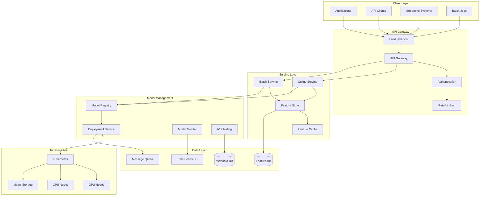
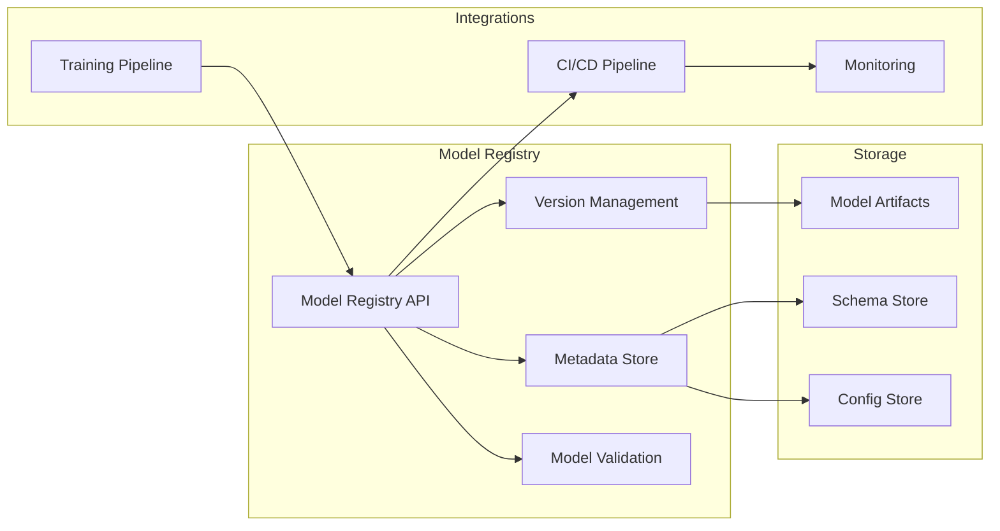
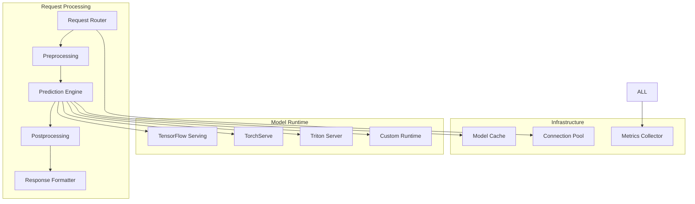
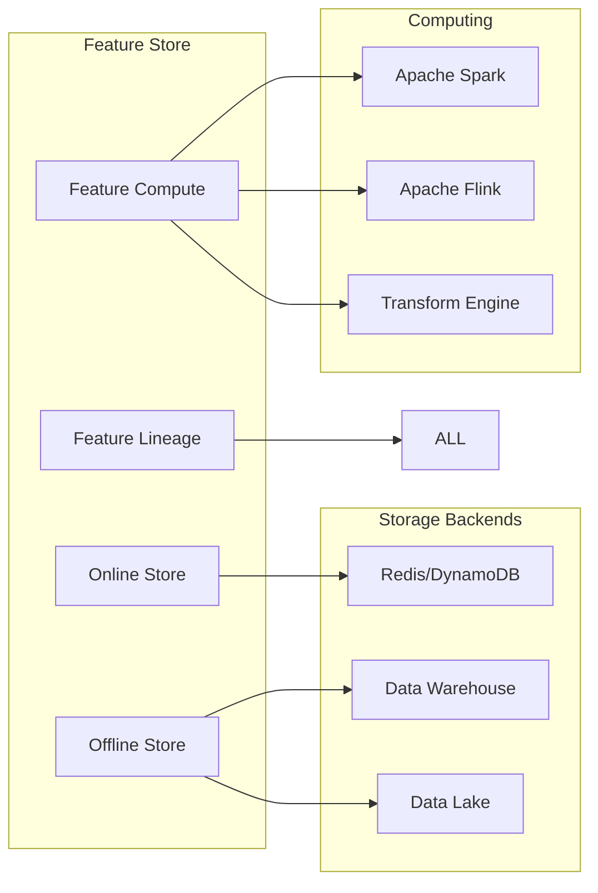
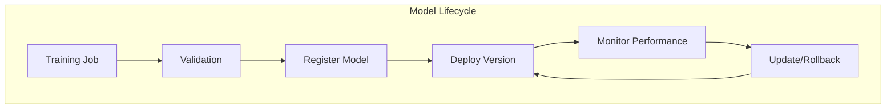

# Design a Machine Learning Serving System

## Problem Statement

Design a machine learning serving platform that can deploy, serve, and manage ML models at scale. The system should support both real-time inference (online) and batch prediction (offline) workloads with high availability, low latency, and proper model lifecycle management.

### Functional Requirements

1. **Model Management**
   - Model deployment and versioning
   - A/B testing and canary deployments
   - Model rollback and blue-green deployments
   - Automated model lifecycle management

2. **Inference Serving**
   - Real-time prediction APIs (synchronous)
   - Batch prediction jobs (asynchronous)
   - Multi-model serving on shared infrastructure
   - Auto-scaling based on traffic patterns

3. **Feature Management**
   - Feature store for consistent feature computation
   - Real-time feature serving with low latency
   - Feature transformation and validation
   - Feature lineage and monitoring

4. **Model Monitoring**
   - Model performance tracking and alerting
   - Data drift and model drift detection
   - Prediction quality monitoring
   - Resource utilization monitoring

5. **Integration & APIs**
   - REST and gRPC APIs for predictions
   - SDK for different programming languages
   - Streaming inference for real-time data
   - Integration with ML training pipelines

### Non-Functional Requirements

1. **Scale**: 1M+ models, 100K RPS per model, 10PB training data
2. **Latency**: 
   - Real-time inference: <10ms P99
   - Feature lookup: <1ms P99
   - Batch processing: Complete within SLA windows
3. **Availability**: 99.99% uptime with zero-downtime deployments
4. **Reliability**: No prediction loss, graceful degradation
5. **Security**: Model IP protection, secure APIs, audit trails

## Key Considerations & Constraints

### Model Complexity Challenges
- **Diverse Frameworks**: TensorFlow, PyTorch, Scikit-learn, XGBoost
- **Model Sizes**: From small linear models to large language models (10GB+)
- **Resource Requirements**: CPU, GPU, TPU, memory-intensive models
- **Inference Patterns**: Single prediction, batch, streaming

### Performance Requirements
- **Latency**: Sub-10ms for real-time serving
- **Throughput**: Millions of predictions per second
- **Efficiency**: Optimal resource utilization and cost
- **Scalability**: Auto-scaling based on traffic patterns

### Operational Complexity
- **Multi-tenancy**: Isolate models and customers
- **Monitoring**: Model performance, drift, resource usage
- **Compliance**: Model governance, audit trails, explainability
- **Cost Management**: Resource optimization, capacity planning

### Data Pipeline Integration
- **Feature Engineering**: Consistent between training and serving
- **Data Quality**: Validation and monitoring of input data
- **Real-time Features**: Low-latency feature computation
- **Batch Features**: Offline feature computation and storage

## High-Level Architecture Approach

### System Architecture



### Core Services Architecture

#### 1. Model Registry Service


#### 2. Online Serving Service


#### 3. Feature Store Service


### Data Models

#### Model Registry Schema
```sql
-- Models table
CREATE TABLE models (
    model_id UUID PRIMARY KEY,
    name VARCHAR(255) NOT NULL,
    description TEXT,
    owner_id UUID NOT NULL,
    framework VARCHAR(50) NOT NULL, -- tensorflow, pytorch, sklearn
    task_type VARCHAR(50) NOT NULL, -- classification, regression, ranking
    created_at TIMESTAMP,
    updated_at TIMESTAMP,
    
    UNIQUE KEY (name),
    INDEX idx_owner (owner_id),
    INDEX idx_framework (framework)
);

-- Model versions table
CREATE TABLE model_versions (
    version_id UUID PRIMARY KEY,
    model_id UUID NOT NULL,
    version VARCHAR(50) NOT NULL,
    artifact_uri VARCHAR(500) NOT NULL,
    status ENUM('staging', 'production', 'archived'),
    metrics JSON, -- Validation metrics
    metadata JSON, -- Framework-specific metadata
    schema JSON, -- Input/output schema
    created_at TIMESTAMP,
    deployed_at TIMESTAMP,
    
    UNIQUE KEY (model_id, version),
    INDEX idx_model_status (model_id, status),
    INDEX idx_deployed (deployed_at)
);

-- Model deployments table
CREATE TABLE model_deployments (
    deployment_id UUID PRIMARY KEY,
    version_id UUID NOT NULL,
    environment VARCHAR(50) NOT NULL, -- staging, production
    endpoint_name VARCHAR(255) NOT NULL,
    config JSON, -- Deployment configuration
    traffic_percentage INT DEFAULT 100,
    status ENUM('deploying', 'active', 'failed', 'stopped'),
    created_at TIMESTAMP,
    updated_at TIMESTAMP,
    
    INDEX idx_version_env (version_id, environment),
    INDEX idx_endpoint (endpoint_name),
    INDEX idx_status (status)
);
```

#### Feature Store Schema
```sql
-- Feature groups (logical grouping of features)
CREATE TABLE feature_groups (
    group_id UUID PRIMARY KEY,
    name VARCHAR(255) NOT NULL,
    description TEXT,
    owner_id UUID NOT NULL,
    data_source JSON, -- Source configuration
    schedule VARCHAR(100), -- Cron expression for batch updates
    freshness_sla INT, -- Maximum staleness in minutes
    created_at TIMESTAMP,
    
    UNIQUE KEY (name),
    INDEX idx_owner (owner_id)
);

-- Feature definitions
CREATE TABLE features (
    feature_id UUID PRIMARY KEY,
    group_id UUID NOT NULL,
    name VARCHAR(255) NOT NULL,
    data_type VARCHAR(50) NOT NULL,
    transformation TEXT, -- SQL or code for transformation
    validation_rules JSON,
    tags JSON,
    created_at TIMESTAMP,
    
    UNIQUE KEY (group_id, name),
    INDEX idx_group (group_id)
);

-- Feature values (for online serving)
-- This would typically be in Redis/DynamoDB
CREATE TABLE feature_values (
    entity_id VARCHAR(255),
    feature_id UUID,
    value JSON,
    timestamp TIMESTAMP,
    
    PRIMARY KEY (entity_id, feature_id),
    INDEX idx_timestamp (timestamp)
);
```

#### Monitoring Schema
```sql
-- Prediction requests table
CREATE TABLE prediction_requests (
    request_id UUID PRIMARY KEY,
    model_id UUID NOT NULL,
    version_id UUID NOT NULL,
    endpoint_name VARCHAR(255),
    input_features JSON,
    prediction JSON,
    confidence FLOAT,
    latency_ms INT,
    status ENUM('success', 'error'),
    error_message TEXT,
    timestamp TIMESTAMP,
    
    INDEX idx_model_timestamp (model_id, timestamp),
    INDEX idx_endpoint_timestamp (endpoint_name, timestamp),
    INDEX idx_status (status)
);

-- Model performance metrics
CREATE TABLE model_metrics (
    metric_id UUID PRIMARY KEY,
    model_id UUID NOT NULL,
    version_id UUID NOT NULL,
    metric_name VARCHAR(100) NOT NULL,
    metric_value FLOAT NOT NULL,
    metric_type ENUM('accuracy', 'precision', 'recall', 'f1', 'auc', 'rmse'),
    measurement_window VARCHAR(50), -- hourly, daily
    timestamp TIMESTAMP,
    
    INDEX idx_model_metric (model_id, metric_name, timestamp),
    INDEX idx_version_metric (version_id, metric_name, timestamp)
);
```

## Relevant Patterns from Pattern Library

### Core Patterns

#### 1. Model Versioning & Registry
**Pattern**: [Version Control](/pattern-library/data-management/event-sourcing/)
- Immutable model artifacts with semantic versioning
- Model lineage tracking from training to deployment
- Rollback capabilities and audit trails



#### 2. Feature Store
**Pattern**: [Feature Store](/pattern-library/data-management/materialized-view/)
- Centralized feature management and serving
- Consistent features between training and serving
- Real-time and batch feature computation

#### 3. Circuit Breaker
**Pattern**: [Circuit Breaker](/pattern-library/resilience/circuit-breaker/)
- Protect against model serving failures
- Graceful degradation with fallback models
- Fast failure detection and recovery

#### 4. Load Balancing
**Pattern**: [Load Balancing](/pattern-library/scaling/load-balancing/)
- Distribute inference requests across replicas
- Support for different routing strategies
- Health check integration

### Supporting Patterns

#### 5. API Gateway
**Pattern**: [API Gateway](/pattern-library/communication/api-gateway/)
- Single entry point for all ML APIs
- Authentication, authorization, and rate limiting
- Request/response transformation

#### 6. Caching
**Pattern**: [Caching](/pattern-library/scaling/caching-strategies/)
- Cache model artifacts and features
- Reduce latency for repeated requests
- Smart cache invalidation strategies

#### 7. Event Sourcing
**Pattern**: [Event Sourcing](/pattern-library/data-management/event-sourcing/)
- Track all model lifecycle events
- Audit trails for compliance
- Enable replay and debugging

#### 8. Bulkhead Pattern
**Pattern**: [Bulkhead](/pattern-library/resilience/bulkhead/)
- Isolate different models and tenants
- Prevent cascade failures
- Resource quota management

## Common Pitfalls to Avoid

### 1. Training-Serving Skew
**Problem**: Inconsistent feature computation between training and serving
**Solution**:
- Centralized feature store with consistent logic
- Validate feature distributions in production
- Automated tests for feature consistency

### 2. Model Version Chaos
**Problem**: Difficulty tracking and managing model versions
**Solution**:
- Immutable model artifacts with semantic versioning
- Automated model lifecycle management
- Clear promotion criteria and approval processes

### 3. Cold Start Latency
**Problem**: Long startup time for model initialization
**Solution**:
- Model warming strategies and pre-loading
- Connection pooling and persistent model servers
- Lazy loading with cache warming

### 4. Resource Overprovisioning
**Problem**: Expensive GPU/CPU resources sitting idle
**Solution**:
- Dynamic auto-scaling based on traffic
- Multi-model serving to share resources
- Spot instances for batch workloads

### 5. Data Drift Blindness
**Problem**: Model performance degrades due to changing data
**Solution**:
- Continuous monitoring of input distributions
- Automated drift detection and alerting
- Regular model retraining triggers

## What Interviewers Look For

### Architecture Design (30%)
- **Service decomposition**: Clear separation of model registry, serving, and monitoring
- **Scalability planning**: How to handle millions of models and requests
- **Technology choices**: Appropriate ML serving frameworks and infrastructure
- **API design**: Clean interfaces for model management and inference

### ML-Specific Knowledge (25%)
- **Model lifecycle**: Understanding of training-to-serving pipeline
- **Feature engineering**: Consistent feature computation and serving
- **A/B testing**: Safe model rollout and experimentation
- **Performance optimization**: Model optimization and serving efficiency

### Operational Excellence (25%)
- **Monitoring**: Model performance, drift detection, resource usage
- **Reliability**: High availability, fault tolerance, graceful degradation
- **Security**: Model IP protection, secure APIs, compliance
- **Cost optimization**: Resource efficiency and capacity planning

### Real-time Systems (20%)
- **Latency optimization**: Sub-10ms inference serving
- **Caching strategies**: Model, feature, and prediction caching
- **Load balancing**: Traffic distribution and auto-scaling
- **Batch processing**: Efficient offline inference pipelines

## Advanced Follow-up Questions

### Model Optimization & Acceleration
**Q**: "How would you optimize serving for large language models (10GB+)?"
**Expected Discussion**:
- Model quantization and pruning techniques
- Model parallelism and sharding strategies
- Specialized hardware (TPUs, FPGAs) utilization
- Caching and batching optimizations

### Multi-Model Serving
**Q**: "How would you efficiently serve thousands of models on shared infrastructure?"
**Expected Discussion**:
- Multi-model servers and resource sharing
- Dynamic model loading and unloading
- Model placement and scheduling algorithms
- Resource isolation and quota management

### A/B Testing & Experimentation
**Q**: "How would you implement safe A/B testing for model deployments?"
**Expected Discussion**:
- Traffic splitting and routing strategies
- Statistical significance testing
- Rollback mechanisms and criteria
- Shadow mode and canary deployments

### Feature Store Architecture
**Q**: "How would you design a feature store for both real-time and batch serving?"
**Expected Discussion**:
- Online vs offline storage trade-offs
- Feature transformation and computation engines
- Consistency between batch and streaming features
- Feature versioning and lineage tracking

## Key Metrics to Monitor

### Model Performance Metrics
- **Accuracy metrics**: Model-specific accuracy, precision, recall
- **Latency**: P50, P95, P99 inference latency
- **Throughput**: Requests per second per model
- **Error rates**: Failed predictions and system errors

### Infrastructure Metrics
- **Resource utilization**: CPU, GPU, memory usage
- **Auto-scaling**: Scale-up/down events and timing
- **Cost metrics**: Cost per prediction, resource efficiency
- **Availability**: Uptime and service level objectives

### Data Quality Metrics
- **Feature drift**: Distribution changes in input features
- **Prediction drift**: Changes in model output distributions
- **Data freshness**: Age of features and training data
- **Validation failures**: Schema and data quality violations

### Business Metrics
- **Model adoption**: Number of active models and users
- **Experiment success**: A/B test results and model improvements
- **Time to deployment**: Model development to production time
- **ROI**: Business impact of deployed models

---

*This system design problem tests understanding of ML operations, model lifecycle management, real-time serving systems, and the unique challenges of production ML at scale. Focus on trade-offs between accuracy, latency, cost, and operational complexity.*