# IC Interviews Guide

> Master both system design and behavioral interviews for Individual Contributor roles (L3-L5)

## Overview

This section covers both **system design** and **behavioral** interviews for Software Engineers (L3-L5 / E3-E5 / SDE I-III). Whether you're interviewing at FAANG, unicorns, or startups, these resources will help you excel in all aspects of IC interviews.

## 🎯 IC Interview Preparation Flow

```mermaid
graph TB
    subgraph "IC Interview Preparation Journey"
        A[📚 Foundation Study<br/>2-4 weeks] --> B{🎯 Target Level?}
        
        B -->|L3/E3| C1[🔰 Junior Focus<br/>• Basic system design<br/>• Core behavioral skills<br/>• Simple problems]
        B -->|L4/E4| C2[🚀 Mid-Level Focus<br/>• Complex architectures<br/>• Technical leadership<br/>• Cross-team scenarios]
        B -->|L5/E5| C3[⭐ Senior Focus<br/>• System trade-offs<br/>• Influence without authority<br/>• Strategic thinking]
        
        C1 --> D[💪 Practice Phase<br/>4-6 weeks]
        C2 --> D
        C3 --> D
        
        D --> E[🎭 Mock Interviews<br/>2-3 weeks]
        E --> F[🎯 Final Prep<br/>1 week]
        F --> G[🏆 Interview Success]
        
        subgraph "Key Skills by Level"
            H1[L3: Foundation Building<br/>• System basics<br/>• Clear communication<br/>• Learning mindset]
            H2[L4: Technical Leadership<br/>• Architecture decisions<br/>• Mentoring others<br/>• Cross-functional work]
            H3[L5: Strategic Impact<br/>• System vision<br/>• Technical strategy<br/>• Organizational influence]
        end
    end
    
    classDef junior fill:#e8f5e8,stroke:#4caf50,stroke-width:2px
    classDef mid fill:#fff3e0,stroke:#ff9800,stroke-width:2px
    classDef senior fill:#e3f2fd,stroke:#2196f3,stroke-width:2px
    classDef process fill:#f3e5f5,stroke:#9c27b0,stroke-width:2px
    
    class C1,H1 junior
    class C2,H2 mid
    class C3,H3 senior
    class A,D,E,F,G process
```

## 📚 Core Resources

- :material-account-voice:{ .lg } **[Behavioral Interviews](../interview-prep/ic-interviews/behavioral/)**
    
    ---
    
    Master IC behavioral questions with technical leadership focus
    
    **Topics**: Technical leadership, mentoring, cross-team collaboration, conflict resolution

- :material-compass-outline:{ .lg } **[Design Frameworks](../interview-prep/ic-interviews/frameworks/)**
    
    ---
    
    Structured approaches to tackle any system design problem
    
    **Methods**: RADIO framework, 4S method, Problem-First design

- :material-puzzle:{ .lg } **[Common Problems](../interview-prep/ic-interviews/common-problems/)**
    
    ---
    
    Practice with frequently asked system design questions
    
    **Popular**: URL Shortener, Chat System, Video Streaming, News Feed

- :material-card-text:{ .lg } **[Cheatsheets](../interview-prep/ic-interviews/cheatsheets/)**
    
    ---
    
    Quick reference guides for your interviews
    
    **Includes**: Scalability numbers, Database comparisons, Pattern selection

## 🎯 IC Interview Types

### 🗣️ Behavioral Interviews (45-60 minutes)
Focus on **technical leadership without authority**, collaboration, and growth.

!!! abstract "Key Evaluation Areas"
    - **🎯 Technical decision-making and influence** - How you drive technical choices
    - **🤝 Cross-team collaboration and conflict resolution** - Working effectively with others
    - **👥 Mentoring and knowledge sharing** - Helping others grow technically
    - **🧩 Problem-solving under ambiguity** - Navigating unclear situations
    - **📈 Learning from failures and adapting** - Growth mindset demonstration

!!! tip "Success Factor"
    Demonstrate leadership through **technical excellence and collaboration**, not management authority.

---

### 🏗️ System Design Interviews (45-60 minutes)
Focus on architectural thinking and scalable system design.

## 🎯 System Design Interview Process

```mermaid
graph LR
    subgraph "System Design Interview Flow (45-60 minutes)"
        A[📋 Requirements<br/>Gathering<br/>5-10 min<br/><br/>• Functional needs<br/>• Scale estimates<br/>• Constraints<br/>• Success metrics] 
        
        B[🏗️ High-Level<br/>Design<br/>15-20 min<br/><br/>• Architecture diagram<br/>• Major components<br/>• Data flow<br/>• API design]
        
        C[🔍 Detailed<br/>Design<br/>15-20 min<br/><br/>• Database schema<br/>• Algorithms<br/>• Tech choices<br/>• Component details]
        
        D[📈 Scale &<br/>Optimization<br/>10-15 min<br/><br/>• Bottlenecks<br/>• Caching strategy<br/>• Performance tuning<br/>• Cost analysis]
    end
    
    A --> B --> C --> D
    
    subgraph "Key Mindsets by Phase"
        E1[📝 Clarify & Scope<br/>Ask smart questions<br/>Define boundaries]
        E2[🎨 Design & Communicate<br/>Think architecturally<br/>Draw clean diagrams]
        E3[🔧 Implement & Justify<br/>Choose technologies<br/>Explain trade-offs]
        E4[🚀 Scale & Optimize<br/>Identify limits<br/>Plan for growth]
    end
    
    A -.-> E1
    B -.-> E2
    C -.-> E3
    D -.-> E4
    
    classDef phase fill:#e3f2fd,stroke:#1976d2,stroke-width:2px
    classDef mindset fill:#f3e5f5,stroke:#7b1fa2,stroke-width:2px
    
    class A,B,C,D phase
    class E1,E2,E3,E4 mindset
```

### Typical Timeline (45-60 minutes)

#### 1. Requirements Gathering (5-10 min)
- Functional requirements
- Non-functional requirements
- Scale estimation
- Success metrics

#### 2. High-Level Design (15-20 min)
- Architecture diagram
- Major components
- Data flow
- API design

#### 3. Detailed Design (15-20 min)
- Database schema
- Algorithm deep dives
- Component interactions
- Technology choices

#### 4. Scale & Optimization (10-15 min)
- Bottleneck identification
- Caching strategies
- Database optimization
- Cost considerations

---

## 📊 Topics by Difficulty Level

### 🟢 Beginner Level (L3/E3)
!!! success "Entry-Level Focus"
    - **URL Shortener** - Hashing, basic caching
    - **Pastebin** - Simple CRUD operations
    - **Hit Counter** - Basic aggregation
    - **Rate Limiter** - Algorithm fundamentals

### 🟡 Intermediate Level (L4/E4)  
!!! warning "Mid-Level Challenges"
    - **Chat Application** - Real-time messaging, WebSockets
    - **Twitter Timeline** - Feed generation, fanout strategies
    - **Video Streaming** - CDN, encoding pipelines
    - **Distributed Cache** - Partitioning, consistency

### 🔴 Advanced Level (L5/E5)
!!! danger "Senior-Level Complexity"
    - **Uber/Lyft** - Geospatial indexing, real-time matching
    - **Google Search** - Distributed indexing, ranking algorithms
    - **Facebook News Feed** - ML recommendations, massive scale
    - **Distributed Database** - ACID properties, consensus algorithms

---

## 🔧 Technical Concepts to Master

### 🎯 Core Concepts (Must Know)
!!! note "Foundation Knowledge"
    - **📈 Scalability** - Horizontal vs Vertical scaling approaches
    - **🛡️ Reliability** - Replication strategies and failover mechanisms
    - **⚡ Availability** - Load balancing and health monitoring
    - **🚀 Performance** - Caching layers, CDNs, database optimization

### 🧠 Advanced Topics (L4+ Focus)
!!! tip "Senior-Level Understanding"
    - **🎯 Consistency** - CAP theorem implications and eventual consistency
    - **🗂️ Partitioning** - Sharding strategies and data distribution
    - **📨 Messaging** - Queue vs Pub/Sub communication patterns
    - **💾 Storage** - SQL vs NoSQL trade-offs and use cases

## 💡 Success Tips

!!! success "✅ Do's - Best Practices"
    - **Ask clarifying questions** - Understand the problem deeply
    - **Start with simple solution** - Build complexity incrementally  
    - **Draw clear diagrams** - Visual communication demonstrates thinking
    - **Discuss trade-offs** - Show engineering judgment and decision-making
    - **Consider edge cases** - Think about failure scenarios and boundaries

!!! danger "❌ Don'ts - Common Pitfalls"
    - **Over-engineer early** - Avoid premature optimization
    - **Ignore requirements** - Always tie back to stated needs
    - **Skip capacity planning** - Size your system appropriately
    - **Forget about failures** - Plan for things going wrong
    - **Use buzzwords incorrectly** - Only mention technologies you understand

## 🚀 Quick Start

### For Behavioral Interviews
1. Read [IC Behavioral Guide](../interview-prep/ic-interviews/behavioral/) to understand key themes
2. Prepare 8-10 STAR stories covering technical leadership scenarios
3. Practice [level-specific scenarios](../interview-prep/ic-interviews/behavioral/by-level.md) for your target role
4. Review [common mistakes](../interview-prep/ic-interviews/behavioral/index#common-ic-behavioral-mistakes.md) to avoid

### For System Design Interviews
1. Review [Design Frameworks](../interview-prep/ic-interviews/frameworks/) to learn structured approaches
2. Practice 2-3 [Common Problems](../interview-prep/ic-interviews/common-problems/) per week
3. Keep [Cheatsheets](../interview-prep/ic-interviews/cheatsheets/) handy for quick reference
4. Do mock interviews focusing on communication and trade-offs

---

*For Engineering Manager/Director interviews, see [Engineering Leadership](../interview-prep/engineering-leadership/) section.*'''