# Interview Prep

Ace your system design interviews with frameworks, practice problems, and comprehensive resources.

## 🎯 What is a System Design Interview?

System design interviews evaluate your ability to architect large-scale distributed systems. Unlike coding interviews that focus on algorithms, these sessions test your understanding of:

!!! abstract "Core Evaluation Areas"
    - **🏗️ Architecture principles** - How to decompose complex problems
    - **📈 Scale considerations** - Handling millions of users and petabytes of data  
    - **⚖️ Trade-off analysis** - Making informed engineering decisions
    - **🌍 Real-world constraints** - Cost, latency, consistency, and reliability

You'll typically spend **45-60 minutes** designing systems like Twitter, Uber, or Netflix while discussing your approach with the interviewer.

---

## How Distributed Systems Knowledge Helps

This compendium's physics-based approach gives you a unique advantage:

1. **🧠 Mental Models** - The 7 Laws provide intuitive frameworks for reasoning about scale
2. **🔧 Pattern Library** - 91 battle-tested patterns solve common design challenges  
3. **📊 Quantitative Skills** - Mathematical tools help you size systems accurately
4. **🏆 Real Examples** - Case studies show how companies actually solve these problems

## 🗺️ Choose Your Interview Prep Path

```mermaid
graph TD
    A[🎯 What's Your Role?] --> B{Current Level?}
    
    B -->|IC L3-L5| C[👨‍💻 Individual Contributor<br/>System Design + Behavioral]
    B -->|Manager L6+| D[👥 Engineering Leadership<br/>People + Strategy + Systems]
    A --> CODING[💻 Coding Interviews<br/>Quick Reference Only]
    
    C --> E{Time Available?}
    D --> F{Leadership Experience?}
    CODING --> K5[📚 Start with Coding Quick Ref]
    
    E -->|2-4 weeks| G[🏃 IC Fast Track<br/>• Core patterns review<br/>• 3-5 practice problems<br/>• Mock interviews<br/>• Behavioral prep]
    
    E -->|2-3 months| H[🏊 IC Deep Prep<br/>• Full framework study<br/>• 15+ practice problems<br/>• Company case studies<br/>• Advanced behavioral]
    
    F -->|New Manager| I[🌱 Leadership Foundation<br/>• First Principles study<br/>• People management focus<br/>• Story development<br/>• Company culture research]
    
    F -->|Experienced| J[🚀 Leadership Mastery<br/>• Business concepts deep dive<br/>• Strategic thinking practice<br/>• Advanced scenarios<br/>• Executive presence]
    
    G --> K1[📚 Start with IC Quick Prep]
    H --> K2[📚 Start with IC Comprehensive]
    I --> K3[📚 Start with Leadership Foundation]
    J --> K4[📚 Start with Leadership Advanced]
    
    classDef role fill:#e3f2fd,stroke:#1976d2,stroke-width:2px
    classDef ic fill:#e8f5e8,stroke:#4caf50,stroke-width:2px
    classDef leader fill:#fff3e0,stroke:#ff9800,stroke-width:2px
    classDef action fill:#f3e5f5,stroke:#9c27b0,stroke-width:2px
    classDef coding fill:#fff8e1,stroke:#ffc107,stroke-width:2px
    
    class A,B role
    class C,E,G,H,K1,K2 ic
    class D,F,I,J,K3,K4 leader
    class K1,K2,K3,K4,K5 action
    class CODING,K5 coding
```

## 📚 Core Resources

- :material-puzzle:{ .lg } **[Common Problems](ic-interviews/common-problems/)** (50+ scenarios)
    
    ---
    
    Practice with frequently asked system design questions from real interviews
    
    | Problem | Complexity | Key Challenges |
    |---------|------------|----------------|
    | [Cloud Storage](ic-interviews/common-problems/cloud-storage/) | 🟢 Beginner | Object storage, metadata, global scale |
    | [Collaborative Editor](ic-interviews/common-problems/collaborative-editor/) | 🟡 Intermediate | Real-time sync, conflict resolution |
    | [ML Serving Platform](ic-interviews/common-problems/ml-serving/) | 🔴 Advanced | Model inference, scaling, monitoring |

- :material-compass-outline:{ .lg } **[Design Frameworks](ic-interviews/frameworks/)**
    
    ---
    
    Structured approaches to tackle any design problem
    
    **Methods**: RADIO, 4S, Problem-First Design, Trade-off Analysis

- :material-card-text:{ .lg } **[Cheatsheets](ic-interviews/cheatsheets/)**
    
    ---
    
    Quick reference guides for interviews
    
    **Includes**: Numbers to know, patterns reference, decision trees

- :material-code-tags:{ .lg } **[Coding Interviews](coding-interviews/)** (Quick Reference)
    
    ---
    
    Lightweight guide for algorithm pattern review
    
    **Focus**: Pattern recognition, complexity analysis, interview strategy

## 🎯 Interview Process Framework

```mermaid
graph LR
    A[📋 Problem<br/>Understanding<br/>5-10 min] --> B[🏗️ High-Level<br/>Design<br/>10-15 min]
    B --> C[🔍 Detailed<br/>Design<br/>20-30 min]
    C --> D[📈 Scale &<br/>Optimize<br/>10-15 min]
    
    A --> A1[Requirements<br/>Scope<br/>Constraints]
    B --> B1[Architecture<br/>Components<br/>Data Flow]
    C --> C1[Deep Dives<br/>Algorithms<br/>Bottlenecks] 
    D --> D1[Growth Handling<br/>Performance<br/>Reliability]
```

### Phase-by-Phase Checklist

| Phase | Time | Your Goals | Key Questions to Ask |
|-------|------|------------|---------------------|
| **📋 Problem Understanding** | 5-10 min | Clarify scope and requirements | "How many users?", "Read vs write ratio?", "Consistency requirements?" |
| **🏗️ High-Level Design** | 10-15 min | Show system architecture | "What are the major components?", "How do they communicate?" |  
| **🔍 Detailed Design** | 20-30 min | Deep dive into critical parts | "How does this component scale?", "What's the data model?" |
| **📈 Scale & Optimize** | 10-15 min | Address scale and reliability | "What happens at 10x users?", "How do we handle failures?" |

---

## 📊 Common Interview Topics

### 🏢 System Categories
| Category | Examples | Key Challenges |
|----------|----------|----------------|
| **Social Media** | Twitter, Instagram | Scale, feed generation |
| **Messaging** | WhatsApp, Slack | Real-time, delivery |
| **Video** | YouTube, Netflix | Storage, streaming |
| **E-commerce** | Amazon, Shopify | Inventory, payments |
| **Transportation** | Uber, DoorDash | Location, matching |

### 🔧 Technical Concepts You Must Know
!!! note "Core System Design Concepts"
    - **📊 Scalability** - Horizontal vs vertical scaling
    - **🛡️ Reliability** - Fault tolerance, redundancy
    - **⚡ Performance** - Latency, throughput
    - **🎯 Consistency** - CAP theorem trade-offs
    - **🔒 Security** - Authentication, encryption

---

## 🏃 Quick Practice

Practice problems organized by time commitment and complexity level.

### 30-Minute Designs (Beginner-Friendly)
| Problem | Key Challenge | Patterns Used |
|---------|---------------|---------------|
| **[Cloud Storage](ic-interviews/common-problems/cloud-storage/)** | Object storage, metadata management | Consistent Hashing, Sharding |
| **[IoT Platform](ic-interviews/common-problems/iot-platform/)** | Device management, data ingestion | Event Streaming, Time Series |
| **[CI/CD Pipeline](ic-interviews/common-problems/cicd-pipeline/)** | Build automation, deployment | Queue Management, Auto-scaling |

### 45-Minute Designs (Intermediate)
| Problem | Key Challenge | Patterns Used |
|---------|---------------|---------------|
| **[Collaborative Editor](ic-interviews/common-problems/collaborative-editor/)** | Real-time sync, conflict resolution | Operational Transform, WebSocket |
| **[ML Serving Platform](ic-interviews/common-problems/ml-serving/)** | Model inference, A/B testing | Load Balancing, Caching, Auto-scaling |
| **[IoT Platform](ic-interviews/common-problems/iot-platform/)** | Device connectivity, data processing | Message Queues, Stream Processing |

### 60-Minute Designs (Advanced)
| Problem | Key Challenge | Patterns Used |
|---------|---------------|---------------|
| **[CI/CD Pipeline](ic-interviews/common-problems/cicd-pipeline/)** | Build orchestration, deployment strategies | Workflow Management, Container Orchestration |
| **[Cloud Storage](ic-interviews/common-problems/cloud-storage/)** | Global distribution, consistency | Sharding, Replication, Eventual Consistency |
| **[ML Serving Platform](ic-interviews/common-problems/ml-serving/)** | Model versioning, performance optimization | Circuit Breaker, Feature Store, A/B Testing |

## 💡 Interview Tips

!!! success "✅ Do's - Best Practices"
    - **Ask clarifying questions** - Show analytical thinking
    - **Start simple, then add complexity** - Demonstrate structured approach
    - **Draw clear diagrams** - Visual communication is key
    - **Discuss trade-offs explicitly** - Show engineering judgment
    - **Consider non-functional requirements** - Think beyond just functionality

!!! danger "❌ Don'ts - Common Pitfalls"
    - **Jump to implementation details** - Stay high-level initially
    - **Over-engineer the solution** - Keep it appropriately simple
    - **Ignore the interviewer's hints** - Listen and adapt
    - **Forget about data consistency** - Address CAP theorem implications
    - **Skip capacity estimation** - Always size your system

## 🛣️ Interview Prep Journey Map

```mermaid
timeline
    title Interview Preparation Journey
    
    section Foundation Phase
        Week 1-2 : Study Core Concepts
                 : 📚 Distributed Systems Laws
                 : 🔧 Pattern Library Review
                 : 📊 Quantitative Analysis
        
        Week 3-4 : Build Framework Knowledge
                 : 🎯 Design Frameworks (IC)
                 : 💼 Business Concepts (Leadership)
                 : 📖 Company Research
    
    section Practice Phase
        Week 5-6 : Problem Solving
                 : 💪 Daily Practice Problems
                 : 🎭 Behavioral Story Development
                 : 📝 Solution Documentation
        
        Week 7-8 : Advanced Practice
                 : 🔄 Mock Interviews
                 : 🎯 Company-Specific Prep
                 : 📈 Weakness Targeting
    
    section Mastery Phase
        Week 9-10 : Integration
                  : 🧠 Mental Model Reinforcement
                  : 💡 Pattern Recognition
                  : 🎪 Complex Scenarios
        
        Week 11-12 : Final Preparation
                   : 🎯 Interview Simulation
                   : 📋 Checklist Review
                   : 😌 Confidence Building
    
    section Interview Day
        Day Of : Peak Performance
               : 🌅 Morning Review
               : 🧘 Mental Preparation
               : 🏆 Execute with Confidence
```

## 📈 Preparation Timeline

### 1 Week Before
- **📚 Study**: Review [Core Principles](../core-principles/) and key [Pattern Library](../interview-prep/ic-interviews/common-problems/) daily, focusing on different complexities
- **🎯 Research**: Study company-specific systems using our [Case Studies](../architects-handbook/case-studies/)

### 3 Days Before  
- **🎭 Mock Interviews**: Practice with peers using [Design Frameworks](ic-interviews/frameworks/)
- **📋 Review**: Study [Cheatsheets](ic-interviews/cheatsheets/) and [System Design Checklist](ic-interviews/cheatsheets/system-design-checklist/)
- **😌 Rest**: Get adequate sleep and reduce study intensity

### Day Of Interview
- **🧠 Quick Review**: Scan [Design Frameworks](ic-interviews/frameworks/) and [Numbers to Know](ic-interviews/cheatsheets/)
- **🧘 Stay Calm**: Trust your preparation and physics-based mental models
- **💬 Think Aloud**: Verbalize your thought process throughout the interview

---

*Start with [Common Problems](ic-interviews/common-problems/) to practice with real interview questions, or jump to [Frameworks](ic-interviews/frameworks/) to learn systematic approaches.*