# Interview Prep

Ace your system design interviews with frameworks, practice problems, and comprehensive resources.

## What is a System Design Interview?

System design interviews evaluate your ability to architect large-scale distributed systems. Unlike coding interviews that focus on algorithms, these sessions test your understanding of:

- **Architecture principles** - How to decompose complex problems
- **Scale considerations** - Handling millions of users and petabytes of data  
- **Trade-off analysis** - Making informed engineering decisions
- **Real-world constraints** - Cost, latency, consistency, and reliability

You'll typically spend 45-60 minutes designing systems like Twitter, Uber, or Netflix while discussing your approach with the interviewer.

## How Distributed Systems Knowledge Helps

This compendium's physics-based approach gives you a unique advantage:

1. **🧠 Mental Models** - The 7 Laws provide intuitive frameworks for reasoning about scale
2. **🔧 Pattern Library** - 112 battle-tested patterns solve common design challenges  
3. **📊 Quantitative Skills** - Mathematical tools help you size systems accurately
4. **🏆 Real Examples** - Case studies show how companies actually solve these problems

## 📚 Core Resources

- :material-puzzle:{ .lg } **[Common Problems](common-problems/)** (50+ scenarios)
    
    ---
    
    Practice with frequently asked system design questions from real interviews
    
    | Problem | Complexity | Key Challenges |
    |---------|------------|----------------|
    | [URL Shortener](common-problems/url-shortener/) | 🟢 Beginner | Hashing, caching, simple scale |
    | [Chat System](common-problems/chat-system/) | 🟡 Intermediate | Real-time messaging, WebSocket scaling |
    | [Video Streaming](common-problems/video-streaming/) | 🔴 Advanced | CDN design, encoding pipelines, global scale |

- :material-compass-outline:{ .lg } **[Design Frameworks](frameworks/)**
    
    ---
    
    Structured approaches to tackle any design problem
    
    **Methods**: RADIO, 4S, Problem-First Design, Trade-off Analysis

- :material-card-text:{ .lg } **[Cheatsheets](cheatsheets/)**
    
    ---
    
    Quick reference guides for interviews
    
    **Includes**: Numbers to know, patterns reference, decision trees

## 🎯 Interview Process Framework

```mermaid
graph LR
    A[📋 Problem<br/>Understanding<br/>5-10 min] --> B[🏗️ High-Level<br/>Design<br/>10-15 min]
    B --> C[🔍 Detailed<br/>Design<br/>20-30 min]
    C --> D[📈 Scale &<br/>Optimize<br/>10-15 min]
    
    A --> A1[Requirements<br/>Scope<br/>Constraints]
    B --> B1[Architecture<br/>Components<br/>Data Flow]
    C --> C1[Deep Dives<br/>Algorithms<br/>Bottlenecks] 
    D --> D1[Growth Handling<br/>Performance<br/>Reliability]
```

### Phase-by-Phase Checklist

| Phase | Time | Your Goals | Key Questions to Ask |
|-------|------|------------|---------------------|
| **📋 Problem Understanding** | 5-10 min | Clarify scope and requirements | "How many users?", "Read vs write ratio?", "Consistency requirements?" |
| **🏗️ High-Level Design** | 10-15 min | Show system architecture | "What are the major components?", "How do they communicate?" |  
| **🔍 Detailed Design** | 20-30 min | Deep dive into critical parts | "How does this component scale?", "What's the data model?" |
| **📈 Scale & Optimize** | 10-15 min | Address scale and reliability | "What happens at 10x users?", "How do we handle failures?" |

## 📊 Common Topics

### System Types
| Category | Examples | Key Challenges |
|----------|----------|----------------|
| Social Media | Twitter, Instagram | Scale, feed generation |
| Messaging | WhatsApp, Slack | Real-time, delivery |
| Video | YouTube, Netflix | Storage, streaming |
| E-commerce | Amazon, Shopify | Inventory, payments |
| Transportation | Uber, DoorDash | Location, matching |

### Technical Concepts
- **Scalability** - Horizontal vs vertical scaling
- **Reliability** - Fault tolerance, redundancy
- **Performance** - Latency, throughput
- **Consistency** - CAP theorem trade-offs
- **Security** - Authentication, encryption

## 🏃 Quick Practice

Practice problems organized by time commitment and complexity level.

### 30-Minute Designs (Beginner-Friendly)
| Problem | Key Challenge | Patterns Used |
|---------|---------------|---------------|
| **[URL Shortener](common-problems/url-shortener/)** | Base62 encoding, cache strategy | Consistent Hashing, Cache-Aside |
| **[Rate Limiter](common-problems/rate-limiter/)** | Algorithm selection, distributed counting | Token Bucket, Sliding Window |
| **[Key-Value Store](common-problems/key-value-store/)** | Partitioning, replication | Consistent Hashing, Gossip Protocol |

### 45-Minute Designs (Intermediate)
| Problem | Key Challenge | Patterns Used |
|---------|---------------|---------------|
| **[Chat Application](common-problems/chat-application/)** | Real-time delivery, online presence | WebSocket, Message Queues, Heartbeat |
| **[News Feed](common-problems/news-feed/)** | Timeline generation, personalization | Fan-out, Caching Strategies, Load Balancing |
| **[Video Streaming](common-problems/video-streaming/)** | Content delivery, adaptive bitrate | CDN, Edge Computing, Load Balancing |

### 60-Minute Designs (Advanced)
| Problem | Key Challenge | Patterns Used |
|---------|---------------|---------------|
| **[Ride Sharing](common-problems/ride-sharing/)** | Real-time matching, location tracking | Geo-hashing, Event Sourcing, CQRS |
| **[Distributed Search](common-problems/search-engine/)** | Index distribution, ranking | Sharding, MapReduce, Consistent Hashing |
| **[Payment System](common-problems/payment-system/)** | ACID compliance, fraud detection | Saga, Two-Phase Commit, Event Sourcing |

## 💡 Interview Tips

### Do's
- ✅ Ask clarifying questions
- ✅ Start simple, then add complexity
- ✅ Draw clear diagrams
- ✅ Discuss trade-offs explicitly
- ✅ Consider non-functional requirements

### Don'ts
- ❌ Jump to implementation details
- ❌ Over-engineer the solution
- ❌ Ignore the interviewer's hints
- ❌ Forget about data consistency
- ❌ Skip capacity estimation

## 📈 Preparation Timeline

### 1 Week Before
- **📚 Study**: Review [Core Principles](../core-principles/) and key [Pattern Library](../pattern-library/) patterns
- **💪 Practice**: Complete 2-3 [Common Problems](common-problems/) daily, focusing on different complexities
- **🎯 Research**: Study company-specific systems using our [Case Studies](../architects-handbook/case-studies/)

### 3 Days Before  
- **🎭 Mock Interviews**: Practice with peers using [Design Frameworks](frameworks/)
- **📋 Review**: Study [Cheatsheets](cheatsheets/) and [System Design Checklist](cheatsheets/system-design-checklist/)
- **😌 Rest**: Get adequate sleep and reduce study intensity

### Day Of Interview
- **🧠 Quick Review**: Scan [Design Frameworks](frameworks/) and [Numbers to Know](cheatsheets/)
- **🧘 Stay Calm**: Trust your preparation and physics-based mental models
- **💬 Think Aloud**: Verbalize your thought process throughout the interview

---

*Start with [Common Problems](common-problems/) to practice with real interview questions, or jump to [Frameworks](frameworks/) to learn systematic approaches.*