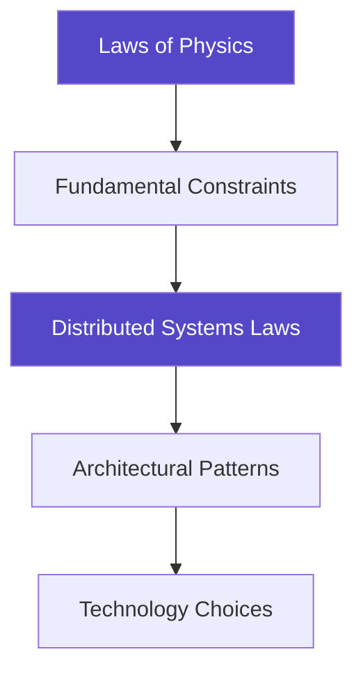

# Getting Started with Distributed Systems

!!! info
 <h2>Welcome to Your Journey</h2>
 
A revolutionary approach to learning distributed systems that starts with the laws of physics rather than specific technologies.

!!! quote "Why This Compendium is Different"
 - **Physics-First**: We derive patterns from fundamental constraints like the speed of light
 - **Technology-Agnostic**: Principles that apply to any distributed system
 - **Battle-Tested**: Real production failures illustrate every concept
 - **Multiple Paths**: Tailored learning for different roles and experience levels

## Our Approach vs Traditional Learning

 

 <h3 class="card__title">Traditional Approach</h3>
 

 Start with tools (Kafka, Redis, Kubernetes). Problem: Technologies become obsolete in 3-5 years.
 

 

 
 

 <h3 class="card__title">Our Physics-First Philosophy</h3>
 

 Start with immutable laws of physics and derive solutions. Benefit: Understanding that transcends technology.
 

 

## Prerequisites

!!! tip "Essential Prerequisites"
| Skill | What You Need | Example |
 |-------|---------------|---------|
 | **Programming** | Basic coding in any language | Functions, loops, data structures |
 | **Networking** | HTTP fundamentals | Client-server, requests, responses |
 | **Databases** | Basic SQL knowledge | SELECT, INSERT, transactions |

!!! note "Helpful but Optional"
| Topic | Why It Helps | When You'll Use It |
 |-------|--------------|-------------------|
 | **OS Concepts** | Understanding processes, threads | Concurrency patterns |
 | **Algorithms** | Complexity analysis | Performance optimization |
 | **Probability** | Failure modeling | Availability calculations |
 | **Linear Algebra** | Vector clocks, consensus | Advanced topics |

## Choose Your Learning Path

!!! tip "Quick Path Selector"
| Your Profile | Recommended Path | Duration | Focus |
 |-------------|------------------|----------|-------|
 | **New Graduate** | Foundation Builder | 6-8 weeks | Laws → Patterns → Tools |
 | **Mid-Level Engineer** | Problem Solver | 4-6 weeks | Patterns → Laws → Cases |
 | **Senior Engineer** | System Designer | 2-4 weeks | Advanced Patterns → Trade-offs |
 | **Technical Leader** | Strategic Overview | 2-3 weeks | Economics → Teams → Culture |

## Learning Path Details

### Path 1: Foundation Builder (New Graduates)
**Duration**: 6-8 weeks | **Time**: 5-10 hours/week

| Week | Focus | Key Activities |
|------|-------|----------------|
| **1-2** | Core Laws | Read Laws 1-4, work examples |
| **3-4** | First Patterns | Circuit Breaker, Retry Logic, Load Balancing |
| **5-6** | Quantitative Tools | Little's Law, Availability Math, calculators |
| **7-8** | Real Systems | Case studies, synthesis exercises |

### Path 2: Practical Problem Solver (Mid-Level Engineers)
**Duration**: 4-6 weeks | **Time**: 5-10 hours/week

| Week | Focus | Key Activities |
|------|-------|----------------|
| **1** | Laws Speed Run | All 7 laws, trade-offs, system mapping |
| **2-3** | Pattern Deep Dives | Your patterns, implementation, failure analysis |
| **4-5** | Quantitative Analysis | Capacity planning, performance models |
| **6** | Case Studies | Compare systems, extract principles |

### Path 3: System Designer (Senior Engineers)
**Duration**: 2-4 weeks | **Time**: 10-15 hours/week

| Week | Focus | Key Activities |
|------|-------|----------------|
| **1** | Advanced Framework | Law interactions, edge cases, assumptions |
| **2** | Complex Patterns | Consensus, distributed transactions, multi-region |
| **3-4** | Design Practice | System design, trade-off analysis |

### Path 4: Technical Leader (Managers/Architects)
**Duration**: 2-3 weeks | **Time**: 5 hours/week

| Week | Focus | Key Activities |
|------|-------|----------------|
| **1** | Strategic Overview | Executive summaries, economics, human factors |
| **2** | Decision Frameworks | Pattern selection, trade-off analysis, cost models |
| **3** | Organization | Team topologies, SRE practices, culture |

## What You'll Find in This Compendium

 

 <h3 class="card__title">The 7 Fundamental Laws</h3>
 

 Correlated Failure, Asynchronous Reality, Emergent Chaos, Multidimensional Optimization, Distributed Knowledge, Cognitive Load, Economic Reality
 

 

 
 

 <h3 class="card__title">50+ Battle-Tested Patterns</h3>
 

 Reliability, scalability, consistency, and performance patterns organized by problem domain.
 

 

 
 

 <h3 class="card__title">Quantitative Toolkit</h3>
 

 Queue theory, availability calculations, capacity planning models, cost optimization frameworks.
 

 

 
 

 <h3 class="card__title">Real-World Case Studies</h3>
 

 Netflix, Amazon DynamoDB, Google Spanner, Uber geospatial services, and more.
 

 

## Study Tips

!!! tip "Active Learning Strategies"
| Strategy | What to Do | Why It Works |
 |----------|------------|--------------|
 | **Predict** | Before reading, guess what patterns emerge | Activates prior knowledge |
 | **Connect** | Map concepts to your experience | Creates lasting memories |
 | **Teach** | Explain concepts to others | Tests understanding |
 | **Build** | Implement patterns yourself | Develops practical skills |

!!! note "Build Your Portfolio"
 - **Document insights** as you learn
 - **Implement patterns** in code
 - **Break things intentionally** to see failures
 - **Share knowledge** with your team

## Quick Navigation

!!! tip "Start Based on Your Immediate Need"
| If You Need | Go To | Why |
 |-------------|-------|-----|
 | **Solve Problem Now** | [Pattern Catalog](../patterns/) | Find proven solutions |
 | **Deep Understanding** | [Law 1 - Failure](../part1-axioms/law1-failure/) | Build from fundamentals |
 | **Design System** | [Pattern Selector](../patterns/pattern-selector/) | Make informed choices |
 | **Capacity Planning** | [Calculators](../quantitative/) | Quantify decisions |
 | **Learn from Failures** | [Case Studies](../case-studies/) | Avoid known pitfalls |

### Reading Order Options

| Goal | Recommended Order |
|------|------------------|
| **Maximum Understanding** | Laws 1-7 → Synthesis → Patterns → Case Studies |
| **Practical Application** | Relevant Pattern → Underlying Laws → Case Studies |
| **Quick Reference** | Pattern Selector → Cheat Sheets → Glossary |

## Common Learning Pitfalls

!!! danger "Avoid These Mistakes"
| Don't Do This | Do This Instead |
 |---------------|-----------------|
 | Skip fundamentals | Review laws deeply, find new insights |
 | Just memorize patterns | Understand why, derive from principles |
 | Ignore failure stories | Study failures, learn from others |
 | Work in isolation | Collaborate, share, and discuss |

## Ready to Start?

!!! tip "Your Quick Start Checklist"
 1. **Check Prerequisites**: Do you have basic programming, networking, and database knowledge?
 2. **Choose Your Path**: Pick the learning path that matches your experience level
 3. **Set Schedule**: Block 5-15 hours per week for focused study
 4. **Begin**: Start with [Law 1: Correlated Failure](../part1-axioms/law1-failure/)

---

<a href="index.md" class="nav-button prev">← Introduction</a>
 <a href="philosophy.md" class="nav-button next">The Philosophy →</a>