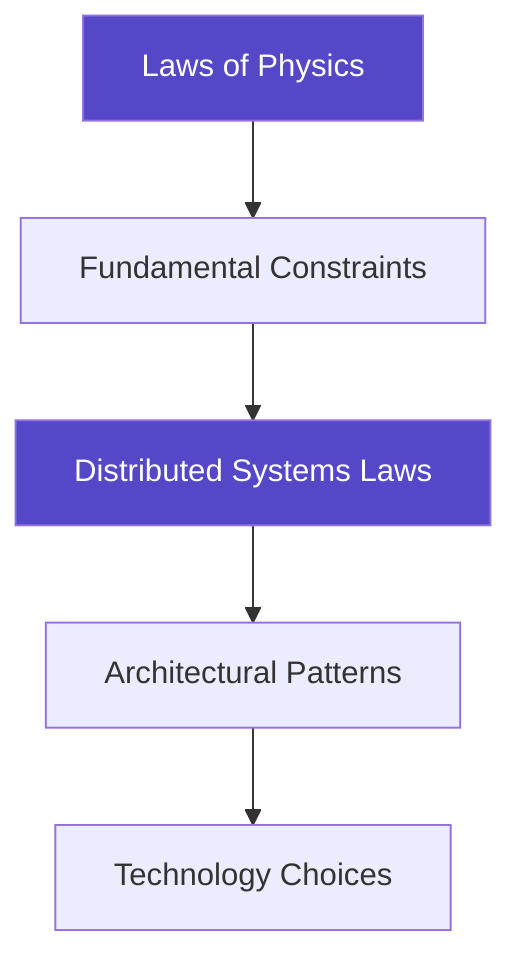

# Getting Started with Distributed Systems

!!! info
 <h2>Welcome to Your Journey</h2>
 <p>A revolutionary approach to learning distributed systems that starts with the laws of physics rather than specific technologies.</p>

!!! quote "Why This Compendium is Different"
 - **Physics-First**: We derive patterns from fundamental constraints like the speed of light
 - **Technology-Agnostic**: Principles that apply to any distributed system
 - **Battle-Tested**: Real production failures illustrate every concept
 - **Multiple Paths**: Tailored learning for different roles and experience levels

## Our Approach vs Traditional Learning

<div class="grid cards" markdown>

- :material-tools:{ .lg .middle } **Traditional Approach**
    
    ---
    
    Start with tools (Kafka, Redis, Kubernetes). Problem: Technologies become obsolete in 3-5 years.

- :material-atom:{ .lg .middle } **Our Physics-First Philosophy**
    
    ---
    
    Start with immutable laws of physics and derive solutions. Benefit: Understanding that transcends technology.

</div>



## Prerequisites

!!! tip "Essential Prerequisites"
| Skill | What You Need | Example |
 |-------|---------------|---------|
 | **Programming** | Basic coding in any language | Functions, loops, data structures |
 | **Networking** | HTTP fundamentals | Client-server, requests, responses |
 | **Databases** | Basic SQL knowledge | SELECT, INSERT, transactions |


!!! info "Helpful but Optional"
| Topic | Why It Helps | When You'll Use It |
 |-------|--------------|-------------------|
 | **OS Concepts** | Understanding processes, threads | Concurrency patterns |
 | **Algorithms** | Complexity analysis | Performance optimization |
 | **Probability** | Failure modeling | Availability calculations |
 | **Linear Algebra** | Vector clocks, consensus | Advanced topics |


## Choose Your Learning Path

!!! tip "Quick Path Selector"
| Your Profile | Recommended Path | Duration | Focus |
 |-------------|------------------|----------|-------|
 | **New Graduate** | Foundation Builder | 6-8 weeks | Laws → Patterns → Tools |
 | **Mid-Level Engineer** | Problem Solver | 4-6 weeks | Patterns → Laws → Cases |
 | **Senior Engineer** | System Designer | 2-4 weeks | Advanced Patterns → Trade-offs |
 | **Technical Leader** | Strategic Overview | 2-3 weeks | Economics → Teams → Culture |


## Learning Path Details

=== "Foundation Builder"

 **For: New Graduates**  
 **Duration**: 6-8 weeks | **Time**: 5-10 hours/week

 ```mermaid
 graph LR
 A[Weeks 1-2<br/>Core Laws] --> B[Weeks 3-4<br/>First Patterns]
 B --> C[Weeks 5-6<br/>Quant Tools]
 C --> D[Weeks 7-8<br/>Real Systems]
 
 style A fill:#e3f2fd
 style B fill:#e8f5e9
 style C fill:#fff3e0
 style D fill:#f3e5f5
 ```

 | Week | Focus | Key Activities | Deliverables |
 |------|-------|----------------|-------------|
 | **1-2** | Core Laws | Read Laws 1-4, work examples | Notes on each law |
 | **3-4** | First Patterns | Circuit Breaker, Retry Logic, Load Balancing | Implement 1 pattern |
 | **5-6** | Quantitative Tools | Little's Law, Availability Math, calculators | Capacity plan for toy system |
 | **7-8** | Real Systems | Case studies, synthesis exercises | System design document |

 **Success Criteria:**
 - Can explain all 7 laws in your own words
 - Have implemented at least 3 patterns
 - Can analyze a system using the framework

=== "Problem Solver"

 **For: Mid-Level Engineers**  
 **Duration**: 4-6 weeks | **Time**: 5-10 hours/week

 ```mermaid
 graph LR
 A[Week 1<br/>Laws Speed Run] --> B[Weeks 2-3<br/>Pattern Deep Dives]
 B --> C[Weeks 4-5<br/>Quant Analysis]
 C --> D[Week 6<br/>Case Studies]
 
 style A fill:#e3f2fd
 style B fill:#e8f5e9
 style C fill:#fff3e0
 style D fill:#f3e5f5
 ```

 | Week | Focus | Key Activities | Deliverables |
 |------|-------|----------------|-------------|
 | **1** | Laws Speed Run | All 7 laws, trade-offs, system mapping | Law interaction diagram |
 | **2-3** | Pattern Deep Dives | Your patterns, implementation, failure analysis | Pattern comparison matrix |
 | **4-5** | Quantitative Analysis | Capacity planning, performance models | Performance model for your system |
 | **6** | Case Studies | Compare systems, extract principles | Architectural decision records |

 **Success Criteria:**
 - Can identify law violations in production systems
 - Have refactored code to follow patterns
 - Created capacity model for real system

=== "System Designer"

 **For: Senior Engineers**  
 **Duration**: 2-4 weeks | **Time**: 10-15 hours/week

 ```mermaid
 graph LR
 A[Week 1<br/>Advanced Framework] --> B[Week 2<br/>Complex Patterns]
 B --> C[Weeks 3-4<br/>Design Practice]
 
 style A fill:#e3f2fd
 style B fill:#e8f5e9
 style C fill:#f3e5f5
 ```

 | Week | Focus | Key Activities | Deliverables |
 |------|-------|----------------|-------------|
 | **1** | Advanced Framework | Law interactions, edge cases, assumptions | Framework extensions document |
 | **2** | Complex Patterns | Consensus, distributed transactions, multi-region | Pattern selection framework |
 | **3-4** | Design Practice | System design, trade-off analysis | Complete system design with trade-offs |

 **Success Criteria:**
 - Can teach the framework to others
 - Have designed multi-region system
 - Created reusable design patterns

=== "Technical Leader"

 **For: Managers/Architects**  
 **Duration**: 2-3 weeks | **Time**: 5 hours/week

 ```mermaid
 graph LR
 A[Week 1<br/>Strategic Overview] --> B[Week 2<br/>Decision Frameworks]
 B --> C[Week 3<br/>Organization]
 
 style A fill:#e3f2fd
 style B fill:#e8f5e9
 style C fill:#f3e5f5
 ```

 | Week | Focus | Key Activities | Deliverables |
 |------|-------|----------------|-------------|
 | **1** | Strategic Overview | Executive summaries, economics, human factors | Cost model for distributed system |
 | **2** | Decision Frameworks | Pattern selection, trade-off analysis, cost models | Decision matrix template |
 | **3** | Organization | Team topologies, SRE practices, culture | Team structure proposal |

 **Success Criteria:**
 - Can justify architectural decisions economically
 - Have created decision frameworks for team
 - Implemented SRE practices


## What You'll Find in This Compendium

<div class="grid cards" markdown>

- :material-scale-balance:{ .lg .middle } **The 7 Fundamental Laws**
    
    ---
    
    Correlated Failure, Asynchronous Reality, Emergent Chaos, Multidimensional Optimization, Distributed Knowledge, Cognitive Load, Economic Reality

- :material-puzzle:{ .lg .middle } **50+ Battle-Tested Patterns**
    
    ---
    
    Reliability, scalability, consistency, and performance patterns organized by problem domain.

- :material-calculator-variant:{ .lg .middle } **Quantitative Toolkit**
    
    ---
    
    Queue theory, availability calculations, capacity planning models, cost optimization frameworks.

- :material-city:{ .lg .middle } **Real-World Case Studies**
    
    ---
    
    Netflix, Amazon DynamoDB, Google Spanner, Uber geospatial services, and more.

</div>

## Study Tips

!!! tip "Active Learning Strategies"
| Strategy | What to Do | Why It Works |
 |----------|------------|--------------|
 | **Predict** | Before reading, guess what patterns emerge | Activates prior knowledge |
 | **Connect** | Map concepts to your experience | Creates lasting memories |
 | **Teach** | Explain concepts to others | Tests understanding |
 | **Build** | Implement patterns yourself | Develops practical skills |


!!! tip "Build Your Portfolio"
 - **Document insights** as you learn
 - **Implement patterns** in code
 - **Break things intentionally** to see failures
 - **Share knowledge** with your team

## Quick Navigation

!!! tip "Start Based on Your Immediate Need"
| If You Need | Go To | Why |
 |-------------|-------|-----|
 | **Solve Problem Now** | [Pattern Catalog](patterns) | Find proven solutions |
 | **Deep Understanding** | [Law 1 - Failure](part1-axioms/law1-failure/index) | Build from fundamentals |
 | **Design System** | [Pattern Selector](patterns/pattern-selector) | Make informed choices |
 | **Capacity Planning** | [Calculators](quantitative) | Quantify decisions |
 | **Learn from Failures** | [Case Studies](case-studies) | Avoid known pitfalls |


### Reading Order Options

=== "Maximum Understanding"

 ```mermaid
 graph TB
 A[Start: Laws 1-7] --> B[Synthesis Chapter]
 B --> C[Core Patterns]
 C --> D[Advanced Patterns]
 D --> E[Case Studies]
 E --> F[Build Your Own]
 
 style A fill:#5448C8,color:#fff
 style F fill:#00BCD4,color:#fff
 ```

 **Best For:** Those who want deep, lasting understanding
 
 **Time Investment:** 6-8 weeks
 
 **Learning Approach:**
 1. Read each law with examples
 2. Work through synthesis exercises
 3. Map patterns to laws
 4. Analyze case studies through law lens
 5. Design your own system

=== "Practical Application"

 ```mermaid
 graph TB
 A[Start: Your Problem] --> B[Find Relevant Pattern]
 B --> C[Understand Underlying Laws]
 C --> D[Study Similar Cases]
 D --> E[Implement Solution]
 E --> F[Iterate & Improve]
 
 style A fill:#5448C8,color:#fff
 style F fill:#00BCD4,color:#fff
 ```

 **Best For:** Engineers with immediate problems to solve
 
 **Time Investment:** 1-2 weeks per problem
 
 **Learning Approach:**
 1. Identify your specific challenge
 2. Find matching patterns
 3. Understand why pattern works (laws)
 4. Learn from others' implementations
 5. Apply and adapt to your context

=== "Quick Reference"

 ```mermaid
 graph TB
 A[Pattern Selector] --> B{Your Scenario}
 B -->|Reliability| C[Circuit Breaker<br/>Retry Patterns]
 B -->|Scale| D[Sharding<br/>Load Balancing]
 B -->|Consistency| E[Consensus<br/>CRDT]
 B -->|Performance| F[Caching<br/>Batching]
 
 style A fill:#5448C8,color:#fff
 ```

 **Best For:** Experienced engineers needing quick answers
 
 **Time Investment:** 15-30 minutes
 
 **Quick Links:**
 - [Pattern Selector Tool](patterns/pattern-selector)
 - [Cheat Sheets](reference/cheat-sheets)
 - [Glossary](reference/glossary)
 - [Recipe Cards](reference/recipe-cards)


## Common Learning Pitfalls

!!! danger "Avoid These Mistakes"
| Don't Do This | Do This Instead |
 |---------------|-----------------|
 | Skip fundamentals | Review laws deeply, find new insights |
 | Just memorize patterns | Understand why, derive from principles |
 | Ignore failure stories | Study failures, learn from others |
 | Work in isolation | Collaborate, share, and discuss |


## Ready to Start?

!!! tip "Your Quick Start Checklist"
 1. **Check Prerequisites**: Do you have basic programming, networking, and database knowledge?
 2. **Choose Your Path**: Pick the learning path that matches your experience level
 3. **Set Schedule**: Block 5-15 hours per week for focused study
 4. **Begin**: Start with [Law 1: Correlated Failure](part1-axioms/law1-failure/index)

---

<a href="/introduction/" class="nav-button prev">← Introduction</a>
 <a href="/introduction/philosophy/" class="nav-button next">The Philosophy →</a>