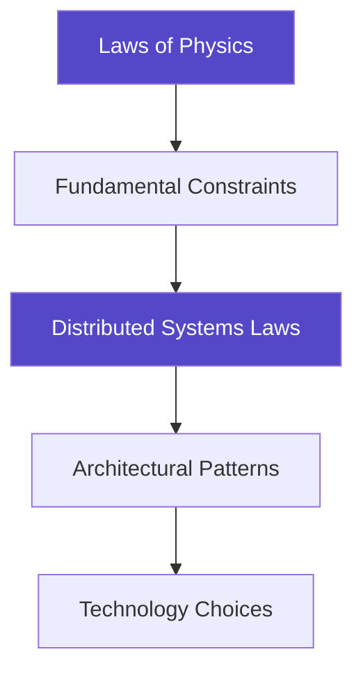

<!-- Navigation -->
[Home](../index.md) → [Introduction](index.md) → **Getting Started**

# Getting Started with Distributed Systems

## Welcome to Your Journey

Welcome to **The Compendium of Distributed Systems** - a revolutionary approach to learning distributed systems that starts with the laws of physics rather than specific technologies. Whether you're a new graduate, an experienced engineer, or a technical leader, this guide will help you navigate your learning journey.

!!! tip "Why This Compendium is Different"
    - **Physics-First**: We derive patterns from fundamental constraints like the speed of light
    - **Technology-Agnostic**: Principles that apply to any distributed system
    - **Battle-Tested**: Real production failures illustrate every concept
    - **Multiple Paths**: Tailored learning for different roles and experience levels

## Understanding Our Unique Approach

### The Problem with Traditional Learning

Most distributed systems education starts with tools and technologies:
- "Here's how to use Kafka"
- "This is how Redis works"
- "Deploy this on Kubernetes"

**The problem?** Technologies change. What you learn today may be obsolete in 5 years.

### Our Physics-First Philosophy

We start with immutable laws of physics and derive everything else:

**The benefit?** Understanding that transcends any specific technology.

## Prerequisites and Background

### Essential Prerequisites

Before diving deep, ensure you have:

1. **Basic Programming Experience**
   - Any language is fine
   - Understanding of functions, data structures, loops

2. **Elementary Networking Concepts**
   - What is a network request?
   - Basic client-server model
   - HTTP fundamentals

3. **Basic Database Knowledge**
   - What is a database?
   - Simple queries (SELECT, INSERT)
   - Concept of transactions

### Helpful but Not Required

- Operating systems concepts
- Algorithms and data structures
- Probability and statistics
- Linear algebra (for advanced topics)

!!! note "Don't Have All Prerequisites?"
    Don't worry! Each section clearly marks its prerequisites. You can learn missing concepts as you go.

## Choosing Your Learning Path

### 🎯 Quick Assessment

Answer these questions to find your ideal path:

1. **What's your experience level?**
   - [ ] New graduate / Junior engineer (0-2 years)
   - [ ] Mid-level engineer (2-5 years)
   - [ ] Senior engineer / Tech lead (5+ years)
   - [ ] Engineering manager / Architect

2. **What's your primary goal?**
   - [ ] Build strong theoretical foundations
   - [ ] Solve immediate practical problems
   - [ ] Design large-scale systems
   - [ ] Lead technical teams

3. **How much time can you dedicate?**
   - [ ] 1-2 hours per week (Extended path: 3-6 months)
   - [ ] 5-10 hours per week (Standard path: 6-8 weeks)
   - [ ] 15+ hours per week (Intensive path: 2-4 weeks)

### 📚 Recommended Learning Paths

Based on your answers above, here are our recommended paths:

#### Path 1: Foundation Builder (New Graduates)
**Duration**: 6-8 weeks | **Time**: 5-10 hours/week

**Week 1-2: Core Laws**
- Start with [Law 1: Failure](../part1-axioms/axiom1-failure/index.md)
- Progress through Laws 2-4
- Focus on examples before exercises

**Week 3-4: First Patterns**
- [Circuit Breaker](../patterns/circuit-breaker.md)
- [Retry with Backoff](../patterns/retry-backoff.md)
- [Load Balancing](../patterns/load-balancing.md)

**Week 5-6: Quantitative Tools**
- [Little's Law](../quantitative/littles-law.md)
- [Availability Math](../quantitative/availability-math.md)
- [Latency Calculations](../quantitative/latency-ladder.md)

**Week 7-8: Real Systems**
- Study 2-3 [case studies](../case-studies/index.md)
- Complete the [synthesis exercises](../part1-axioms/synthesis.md)

#### Path 2: Practical Problem Solver (Mid-Level Engineers)
**Duration**: 4-6 weeks | **Time**: 5-10 hours/week

**Week 1: Laws Speed Run**
- Skim all [7 Laws](../part1-axioms/index.md)
- Focus on trade-offs and implications
- Map to your current systems

**Week 2-3: Pattern Deep Dives**
- Study patterns relevant to your work
- Implement at least one pattern
- Analyze failure modes

**Week 4-5: Quantitative Analysis**
- [Capacity Planning](../quantitative/capacity-planning.md)
- [Performance Modeling](../quantitative/performance-modeling.md)
- Apply to your systems

**Week 6: Case Studies**
- Compare similar systems (e.g., Kafka vs Pulsar)
- Extract design principles
- Document learnings

#### Path 3: System Designer (Senior Engineers)
**Duration**: 2-4 weeks | **Time**: 10-15 hours/week

**Week 1: Advanced Framework**
- Review all [Laws with critical lens](../part1-axioms/index.md)
- Focus on law interactions
- Challenge assumptions

**Week 2: Complex Patterns**
- [Consensus Algorithms](../patterns/consensus.md)
- [Distributed Transactions](../patterns/distributed-transactions.md)
- [Multi-Region Architecture](../patterns/multi-region.md)

**Week 3-4: Design Practice**
- Apply patterns to complex system design
- Analyze trade-offs systematically
- Practice architectural decision making

#### Path 4: Technical Leader (Managers/Architects)
**Duration**: 2-3 weeks | **Time**: 5 hours/week

**Week 1: Strategic Overview**
- All Laws (executive summaries)
- [Economic Reality](../part1-axioms/axiom7-economics/index.md)
- [Human Factors](../part1-axioms/axiom6-human-api/index.md)

**Week 2: Decision Frameworks**
- [Pattern Selection Guide](../patterns/pattern-selector.md)
- [Trade-off Analysis](../part2-pillars/tradeoff-calculus.md)
- Cost models

**Week 3: Organization**
- [Team Topologies](../human-factors/team-topologies.md)
- [SRE Practices](../human-factors/sre-practices.md)
- Cultural considerations

## Key Sections Overview

### 🏛️ Part 1: The 7 Fundamental Laws

Our advanced framework presents 7 laws that govern all distributed systems:

1. **[Correlated Failure](../part1-axioms/axiom1-failure/index.md)** - Failures cascade and correlate
2. **[Asynchronous Reality](../part1-axioms/axiom2-asynchrony/index.md)** - No shared time, only happens-before
3. **[Emergent Chaos](../part1-axioms/axiom3-emergence/index.md)** - Complexity breeds unpredictability
4. **[Multidimensional Optimization](../part1-axioms/axiom4-tradeoffs/index.md)** - Every choice has ripple effects
5. **[Distributed Knowledge](../part1-axioms/axiom5-epistemology/index.md)** - Truth is local and uncertain
6. **[Cognitive Load](../part1-axioms/axiom6-human-api/index.md)** - Human understanding has limits
7. **[Economic Reality](../part1-axioms/axiom7-economics/index.md)** - Resources shape all decisions

### 🔧 Patterns & Solutions

Over 50 battle-tested patterns organized by problem domain:

- **Reliability**: Circuit breakers, retries, failover
- **Scalability**: Sharding, caching, load balancing  
- **Consistency**: Consensus, CRDTs, event sourcing
- **Performance**: Async processing, batching, compression

### 📊 Quantitative Toolkit

Mathematical tools for informed decisions:

- Queue theory and Little's Law
- Availability calculations (99.9% vs 99.99%)
- Capacity planning models
- Cost optimization frameworks

### 📚 Case Studies

Learn from real systems and their failures:

- Netflix's chaos engineering
- Amazon's DynamoDB design
- Google's Spanner architecture
- Uber's geospatial services

## Getting the Most from This Resource

### Active Learning Strategies

1. **Predict Before Reading**
   - Given a law, what patterns might emerge?
   - How would violating it cause failures?

2. **Map to Experience**
   - Where have you seen these laws in action?
   - What systems violate these principles?

3. **Explain to Others**
   - Can you teach this concept simply?
   - Where are the gaps in your understanding?

### Practical Exercises

Each section includes:

- **Thought Experiments**: "What would happen if..."
- **Design Challenges**: "Build a system that..."
- **Failure Analysis**: "Why did this break?"
- **Trade-off Decisions**: "Choose between..."

### Building Your Portfolio

As you progress:

1. **Document Your Journey**
   - Keep notes on key insights
   - Track which laws apply to your work
   - Record your design decisions

2. **Implement Examples**
   - Code the patterns you learn
   - Build toy versions of systems
   - Break things intentionally

3. **Share Knowledge**
   - Write about your learnings
   - Present to your team
   - Contribute improvements

## Quick Navigation Guide

### 🚀 Start Here Based on Your Needs

**"I need to solve a specific problem NOW"**
→ Jump to [Pattern Catalog](../patterns/index.md)

**"I want deep understanding"**
→ Start with [Law 1: Failure](../part1-axioms/axiom1-failure/index.md)

**"I'm designing a new system"**
→ Review [Design Patterns](../patterns/pattern-selector.md)

**"I need to do capacity planning"**
→ Use [Quantitative Tools](../quantitative/index.md)

**"I want to learn from others' mistakes"**
→ Study [Case Studies](../case-studies/index.md)

### 📖 Reading Order Suggestions

#### For Maximum Understanding
1. Laws 1-7 in order
2. Synthesis exercises
3. Selected patterns
4. Relevant case studies

#### For Practical Application
1. Your problem's relevant pattern
2. The laws it derives from
3. Similar case studies
4. Quantitative analysis

#### For Quick Reference
1. [Pattern selector tool](../patterns/pattern-selector.md)
2. [Cheat sheets](../reference/cheat-sheets.md)
3. [Recipe cards](../reference/recipe-cards.md)
4. [Glossary](../reference/glossary.md)

## Common Pitfalls to Avoid

### ❌ Don't Skip the Fundamentals

Even experienced engineers benefit from reviewing the laws. They provide vocabulary and frameworks for discussing complex trade-offs.

### ❌ Don't Just Memorize

Understanding why patterns exist is more valuable than memorizing their implementation.

### ❌ Don't Ignore Failures

The failure stories contain the most valuable lessons. Study them carefully.

### ❌ Don't Work in Isolation

Distributed systems are team efforts. Share your learning, discuss trade-offs, and learn from others.

## Next Steps

Ready to begin your journey? Here are your immediate next steps:

1. **Choose Your Path**: Select one of the learning paths above
2. **Set a Schedule**: Block time for focused learning
3. **Start with Law 1**: [Begin with failure](../part1-axioms/axiom1-failure/index.md)
4. **Join the Community**: Engage with other learners

!!! success "You're Ready!"
    You now have everything you need to master distributed systems from first principles. Remember: this isn't about memorizing solutions—it's about understanding the fundamental constraints that shape all distributed systems.
    
    **Your journey starts here. Let's begin! →** [Law 1: Correlated Failure](../part1-axioms/axiom1-failure/index.md)

---

  <a href="index.md" class="nav-button prev">← Introduction</a>
  <a href="philosophy.md" class="nav-button next">The Philosophy →</a>

!!! quote "Inspiration for Your Journey"
    "In distributed systems, the only certainty is uncertainty. Master the fundamentals, and you can navigate any chaos."
    
    — The Authors