<!-- Navigation -->
[Home](../index.md) → [Introduction](index.md) → **Getting Started**

# Getting Started with Distributed Systems

## Welcome to Your Journey

Welcome to **The Compendium of Distributed Systems** - a revolutionary approach to learning distributed systems that starts with the laws of physics rather than specific technologies. Whether you're a new graduate, an experienced engineer, or a technical leader, this guide will help you navigate your learning journey.

!!! tip "Why This Compendium is Different"
    - **Physics-First**: We derive patterns from fundamental constraints like the speed of light
    - **Technology-Agnostic**: Principles that apply to any distributed system
    - **Battle-Tested**: Real production failures illustrate every concept
    - **Multiple Paths**: Tailored learning for different roles and experience levels

## Understanding Our Unique Approach

### The Problem with Traditional Learning

Most distributed systems education starts with tools and technologies:
- "Here's how to use Kafka"
- "This is how Redis works"
- "Deploy this on Kubernetes"

**The problem?** Technologies change. What you learn today may be obsolete in 5 years.

### Our Physics-First Philosophy

We start with immutable laws of physics and derive everything else:

**The benefit?** Understanding that transcends any specific technology.

## Prerequisites and Background

### ✅ Essential Prerequisites

```mermaid
graph LR
    subgraph "Must Have"
        P1["💻 Programming<br/>Any language"] 
        P2["🌐 Networking<br/>HTTP basics"]
        P3["🗜️ Database<br/>Basic SQL"]
    end
    
    subgraph "Your Skills"
        P1 --> S1["Functions<br/>Data structures<br/>Loops"]
        P2 --> S2["Client-server<br/>Requests<br/>Responses"]
        P3 --> S3["SELECT/INSERT<br/>Transactions<br/>ACID basics"]
    end
    
    S1 --> Ready["Ready to Start! 🚀"]
    S2 --> Ready
    S3 --> Ready
    
    style P1 fill:#10b981,color:#fff
    style P2 fill:#3b82f6,color:#fff
    style P3 fill:#8b5cf6,color:#fff
    style Ready fill:#5448C8,color:#fff
```

### 📚 Helpful but Not Required

| Topic | Why It Helps | When You'll Use It |
|-------|--------------|-------------------|
| **OS Concepts** | Understanding processes, threads | Concurrency patterns |
| **Algorithms** | Complexity analysis | Performance optimization |
| **Probability** | Failure modeling | Availability calculations |
| **Linear Algebra** | Vector clocks, consensus | Advanced topics |

!!! note "Don't Have All Prerequisites?"
    Don't worry! Each section clearly marks its prerequisites. You can learn missing concepts as you go.

## Choosing Your Learning Path

### 🎯 Quick Assessment

#### Quick Path Selector

| Your Profile | Recommended Path | Duration | Focus |
|-------------|------------------|----------|-------|
| 🎓 **New Graduate** | Foundation Builder | 6-8 weeks | Laws → Patterns → Tools |
| 💼 **Mid-Level Engineer** | Problem Solver | 4-6 weeks | Patterns → Laws → Cases |
| 🏗️ **Senior Engineer** | System Designer | 2-4 weeks | Advanced Patterns → Trade-offs |
| 👥 **Technical Leader** | Strategic Overview | 2-3 weeks | Economics → Teams → Culture |

### 📚 Recommended Learning Paths

#### Path 1: Foundation Builder (New Graduates)
**Duration**: 6-8 weeks | **Time**: 5-10 hours/week

```mermaid
graph LR
    W1["📚 Week 1-2<br/>Core Laws"] --> W3["🔧 Week 3-4<br/>First Patterns"]
    W3 --> W5["📊 Week 5-6<br/>Quantitative Tools"]
    W5 --> W7["🏗️ Week 7-8<br/>Real Systems"]
    
    W1 -.-> L1["Law 1: Failure<br/>Law 2: Async<br/>Law 3: Emergence"]
    W3 -.-> P1["Circuit Breaker<br/>Retry Logic<br/>Load Balancing"]
    W5 -.-> T1["Little's Law<br/>Availability Math<br/>Latency Calc"]
    W7 -.-> C1["Case Studies<br/>Synthesis<br/>Portfolio"]
    
    style W1 fill:#e1f5e1
    style W3 fill:#fff3cd
    style W5 fill:#cfe2ff
    style W7 fill:#f8d7da
```

| Week | Focus | Key Activities | Deliverables |
|------|-------|----------------|-------------|
| **1-2** | Core Laws | • Read [Law 1: Failure](../part1-axioms/axiom1-failure/index.md) • Study Laws 2-4 • Work examples | Understanding checklist |
| **3-4** | First Patterns | • [Circuit Breaker](../patterns/circuit-breaker.md) • [Retry Logic](../patterns/retry-backoff.md) • [Load Balancing](../patterns/load-balancing.md) | Implement 1 pattern |
| **5-6** | Quantitative Tools | • [Little's Law](../quantitative/littles-law.md) • [Availability Math](../quantitative/availability-math.md) • Use calculators | Capacity plan |
| **7-8** | Real Systems | • Study [case studies](../case-studies/index.md) • [Synthesis exercises](../part1-axioms/synthesis.md) | Final project |

#### Path 2: Practical Problem Solver (Mid-Level Engineers)
**Duration**: 4-6 weeks | **Time**: 5-10 hours/week

#### Path 3: System Designer (Senior Engineers)
**Duration**: 2-4 weeks | **Time**: 10-15 hours/week

#### Path 4: Technical Leader (Managers/Architects)
**Duration**: 2-3 weeks | **Time**: 5 hours/week

## Key Sections Overview

### 🏛️ Part 1: The 7 Fundamental Laws

Our advanced framework presents 7 laws that govern all distributed systems:

1. **[Correlated Failure](../part1-axioms/axiom1-failure/index.md)** - Failures cascade and correlate
2. **[Asynchronous Reality](../part1-axioms/axiom2-asynchrony/index.md)** - No shared time, only happens-before
3. **[Emergent Chaos](../part1-axioms/axiom3-emergence/index.md)** - Complexity breeds unpredictability
4. **[Multidimensional Optimization](../part1-axioms/axiom4-tradeoffs/index.md)** - Every choice has ripple effects
5. **[Distributed Knowledge](../part1-axioms/axiom5-epistemology/index.md)** - Truth is local and uncertain
6. **[Cognitive Load](../part1-axioms/axiom6-human-api/index.md)** - Human understanding has limits
7. **[Economic Reality](../part1-axioms/axiom7-economics/index.md)** - Resources shape all decisions

### 🔧 Patterns & Solutions

Over 50 battle-tested patterns organized by problem domain:

- **Reliability**: Circuit breakers, retries, failover
- **Scalability**: Sharding, caching, load balancing  
- **Consistency**: Consensus, CRDTs, event sourcing
- **Performance**: Async processing, batching, compression

### 📊 Quantitative Toolkit

Mathematical tools for informed decisions:

- Queue theory and Little's Law
- Availability calculations (99.9% vs 99.99%)
- Capacity planning models
- Cost optimization frameworks

### 📚 Case Studies

Learn from real systems and their failures:

- Netflix's chaos engineering
- Amazon's DynamoDB design
- Google's Spanner architecture
- Uber's geospatial services

## Getting the Most from This Resource

### Active Learning Strategies

<h4>🔮 Predict Before Reading</h4>
<ul>
<li>Given a law, what patterns might emerge?</li>
<li>How would violating it cause failures?</li>
<li>What are the natural consequences?</li>
</ul>

<h4>🗺️ Map to Experience</h4>
<ul>
<li>Where have you seen these laws in action?</li>
<li>What systems violate these principles?</li>
<li>Which failures could have been prevented?</li>
</ul>

<h4>👥 Explain to Others</h4>
<ul>
<li>Can you teach this concept simply?</li>
<li>Where are the gaps in your understanding?</li>
<li>What questions would a beginner ask?</li>
</ul>

<h4>🛠️ Build & Break</h4>
<ul>
<li>Implement the pattern yourself</li>
<li>Intentionally violate the law</li>
<li>Observe and document failures</li>
</ul>

### Practical Exercises

Each section includes:

- **Thought Experiments**: "What would happen if..."
- **Design Challenges**: "Build a system that..."
- **Failure Analysis**: "Why did this break?"
- **Trade-off Decisions**: "Choose between..."

### Building Your Portfolio

As you progress:

1. **Document Your Journey**
   - Keep notes on key insights
   - Track which laws apply to your work
   - Record your design decisions

2. **Implement Examples**
   - Code the patterns you learn
   - Build toy versions of systems
   - Break things intentionally

3. **Share Knowledge**
   - Write about your learnings
   - Present to your team
   - Contribute improvements

## Quick Navigation Guide

### 🚀 Start Here Based on Your Needs

```mermaid
graph TD
    Need["What do you need?"] --> Problem["🚨 Solve Problem NOW"]
    Need --> Understand["🧠 Deep Understanding"]
    Need --> Design["🏗️ Design System"]
    Need --> Plan["📊 Capacity Planning"]
    Need --> Learn["📚 Learn from Failures"]
    
    Problem --> Patterns["Go to: Pattern Catalog<br/>Find proven solutions"]
    Understand --> Laws["Start: Law 1 - Failure<br/>Build from fundamentals"]
    Design --> Selector["Use: Pattern Selector<br/>Make informed choices"]
    Plan --> Tools["Open: Calculators<br/>Quantify decisions"]
    Learn --> Cases["Read: Case Studies<br/>Avoid known pitfalls"]
    
    style Need fill:#5448C8,color:#fff
    style Problem fill:#dc3545,color:#fff
    style Understand fill:#198754,color:#fff
    style Design fill:#0dcaf0,color:#000
    style Plan fill:#ffc107,color:#000
    style Learn fill:#6f42c1,color:#fff
```

### 📖 Reading Order Suggestions

#### For Maximum Understanding
1. Laws 1-7 in order
2. Synthesis exercises
3. Selected patterns
4. Relevant case studies

#### For Practical Application
1. Your problem's relevant pattern
2. The laws it derives from
3. Similar case studies
4. Quantitative analysis

#### For Quick Reference
1. [Pattern selector tool](../patterns/pattern-selector.md)
2. [Cheat sheets](../reference/cheat-sheets.md)
3. [Recipe cards](../reference/recipe-cards.md)
4. [Glossary](../reference/glossary.md)

## Common Pitfalls to Avoid

### ⚠️ Learning Anti-Patterns

```mermaid
graph TD
    subgraph "DON'T DO THIS ❌"
        A1["Skip fundamentals<br/>'I know this already'"]
        A2["Just memorize<br/>patterns & solutions"]
        A3["Ignore failures<br/>'Won't happen to me'"]
        A4["Work alone<br/>'I'll figure it out'"]
    end
    
    subgraph "DO THIS INSTEAD ✅"
        B1["Review laws deeply<br/>Find new insights"]
        B2["Understand why<br/>Derive from principles"]
        B3["Study failures<br/>Learn from others"]
        B4["Collaborate<br/>Share & discuss"]
    end
    
    A1 -.-> B1
    A2 -.-> B2
    A3 -.-> B3
    A4 -.-> B4
    
    style A1 fill:#fee2e2
    style A2 fill:#fee2e2
    style A3 fill:#fee2e2
    style A4 fill:#fee2e2
    style B1 fill:#dcfce7
    style B2 fill:#dcfce7
    style B3 fill:#dcfce7
    style B4 fill:#dcfce7
```

!!! warning "The Dunning-Kruger Trap"
    The more you learn about distributed systems, the more you realize how much you don't know. This is good! It means you're developing true expertise.

## Quick Start Checklist

### ✅ Your Learning Checklist

## Next Steps

Ready to begin your journey? Here are your immediate next steps:

1. **Choose Your Path**: Select one of the learning paths above
2. **Set a Schedule**: Block time for focused learning
3. **Start with Law 1**: [Begin with failure](../part1-axioms/axiom1-failure/index.md)
4. **Join the Community**: Engage with other learners

!!! success "You're Ready!"
    You now have everything you need to master distributed systems from first principles. Remember: this isn't about memorizing solutions—it's about understanding the fundamental constraints that shape all distributed systems.
    
    **Your journey starts here. Let's begin! →** [Law 1: Correlated Failure](../part1-axioms/axiom1-failure/index.md)

---

  <a href="index.md" class="nav-button prev">← Introduction</a>
  <a href="philosophy.md" class="nav-button next">The Philosophy →</a>

!!! quote "Inspiration for Your Journey"
    "In distributed systems, the only certainty is uncertainty. Master the fundamentals, and you can navigate any chaos."
    
    — The Authors