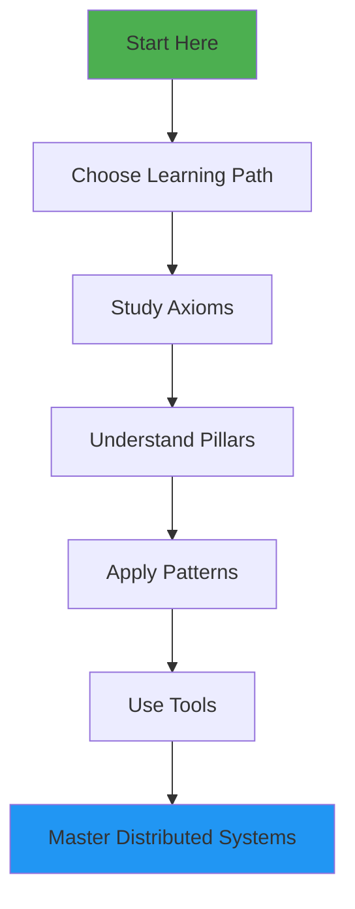
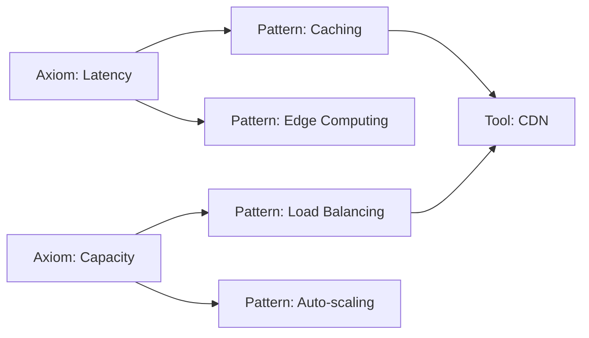

# How to Use This Guide

!!! success "Welcome!"
    This guide will help you navigate the Compendium effectively and get the most value from your learning journey.

## 🗺️ Understanding the Structure

### The Big Picture

### Content Organization

1. **Axioms (Part I)**: 8 fundamental constraints that govern all distributed systems
2. **Pillars (Part II)**: 5 architectural patterns that emerge from axioms
3. **Tools**: Interactive calculators and planners
4. **Reference**: Glossary, cheat sheets, and quick lookups

## 📖 Reading Strategies

### For First-Time Readers

!!! tip "Sequential Approach"
    1. Start with [Philosophy](philosophy.md) to understand our approach
    2. Check [Prerequisites](prerequisites.md) to ensure you're ready
    3. Choose your [Learning Path](roadmap.md)
    4. Read axioms in order (they build on each other)
    5. Do exercises after each axiom
    6. Move to pillars once comfortable with axioms

### For Reference Users

!!! tip "Quick Access"
    - Use the search bar (Ctrl+K) to find specific topics
    - Bookmark the [Glossary](../reference/glossary.md) for quick term lookups
    - Keep [Cheat Sheets](../reference/cheat-sheets.md) handy
    - Use the table of contents (right sidebar) for navigation

### For Problem Solvers

!!! tip "Solution-Oriented"
    1. Start with your specific problem
    2. Use the [Decision Trees](../reference/cheat-sheets.md#decision-trees) to identify relevant axioms
    3. Jump directly to those axioms
    4. Review related examples and failures
    5. Apply the patterns to your situation

## 🎯 Learning Features

### Visual Indicators

Throughout the guide, you'll see these helpful markers:

- 🎯 **Decision Points**: Critical architectural choices
- ⚠️ **Common Pitfalls**: Where systems typically fail
- 💡 **Insights**: Counter-intuitive truths
- 🔧 **Try This**: Hands-on exercises (<5 minutes)
- 📊 **Measure This**: Key metrics to track
- 🎬 **Real Stories**: Production failure case studies

### Interactive Elements

- **Code Playgrounds**: Experiment with concepts directly
- **Calculators**: [Latency Calculator](../tools/latency-calculator.md), [Capacity Planner](../tools/capacity-planner.md)
- **Visualizations**: Interactive diagrams and animations
- **Quizzes**: Test your understanding

### Content Boxes

**Axiom Boxes**: Fundamental truths and definitions

**Decision Boxes**: Frameworks for making choices

**Failure Vignettes**: Real-world disasters and lessons

**Truth Boxes**: Counter-intuitive insights

## 🏃 Pacing Your Learning

### Time Estimates

Each section includes estimated reading times:
- **Axiom Core Concepts**: 15-20 minutes each
- **Examples**: 10-15 minutes
- **Exercises**: 20-30 minutes
- **Pillar Concepts**: 20-30 minutes each

### Suggested Schedule

**Intensive (1 week)**:
- Day 1-2: All 8 axioms
- Day 3-4: 5 pillars
- Day 5: Tools and exercises
- Day 6-7: Apply to your system

**Regular (1 month)**:
- Week 1: Axioms 1-3
- Week 2: Axioms 4-6
- Week 3: Axioms 7-8 + Pillars 1-2
- Week 4: Pillars 3-5 + Integration

**Casual (3 months)**:
- Month 1: All axioms (2 per week)
- Month 2: All pillars
- Month 3: Deep dives and application

## 💪 Maximizing Value

### Active Learning Techniques

1. **Explain to Others**: Teach concepts to teammates
2. **Find Examples**: Identify axioms in your current system
3. **Do Exercises**: Don't skip the 🔧 Try This sections
4. **Take Notes**: Keep a learning journal
5. **Ask Questions**: Challenge assumptions

### Building Mental Models

!!! example "The Power of Mental Models"
    Don't memorize facts. Build mental models:
    
    - **Latency**: Think "speed of light budget"
    - **Capacity**: Think "finite resources, infinite demand"
    - **Failure**: Think "everything breaks eventually"
    
    These models help you reason about new situations.

### Connecting Concepts

## 🔄 Iterative Understanding

### First Pass: Overview
- Read headings and summaries
- Look at diagrams
- Get the general idea

### Second Pass: Understanding
- Read full content
- Work through examples
- Try simple exercises

### Third Pass: Mastery
- Challenge assumptions
- Modify examples
- Apply to real systems

## 🚀 Beyond Reading

### Practical Application

1. **Audit Your System**: Find axiom violations in production
2. **Design Reviews**: Use axioms as a checklist
3. **Incident Analysis**: Map failures to violated axioms
4. **Teaching**: Run a workshop for your team
5. **Contributing**: Share your failure stories

### Community Engagement

- **Discussions**: Comment on examples with your experiences
- **Contributions**: Submit pull requests with improvements
- **Questions**: Open issues for clarifications
- **Sharing**: Write about your learnings

## ❓ Getting Help

### When Stuck

1. **Check Prerequisites**: Ensure you have the required background
2. **Review Glossary**: Clarify unfamiliar terms
3. **Re-read Philosophy**: Reconnect with first principles
4. **Try Exercises**: Hands-on learning often clarifies concepts
5. **Ask Community**: Open a discussion on GitHub

### Common Challenges

!!! warning "If you're feeling overwhelmed..."
    - **Too Abstract?** Focus on failure stories first
    - **Too Dense?** Take breaks between axioms
    - **Too Theoretical?** Jump to exercises
    - **Not Relevant?** Start with your specific problem

## 🎉 Success Criteria

You'll know you've mastered the content when you can:

- [ ] Explain why caching exists from first principles
- [ ] Predict failure modes of a system design
- [ ] Make quantitative trade-off decisions
- [ ] Design systems that degrade gracefully
- [ ] Teach these concepts to others

## Next Steps

Ready to begin? Here are your options:

1. **Structured Learning**: Follow a [Learning Path](roadmap.md)
2. **Deep Dive**: Start with [Axiom 1: Latency](../part1-axioms/axiom-1-latency/index.md)
3. **Quick Reference**: Bookmark the [Glossary](../reference/glossary.md)
4. **Hands-On**: Try the [Latency Calculator](../tools/latency-calculator.md)

---

!!! quote "Remember"
    "The best way to learn distributed systems is to understand the constraints, not memorize the solutions." - The Compendium Philosophy

Happy learning! 🚀