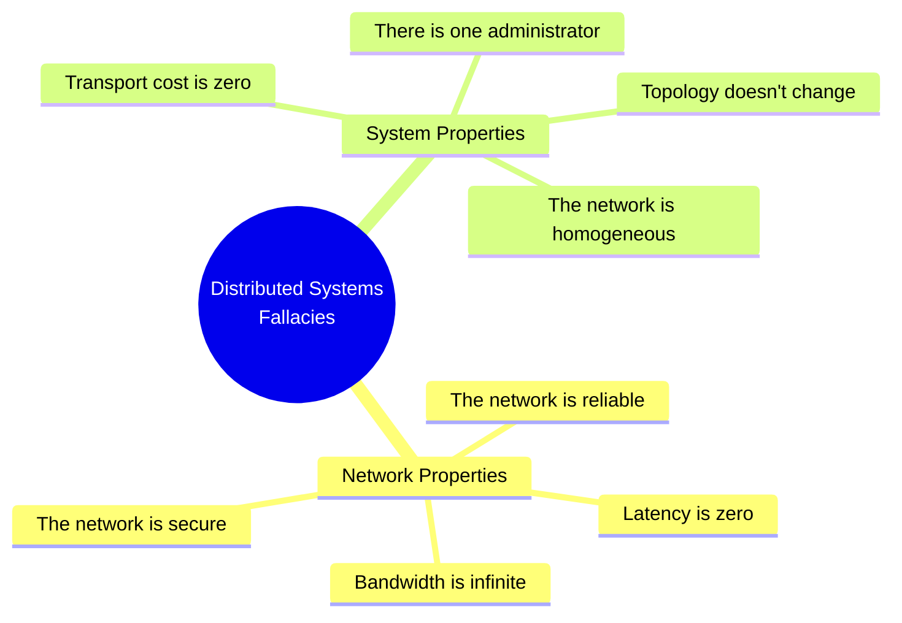
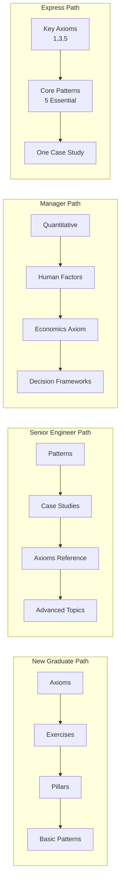

<!-- Navigation -->
[Home](../index.md) → [Introduction](index.md) → **Welcome to Distributed Systems**

# Welcome to Distributed Systems

## The Journey Begins

Welcome to *The Compendium of Distributed Systems* - a comprehensive guide that teaches distributed systems from first principles. Unlike traditional approaches that jump straight into specific technologies, we start with the fundamental physics and mathematics that govern all distributed systems.

!!! quote "The Hidden Infrastructure of Modern Life"
    Every time you:
    - Send a message that reaches someone on another continent in 200ms
    - Stream a 4K video without buffering from servers 1000 miles away
    - Make a purchase that coordinates inventory, payment, and shipping across dozens of systems
    - Trust that your bank balance is correct despite thousands of concurrent transactions

    ...you're relying on distributed systems that must overcome the fundamental laws of physics, handle inevitable failures, and coordinate actions across the globe. **In 2024, a 1-hour outage of a major cloud provider can cost the global economy over $1 billion¹.**

## The 8 Fallacies of Distributed Computing

Before we dive into our physics-based approach, it's crucial to understand what distributed systems are NOT. In the 1990s, engineers at Sun Microsystems identified eight dangerous assumptions that developers often make about distributed systems - assumptions that lead to brittle, unreliable systems²³.

!!! danger "The 8 Fallacies"
    1. **The network is reliable** - Networks fail. Packets get lost. Connections drop.
    2. **Latency is zero** - Every network hop takes time. Physics imposes fundamental limits.
    3. **Bandwidth is infinite** - Network capacity is always limited and often contested.
    4. **The network is secure** - Networks are inherently vulnerable to attacks and breaches.
    5. **Topology doesn't change** - Network paths and nodes constantly evolve.
    6. **There is one administrator** - Distributed systems span multiple domains of control.
    7. **Transport cost is zero** - Moving data costs time, money, and resources.
    8. **The network is homogeneous** - Different parts use different protocols and standards.

### Visual Summary: The 8 Fallacies

These fallacies aren't just theoretical - they manifest in real production failures every day. Understanding them is the first step toward building robust distributed systems.

!!! info "Modern Fallacies"
    While the original eight fallacies remain foundational, modern distributed systems have revealed additional dangerous assumptions⁴:
    
    - **Observability is optional** (2020) - Without proper observability, you're flying blind
    - **Eventual consistency is easy** - Managing inconsistent states is one of the hardest problems
    - **Microservices solve complexity** - They often trade code complexity for operational complexity
    - **The cloud is infinitely scalable** - Even cloud providers have limits and quotas

### Real-World Consequences

!!! example "The Cost of Ignoring Fallacies"
    **Fallacy #2 in Action: Amazon's 100ms Rule**

    Amazon discovered that every 100ms of latency cost them 1% in sales⁵. Greg Linden, who worked on Amazon's recommendation engine, revealed that a 100ms delay in page load time could translate to a 1% loss in revenue - potentially $1.6 billion per year for Amazon's scale⁵⁶.

    **Fallacy #1 in Action: GitHub's 2018 Outage**

    On October 21, 2018, GitHub experienced a 24-hour service degradation⁷. The cause? A brief network partition between their primary and secondary data centers triggered a split-brain scenario. Their assumption of network reliability led to data inconsistency affecting millions of developers worldwide.

    **Fallacy #3 in Action: The 2016 Dyn DDoS Attack**

    On October 21, 2016, a massive DDoS attack on DNS provider Dyn took down major services including Twitter, Netflix, and Reddit⁸. The attack exploited bandwidth limitations, sending 1.2 Tbps of traffic - proving that bandwidth is very much finite and can be weaponized.

## Why First Principles?

Most distributed systems education starts with specific technologies: "Here's how to use Kafka" or "This is how Kubernetes works." But technologies come and go. The fundamental constraints of physics and mathematics remain constant.

By understanding these constraints, you'll:
- **Predict failure modes** before they happen
- **Make informed trade-offs** based on physical limits
- **Design systems that work with reality**, not against it
- **Understand why** certain patterns exist, not just how to use them

### The Science Behind the Systems

!!! success "Research-Backed Principles"
    Our approach is grounded in decades of research and hard-won industry experience:

    **Latency Impact Studies:**
    - Google: 500ms delay → 20% drop in traffic (2006)⁹
    - Bing: 2s delay → 4.3% drop in revenue per user (2009)¹⁰
    - Facebook: 1s delay → 3% drop in posts, 5% drop in photos uploaded (2017)¹¹

    **Failure Rates in Production:**
    - Google: Expects 1-5% of drives to fail annually¹²
    - Facebook: Plans for entire data center failures¹³
    - Netflix: Deliberately induces failures daily with Chaos Monkey¹⁴

    **The CAP Theorem in Practice:**
    - LinkedIn chose AP over C: Accepts temporary inconsistency for availability¹⁵
    - Banking systems choose CP over A: Prefer to be unavailable than incorrect
    - Amazon DynamoDB: Tunable consistency lets users choose per operation¹⁶

## Your Learning Path

This compendium offers multiple paths through the material, tailored to your background and goals:

### 🎓 For New Graduates
Start with the axioms to build a solid foundation, then explore patterns with guided exercises.

### 🏗️ For Senior Engineers
Jump to specific patterns and case studies, using axioms as reference when needed.

### 📊 For Engineering Managers
Focus on quantitative methods and human factors for better decision-making.

### ⚡ Express Path
A curated subset covering the essential 20% that delivers 80% of the value.

## What Makes This Different?

Unlike traditional resources, we:
- **Start with physics**, not products
- **Derive patterns from constraints**, not prescribe them
- **Include real failure stories** from production systems
- **Provide quantitative tools** for capacity planning and analysis
- **Address human factors** - the most common source of failures

### Learning from Disasters

!!! info "Real Systems, Real Failures, Real Lessons"
    Throughout this compendium, you'll encounter detailed analyses of actual system failures:

    - **Knight Capital's $440 Million Bug** (2012): How a deployment error and lack of proper distributed system controls led to a 45-minute trading disaster¹⁷
    - **AWS S3 Outage** (2017): How a typo during debugging took down a massive portion of the internet, revealing hidden dependencies¹⁸
    - **Cloudflare's Global Outage** (2019): How a regular expression deployed globally caused 27 minutes of downtime, showing the perils of synchronized updates¹⁹
    - **Slack's Cascading Failure** (2021): How routine scaling triggered a perfect storm of failures across multiple systems²⁰

    Each case study maps failures back to fundamental axioms, showing how physics and mathematics could have predicted these outcomes.

## Content Roadmap

## Learning Paths by Role

## Ready to Begin?

Start your journey with [Part 1: The 8 Axioms](../part1-axioms/index.md), where we explore the fundamental constraints that shape all distributed systems. Each axiom builds on the previous ones, creating a complete mental model for reasoning about distributed systems.

!!! tip "How to Use This Guide"
    - **Read actively**: Try to predict consequences before reading them
    - **Work the exercises**: Theory without practice is incomplete
    - **Question everything**: If something seems wrong, it might be - or you might have discovered a deeper truth
    - **Share your journey**: Distributed systems are best learned in community

---

## References

¹ [Uptime Institute Annual Outage Analysis 2024](https://uptimeinstitute.com/resources/research-and-reports/annual-outage-analysis-2024)

² [Peter Deutsch, "The Eight Fallacies of Distributed Computing" (1994)](https://www.rgoarchitects.com/Files/fallacies.pdf)

³ [James Gosling's addition to the fallacies (1997)](https://en.wikipedia.org/wiki/Fallacies_of_distributed_computing)

⁴ [Modern Fallacies in Distributed Systems (2020)](https://en.wikipedia.org/wiki/Fallacies_of_distributed_computing#The_fallacies)

⁵ [Greg Linden's Blog: Make Data Useful](http://glinden.blogspot.com/2006/11/marissa-mayer-at-web-20.html)

⁶ [Stanford CS193p Lecture by Greg Linden on Amazon's Latency Findings](https://web.stanford.edu/class/cs193p/WWDC/Designing%20for%20Speed%20on%20the%20Modern%20Web.pdf)

⁷ [GitHub Engineering: October 21 post-incident analysis](https://github.blog/2018-10-30-oct21-post-incident-analysis/)

⁸ [Dyn Analysis Summary Of Friday October 21 Attack](https://dyn.com/blog/dyn-analysis-summary-of-friday-october-21-attack/)

⁹ [Google Research: Speed Matters](https://ai.googleblog.com/2009/06/speed-matters.html)

¹⁰ [Bing: Page Load Time Impact on User Behavior](https://exp-platform.com/Documents/IEEEComputer2007OnlineExperiments.pdf)

¹¹ [Facebook: Network Performance Effects on Mobile User Experience](https://engineering.fb.com/2017/05/24/android/network-performance-effects-on-mobile-user-experience/)

¹² [Google SRE Book: Chapter 3 - Embracing Risk](https://sre.google/sre-book/embracing-risk/)

¹³ [Facebook Engineering: Building Resilient Infrastructure](https://engineering.fb.com/2011/01/05/data-center-engineering/building-efficient-data-centers-with-the-open-compute-project/)

¹⁴ [Netflix Technology Blog: The Netflix Simian Army](https://netflixtechblog.com/the-netflix-simian-army-16e57fbab116)

¹⁵ [LinkedIn Engineering: Project Voldemort](https://engineering.linkedin.com/distributed-systems/log-what-every-software-engineer-should-know-about-real-time-datas-unifying)

¹⁶ [Amazon DynamoDB: Consistent Reads](https://docs.aws.amazon.com/amazondynamodb/latest/developerguide/HowItWorks.ReadConsistency.html)

¹⁷ [SEC Filing: Knight Capital Group Provides Update](https://www.sec.gov/Archives/edgar/data/1060131/000119312512346593/d398788d8k.htm)

¹⁸ [AWS Post-Event Summary: Amazon S3 Service Disruption](https://aws.amazon.com/message/41926/)

¹⁹ [Cloudflare Blog: Details of the Cloudflare outage on July 2, 2019](https://blog.cloudflare.com/cloudflare-outage/)

²⁰ [Slack Engineering: Slack's Outage on January 4th 2021](https://slack.engineering/slacks-outage-on-january-4th-2021/)