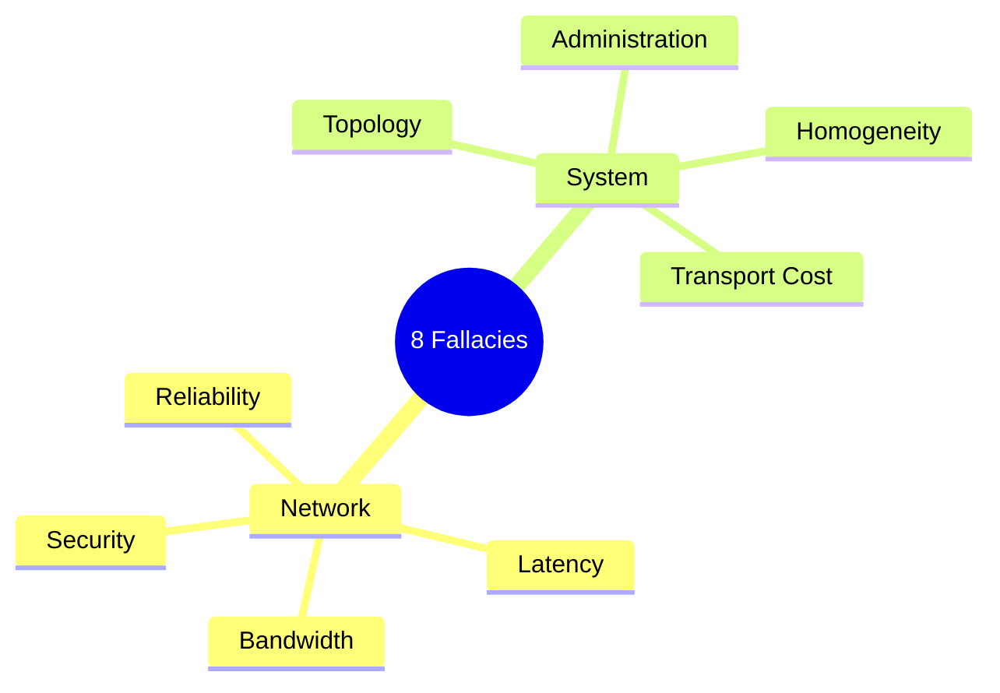
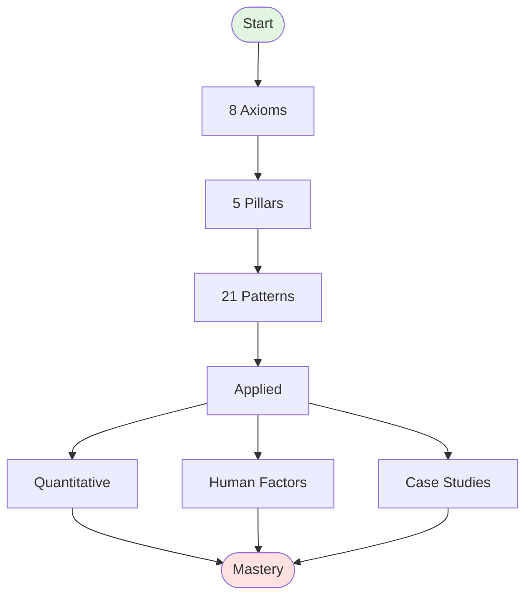

<!-- Navigation -->
[Home](../index.md) → [Introduction](index.md) → **Welcome to Distributed Systems**

# Welcome to Distributed Systems

This compendium teaches distributed systems from first principles—starting with physics and mathematics rather than specific technologies.

!!! quote "The Hidden Infrastructure"
    Every message across continents (200ms), every video stream (1000 miles away), every online purchase (dozens of systems), every bank transaction (thousands concurrent)—all rely on distributed systems overcoming physics, handling failures, and coordinating globally.
    
    **Impact**: A 1-hour major cloud outage costs the global economy over $1 billion¹.

## The 8 Fallacies of Distributed Computing

In the 1990s, Sun Microsystems identified eight dangerous assumptions that lead to brittle systems²³:

!!! danger "The 8 Fallacies"
    1. **The network is reliable** → Networks fail, packets drop
    2. **Latency is zero** → Physics imposes fundamental limits
    3. **Bandwidth is infinite** → Capacity is always limited
    4. **The network is secure** → Inherently vulnerable
    5. **Topology doesn't change** → Constantly evolving
    6. **There is one administrator** → Multiple domains of control
    7. **Transport cost is zero** → Costs time, money, resources
    8. **The network is homogeneous** → Different protocols everywhere

!!! info "Modern Fallacies"
    Additional dangerous assumptions in 2024⁴:
    - **Observability is optional** → Flying blind
    - **Eventual consistency is easy** → Among the hardest problems
    - **Microservices solve complexity** → Trade code for operational complexity
    - **The cloud is infinitely scalable** → Providers have limits

### Real-World Consequences

!!! example "Fallacies in Production"
    **Latency (#2)**: Amazon's 100ms = 1% sales loss = $1.6B/year⁵⁶
    
    **Reliability (#1)**: GitHub 2018 - Network partition → 24hr outage⁷
    
    **Bandwidth (#3)**: Dyn 2016 - 1.2 Tbps DDoS → Twitter/Netflix down⁸

## Why First Principles?

Technologies come and go. Physics and mathematics remain constant.

Understanding fundamental constraints enables you to:
- **Predict** failure modes
- **Make** informed trade-offs
- **Design** with reality
- **Understand** why, not just how

!!! success "Evidence-Based Impact"
    **Latency**: Google 500ms → -20% traffic⁹ | Bing 2s → -4.3% revenue¹⁰
    
    **Failures**: Google 1-5% drives/year¹² | Netflix induces daily¹⁴
    
    **CAP Trade-offs**: LinkedIn (AP)¹⁵ | Banks (CP) | DynamoDB (tunable)¹⁶

## Learning Paths

🎓 **New Graduates**: Axioms → Exercises → Patterns  
🏗️ **Senior Engineers**: Patterns → Case Studies → Axiom References  
📊 **Engineering Managers**: Quantitative Methods → Human Factors  
⚡ **Express Path**: Essential 20% for 80% value

## What Makes This Different?

- **Physics first**, not products
- **Derive patterns**, don't prescribe
- **Real failures** from production
- **Quantitative tools** for planning
- **Human factors** - #1 failure source

!!! info "Learning from Disasters"
    **Knight Capital** (2012): $440M in 45min - deployment controls¹⁷  
    **AWS S3** (2017): Typo → internet down - hidden dependencies¹⁸  
    **Cloudflare** (2019): Regex → 27min outage - sync updates¹⁹  
    **Slack** (2021): Scaling → cascade - system interactions²⁰
    
    Each maps to violated axioms.

## Content Structure

**Part 1**: 8 Axioms (Latency, Capacity, Failure, Concurrency, Coordination, Observability, Human Interface, Economics)  
**Part 2**: 5 Pillars (Work, State, Truth, Control, Intelligence)  
**Part 3**: 21 Patterns (CQRS, Event Sourcing, Service Mesh, etc.)

## Ready to Begin?

Start with [Part 1: The 8 Axioms](../part1-axioms/index.md) to build your mental model.

!!! tip "Active Learning"
    📖 **Predict** consequences  
    ✍️ **Work** exercises  
    ❓ **Question** everything  
    🤝 **Share** insights

---

## References

¹ [Uptime Institute Annual Outage Analysis 2024](https://uptimeinstitute.com/resources/research-and-reports/annual-outage-analysis-2024)

² [Peter Deutsch, "The Eight Fallacies of Distributed Computing" (1994)](https://www.rgoarchitects.com/Files/fallacies.pdf)

³ [James Gosling's addition to the fallacies (1997)](https://en.wikipedia.org/wiki/Fallacies_of_distributed_computing)

⁴ [Modern Fallacies in Distributed Systems (2020)](https://en.wikipedia.org/wiki/Fallacies_of_distributed_computing#The_fallacies)

⁵ [Greg Linden's Blog: Make Data Useful](http://glinden.blogspot.com/2006/11/marissa-mayer-at-web-20.html)

⁶ [Stanford CS193p Lecture by Greg Linden on Amazon's Latency Findings](https://web.stanford.edu/class/cs193p/WWDC/Designing%20for%20Speed%20on%20the%20Modern%20Web.pdf)

⁷ [GitHub Engineering: October 21 post-incident analysis](https://github.blog/2018-10-30-oct21-post-incident-analysis/)

⁸ [Dyn Analysis Summary Of Friday October 21 Attack](https://dyn.com/blog/dyn-analysis-summary-of-friday-october-21-attack/)

⁹ [Google Research: Speed Matters](https://ai.googleblog.com/2009/06/speed-matters.html)

¹⁰ [Bing: Page Load Time Impact on User Behavior](https://exp-platform.com/Documents/IEEEComputer2007OnlineExperiments.pdf)

¹¹ [Facebook: Network Performance Effects on Mobile User Experience](https://engineering.fb.com/2017/05/24/android/network-performance-effects-on-mobile-user-experience/)

¹² [Google SRE Book: Chapter 3 - Embracing Risk](https://sre.google/sre-book/embracing-risk/)

¹³ [Facebook Engineering: Building Resilient Infrastructure](https://engineering.fb.com/2011/01/05/data-center-engineering/building-efficient-data-centers-with-the-open-compute-project/)

¹⁴ [Netflix Technology Blog: The Netflix Simian Army](https://netflixtechblog.com/the-netflix-simian-army-16e57fbab116)

¹⁵ [LinkedIn Engineering: Project Voldemort](https://engineering.linkedin.com/distributed-systems/log-what-every-software-engineer-should-know-about-real-time-datas-unifying)

¹⁶ [Amazon DynamoDB: Consistent Reads](https://docs.aws.amazon.com/amazondynamodb/latest/developerguide/HowItWorks.ReadConsistency.html)

¹⁷ [SEC Filing: Knight Capital Group Provides Update](https://www.sec.gov/Archives/edgar/data/1060131/000119312512346593/d398788d8k.htm)

¹⁸ [AWS Post-Event Summary: Amazon S3 Service Disruption](https://aws.amazon.com/message/41926/)

¹⁹ [Cloudflare Blog: Details of the Cloudflare outage on July 2, 2019](https://blog.cloudflare.com/cloudflare-outage/)

²⁰ [Slack Engineering: Slack's Outage on January 4th 2021](https://slack.engineering/slacks-outage-on-january-4th-2021/)