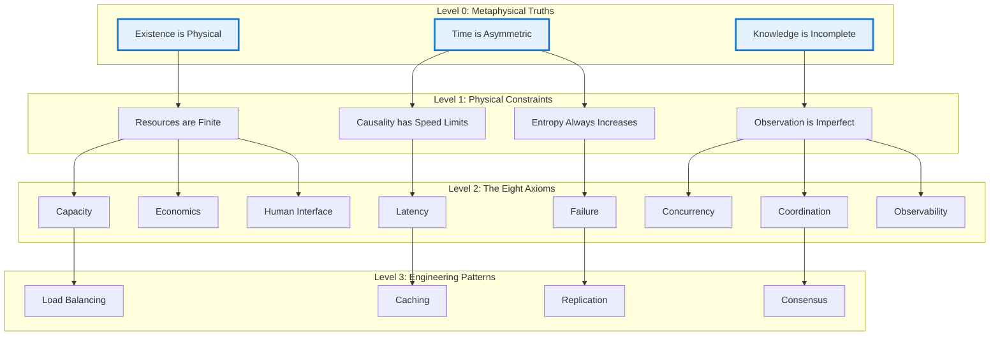
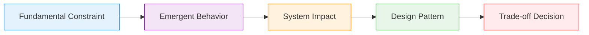

# Core First-Principles Philosophy

!!! info "Prerequisites"
    [The Zeroth Principles](zeroth-principles.md) - The metaphysical foundation

!!! abstract "The Deductive Method"
    This treatise is an exercise in deductive reasoning. We reject the cataloging of transient patterns and technologies. Instead, we begin with the most fundamental truths about reality and logically derive the entire discipline of distributed systems.

## The Foundation

<div class="axiom-box">

The entire compendium is built on fundamental constraints:

1. **Physical Laws**: Speed of light, thermodynamics, information theory
2. **Mathematical Laws**: Queueing theory, probability, graph theory
3. **Economic Laws**: Cost gradients, opportunity costs, resource allocation
4. **Human Laws**: Cognitive limits, communication bandwidth, organizational dynamics

</div>

## The Deductive Chain: From Metaphysics to Engineering



## First-Principles Learning Framework



## Why First Principles?

### Traditional Approach Problems

Most distributed systems education follows this pattern:

1. **Tool-First**: "Here's how to use Kafka"
2. **Pattern-First**: "This is the Circuit Breaker pattern"
3. **Recipe-Based**: "For X problem, use Y solution"

This creates engineers who:
- Can implement patterns but don't know when to use them
- Struggle with novel problems
- Make decisions based on popularity rather than physics
- Build Rube Goldberg machines of trendy technologies

### Our Approach: The Principia Method

We start with three metaphysical truths and derive everything else through unbroken logical chains:

<div class="mental-model-box">

**The Deductive Process**:

1. **Metaphysical Truth** (What reality IS)
   - Example: "Time is asymmetric"

2. **Physical Constraint** (What this MEANS)
   - Example: "Cause precedes effect; entropy increases"

3. **System Law** (What this FORCES)
   - Example: "Components will fail (Law of Failure)"

4. **Engineering Pattern** (What we BUILD)
   - Example: "Circuit breakers, retry logic, redundancy"

5. **Operational Practice** (How we RUN)
   - Example: "Chaos engineering, failure injection"

</div>

```
Speed of Light → Latency constraints → Caching patterns
Thermodynamics → Entropy increase → Failure handling
Incomplete Knowledge → Partial views → Eventual consistency
Finite Resources → Capacity limits → Backpressure mechanisms
```

## The Power of Constraints

!!! quote "Insight"
    "Every distributed system pattern is a workaround for physics. Once you understand the physics, the patterns become obvious."

### Example: Why Does Caching Exist?

**Traditional Explanation**: "Caching improves performance"

**First-Principles Derivation**:
1. Light travels at 299,792 km/s in vacuum
2. In fiber optic cable: ~200,000 km/s
3. NYC to London: 5,567 km
4. Minimum round trip: 5,567 × 2 ÷ 200,000 = 56ms
5. Users expect <100ms response
6. Backend processing takes 30ms
7. Total: 86ms, leaving only 14ms margin
8. **Therefore**: Cache data closer to users

The pattern emerges from physics, not preference.

## Mental Models

### Model 1: The Gradient Descent of Engineering

Every system naturally moves toward:
- Higher entropy (more disorder)
- Higher latency (more hops)
- Higher cost (more resources)
- Higher complexity (more components)

Good engineering pushes back against these gradients.

### Model 2: Conservation Laws

In distributed systems:
- **Consistency + Availability + Partition Tolerance = Constant**
- **Latency × Throughput × Cost = Constant**
- **Simplicity × Flexibility × Performance = Constant**

Improving one dimension always costs another.

### Model 3: The Fractal Nature

Distributed systems patterns repeat at every scale:
- Process ↔ Thread (mini distributed system)
- Service ↔ Service (classic distributed system)
- Region ↔ Region (geo-distributed system)
- Cloud ↔ Cloud (multi-cloud system)

## The Architect's Evolution

<div class="truth-box">

As you master this deductive method, your role evolves:

1. **Level 1: The Mechanic** - Implements patterns from memory
2. **Level 2: The Engineer** - Understands why patterns work
3. **Level 3: The Physicist** - Derives patterns from constraints
4. **Level 4: The Philosopher** - Sees the necessity in all designs

</div>

## Axioms as Universal Laws

Our eight axioms aren't arbitrary. They're the minimal set derived from the three metaphysical truths:

1. **Latency** - Information propagation takes time
2. **Capacity** - Resources are finite
3. **Failure** - Components fail independently
4. **Concurrency** - Time is relative
5. **Coordination** - Agreement has cost
6. **Observability** - Knowledge is partial
7. **Human Interface** - People are in the loop
8. **Economics** - Everything has a price

Every pattern, every failure, every architecture decision traces back through these eight constraints to the three metaphysical truths.

<div class="decision-box">

**The Complete Deductive Framework**:

```
Zeroth Principles (Metaphysics)
    ↓
First Principles (The 8 Axioms)
    ↓
Second Principles (Abstract Models)
    ↓
Third Principles (Engineering Disciplines)
    ↓
Fourth Principles (Operational Philosophy)
```

</div>

## The Journey Ahead

<div class="mental-model-box">

```
You are here:
Philosophy → Axioms → Patterns → Implementation → Mastery
    ↑
    └─ Understanding why before what
```

</div>

!!! success "Key Takeaway"
    By understanding the fundamental constraints, you'll be able to:
    - Derive solutions to novel problems
    - Evaluate new technologies critically
    - Make decisions based on physics, not fashion
    - Build systems that work with, not against, reality