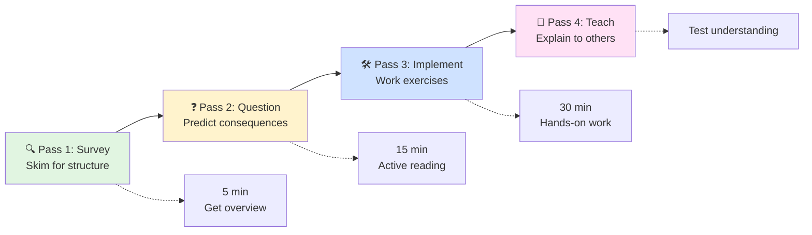
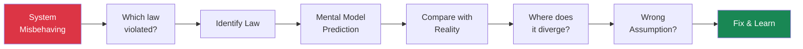

# The Philosophy: Learning from First Principles

!!! quote "The Feynman Principle"
 "If you can't explain it simply, you don't understand it well enough." — Richard Feynman

 **Our approach**: Start with physics constraints, derive solutions. Not memorize tools.

## Why First Principles Matter

<div class="grid" markdown>
 <div class="card">
 <h3 class="card__title">Traditional Learning</h3>
 <p class="card__description">
 Learn tools (Redis, Kafka). Problem: Skills obsolete in 3-5 years.
 </p>
 </div>
 
 <div class="card">
 <h3 class="card__title">First Principles Learning</h3>
 <p class="card__description">
 Learn physics constraints. Benefit: Skills compound over decades.
 </p>
 </div>
</div>

## Traditional vs First Principles Learning

!!! tip "Impact Comparison"
| Aspect | Traditional | First Principles | Impact |
 |--------|-------------|------------------|--------|
 | **Starting Point** | Popular tools | Physics constraints | 10x faster learning new tech |
 | **Problem Solving** | Copy solutions | Derive from constraints | Can solve novel problems |
 | **Debugging** | Trial and error | Systematic analysis | 5x faster resolution |
 | **Career Growth** | Tool expert → obsolete | Principle expert → architect | 2-3x salary growth |
 | **Innovation** | Follow patterns | Create patterns | Build next Google |


## Learning Methods Effectiveness

!!! note "Retention Rates by Method"
| Learning Method | Retention Rate | Time to Mastery | Example |
 |-----------------|----------------|-----------------|---------|
 | **Read about it** | 10% | Never | "Redis is a cache" |
 | **See demonstration** | 30% | 2 years | Watch Redis tutorial |
 | **Practice with guidance** | 75% | 6 months | Build with Redis |
 | **Teach others** | 90% | 3 months | Explain to colleague |
 | **Derive from principles** | 95% | 1 month | Invent Redis from constraints |


 **Key insight**: Active derivation beats passive consumption by 9x.

## Deriving Solutions from Constraints

### Example 1: Why Caching Exists

!!! note "Traditional vs First Principles"
 **Traditional**: "Caching improves performance by storing data closer to users."
 **First Principles**:
 1. Law 1 (Failure) + Law 4 (Trade-offs) → Need redundancy with balanced constraints
 2. Trade reliability for consistency → Store copies closer to usage
 3. **Result**: Caching emerges as optimization strategy
 4. **Consequences**: Cache invalidation, hierarchies, coherence protocols

### Example 2: Why Microservices Exist

!!! info "Derivation from Laws"
 **Traditional**: "Microservices enable teams to work independently."
 **First Principles**:
 1. Law 6 (Cognitive Load) + Law 3 (Chaos) + Law 1 (Failure) → Decompose along team boundaries
 2. Accept network overhead for human comprehension
 3. **Result**: Microservices as cognitive trade-off
 4. **Implications**: Conway's Law, service = team boundary, not everything needs microservices

### Example 3: Why Consensus Algorithms Exist

!!! note
 <h4>From Laws to Protocols</h4>

 **Traditional**: "Consensus ensures distributed systems agree on state."

 **First Principles**:
 1. Law 2 (No global clock) + Law 1 (Nodes fail/lie) + Law 5 (No single truth) 
 2. → Need protocols for agreement despite failures
 3. → Must trade safety vs liveness 
 4. **Result**: Consensus algorithms (Raft/Paxos) emerge
 5. **Explains**: FLP impossibility, different protocols for different scenarios

## Real-World Impact

### Case Study: NASA Apollo 11 
!!! danger "First Principles Under Pressure"
 **Challenge**: Land on moon with 1960s technology, no existing patterns.
 **Constraints**: 72KB memory, CPU limits, cannot fail during landing.
 **First Principles Solution**: Priority scheduling + restart capability for non-critical tasks.
 **Result**: During landing, computer overloaded with radar data but successfully shed non-critical tasks and landed safely. Traditional approaches would have crashed.

### Case Study: Amazon DynamoDB
!!! info "From CAP Theorem to NoSQL Revolution"
 **Challenge**: Amazon's massive scaling problems in 2004.
 **First Principles**: CAP theorem says can't have consistency + availability + partition tolerance.
 **Business Constraint**: Shopping cart must always be available.
 **Solution**: Choose availability over consistency, use eventual consistency with vector clocks.
 **Result**: Created DynamoDB and spawned the entire NoSQL movement.

## Learning Journey Stages

!!! tip "Expertise Development"
| Stage | Years | Capability | Mental Model |
 |-------|-------|------------|-------------|
 | **Novice** | 0-1 | Follow laws as rules | Single law application |
 | **Competent** | 1-3 | Map problems to laws | Pattern recognition |
 | **Proficient** | 3-5 | See law interactions | System thinking |
 | **Expert** | 5+ | Predict from constraints | First principles |


### Metacognition: Learning How to Learn

We explicitly teach learning strategies based on research¹³:

!!! info
 #### 📚 The Three-Pass Method



<div class="responsive-table" markdown>

| Pass | Time | Activity | Outcome |
|------|------|----------|------|
| **1: Survey** | 5 min | Skim headings, diagrams | Mental map |
| **2: Question** | 15 min | Read actively, ask "why?" | Key insights |
| **3: Implement** | 30 min | Code examples, exercises | Practical skills |
| **4: Teach** | Variable | Explain to colleague | Validated understanding |


</div>

!!! note "Research Foundation"
 This method combines SQ3R (Survey, Question, Read, Recite, Review) with Feynman Technique, proven effective in technical learning¹⁴.

### Transfer Learning

By focusing on principles, knowledge transfers across:
- **Technologies**: Principles apply to any message queue
- **Scales**: Same physics from 2 nodes to 2000
- **Domains**: From databases to microservices to IoT

## The Role of Mental Models

### Building Accurate Mental Models

!!! info "How Laws Create Mental Models"

 ```mermaid
 graph TB
 subgraph "Individual Laws"
 L1["Law 1: Failure"] --> M1["Mental Model:<br/>Failures cascade"]
 M1 --> P1["Prediction:<br/>Need isolation"]

 L5["Law 5: Epistemology"] --> M5["Mental Model:<br/>No single truth"]
 M5 --> P5["Prediction:<br/>Need consensus"]
 end

 subgraph "Combined Understanding"
 P1 --> Insight["Key Insight:<br/>Isolated systems must handle<br/>knowledge gaps during failures"]
 P5 --> Insight
 end

 subgraph "Application"
 Insight --> A1["Design:<br/>Bulkheads"]
 Insight --> A2["Pattern:<br/>Event Sourcing"]
 Insight --> A3["Protocol:<br/>Gossip"]
 end

 style L1 fill:#fee2e2
 style L5 fill:#e0e7ff
 style Insight fill:#5448C8,color:#fff
 ```

### Debugging with Mental Models

!!! info
 #### Systematic Debugging Process



<div class="responsive-table" markdown>

| Step | Question | Action |
|------|----------|--------| 
| 1 | Which law is violated? | Map symptoms to laws |
| 2 | What does model predict? | Apply law's mental model |
| 3 | Where does reality diverge? | Find the gap |
| 4 | What assumption was wrong? | Update understanding |


</div>

## Practical Benefits of First Principles Thinking

### Connection to Established Learning Science

Our approach isn't just philosophical preference - it's grounded in decades of cognitive science and educational research:

!!! info "Research Foundation"
 **The Expertise Reversal Effect** (Sweller, 2003)¹⁵: Experts learn differently than novices. While beginners need worked examples, experts benefit more from deriving solutions. Our multi-path approach accommodates both.

 **Deliberate Practice Theory** (Ericsson, 1993)¹⁶: Mastery comes from practicing at the edge of current ability with immediate feedback. Our exercises progressively challenge readers while providing failure stories as feedback.

 **Transfer Learning** (Thorndike & Woodworth, 1901)¹⁷: Knowledge transfers best when underlying principles are understood. By teaching physics-based constraints, skills transfer across any distributed system.

### For Individual Engineers

- **Future-Proof Skills**: Principles outlast technologies
- **Faster Learning**: New tools map to known patterns
- **Better Debugging**: Systematic approach to problems
- **Innovation Capability**: Derive novel solutions

### For Teams

- **Shared Vocabulary**: Everyone speaks "laws"
- **Principled Debates**: Arguments grounded in physics
- **Better Design Reviews**: "Which laws does this violate?"
- **Knowledge Transfer**: Onboard through principles

### For Organizations

- **Technology Agnostic**: Switch tools without retraining
- **Better Architecture**: Decisions based on constraints
- **Reduced Failures**: Predict problems before they occur
- **Cost Optimization**: Understand fundamental trade-offs

## How to Use This Compendium

### How Google SREs Think in First Principles

!!! quote "From Google's SRE Book"
 "Hope is not a strategy. Engineering solutions based on fundamental constraints and mathematical analysis is."¹⁸

 Google's Site Reliability Engineers are trained to:
 1. **Quantify everything** - If you can't measure it, you can't improve it
 2. **Derive from fundamentals** - Ask "why" five times to reach root causes
 3. **Embrace failure** - Every outage is a learning opportunity
 4. **Think in trade-offs** - There's no perfect solution, only informed choices

This mirrors our approach exactly - start with physics, derive patterns, learn from failures, quantify decisions.

### Active Reading Strategies

!!! tip
 #### 🦭 How to Read This Compendium

 ```mermaid
 graph TD
 Start["Starting a Section"] --> Predict["1. Predict Before Reading"]
 Predict --> P1["Given this law...<br/>what patterns emerge?"]
 Predict --> P2["What happens if<br/>we violate it?"]

 P1 --> Connect["2. Connect While Reading"]
 P2 --> Connect

 Connect --> C1["Where have I<br/>seen this?"]
 Connect --> C2["How does this relate<br/>to my systems?"]

 C1 --> Challenge["3. Challenge After Reading"]
 C2 --> Challenge

 Challenge --> Ch1["What if the<br/>law changed?"]
 Challenge --> Ch2["What edge cases<br/>aren't covered?"]

 Ch1 --> Apply["4. Apply & Test"]
 Ch2 --> Apply

 Apply --> Result["Deep Understanding"]

 style Start fill:#5448C8,color:#fff
 style Result fill:#10b981,color:#fff
 ```

### The Feynman Notebook Method

Keep a notebook where you:
1. Write the law in your own words
2. Create your own examples
3. Draw your own diagrams
4. Explain to an imaginary student

### Building Your Own Understanding

!!! exercise "Test Your Understanding"
 For each new concept, ask:

 1. **What** is the fundamental constraint?
 2. **Why** does this constraint exist?
 3. **How** does it manifest in real systems?
 4. **When** does it matter most?
 5. **Where** have I seen this before?
 6. **Who** needs to understand this on my team?

## Detailed Comparison: Traditional vs First-Principles

### Learning Approach Comparison

!!! tip
 #### Traditional vs First-Principles Learning

 ```mermaid
 graph TD
 subgraph "Traditional Path 📉"
 T1["Learn Kafka"] --> T2["Learn Redis"]
 T2 --> T3["Learn K8s"]
 T3 --> T4["New Tech?<br/>Start Over"]
 T4 --> T5["Skills obsolete<br/>in 3-5 years"]
 end

 subgraph "First-Principles Path 📈"
 F1["Learn Physics<br/>Constraints"] --> F2["Derive Patterns"]
 F2 --> F3["Apply to Any Tech"]
 F3 --> F4["New Tech?<br/>Map to Laws"]
 F4 --> F5["Skills compound<br/>over decades"]
 end

 style T5 fill:#fee2e2
 style F5 fill:#dcfce7
 ```

| Aspect | Traditional Approach | First-Principles Approach | Why It Matters |
|--------|---------------------|--------------------------|----------------|
| **Starting Point** | Popular technologies (Kafka, Redis) | Laws of physics (speed of light) | Technologies become obsolete; physics doesn't |
| **Problem Solving** | Pattern matching from examples | Deriving solutions from constraints | Can handle novel problems |
| **Failure Analysis** | "It broke, try these fixes" | "It violated Law X, therefore..." | Systematic debugging |
| **Technology Changes** | Start learning from scratch | Map new tech to known principles | 10x faster adoption |
| **Architecture Decisions** | "Industry best practices" | Quantified trade-offs | Decisions fit your constraints |
| **Knowledge Depth** | Surface-level how | Deep understanding of why | Can innovate, not just implement |
| **Career Longevity** | Skills obsolete in 3-5 years | Skills compound over decades | Future-proof expertise |


### Example: Learning Message Queues

#### Traditional Path:
1. Learn RabbitMQ tutorials
2. Memorize AMQP protocol
3. Copy configuration from Stack Overflow
4. Debug through trial and error
5. Learn Kafka from scratch when needed
6. Can't explain why to choose one over another

#### First-Principles Path:
1. Understand queue theory (Little's Law)
2. Derive need for persistence (Law 1: Failure)
3. Understand ordering guarantees (Law 3: Emergence)
4. Calculate throughput limits (Law 4: Trade-offs)
5. Any message queue maps to these concepts
6. Can design custom queue for specific needs

### Real-World Impact

!!! success "Case Study: Engineer Growth"
 **Traditional Engineer After 5 Years:**
 - Expert in 3-4 specific technologies
 - Struggles with new paradigms
 - Debates solutions based on experience
 - Limited to learned patterns

 **First-Principles Engineer After 5 Years:**
 - Understands any distributed system quickly
 - Derives solutions for novel problems
 - Debates with quantified trade-offs
 - Creates new patterns when needed

### Industry Validation

!!! example "How Top Companies Apply First Principles"
 **Amazon's Working Backwards**: Start with customer constraints (latency, cost) and derive architecture¹⁹

 **SpaceX's Physics-Based Design**: "The best part is no part. The best process is no process. The best requirement is no requirement." - Reasoning from physics up²⁰

 **Netflix's Chaos Engineering**: Don't assume reliability - derive it from testing failure modes²¹

 **Cloudflare's Speed of Light Blog Series**: Teaches networking from physical constraints²²

## The Learning Never Stops

Distributed systems evolve, but principles endure:

- **1960s**: Mainframes → Same coordination problems
- **1990s**: Internet → Same latency constraints
- **2010s**: Cloud → Same failure modes
- **2020s**: Edge computing → Same physics applies
- **Future**: Quantum networks → Still bound by causality

By mastering principles, you're equipped for whatever comes next.

---

*"The worthwhile problems are the ones you can really solve or help solve, the ones you can really contribute something to... No problem is too small or too trivial if we can really do something about it."* — Richard Feynman

## References

¹ [Piaget, J. (1952). The origins of intelligence in children](https://doi.org/10.1037/11494-000)

² [Constructivism in Education: What Every Educator Should Know](https://www.edutopia.org/article/constructivism-education)

³ [Bloom, B. S. (1956). Taxonomy of educational objectives: The classification of educational goals](https://www.uky.edu/~rsand1/china2018/texts/Bloom-taxonomy.pdf)

⁴ [Anderson, L. W., & Krathwohl, D. R. (2001). A taxonomy for learning, teaching, and assessing](https://www.depauw.edu/files/resources/krathwohl.pdf)

⁵ [Roediger, H. L., & Butler, A. C. (2011). The critical role of retrieval practice in long-term retention](https://doi.org/10.1016/j.tics.2010.09.003)

⁶ [Ebbinghaus, H. (1885). Memory: A contribution to experimental psychology](https://psychclassics.yorku.ca/Ebbinghaus/)

⁷ [Freeman, S., et al. (2014). Active learning increases student performance in science, engineering, and mathematics](https://doi.org/10.1073/pnas.1319030111)

⁸ [Metcalfe, J. (2017). Learning from errors. Annual Review of Psychology](https://doi.org/10.1146/annurev-psych-010416-044022)

⁹ [Fischer, M. J., Lynch, N. A., & Paterson, M. S. (1985). Impossibility of distributed consensus with one faulty process](https://doi.org/10.1145/3149.214121)

¹⁰ [Hamilton, M. (2016). Apollo 11's source code is now on GitHub](https://github.com/chrislgarry/Apollo-11)

¹¹ [DeCandia, G., et al. (2007). Dynamo: Amazon's highly available key-value store](https://www.allthingsdistributed.com/files/amazon-dynamo-sosp2007.pdf)

¹² [Dreyfus, S. E., & Dreyfus, H. L. (1980). A five-stage model of the mental activities involved in directed skill acquisition](https://apps.dtic.mil/sti/pdfs/ADA084551.pdf)

¹³ [Zimmerman, B. J. (2002). Becoming a self-regulated learner: An overview](https://doi.org/10.1207/s15430421tip4102_2)

¹⁴ [Robinson, F. P. (1978). Effective Study (6th ed.)](https://www.jstor.org/stable/20865669)

¹⁵ [Sweller, J. (2003). Evolution of human cognitive architecture](https://doi.org/10.1016/S0079-7421(03)44002-8)

¹⁶ [Ericsson, K. A., Krampe, R. T., & Tesch-Römer, C. (1993). The role of deliberate practice in the acquisition of expert performance](https://doi.org/10.1037/0033-295X.100.3.363)

¹⁷ [Thorndike, E. L., & Woodworth, R. S. (1901). The influence of improvement in one mental function upon the efficiency of other functions](https://doi.org/10.1037/h0074898)

¹⁸ [Beyer, B., et al. (2016). Site Reliability Engineering: How Google Runs Production Systems](https://sre.google/sre-book/)

¹⁹ [Bryar, C., & Carr, B. (2021). Working Backwards: Insights, Stories, and Secrets from Inside Amazon](https://www.amazon.com/Working-Backwards-Insights-Stories-Secrets/dp/1250267595)

²⁰ [Vance, A. (2015). Elon Musk: Tesla, SpaceX, and the Quest for a Fantastic Future](https://www.tesla.com/blog/first-principles-thinking)

²¹ [Rosenthal, C., & Jones, N. (2020). Chaos Engineering: System Resiliency in Practice](https://principlesofchaos.org/)

²² [Cloudflare Blog: The Speed of Light](https://blog.cloudflare.com/the-speed-of-light-isnt-fast-enough)