<!-- Navigation -->
[Home](../introduction/index.md) → [Introduction](index.md) → **The Philosophy: Learning from First Principles**

# The Philosophy: Learning from First Principles

## Why First Principles Matter

In 1964, Richard Feynman gave a lecture at Cornell titled "The Character of Physical Law." He argued that to truly understand something, you must be able to derive it from fundamental principles, not just memorize formulas. This philosophy drives our entire approach to distributed systems education.

!!! quote "The Feynman Technique"
    "If you can't explain it simply, you don't understand it well enough. The best way to learn is to teach - break down complex ideas into simple components, identify gaps in understanding, and rebuild from the ground up."

    — Richard Feynman

## Traditional Learning vs First Principles Learning

### The Problem with Traditional Distributed Systems Education

| Traditional Approach | First Principles Approach |
|---------------------|--------------------------|
| **Start with Tools**: "Here's how to use Redis" | **Start with Physics**: "Here's why caching exists" |
| **Memorize Patterns**: "Use Circuit Breaker for fault tolerance" | **Derive Patterns**: "Given network failures, what emerges?" |
| **Copy Solutions**: "Netflix does it this way" | **Understand Trade-offs**: "Why did Netflix choose this?" |
| **Technology-Specific**: "Kubernetes networking" | **Universal Principles**: "How must any orchestrator handle networking?" |
| **Shallow Understanding**: Can implement | **Deep Understanding**: Can innovate |

### The Educational Theory Behind Our Approach

Our methodology draws from proven educational frameworks:

#### 1. **Constructivism (Piaget)**¹
Learning by building mental models from fundamental concepts:
- Start with concrete physical constraints (speed of light)
- Build abstract concepts on solid foundations (eventual consistency)
- Connect new knowledge to existing understanding

Jean Piaget's theory of cognitive development shows that true understanding comes from constructing knowledge, not receiving it².
#### 2. **Bloom's Taxonomy Applied**³
We move systematically up the learning hierarchy:

Benjamin Bloom's taxonomy of educational objectives provides a framework for structuring learning from basic recall to creative synthesis⁴.

#### 3. **Spaced Repetition & Interleaving**⁵
Core concepts appear throughout:
- Latency appears in every pattern discussion
- Failure modes analyzed in every case study
- Trade-offs reinforced through exercises

Research by Ebbinghaus and modern cognitive scientists shows that spaced repetition dramatically improves retention⁶.

#### 4. **Active Learning Through Failure**⁷
Real disasters make better teachers than success stories:
- Each failure maps to violated laws
- Students predict failure modes before reading solutions
- Exercises include "break this system" challenges

Studies show that learning from mistakes activates different neural pathways than learning from successes, leading to deeper understanding⁸.

## The Power of Deriving from Constraints

### Example 1: Why Does Caching Exist?

**Traditional Explanation**: "Caching improves performance by storing frequently accessed data closer to users."

**First Principles Derivation**:

### Example 2: Why Do Microservices Exist?

**Traditional Explanation**: "Microservices enable teams to work independently and deploy separately."

**First Principles Derivation**:

```mermaid
graph TD
    L6["Law 6: Cognitive Load<br/>Human capacity limited"] --> D1["Decompose along<br/>team boundaries"]
    L3["Law 3: Emergent Chaos<br/>Complex = unpredictable"] --> D1
    L1["Law 1: Correlated Failure<br/>Smaller failure domains"] --> D1
    
    D1 --> T1["Accept network<br/>overhead"]
    T1 --> T2["For human<br/>comprehension"]
    T2 --> Result["Microservices emerge<br/>as cognitive trade-off"]
    
    Result --> E1["✓ Conway's Law applies"]
    Result --> E2["✓ Service = Team boundary"]
    Result --> E3["✗ Not everything microservice"]
    
    style L6 fill:#fef3c7
    style L3 fill:#fee2e2
    style L1 fill:#fee2e2
    style Result fill:#5448C8,color:#fff
```

### Example 3: Why Do We Need Consensus Algorithms?

**Traditional Explanation**: "Consensus algorithms ensure distributed systems agree on state."

**First Principles Derivation**:
1. **Law 2 (Asynchronous Reality)**: No global clock exists
2. **Law 1 (Correlated Failure)**: Nodes can fail together or lie
3. **Law 5 (Distributed Knowledge)**: No single source of truth
4. **Therefore**: Need protocols for agreement despite failures
5. **Therefore**: Must trade between safety and liveness
6. **Therefore**: Consensus algorithms like Raft/Paxos emerge

This explains the fundamental impossibility results like FLP⁹ and why we need different consensus protocols for different scenarios.

## Real-World Engineering Impact

### Case Study: How NASA Applied First Principles

!!! example "Apollo 11 Lunar Module Software"
    When NASA engineers faced the challenge of landing on the moon with 1960s technology, they couldn't rely on existing patterns - none existed. Margaret Hamilton's team derived their software architecture from first principles¹⁰:

    1. **Constraint**: Limited memory (72KB) and CPU
    2. **Constraint**: Cannot fail during landing
    3. **Derivation**: Priority scheduling for critical tasks
    4. **Derivation**: Restart capability for non-critical tasks
    5. **Result**: System that handled unexpected radar overload

    During landing, the computer overloaded with radar data. The first-principles design allowed it to shed non-critical tasks and continue landing safely. Traditional approaches would have crashed.

### Case Study: Amazon's DynamoDB Genesis

!!! example "From First Principles to NoSQL Revolution"
    In 2004, Amazon faced massive scaling challenges. Instead of forcing existing databases to work, they reasoned from first principles¹¹:

    1. **Observed**: CAP theorem - can't have consistency, availability, AND partition tolerance
    2. **Business constraint**: Shopping cart must always be available
    3. **Derivation**: Choose availability over consistency
    4. **Derivation**: Use eventual consistency with vector clocks
    5. **Result**: DynamoDB, spawning the NoSQL movement

    By reasoning from CAP theorem rather than assuming "databases must be consistent," they created a new category of data stores.

## The Learning Journey

```mermaid
flowchart LR
    N["🌱 Novice<br/>0-1 years"] --> C["🌳 Competent<br/>1-3 years"]
    C --> P["🌲 Proficient<br/>3-5 years"]
    P --> E["🌴 Expert<br/>5+ years"]
    
    N -.-> |"Apply"| R1["Follow laws<br/>as rules"]
    C -.-> |"Analyze"| R2["Map problems<br/>to laws"]
    P -.-> |"Synthesize"| R3["See law<br/>interactions"]
    E -.-> |"Create"| R4["Predict from<br/>constraints"]
    
    style N fill:#e1f5e1
    style C fill:#fff3cd
    style P fill:#cfe2ff
    style E fill:#f8d7da
```

| Stage | Years | Capability | Mental Model |
|-------|-------|------------|-------------|
| **🌱 Novice** | 0-1 | Follow laws as rules | Single law application |
| **🌳 Competent** | 1-3 | Map problems to laws | Pattern recognition |
| **🌲 Proficient** | 3-5 | See law interactions | System thinking |
| **🌴 Expert** | 5+ | Predict from constraints | First principles |

### Metacognition: Learning How to Learn

We explicitly teach learning strategies based on research¹³:

#### 📚 The Three-Pass Method

```mermaid
graph LR
    A["🔍 Pass 1: Survey<br/>Skim for structure"] --> B["❓ Pass 2: Question<br/>Predict consequences"]
    B --> C["🛠️ Pass 3: Implement<br/>Work exercises"]
    C --> D["👥 Pass 4: Teach<br/>Explain to others"]
    
    A -.-> A1["5 min<br/>Get overview"]
    B -.-> B1["15 min<br/>Active reading"]
    C -.-> C1["30 min<br/>Hands-on work"]
    D -.-> D1["Test understanding"]
    
    style A fill:#e1f5e1
    style B fill:#fff3cd
    style C fill:#cfe2ff
    style D fill:#ffe1f5
```

| Pass | Time | Activity | Outcome |
|------|------|----------|------|
| **1: Survey** | 5 min | Skim headings, diagrams | Mental map |
| **2: Question** | 15 min | Read actively, ask "why?" | Key insights |
| **3: Implement** | 30 min | Code examples, exercises | Practical skills |
| **4: Teach** | Variable | Explain to colleague | Validated understanding |

!!! note "Research Foundation"
    This method combines SQ3R (Survey, Question, Read, Recite, Review) with Feynman Technique, proven effective in technical learning¹⁴.

### Transfer Learning

By focusing on principles, knowledge transfers across:
- **Technologies**: Principles apply to any message queue
- **Scales**: Same physics from 2 nodes to 2000
- **Domains**: From databases to microservices to IoT

## The Role of Mental Models

### Building Accurate Mental Models

#### How Laws Create Mental Models

### Debugging with Mental Models

#### 🔍 Systematic Debugging Process

| Step | Question | Action |
|------|----------|--------|  
| 1 | Which law is violated? | Map symptoms to laws |
| 2 | What does model predict? | Apply law's mental model |
| 3 | Where does reality diverge? | Find the gap |
| 4 | What assumption was wrong? | Update understanding |

## Practical Benefits of First Principles Thinking

### Connection to Established Learning Science

Our approach isn't just philosophical preference - it's grounded in decades of cognitive science and educational research:

!!! info "Research Foundation"
    **The Expertise Reversal Effect** (Sweller, 2003)¹⁵: Experts learn differently than novices. While beginners need worked examples, experts benefit more from deriving solutions. Our multi-path approach accommodates both.

    **Deliberate Practice Theory** (Ericsson, 1993)¹⁶: Mastery comes from practicing at the edge of current ability with immediate feedback. Our exercises progressively challenge readers while providing failure stories as feedback.

    **Transfer Learning** (Thorndike & Woodworth, 1901)¹⁷: Knowledge transfers best when underlying principles are understood. By teaching physics-based constraints, skills transfer across any distributed system.

### For Individual Engineers

- **Future-Proof Skills**: Principles outlast technologies
- **Faster Learning**: New tools map to known patterns
- **Better Debugging**: Systematic approach to problems
- **Innovation Capability**: Derive novel solutions

### For Teams

- **Shared Vocabulary**: Everyone speaks "laws"
- **Principled Debates**: Arguments grounded in physics
- **Better Design Reviews**: "Which laws does this violate?"
- **Knowledge Transfer**: Onboard through principles

### For Organizations

- **Technology Agnostic**: Switch tools without retraining
- **Better Architecture**: Decisions based on constraints
- **Reduced Failures**: Predict problems before they occur
- **Cost Optimization**: Understand fundamental trade-offs

## How to Use This Compendium

### How Google SREs Think in First Principles

!!! quote "From Google's SRE Book"
    "Hope is not a strategy. Engineering solutions based on fundamental constraints and mathematical analysis is."¹⁸

    Google's Site Reliability Engineers are trained to:
    1. **Quantify everything** - If you can't measure it, you can't improve it
    2. **Derive from fundamentals** - Ask "why" five times to reach root causes
    3. **Embrace failure** - Every outage is a learning opportunity
    4. **Think in trade-offs** - There's no perfect solution, only informed choices

This mirrors our approach exactly - start with physics, derive patterns, learn from failures, quantify decisions.

### Active Reading Strategies

#### 🦭 How to Read This Compendium

### The Feynman Notebook Method

Keep a notebook where you:
1. Write the law in your own words
2. Create your own examples
3. Draw your own diagrams
4. Explain to an imaginary student

### Building Your Own Understanding

!!! exercise "Test Your Understanding"
    For each new concept, ask:

    1. **What** is the fundamental constraint?
    2. **Why** does this constraint exist?
    3. **How** does it manifest in real systems?
    4. **When** does it matter most?
    5. **Where** have I seen this before?
    6. **Who** needs to understand this on my team?

## Detailed Comparison: Traditional vs First-Principles

### Learning Approach Comparison

#### 🎯 Traditional vs First-Principles Learning

| Aspect | Traditional Approach | First-Principles Approach | Why It Matters |
|--------|---------------------|--------------------------|----------------|
| **Starting Point** | Popular technologies (Kafka, Redis) | Laws of physics (speed of light) | Technologies become obsolete; physics doesn't |
| **Problem Solving** | Pattern matching from examples | Deriving solutions from constraints | Can handle novel problems |
| **Failure Analysis** | "It broke, try these fixes" | "It violated Law X, therefore..." | Systematic debugging |
| **Technology Changes** | Start learning from scratch | Map new tech to known principles | 10x faster adoption |
| **Architecture Decisions** | "Industry best practices" | Quantified trade-offs | Decisions fit your constraints |
| **Knowledge Depth** | Surface-level how | Deep understanding of why | Can innovate, not just implement |
| **Career Longevity** | Skills obsolete in 3-5 years | Skills compound over decades | Future-proof expertise |

### Example: Learning Message Queues

#### Traditional Path:
1. Learn RabbitMQ tutorials
2. Memorize AMQP protocol
3. Copy configuration from Stack Overflow
4. Debug through trial and error
5. Learn Kafka from scratch when needed
6. Can't explain why to choose one over another

#### First-Principles Path:
1. Understand queue theory (Little's Law)
2. Derive need for persistence (Law 1: Failure)
3. Understand ordering guarantees (Law 3: Emergence)
4. Calculate throughput limits (Law 4: Trade-offs)
5. Any message queue maps to these concepts
6. Can design custom queue for specific needs

### Real-World Impact

!!! success "Case Study: Engineer Growth"
    **Traditional Engineer After 5 Years:**
    - Expert in 3-4 specific technologies
    - Struggles with new paradigms
    - Debates solutions based on experience
    - Limited to learned patterns

    **First-Principles Engineer After 5 Years:**
    - Understands any distributed system quickly
    - Derives solutions for novel problems
    - Debates with quantified trade-offs
    - Creates new patterns when needed

### Industry Validation

!!! example "How Top Companies Apply First Principles"
    **Amazon's Working Backwards**: Start with customer constraints (latency, cost) and derive architecture¹⁹

    **SpaceX's Physics-Based Design**: "The best part is no part. The best process is no process. The best requirement is no requirement." - Reasoning from physics up²⁰

    **Netflix's Chaos Engineering**: Don't assume reliability - derive it from testing failure modes²¹

    **Cloudflare's Speed of Light Blog Series**: Teaches networking from physical constraints²²

## The Learning Never Stops

Distributed systems evolve, but principles endure:

- **1960s**: Mainframes → Same coordination problems
- **1990s**: Internet → Same latency constraints
- **2010s**: Cloud → Same failure modes
- **2020s**: Edge computing → Same physics applies
- **Future**: Quantum networks → Still bound by causality

By mastering principles, you're equipped for whatever comes next.

---

*"The worthwhile problems are the ones you can really solve or help solve, the ones you can really contribute something to... No problem is too small or too trivial if we can really do something about it."* — Richard Feynman

## References

¹ [Piaget, J. (1952). The origins of intelligence in children](https://doi.org/10.1037/11494-000)

² [Constructivism in Education: What Every Educator Should Know](https://www.edutopia.org/article/constructivism-education)

³ [Bloom, B. S. (1956). Taxonomy of educational objectives: The classification of educational goals](https://www.uky.edu/~rsand1/china2018/texts/Bloom-taxonomy.pdf)

⁴ [Anderson, L. W., & Krathwohl, D. R. (2001). A taxonomy for learning, teaching, and assessing](https://www.depauw.edu/files/resources/krathwohl.pdf)

⁵ [Roediger, H. L., & Butler, A. C. (2011). The critical role of retrieval practice in long-term retention](https://doi.org/10.1016/j.tics.2010.09.003)

⁶ [Ebbinghaus, H. (1885). Memory: A contribution to experimental psychology](https://psychclassics.yorku.ca/Ebbinghaus/)

⁷ [Freeman, S., et al. (2014). Active learning increases student performance in science, engineering, and mathematics](https://doi.org/10.1073/pnas.1319030111)

⁸ [Metcalfe, J. (2017). Learning from errors. Annual Review of Psychology](https://doi.org/10.1146/annurev-psych-010416-044022)

⁹ [Fischer, M. J., Lynch, N. A., & Paterson, M. S. (1985). Impossibility of distributed consensus with one faulty process](https://doi.org/10.1145/3149.214121)

¹⁰ [Hamilton, M. (2016). Apollo 11's source code is now on GitHub](https://github.com/chrislgarry/Apollo-11)

¹¹ [DeCandia, G., et al. (2007). Dynamo: Amazon's highly available key-value store](https://www.allthingsdistributed.com/files/amazon-dynamo-sosp2007.pdf)

¹² [Dreyfus, S. E., & Dreyfus, H. L. (1980). A five-stage model of the mental activities involved in directed skill acquisition](https://apps.dtic.mil/sti/pdfs/ADA084551.pdf)

¹³ [Zimmerman, B. J. (2002). Becoming a self-regulated learner: An overview](https://doi.org/10.1207/s15430421tip4102_2)

¹⁴ [Robinson, F. P. (1978). Effective Study (6th ed.)](https://www.jstor.org/stable/20865669)

¹⁵ [Sweller, J. (2003). Evolution of human cognitive architecture](https://doi.org/10.1016/S0079-7421(03)44002-8)

¹⁶ [Ericsson, K. A., Krampe, R. T., & Tesch-Römer, C. (1993). The role of deliberate practice in the acquisition of expert performance](https://doi.org/10.1037/0033-295X.100.3.363)

¹⁷ [Thorndike, E. L., & Woodworth, R. S. (1901). The influence of improvement in one mental function upon the efficiency of other functions](https://doi.org/10.1037/h0074898)

¹⁸ [Beyer, B., et al. (2016). Site Reliability Engineering: How Google Runs Production Systems](https://sre.google/sre-book/)

¹⁹ [Bryar, C., & Carr, B. (2021). Working Backwards: Insights, Stories, and Secrets from Inside Amazon](https://www.amazon.com/Working-Backwards-Insights-Stories-Secrets/dp/1250267595)

²⁰ [Vance, A. (2015). Elon Musk: Tesla, SpaceX, and the Quest for a Fantastic Future](https://www.tesla.com/blog/first-principles-thinking)

²¹ [Rosenthal, C., & Jones, N. (2020). Chaos Engineering: System Resiliency in Practice](https://principlesofchaos.org/)

²² [Cloudflare Blog: The Speed of Light](https://blog.cloudflare.com/the-speed-of-light-isnt-fast-enough)