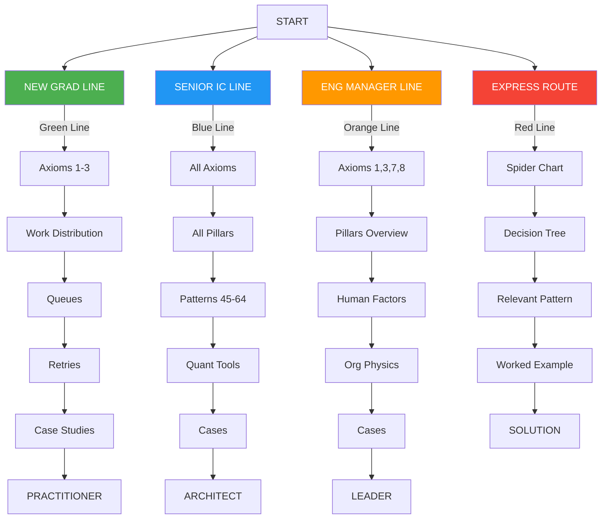
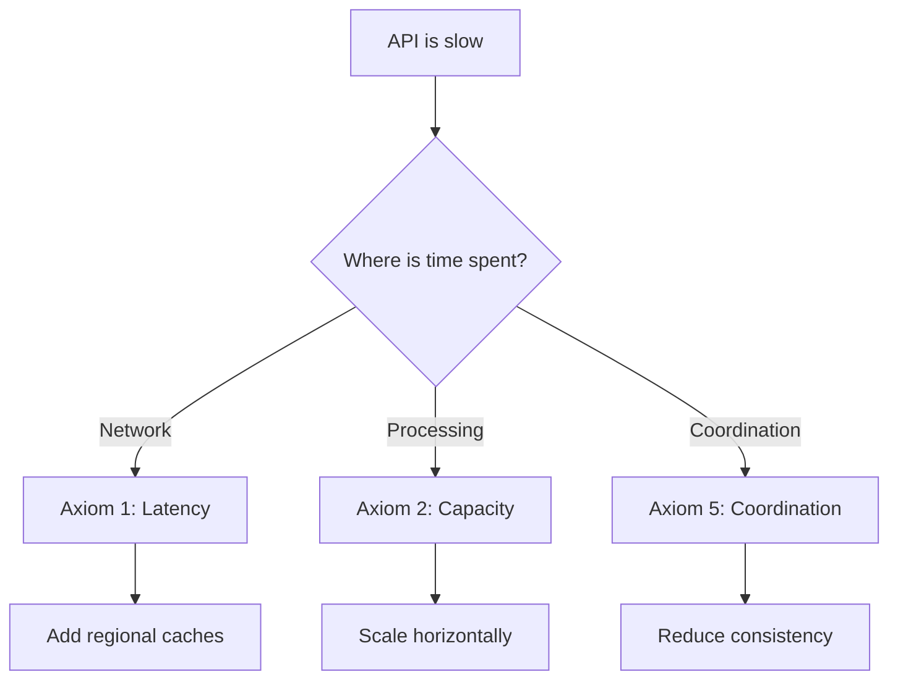

# Learning Roadmaps

!!! info "Prerequisites"
    - [Core Philosophy](philosophy.md) - Understand our approach
    - [Preface](preface.md) - Know why this exists

## Choose Your Path

**Learning Paths**

## New Graduate Path 🟢 {#new-graduate-path}

### Your Learning Objectives
- Build intuition for distributed systems
- Understand fundamental constraints
- Learn to identify common failures
- Develop debugging skills

### Recommended Route

1. **Week 1: Foundations**
   - [Axiom 1: Latency](../part1-axioms/axiom-1-latency/index.md) - Why distance matters
   - [Axiom 2: Capacity](../part1-axioms/axiom-2-capacity/index.md) - Why things break
   - [Axiom 3: Partial Failure](../part1-axioms/axiom-3-failure/index.md) - Why distributed is hard

2. **Week 2: Basic Patterns**
   - [Work Distribution Basics](../part2-pillars/pillar-1-work/index.md)
   - [Simple Queueing](../part1-axioms/axiom-2-capacity/index.md#queueing-theory)
   - [Retry Strategies](../part1-axioms/axiom-3-failure/index.md#retry-patterns)

3. **Week 3: Practical Application**
   - Try all 🔧 exercises
   - Read all 🎬 failure stories
   - Implement a distributed counter

4. **Week 4: Case Studies**
   - [Real-world failures](../part1-axioms/axiom-3-failure/examples.md)
   - Apply learnings to your current system
   - Present findings to team

### Skills You'll Gain
- ✅ Reason about distributed behavior
- ✅ Identify failure modes
- ✅ Design simple distributed systems
- ✅ Debug production issues

## Senior Engineer Path 🔵 {#senior-engineer-path}

### Your Learning Objectives
- Master all fundamental constraints
- Understand pattern derivations
- Make quantitative trade-offs
- Design complex systems

### Recommended Route

1. **Week 1: All Axioms**
   - Speed-read all [8 Axioms](../part1-axioms/index.md)
   - Focus on mathematical proofs
   - Note axiom interactions

2. **Week 2: All Pillars**
   - Deep dive into [5 Pillars](../part2-pillars/index.md)
   - Study pattern emergence
   - Examine trade-off matrices

3. **Week 3: Advanced Patterns**
   - Consensus protocols
   - Distributed transactions
   - Global coordination

4. **Week 4: Quantitative Tools**
   - [Latency calculator](../tools/latency-calculator.md)
   - [Capacity planner](../tools/capacity-planner.md)

### Skills You'll Gain
- ✅ Derive novel solutions
- ✅ Optimize existing systems
- ✅ Predict failure modes
- ✅ Lead architecture reviews

## Engineering Manager Path 🟠 {#manager-path}

### Your Learning Objectives
- Understand system economics
- Manage human factors
- Make informed trade-offs
- Lead incident response

### Recommended Route

1. **Week 1: Critical Axioms**
   - [Axiom 1: Latency](../part1-axioms/axiom-1-latency/index.md) - User experience
   - [Axiom 3: Failure](../part1-axioms/axiom-3-failure/index.md) - Incident patterns
   - [Axiom 7: Human Interface](../part1-axioms/axiom-7-human-interface/index.md) - Team dynamics
   - [Axiom 8: Economics](../part1-axioms/axiom-8-economics/index.md) - Cost models

2. **Week 2: System Overview**
   - [Pillars summary](../part2-pillars/index.md)
   - Decision frameworks
   - Trade-off matrices

3. **Week 3: Human Factors**
   - Cognitive load in operations
   - On-call best practices
   - Incident management

4. **Week 4: Organizational Physics**
   - Conway's Law implications
   - Team topology patterns
   - Communication costs

### Skills You'll Gain
- ✅ Evaluate architectural proposals
- ✅ Estimate project costs
- ✅ Design effective on-call
- ✅ Lead postmortems

## Express Route 🔴 {#express-route}

### When to Use
- Solving immediate problem
- Preparing for interview
- Quick architecture review
- Technology evaluation

### How It Works

1. **Identify Your Constraint**
   - Use the [Axiom Spider Chart](../part1-axioms/index.md#spider-chart)
   - Find dominant constraint

2. **Jump to Solution**
   - Follow relevant decision tree
   - Read specific pattern
   - Review similar failures

3. **Apply Immediately**
   - Use provided formulas
   - Implement suggested fix
   - Measure improvement

### Example: "Our API is too slow"

## Custom Paths

### By Problem Domain

| Domain | Focus Areas | Key Patterns |
|--------|-------------|--------------|
| **E-commerce** | Axioms 1,2,3,8 | Caching, eventual consistency |
| **Finance** | Axioms 3,4,5 | Strong consistency, transactions |
| **Gaming** | Axioms 1,2 | Edge computing, state sync |
| **Analytics** | Axioms 2,5,8 | Batch processing, cost optimization |
| **Social** | Axioms 2,3,6 | Feed generation, partial failures |

### By Technology Stack

| Stack | Relevant Sections | Special Considerations |
|-------|-------------------|------------------------|
| **Kubernetes** | Control planes, orchestration | Container scheduling |
| **Serverless** | Cost models, cold starts | Event-driven patterns |
| **Microservices** | All pillars | Service mesh, coordination |
| **Data Pipelines** | State, coordination | Exactly-once processing |

## Progress Tracking

### Checklist for Mastery

- [ ] Understand all 8 axioms
- [ ] Can derive basic patterns
- [ ] Completed 10+ exercises
- [ ] Read 20+ failure stories
- [ ] Applied to real system
- [ ] Made quantitative trade-off
- [ ] Debugged production issue
- [ ] Taught someone else

### Self-Assessment Questions

1. Can you explain why caching exists from first principles?
2. Given a system design, can you identify its failure modes?
3. Can you calculate the coordination cost of a protocol?
4. Do you know when to use strong vs eventual consistency?
5. Can you design a system that degrades gracefully?

## Navigation

!!! tip "Ready to Start?"
    
    **New Graduates**: [Begin with Axiom 1](../part1-axioms/axiom-1-latency/index.md) →
    
    **Experienced Engineers**: [Jump to Part I Overview](../part1-axioms/index.md) →
    
    **Quick Problem**: [Use the Decision Tree](../references/decision-trees.md) →