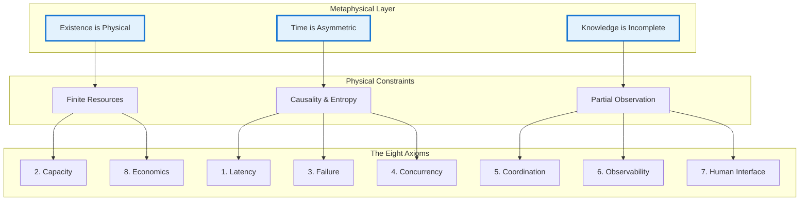

# The Zeroth Principles: Metaphysical Foundation

!!! abstract "The Ultimate Foundation"
    Before we can speak of systems, we must speak of the universe in which they exist. All technical constraints are downstream consequences of three metaphysical truths.

## The Three Metaphysical Truths

<div class="axiom-box">

### Axiom Zero-A: Existence is Physical

**The Substrate of Reality**: Information is not an abstract ideal; it is a physical state of matter. A bit is not a '1' or a '0' in the abstract; it is the spin of an electron, a voltage level in a transistor, or a pit etched into a disk.

**Inevitable Consequence**: **Finitude**. Because every component is built from a finite number of atoms and powered by a finite amount of energy, its capacity is inherently limited.

</div>

<div class="axiom-box">

### Axiom Zero-B: Time is Asymmetric

**The Arrow of Time**: This axiom asserts the fundamental asymmetry of time's flow. Cause must precede effect. The past is determined, while the future is probabilistic.

**Consequence I**: **The Primacy of Causality**. Given the finite speed of light, there is no universal "now". The only objective truth about event ordering is the "happened-before" relation.

**Consequence II**: **The Inevitability of Decay (Entropy)**. The Second Law of Thermodynamics dictates that disorder always increases. A distributed system is an island of order requiring constant energy to resist decay.

</div>

<div class="axiom-box">

### Axiom Zero-C: Knowledge is Incomplete

**The Veil of Observation**: There is no privileged, external viewpoint from which to observe a system. Any observer is part of the system it observes.

**Consequence I**: **The Uncertainty Principle**. One cannot simultaneously know all properties of a distributed system with perfect accuracy. By the time state information is gathered, it has already changed.

**Consequence II**: **The Problem of Other Minds**. A node can never directly access another's internal state. It can only build a model based on messages received—the root of the consensus challenge.

</div>

## The Deductive Chain

These three metaphysical truths form an unbreakable chain of reasoning:



## The Architect's Burden

<div class="mental-model-box">

Understanding these zeroth principles transforms the architect's role:

1. **From Mechanic to Physicist**: You're not just assembling components; you're arranging matter and energy in space and time.

2. **From Problem Solver to Constraint Navigator**: You don't overcome physics; you work within its boundaries.

3. **From Pattern Memorizer to Law Deriver**: You don't learn solutions; you derive them from first principles.

</div>

## Why This Matters

### Example: The Speed of Light and System Design

<div class="truth-box">

**Traditional Thinking**: "We need low latency, so let's optimize our code."

**First-Principles Thinking**: 
1. Light travels at 299,792 km/s (Axiom Zero-B)
2. NYC to Tokyo is 10,850 km
3. Minimum round-trip time: 72ms
4. No optimization can beat physics
5. **Therefore**: We must cache data geographically

The solution emerges from physics, not from a pattern catalog.

</div>

### Example: The CAP Theorem's Deeper Truth

The famous CAP theorem isn't just a computer science result—it's a necessary consequence of our metaphysical foundation:

1. **Knowledge is Incomplete** (Axiom Zero-C) → Nodes have partial views
2. **Time is Asymmetric** (Axiom Zero-B) → Messages take time to propagate  
3. **Existence is Physical** (Axiom Zero-A) → Networks can physically partition

Therefore, you cannot simultaneously guarantee:
- **Consistency**: All nodes see the same data (violates incomplete knowledge)
- **Availability**: All nodes can respond (requires complete knowledge during partition)
- **Partition Tolerance**: System continues despite network splits (physical reality)

## The Power of Deductive Reasoning

<div class="decision-box">

**From Metaphysics to Engineering**:

```
Metaphysical Truth
    ↓ (logical deduction)
Physical Constraint  
    ↓ (mathematical analysis)
System Behavior
    ↓ (engineering response)
Design Pattern
    ↓ (operational experience)
Best Practice
```

Each level is derived, not invented.

</div>

## Synthesis: The Complete Picture

When you internalize these zeroth principles, every distributed systems challenge becomes a physics problem:

- **Latency**: Speed of light constraint (Axiom Zero-B)
- **Capacity**: Finite matter and energy (Axiom Zero-A)
- **Failure**: Entropy increase (Axiom Zero-B)
- **Consistency**: Incomplete knowledge (Axiom Zero-C)
- **Coordination**: No privileged observer (Axiom Zero-C)
- **Cost**: Resource scarcity (Axiom Zero-A)

!!! success "Key Insight"
    Master these three metaphysical truths, and you'll never be surprised by a distributed systems problem again. Every challenge, every pattern, every failure mode flows inevitably from these foundations.

## Navigation

**Continue to**: [Core Philosophy](philosophy.md) → 

**Or explore**: [The Eight Axioms](../part1-axioms/index.md) →