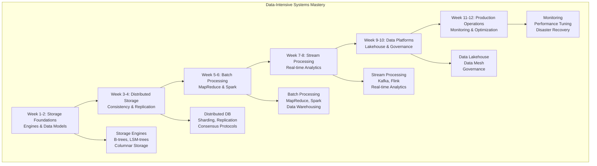

# Data-Intensive Systems Learning Path

**Essential Question**: *How do I design and build data systems that process, store, and analyze massive datasets with high reliability and performance?*

> **What You'll Master**: Complete data system architecture - from storage engines to distributed analytics platforms that handle petabytes of data for companies like Netflix, Uber, and Google.

## 🎯 Learning Journey Overview

Data-intensive systems are like designing a massive library system for the digital age - you need efficient storage, fast retrieval, reliable cataloging, and the ability to serve millions of simultaneous users while continuously growing. This path teaches you to design storage systems, build processing pipelines, handle consistency models, implement real-time analytics, and operate systems that process terabytes daily.



**Path Duration**: 10-12 weeks (18-25 hours/week)  
**Target Audience**: Senior engineers, data engineers, system architects  
**End Goal**: Design and operate production data systems at massive scale

## 🗺️ Complete Learning Roadmap

### Phase 1: Storage System Foundations (Weeks 1-2)

#### Week 1: Storage Engines and Data Models (20-25 hours)
**Goal**: Understand how data is physically stored and retrieved

**Core Storage Concepts** (12 hours):
- [LSM-Tree Storage](../pattern-library/data-management/lsm-tree.md) - Write-optimized storage
- [Write-Ahead Logging](../pattern-library/data-management/write-ahead-log.md) - Durability guarantees
- [Segmented Log](../pattern-library/data-management/segmented-log.md) - Append-only storage patterns
- B-Tree vs LSM-Tree trade-offs and use cases

**Data Model Deep-Dive** (8 hours):
- Relational model vs document model
- Graph data models and query patterns
- Time-series data storage optimization
- Columnar storage for analytics workloads

**Case Studies** (5 hours):
- [Google Bigtable](../architects-handbook/case-studies/databases/google-spanner.md) - Large-scale structured data
- [Amazon DynamoDB](../architects-handbook/case-studies/databases/amazon-dynamo.md) - High-performance NoSQL
- [Apache Cassandra](../architects-handbook/case-studies/databases/cassandra.md) - Wide-column store

**Hands-On Project**: Build a simple key-value store with LSM-tree storage engine

#### Week 2: Indexing and Query Processing (20-25 hours)
**Goal**: Master indexing strategies and query optimization

**Indexing Strategies** (10 hours):
- B-tree indexing and optimization
- Hash indexing for equality queries
- Bitmap indexes for analytical queries
- Full-text search indexing (inverted indexes)
- Geospatial indexing strategies

**Query Processing** (8 hours):
- Query planning and optimization
- Join algorithms and optimization
- Aggregation and window functions
- Query execution engines architecture

**Advanced Topics** (7 hours):
- [Bloom Filters](../pattern-library/data-management/bloom-filter.md) - Probabilistic data structures
- [Merkle Trees](../pattern-library/data-management/merkle-trees.md) - Data verification
- Compression techniques for storage efficiency

**Practical Implementation**: Extend key-value store with indexing and basic query processing

### Phase 2: Distributed Storage Systems (Weeks 3-4)

#### Week 3: Data Distribution and Consistency (22-25 hours)
**Goal**: Design distributed storage with appropriate consistency guarantees

**Distribution Strategies** (10 hours):
- [Consistent Hashing](../pattern-library/data-management/consistent-hashing.md) - Balanced data distribution
- [Sharding](../pattern-library/scaling/sharding.md) - Horizontal partitioning
- Data placement strategies and hotspot avoidance
- Cross-shard query processing

**Consistency Models** (8 hours):
- [Eventual Consistency](../pattern-library/data-management/eventual-consistency.md) - BASE properties
- Strong consistency with linearizability
- Causal consistency and session consistency
- [Tunable Consistency](../pattern-library/data-management/tunable-consistency.md) - Flexible guarantees

**Replication Patterns** (7 hours):
- Primary-replica replication
- Multi-primary replication
- [Read Repair](../pattern-library/data-management/read-repair.md) - Consistency maintenance
- Anti-entropy and gossip protocols

**Advanced Case Studies**:
- [Google Spanner](../architects-handbook/case-studies/databases/google-spanner.md) - Global consistency
- [Amazon Aurora](../architects-handbook/case-studies/databases/amazon-aurora.md) - Cloud-native database

#### Week 4: Distributed Transactions and Consensus (22-25 hours)
**Goal**: Handle transactions and coordination in distributed environments

**Transaction Processing** (12 hours):
- [Two-Phase Commit](../pattern-library/coordination/two-phase-commit.md) - Atomic transactions
- [Saga Pattern](../pattern-library/data-management/saga.md) - Long-running transactions
- Distributed deadlock detection and prevention
- Transaction isolation levels in distributed systems

**Consensus Protocols** (8 hours):
- [Consensus](../pattern-library/coordination/consensus.md) - Distributed agreement
- Raft consensus algorithm
- Byzantine fault tolerance
- Blockchain consensus mechanisms

**Advanced Patterns** (7 hours):
- [Vector Clocks](../pattern-library/coordination/vector-clocks.md) - Causal ordering
- [Hybrid Logical Clocks](../pattern-library/coordination/hlc.md) - Physical + logical time
- Conflict-free replicated data types (CRDTs)

**Complex Project**: Implement distributed database with configurable consistency levels and transaction support

### Phase 3: Large-Scale Batch Processing (Weeks 5-6)

#### Week 5: MapReduce and Distributed Computing (22-25 hours)
**Goal**: Master large-scale batch processing frameworks

**MapReduce Fundamentals** (10 hours):
- MapReduce programming model and execution
- Combiner patterns and optimization
- Partition functions and data locality
- Failure handling in distributed computation

**Apache Spark Deep-Dive** (10 hours):
- Spark architecture and RDD abstraction
- DataFrames and Dataset APIs
- Catalyst query optimizer
- Memory management and caching strategies

**Performance Optimization** (7 hours):
- Data skew handling and mitigation
- Resource allocation and tuning
- Serialization optimization
- Network and I/O optimization

**Case Studies**:
- [MapReduce at Google](../architects-handbook/case-studies/messaging-streaming/mapreduce.md)
- [Spark at Netflix](../architects-handbook/case-studies/messaging-streaming/apache-spark.md)

#### Week 6: Data Warehousing and Analytics (22-25 hours)
**Goal**: Build systems for analytical workloads and business intelligence

**Data Warehouse Architecture** (12 hours):
- Star schema and snowflake schema design
- Fact tables and dimension modeling
- Slowly changing dimensions
- Data mart vs data warehouse strategies

**Columnar Storage** (8 hours):
- Column-oriented storage benefits
- Compression techniques for columns
- Vectorized query execution
- Apache Parquet and ORC file formats

**OLAP and Analytics** (7 hours):
- OLAP cube design and operations
- Roll-up, drill-down, and slice/dice operations
- Materialized view strategies
- Real-time OLAP (ROLAP) patterns

**Advanced Implementation**: Build complete data warehouse with ETL pipelines and OLAP capabilities

### Phase 4: Real-Time Stream Processing (Weeks 7-8)

#### Week 7: Stream Processing Architectures (25-28 hours)
**Goal**: Design and implement real-time data processing systems

**Stream Processing Fundamentals** (12 hours):
- [Stream Processing](../pattern-library/data-management/stream-processing.md) - Real-time data pipelines
- Event time vs processing time semantics
- Windowing strategies (tumbling, sliding, session)
- Watermarks and late data handling

**Apache Kafka Ecosystem** (10 hours):
- Kafka architecture and internals
- Kafka Streams for stream processing
- Kafka Connect for data integration
- Schema Registry and Avro serialization

**Complex Event Processing** (8 hours):
- Pattern matching in event streams
- State management in stream processing
- Exactly-once processing guarantees
- Stream-table duality concepts

**Technology Comparison**:
- Apache Flink vs Kafka Streams vs Apache Storm
- Cloud streaming services (Dataflow, Kinesis Analytics)

#### Week 8: Real-Time Analytics and ML (25-28 hours)
**Goal**: Build systems for real-time analytics and machine learning inference

**Real-Time Analytics** (12 hours):
- Approximate algorithms for streaming (HyperLogLog, Count-Min Sketch)
- Real-time aggregations and metrics
- Anomaly detection in streams
- Real-time dashboard and alerting systems

**Stream ML and Feature Stores** (10 hours):
- [Feature Store](../pattern-library/ml-infrastructure/feature-store.md) - ML feature management
- Real-time feature computation
- Online learning and model updates
- A/B testing with streaming data

**Lambda vs Kappa Architectures** (8 hours):
- [Lambda Architecture](../pattern-library/architecture/lambda-architecture.md) - Batch + stream processing
- [Kappa Architecture](../pattern-library/architecture/kappa-architecture.md) - Stream-only processing
- Unified batch and stream processing

**Capstone Project**: Build real-time recommendation system with feature store and online learning

### Phase 5: Modern Data Platforms (Weeks 9-10)

#### Week 9: Data Lakehouse and Modern Architecture (25-28 hours)
**Goal**: Design modern data architectures with lakehouse patterns

**Data Lake vs Data Warehouse** (10 hours):
- [Data Lake](../pattern-library/data-management/data-lake.md) - Raw data storage
- [Data Lakehouse](../pattern-library/data-management/data-lakehouse.md) - Unified architecture
- Delta Lake, Apache Iceberg, Apache Hudi comparison
- Schema evolution and time travel queries

**Data Mesh Architecture** (10 hours):
- [Data Mesh](../pattern-library/data-management/data-mesh.md) - Decentralized data architecture
- Domain-oriented data ownership
- Data product thinking
- Federated computational governance

**Cloud Data Platforms** (8 hours):
- Snowflake architecture and features
- Databricks unified analytics platform
- Google BigQuery and separation of storage/compute
- AWS data analytics stack

**Advanced Topics**:
- Multi-cloud data strategies
- Data virtualization and federation
- Metadata management at scale

#### Week 10: Data Governance and Quality (25-28 hours)
**Goal**: Implement governance, lineage, and quality assurance

**Data Governance** (12 hours):
- Data catalog and metadata management
- Data lineage tracking and visualization
- Data classification and sensitivity
- Privacy-preserving techniques (differential privacy)

**Data Quality** (10 hours):
- Data quality dimensions and metrics
- Data validation and testing frameworks
- Data monitoring and alerting
- Root cause analysis for data issues

**Security and Compliance** (8 hours):
- Encryption at rest and in transit
- Access control and auditing
- GDPR and data privacy compliance
- Data masking and anonymization

**Final Integration Project**: Design complete data platform with governance, quality monitoring, and compliance

### Phase 6: Production Operations (Weeks 11-12)

#### Week 11: Monitoring and Observability (25-28 hours)
**Goal**: Monitor and troubleshoot data systems in production

**Data System Monitoring** (12 hours):
- Key metrics for data systems (throughput, latency, error rates)
- Query performance monitoring and optimization
- Resource utilization tracking
- Data freshness and SLA monitoring

**Observability Patterns** (10 hours):
- Distributed tracing for data pipelines
- Logging strategies for data systems
- Metrics aggregation and visualization
- Alerting and incident response

**Performance Tuning** (8 hours):
- Database performance optimization
- Query tuning and index optimization
- Memory and storage optimization
- Network optimization for data systems

**Tools and Technologies**:
- Prometheus and Grafana for metrics
- Jaeger for distributed tracing
- ELK stack for log analysis

#### Week 12: Scaling and Disaster Recovery (25-28 hours)
**Goal**: Scale data systems and implement disaster recovery

**Scaling Strategies** (12 hours):
- Horizontal vs vertical scaling decisions
- Auto-scaling for data workloads
- Multi-region data deployment
- Cost optimization for cloud data systems

**Disaster Recovery** (10 hours):
- Backup and restore strategies
- Cross-region replication
- Disaster recovery testing and procedures
- Business continuity planning

**Final Capstone Assessment** (10 hours):
- Design complete data architecture for enterprise scenario
- Present scaling and disaster recovery strategy
- Demonstrate production monitoring setup
- Conduct architecture review with industry experts

## 📚 Core Laws and Pillars Integration

### Primary Laws (Essential Understanding)
1. **[Law of Distributed Knowledge](../core-principles/laws/distributed-knowledge.md)** - Data consistency across distributed storage
2. **[Law of Economic Reality](../core-principles/laws/economic-reality.md)** - Cost optimization in data systems
3. **[Law of Multidimensional Optimization](../core-principles/laws/multidimensional-optimization.md)** - CAP theorem and consistency trade-offs
4. **[Law of Emergent Chaos](../core-principles/laws/emergent-chaos.md)** - Managing complexity in data pipelines

### Supporting Laws
5. **[Law of Correlated Failure](../core-principles/laws/correlated-failure.md)** - Failure modes in distributed storage
6. **[Law of Asynchronous Reality](../core-principles/laws/asynchronous-reality.md)** - Async processing in data pipelines
7. **[Law of Cognitive Load](../core-principles/laws/cognitive-load.md)** - Simplifying complex data architectures

### Pillars Application
- **Work Distribution**: Distributed computing frameworks (Spark, Hadoop)
- **State Distribution**: Database sharding, replication, and consistency
- **Truth Distribution**: Consensus protocols and distributed transactions
- **Control Distribution**: Data pipeline orchestration and failure handling
- **Intelligence Distribution**: Distributed analytics and ML inference

## 🛠️ Critical Patterns by Priority

### Tier 1: Storage Foundations (Must Master)
1. [LSM-Tree Storage](../pattern-library/data-management/lsm-tree.md)
2. [Write-Ahead Log](../pattern-library/data-management/write-ahead-log.md)
3. [Consistent Hashing](../pattern-library/data-management/consistent-hashing.md)
4. [Sharding](../pattern-library/scaling/sharding.md)
5. [Eventual Consistency](../pattern-library/data-management/eventual-consistency.md)

### Tier 2: Processing Patterns (Production Critical)
6. [Stream Processing](../pattern-library/data-management/stream-processing.md)
7. [Event Sourcing](../pattern-library/data-management/event-sourcing.md)
8. [CQRS](../pattern-library/data-management/cqrs.md)
9. [Saga Pattern](../pattern-library/data-management/saga.md)
10. [Change Data Capture](../pattern-library/data-management/cdc.md)

### Tier 3: Advanced Patterns (Scale and Optimization)
11. [Data Lakehouse](../pattern-library/data-management/data-lakehouse.md)
12. [Data Mesh](../pattern-library/data-management/data-mesh.md)
13. [Lambda Architecture](../pattern-library/architecture/lambda-architecture.md)
14. [Feature Store](../pattern-library/ml-infrastructure/feature-store.md)
15. [Polyglot Persistence](../pattern-library/data-management/polyglot-persistence.md)

## 📊 Case Studies Progression

### Weeks 1-3: Storage System Case Studies
- **[Google Bigtable](../architects-handbook/case-studies/databases/google-spanner.md)** - Distributed storage at scale
- **[Amazon DynamoDB](../architects-handbook/case-studies/databases/amazon-dynamo.md)** - High-performance NoSQL design
- **[Apache Cassandra](../architects-handbook/case-studies/databases/cassandra.md)** - Wide-column distributed database

### Weeks 4-6: Processing Framework Case Studies  
- **[MapReduce at Google](../architects-handbook/case-studies/messaging-streaming/mapreduce.md)** - Large-scale batch processing
- **[Spark at Netflix](../architects-handbook/case-studies/messaging-streaming/apache-spark.md)** - Unified analytics engine
- **[Hadoop Ecosystem](../architects-handbook/case-studies/infrastructure/kubernetes.md)** - Big data platform evolution

### Weeks 7-9: Real-Time System Case Studies
- **[Kafka at LinkedIn](../architects-handbook/case-studies/messaging-streaming/kafka.md)** - Real-time data streaming
- **[Uber's Data Platform](../architects-handbook/case-studies/location-services/uber-location.md)** - Real-time location processing
- **[Netflix Data Pipeline](../architects-handbook/case-studies/messaging-streaming/netflix-streaming.md)** - Streaming analytics

### Weeks 10-12: Platform Architecture Case Studies
- **[Airbnb's Data Platform](../architects-handbook/case-studies/social-communication/social-media-feed.md)** - Modern data architecture
- **[Stripe's Data Infrastructure](../architects-handbook/case-studies/elite-engineering/stripe-api-excellence.md)** - Financial data processing
- **[Shopify's Analytics Platform](../architects-handbook/case-studies/financial-commerce/shopify-flash-sales.md)** - E-commerce data systems

## 🎯 Prerequisites and Assessment

### Required Background
**Technical Prerequisites**:
- [ ] 3+ years backend development experience
- [ ] Strong SQL skills and database design knowledge
- [ ] Understanding of data structures and algorithms
- [ ] Experience with at least one JVM language (Java/Scala) or Python
- [ ] Basic knowledge of distributed systems concepts
- [ ] Familiarity with cloud platforms (AWS/GCP/Azure)

**Recommended Experience**:
- [ ] ETL/data pipeline development experience
- [ ] NoSQL database experience (MongoDB, Cassandra, etc.)
- [ ] Message queue systems (Kafka, RabbitMQ)
- [ ] Container orchestration (Kubernetes, Docker Swarm)
- [ ] Stream processing frameworks (Spark, Flink)

### Skills Assessment Matrix
Rate your current level (1-5) in each area:

| Skill Domain | Beginner (1-2) | Intermediate (3) | Advanced (4-5) |
|-------------|---------------|-----------------|---------------|
| **Database Design** | Basic tables/queries | Normalized schemas | Distributed databases |
| **Data Modeling** | Simple relationships | Complex domains | Event-driven models |
| **Processing Frameworks** | Basic SQL | Spark/Hadoop basics | Custom pipeline development |
| **System Architecture** | Single database | Multi-tier systems | Distributed architectures |
| **Performance Tuning** | Basic indexing | Query optimization | System-wide optimization |

**Path Customization Based on Assessment**:
- **Score 8-15**: Take full path, spend extra time on fundamentals
- **Score 16-22**: Standard path, focus on hands-on implementation  
- **Score 23-28**: Accelerated path, focus on advanced patterns and case studies
- **Score 29+**: Expert track, focus on bleeding-edge techniques and research

## 📈 Milestone Validation Framework

### Week 2 Checkpoint: Storage Engine Mastery
**Validation Requirements**:
- [ ] Implement basic LSM-tree storage engine from scratch
- [ ] Design indexing strategy for time-series data
- [ ] Explain trade-offs between B-tree and LSM-tree storage
- [ ] Optimize query performance using appropriate indexing

**Practical Assessment**: Build key-value database with configurable storage engines

### Week 4 Checkpoint: Distributed Storage Design  
**Validation Requirements**:
- [ ] Design sharding strategy for multi-tenant application
- [ ] Implement consensus protocol for distributed configuration
- [ ] Handle network partitions with appropriate consistency model
- [ ] Design cross-shard transaction processing

**Practical Assessment**: Implement distributed database with tunable consistency

### Week 6 Checkpoint: Batch Processing Expertise
**Validation Requirements**:
- [ ] Optimize large-scale MapReduce job performance
- [ ] Design data warehouse schema for analytical queries
- [ ] Implement complex ETL pipeline with error handling
- [ ] Build OLAP cube with drill-down capabilities

**Practical Assessment**: Create end-to-end data warehouse with analytics

### Week 8 Checkpoint: Stream Processing Proficiency
**Validation Requirements**:
- [ ] Build real-time analytics system with windowing
- [ ] Implement exactly-once processing guarantees
- [ ] Design feature store for machine learning
- [ ] Handle late-arriving data and out-of-order events

**Practical Assessment**: Develop real-time recommendation engine

### Week 10 Checkpoint: Modern Platform Architecture
**Validation Requirements**:
- [ ] Design data lakehouse architecture with governance
- [ ] Implement data mesh with domain-oriented ownership
- [ ] Create data quality monitoring and alerting system
- [ ] Demonstrate compliance with privacy regulations

**Practical Assessment**: Architect complete data platform for enterprise

### Week 12 Final Assessment: Production Readiness
**Comprehensive Evaluation**:
- [ ] Present scalable data architecture handling petabyte-scale data
- [ ] Demonstrate monitoring, alerting, and incident response capabilities
- [ ] Design disaster recovery with RPO/RTO requirements
- [ ] Conduct performance analysis and optimization recommendations
- [ ] Lead architecture review with industry experts

## 🎓 Advanced Career Outcomes

### Technical Leadership Roles
**Staff Data Engineer** ($180k-250k):
- Lead design of company-wide data infrastructure
- Define data architecture standards and best practices
- Mentor engineering teams on data system design

**Principal Data Architect** ($220k-320k):
- Design enterprise data strategy and roadmap
- Evaluate and select data technologies for organization
- Lead technical decisions for data platform evolution

**Distinguished Engineer - Data Systems** ($300k-500k+):
- Research and develop next-generation data technologies
- Influence industry standards and open source projects
- Represent company in data technology conferences

### Management Track Progression
**Data Platform Engineering Manager** ($200k-280k):
- Manage team building data infrastructure
- Balance technical decisions with business requirements
- Drive adoption of data platform across organization

**Director of Data Engineering** ($250k-400k):
- Lead multiple data engineering teams
- Own P&L for data platform investment
- Partner with business leaders on data strategy

**VP of Data Infrastructure** ($350k-600k+):
- Set technical vision for data systems across company
- Manage engineering budget for data initiatives
- Board-level reporting on data capabilities

### Specialized Expert Paths
**Real-time Systems Architect** ($200k-350k):
- Focus on low-latency, high-throughput systems
- Industries: Finance, Gaming, IoT, Autonomous Systems

**ML Platform Engineer** ($180k-300k):
- Build infrastructure for machine learning at scale
- Design feature stores and model serving platforms

**Data Governance Specialist** ($160k-250k):
- Implement data privacy and compliance systems
- Design data cataloging and lineage solutions

## 🤝 Community and Industry Engagement

### Professional Development
**Conference Participation**:
- Strata Data Conference (O'Reilly)
- DataEngConf and Data Council
- Apache Kafka Summit
- Spark + AI Summit

**Certification Paths**:
- Google Cloud Professional Data Engineer
- AWS Certified Big Data - Specialty  
- Databricks Certified Data Engineer
- Confluent Certified Kafka Developer

### Open Source Contributions
**High-Impact Projects**:
- Apache Kafka ecosystem contributions
- Apache Spark optimization projects
- Delta Lake/Iceberg feature development
- Data quality and monitoring tools

**Community Leadership**:
- Local data engineering meetup organization
- Conference speaking on data architecture
- Technical blog writing and thought leadership
- Mentoring junior data engineers

### Industry Networking
**Professional Communities**:
- Data Engineering Weekly newsletter
- Data Talks Club community
- Reddit r/dataengineering
- LinkedIn data engineering groups

**Mentorship and Learning**:
- Pair with senior data architects from FAANG companies
- Join architecture review sessions with industry experts
- Participate in data engineering book clubs
- Attend vendor-neutral technology discussions

## 🚀 Getting Started This Week

### Environment Setup (4-6 hours)
**Development Environment**:
```bash
# Install Java, Scala, Python for data processing
# Set up Apache Spark locally
pip install pyspark jupyter pandas

# Install database systems for learning
docker run -d --name postgres -p 5432:5432 -e POSTGRES_PASSWORD=password postgres
docker run -d --name redis -p 6379:6379 redis
docker run -d --name kafka -p 9092:9092 confluentinc/cp-kafka

# Cloud accounts for advanced exercises
# AWS free tier, GCP $300 credit, Azure free account
```

**Learning Resources Setup**:
- Subscribe to data engineering newsletters
- Join community Slack channels
- Set up GitHub repository for projects
- Configure development environment

### Week 1 Immediate Actions
**Day 1**: Complete skills assessment and customize learning path
**Day 2-3**: Read foundational laws and understand data system constraints
**Day 4-5**: Implement basic key-value storage engine
**Day 6-7**: Study LSM-tree architecture and trade-offs

### Long-term Success Strategies
**Daily Habits**:
- 3-4 hours focused coding on data systems
- Read data engineering blogs and papers
- Engage with community discussions
- Document learnings and share insights

**Weekly Goals**:
- Complete one major implementation project
- Analyze one production case study in detail  
- Participate in community discussions
- Practice system design problems

**Monthly Objectives**:
- Present learning progress to peers
- Contribute to open source data projects
- Write technical blog post on learnings
- Apply knowledge to current work projects

---

**Ready to master data systems that power the world's largest applications?** Begin with [Law of Distributed Knowledge](../core-principles/laws/distributed-knowledge.md) to understand the fundamental challenges of managing data across distributed systems.

*Remember: Data-intensive systems are the foundation of modern digital businesses - from recommendation engines to financial trading platforms, mastering these concepts opens doors to the most challenging and rewarding technical problems.*