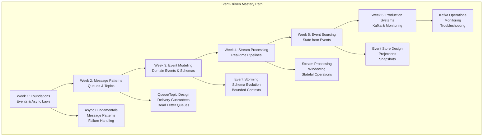

# Event-Driven Systems Learning Path

**Essential Question**: *How do I design and build event-driven systems that handle millions of events with guaranteed delivery and ordering?*

> **What You'll Master**: Complete event-driven architecture - from event modeling to production streaming platforms that power modern applications.

## 🎯 Learning Journey Overview

Event-driven architecture is like designing a bustling city's communication system - instead of everyone calling everyone directly, you create efficient message routing that allows components to communicate asynchronously, scale independently, and respond to changes in real-time. This path teaches you to model events, design message flows, implement streaming platforms, and build systems that react to business events as they occur.



**Path Duration**: 6-8 weeks (12-18 hours/week)  
**Target Audience**: Backend developers, system architects moving to event-driven patterns  
**End Goal**: Design and operate production event-driven systems

## 🗺️ Complete Learning Roadmap

### Week 1: Event-Driven Foundations (12-15 hours)
**Goal**: Understand asynchronous communication and fundamental event patterns

#### Core Concepts (8 hours)
**Essential Laws**:
- [Law of Asynchronous Reality](../core-principles/laws/asynchronous-reality.md) - Why synchronous systems don't scale
- [Law of Correlated Failure](../core-principles/laws/correlated-failure.md) - Decoupling to prevent cascades
- [Law of Emergent Chaos](../core-principles/laws/emergent-chaos.md) - Managing async system complexity

**Fundamental Patterns**:
- [Event-Driven Architecture](../pattern-library/architecture/event-driven.md) - Core architecture principles
- [Publish-Subscribe](../pattern-library/communication/publish-subscribe.md) - Decoupled communication
- [Message Queue](../pattern-library/communication/request-reply.md) - Reliable async messaging

#### Practical Implementation (7 hours)
**Hands-On Project**: Build Basic Event System
- Implement pub/sub with Redis/RabbitMQ
- Create event producers and consumers
- Handle basic failure scenarios
- Monitor message flow and latency

**Assessment**:
- Explain benefits of async vs sync communication
- Implement reliable message delivery
- Design event flow for simple e-commerce scenario

### Week 2: Message Patterns and Delivery Guarantees (15-18 hours)
**Goal**: Master different messaging patterns and reliability guarantees

#### Message Pattern Deep-Dive (10 hours)
**Core Patterns**:
- [Message Routing](../pattern-library/communication/publish-subscribe.md) - Topic-based routing
- [Competing Consumers](../pattern-library/scaling/queues-streaming.md) - Load distribution
- [Message Filtering](../pattern-library/communication/api-gateway.md) - Content-based routing
- [Dead Letter Queues](../pattern-library/resilience/graceful-degradation.md) - Failure handling

**Delivery Guarantees**:
- At-most-once delivery (fast, potential loss)
- At-least-once delivery (reliable, potential duplicates)
- Exactly-once delivery (complex, consistent)
- Idempotency patterns for duplicate handling

#### Advanced Implementation (8 hours)
**Complex Project**: E-commerce Event System
- Order processing with guaranteed delivery
- Inventory updates with idempotency
- Email notifications with retry logic
- Payment processing with compensation
- Implement all three delivery guarantee levels

**Technology Focus**:
- Apache Kafka for high-throughput messaging
- RabbitMQ for complex routing
- Amazon SQS/SNS for cloud-native solutions
- Apache Pulsar for global replication

### Week 3: Event Modeling and Schema Design (15-18 hours)
**Goal**: Model business domain events and design evolving schemas

#### Domain Event Modeling (10 hours)
**Event Storming Techniques**:
- Identifying domain events from business processes
- Mapping events to bounded contexts
- Designing event hierarchies and relationships
- Modeling temporal events and state changes

**Schema Evolution**:
- Forward and backward compatibility
- Schema registry patterns
- Versioning strategies for events
- Migration patterns for schema changes

**Case Study Analysis** (4 hours):
- [Netflix Event Architecture](../architects-handbook/case-studies/messaging-streaming/netflix-streaming.md)
- [Uber Real-time Events](../architects-handbook/case-studies/location-services/uber-location.md)

#### Practical Workshop (8 hours)
**Event Modeling Workshop**: Design events for complex domain
- Banking transaction events
- Social media interaction events  
- IoT device telemetry events
- Gaming player action events

**Schema Implementation**:
- Avro schema design and evolution
- JSON Schema with validation
- Protocol Buffers for performance
- Event schema documentation

### Week 4: Stream Processing and Real-time Pipelines (18-20 hours)
**Goal**: Build real-time data processing pipelines with windowing and aggregations

#### Stream Processing Fundamentals (12 hours)
**Core Concepts**:
- [Stream Processing](../pattern-library/data-management/stream-processing.md) - Real-time data pipelines
- Stateless vs stateful stream processing
- Windowing strategies (tumbling, sliding, session)
- Time semantics (event time vs processing time)

**Advanced Patterns**:
- [Event Streaming](../pattern-library/architecture/event-streaming.md) - Continuous data flow
- Stream joins and aggregations
- Exactly-once processing guarantees
- Stream-table duality concepts

**Technology Deep-Dive**:
- Apache Kafka Streams
- Apache Flink for complex event processing
- Apache Pulsar Functions
- Cloud stream processing (Dataflow, Kinesis)

#### Complex Implementation (8 hours)
**Real-time Analytics Pipeline**:
- User activity stream processing
- Real-time recommendation engine
- Fraud detection with windowed aggregations
- IoT sensor data processing pipeline

**Performance Optimization**:
- Partitioning strategies for parallelism
- State store optimization
- Checkpoint and recovery mechanisms
- Latency vs throughput trade-offs

### Week 5: Event Sourcing and CQRS (18-20 hours)
**Goal**: Implement event sourcing patterns and command-query separation

#### Event Sourcing Deep-Dive (12 hours)
**Core Patterns**:
- [Event Sourcing](../pattern-library/data-management/event-sourcing.md) - State from events
- [CQRS](../pattern-library/data-management/cqrs.md) - Command Query Responsibility Segregation
- Event store design and implementation
- Projection patterns for read models

**Advanced Concepts**:
- Snapshot strategies for performance
- Event versioning and upcasting
- Temporal queries and point-in-time recovery
- Event store partitioning and sharding

**Case Studies**:
- [Figma's CRDT Events](../architects-handbook/case-studies/elite-engineering/figma-crdt-collaboration.md)
- [Banking Event Sourcing](../architects-handbook/case-studies/financial-commerce/payment-system.md)

#### Production Implementation (8 hours)
**Event-Sourced System**: Build complete application
- Command handlers with validation
- Event store with optimistic locking
- Multiple read model projections
- Event replay and recovery mechanisms

**Technologies**:
- EventStore database
- Apache Kafka as event log
- Custom event store implementation
- Cloud event sourcing services

### Week 6: Production Operations and Monitoring (18-20 hours)
**Goal**: Deploy and operate event-driven systems in production

#### Production Kafka Operations (12 hours)
**Kafka Mastery**:
- Cluster setup and configuration
- Topic partitioning strategies
- Replication and fault tolerance
- Performance tuning and monitoring

**Advanced Operations**:
- Cross-datacenter replication
- Schema registry operations
- Connector management (Kafka Connect)
- Security and access control

**Monitoring and Observability**:
- Kafka metrics and alerting
- Consumer lag monitoring
- Message tracing across services
- Performance bottleneck identification

#### Production Challenges (8 hours)
**Incident Response**:
- Message loss investigation
- Consumer lag remediation
- Partition rebalancing issues
- Schema evolution failures

**Scaling Strategies**:
- Horizontal scaling patterns
- Hot partition mitigation
- Consumer group optimization
- Multi-region event replication

**Final Capstone Project**:
Complete event-driven e-commerce platform:
- Order processing with event sourcing
- Real-time inventory management
- Customer notification system
- Analytics and reporting pipelines
- Full production deployment

## 📚 Core Laws and Pillars Integration

### Primary Laws (Deep Focus)
1. **[Law of Asynchronous Reality](../core-principles/laws/asynchronous-reality.md)** - Foundation of event-driven thinking
2. **[Law of Correlated Failure](../core-principles/laws/correlated-failure.md)** - Decoupling for resilience
3. **[Law of Emergent Chaos](../core-principles/laws/emergent-chaos.md)** - Managing complex event flows
4. **[Law of Distributed Knowledge](../core-principles/laws/distributed-knowledge.md)** - Event-based state synchronization

### Supporting Laws
5. **[Law of Cognitive Load](../core-principles/laws/cognitive-load.md)** - Keeping event systems understandable
6. **[Law of Economic Reality](../core-principles/laws/economic-reality.md)** - Cost-benefit of async patterns
7. **[Law of Multidimensional Optimization](../core-principles/laws/multidimensional-optimization.md)** - Trade-offs in event systems

### Core Pillars Application
- **Work Distribution**: Event-driven task distribution and load balancing
- **State Distribution**: Event sourcing and eventual consistency patterns
- **Truth Distribution**: Event ordering and consensus in distributed logs
- **Control Distribution**: Event-based orchestration and choreography
- **Intelligence Distribution**: Stream processing and real-time decision making

## 🛠️ Essential Patterns by Priority

### Tier 1: Foundation Patterns (Must Master)
1. [Event-Driven Architecture](../pattern-library/architecture/event-driven.md)
2. [Publish-Subscribe](../pattern-library/communication/publish-subscribe.md)
3. [Message Queue](../pattern-library/scaling/queues-streaming.md)
4. [Event Streaming](../pattern-library/architecture/event-streaming.md)
5. [Asynchronous Processing](../core-principles/laws/asynchronous-reality.md)

### Tier 2: Advanced Patterns (Production Ready)
6. [Event Sourcing](../pattern-library/data-management/event-sourcing.md)
7. [CQRS](../pattern-library/data-management/cqrs.md)
8. [Saga Pattern](../pattern-library/data-management/saga.md)
9. [Outbox Pattern](../pattern-library/data-management/outbox.md)
10. [Stream Processing](../pattern-library/data-management/stream-processing.md)

### Tier 3: Specialized Patterns (Expert Level)
11. [Choreography](../pattern-library/architecture/choreography.md)
12. [Event Store](../pattern-library/data-management/segmented-log.md)
13. [Materialized Views](../pattern-library/data-management/materialized-view.md)
14. [Change Data Capture](../pattern-library/data-management/cdc.md)
15. [Multi-Region Event Replication](../pattern-library/scaling/multi-region.md)

## 📊 Case Studies by Week

### Week 1-2: Messaging Foundations
- **[Apache Kafka at LinkedIn](../architects-handbook/case-studies/messaging-streaming/kafka.md)** - Understanding message broker scaling
- **[Netflix Event-Driven Architecture](../architects-handbook/case-studies/messaging-streaming/netflix-streaming.md)** - Large-scale async patterns

### Week 3-4: Event Modeling and Processing
- **[Uber Real-time Processing](../architects-handbook/case-studies/location-services/uber-location.md)** - Location event modeling
- **[Twitter Timeline Generation](../case-studies/twitter-timeline.md)** - Social media event patterns

### Week 5-6: Advanced Patterns and Production
- **[Banking Event Sourcing](../architects-handbook/case-studies/financial-commerce/payment-system.md)** - Financial event modeling
- **[Figma Real-time Collaboration](../architects-handbook/case-studies/elite-engineering/figma-crdt-collaboration.md)** - Distributed event handling

## 🎯 Prerequisites Assessment

### Required Background
**Development Experience**: 
- [ ] 2+ years building web applications
- [ ] Experience with REST APIs and HTTP
- [ ] Basic understanding of databases (SQL/NoSQL)
- [ ] Familiarity with concurrent/parallel programming

**System Design Knowledge**:
- [ ] Understanding of distributed system challenges
- [ ] Basic knowledge of load balancing and caching
- [ ] Experience with cloud platforms (AWS/GCP/Azure)
- [ ] Container knowledge (Docker basics)

**Programming Skills**:
- [ ] Proficiency in at least one backend language (Java, Python, Go, etc.)
- [ ] Understanding of async/await patterns
- [ ] Experience with JSON/XML data formats
- [ ] Basic networking concepts (TCP, HTTP)

### Pre-Path Skills Assessment
Rate your current level (1-5) in each area:

| Skill Area | Beginner (1-2) | Intermediate (3) | Advanced (4-5) |
|------------|---------------|-----------------|---------------|
| **Async Programming** | Callbacks, basic promises | Async/await, event loops | Reactive programming |
| **Message Queues** | Never used | Basic pub/sub | Production queue systems |
| **Event Modeling** | Basic events | Domain events | Event sourcing |
| **Stream Processing** | Batch processing only | Basic streaming | Complex stream ops |
| **System Design** | Single services | Multi-service systems | Distributed architecture |

**Recommended Starting Points**:
- **Score 5-10**: Begin with Week 1, take extra time on fundamentals
- **Score 11-15**: Start with Week 1, can move faster through basics
- **Score 16-20**: Consider starting with Week 2 after reviewing core laws
- **Score 20+**: Focus on advanced patterns and production concerns

## 📈 Weekly Milestones and Validation

### Week 1 Checkpoint: Async Fundamentals
**Validation Criteria**:
- [ ] Implement reliable pub/sub system with failure handling
- [ ] Explain trade-offs between sync and async communication
- [ ] Design event flow for a simple application scenario
- [ ] Handle message failures and implement basic retry logic

**Practical Assessment**:
Build a notification system that handles email and SMS events with guaranteed delivery.

### Week 2 Checkpoint: Message Patterns Mastery  
**Validation Criteria**:
- [ ] Implement all three delivery guarantee levels
- [ ] Design competing consumer pattern for load distribution
- [ ] Handle duplicate messages with idempotency patterns
- [ ] Set up dead letter queues and error handling

**Practical Assessment**:
Create an order processing system with inventory updates and payment processing events.

### Week 3 Checkpoint: Event Modeling Expertise
**Validation Criteria**:
- [ ] Model domain events using event storming techniques
- [ ] Design backward-compatible schema evolution
- [ ] Implement event hierarchies and relationships
- [ ] Document events with proper schema definitions

**Practical Assessment**:
Design complete event model for a banking or e-commerce domain with schema registry.

### Week 4 Checkpoint: Stream Processing Proficiency
**Validation Criteria**:
- [ ] Build real-time aggregations with windowing
- [ ] Implement stateful stream processing operations
- [ ] Handle exactly-once processing guarantees
- [ ] Optimize stream processing for low latency

**Practical Assessment**:
Create real-time fraud detection system using streaming patterns.

### Week 5 Checkpoint: Event Sourcing Implementation
**Validation Criteria**:
- [ ] Implement complete event sourcing system
- [ ] Build multiple read model projections
- [ ] Handle event versioning and schema evolution
- [ ] Implement snapshot and replay mechanisms

**Practical Assessment**:
Build event-sourced banking account system with transaction history.

### Week 6 Final Assessment: Production Operations
**Validation Criteria**:
- [ ] Deploy and operate production Kafka cluster
- [ ] Implement comprehensive monitoring and alerting
- [ ] Handle production incidents and performance issues
- [ ] Design multi-region event replication strategy

**Final Capstone**:
Present complete event-driven system architecture with monitoring, scaling, and disaster recovery plans.

## 🎓 Learning Outcomes and Career Advancement

### Technical Mastery Achieved
**System Design Excellence**:
- Design event-driven architectures that scale to millions of events
- Model complex business domains using events and bounded contexts
- Implement reliable message delivery with appropriate guarantees
- Build real-time stream processing pipelines

**Production Operations Proficiency**:
- Operate Apache Kafka clusters in production environments
- Monitor and troubleshoot distributed event systems
- Handle schema evolution and backward compatibility
- Implement disaster recovery for event streaming platforms

**Advanced Pattern Implementation**:
- Event sourcing with CQRS for complex business domains
- Multi-region event replication and consistency
- Stream processing with exactly-once semantics
- Choreography-based microservices coordination

### Career Progression Opportunities
**Immediate Roles**:
- **Event Platform Engineer** ($120k-180k)
- **Stream Processing Developer** ($130k-200k)
- **Kafka Platform Specialist** ($140k-190k)
- **Real-time Systems Engineer** ($150k-220k)

**Advanced Career Paths**:
- **Principal Event Architect** ($200k-300k+)
- **Streaming Platform Lead** ($180k-250k)
- **Real-time Data Platform Director** ($250k-400k)
- **Distinguished Engineer - Event Systems** ($300k+)

**Industry Demand Areas**:
- Fintech (trading, payments, fraud detection)
- Gaming (real-time multiplayer, analytics)
- IoT/Industrial (sensor data processing)
- Social Media (activity feeds, recommendations)
- E-commerce (inventory, order processing)

## 🤝 Community and Learning Support

### Study Groups and Mentorship
- **Discord Channel**: `#event-driven-learners`
- **Weekly Live Sessions**: Wednesdays 8 PM EST
- **Code Review Groups**: Paired learning with peer feedback
- **Mentor Office Hours**: Tuesdays 7 PM EST with industry practitioners

### Project Collaboration
- **Shared Kafka Cluster**: For learning and experimentation
- **Open Source Contributions**: Contribute to Kafka ecosystem projects
- **Industry Projects**: Work on real-world event systems with mentors
- **Conference Presentations**: Present your learning journey

### Learning Resources
- **Video Walkthroughs**: Screen recordings of complex implementations
- **Interactive Labs**: Hands-on exercises with immediate feedback
- **Case Study Deep-Dives**: Detailed analysis sessions
- **Architecture Review Sessions**: Get expert feedback on your designs

## 🚀 Getting Started Today

### Environment Setup (1-2 hours)
**Development Environment**:
```bash
# Install Docker and Docker Compose
# Set up Kafka cluster locally
docker-compose -f kafka-cluster.yml up -d

# Install programming language SDKs
# Python: pip install kafka-python confluent-kafka
# Java: Maven dependencies for Kafka clients
# Node.js: npm install kafkajs

# Set up monitoring tools
# Kafka Manager or Conduktor for cluster management
```

**Cloud Setup** (Optional):
- Confluent Cloud free tier account
- AWS MSK or Google Cloud Pub/Sub
- Azure Event Hubs for cloud-native development

### Week 1 Quick Start
1. **Day 1**: Read [Law of Asynchronous Reality](../core-principles/laws/asynchronous-reality.md)
2. **Day 2-3**: Implement basic pub/sub with Redis
3. **Day 4-5**: Build reliable message queue system
4. **Day 6-7**: Create event-driven notification system

### Success Strategies
- **Daily Practice**: Spend 2-3 hours daily on hands-on coding
- **Real-World Application**: Apply patterns to your current work
- **Community Engagement**: Share progress and ask questions
- **Portfolio Building**: Document all projects for job interviews
- **Industry Focus**: Choose use cases relevant to your target industry

### Common Pitfalls to Avoid
- **Over-Engineering**: Start simple, add complexity gradually
- **Ignoring Operations**: Focus on production concerns early
- **Schema Negligence**: Plan schema evolution from the beginning
- **Testing Gaps**: Include testing strategies for async systems
- **Monitoring Blindness**: Implement observability from day one

---

**Ready to start building reactive, scalable systems?** Begin with [Law of Asynchronous Reality](../core-principles/laws/asynchronous-reality.md) to understand why event-driven architecture is essential for modern distributed systems.

*Remember: Event-driven systems aren't just about technology - they're about designing systems that mirror how business actually works: through events, reactions, and continuous adaptation.*