# 🎓 Learning Paths

# 🎓 Learning Paths Guide

## 🗺 Navigate Your Distributed Systems Journey

This guide helps you navigate the enhanced documentation based on your role, experience level, and learning goals.

```mermaid
graph TD
    Start["🎯 Start Here"] --> Assessment{"📊 What's Your Goal?"}
    
    Assessment -->|"Learn Fundamentals"| Foundation["📚 Foundation Path"]
    Assessment -->|"Build Systems"| Practice["🛠️ Practice Path"]
    Assessment -->|"Design Architecture"| Design["🏗️ Design Path"]
    Assessment -->|"Lead Teams"| Leadership["💼 Leadership Path"]
    
    Foundation --> Laws["⚖️ 7 Fundamental Laws"]
    Practice --> Patterns["🎨 20+ Patterns"]
    Design --> TradeOffs["📊 Trade-off Analysis"]
    Leadership --> Strategy["🚀 Strategic Decisions"]
    
    Laws --> Applied["💻 Apply to Real Systems"]
    Patterns --> Applied
    TradeOffs --> Applied
    Strategy --> Applied
    
    Applied --> Expert["🏆 Domain Expert"]
    
    style Start fill:#f9f,stroke:#333,stroke-width:4px
    style Expert fill:#9f9,stroke:#333,stroke-width:2px
```



---

## Quick Start by Role

### 👨‍🎓 New Graduate / Junior Engineer
**Goal**: Build strong foundations in distributed systems

<div class="learning-roadmap">


</div>

#### Week 1-2: Fundamentals

**Time Investment**: 🕒 20-25 hours

1. **Day 1-2**: Start with [Law 1: Failure](part1-axioms/law1-failure/index.md)
   - 📖 Read theory (2 hours)
   - 👀 Study cascading failure examples (2 hours)
   - Complete hands-on exercises (4 hours)
   
2. **Day 3-8**: Progress through Laws 2-4:
   - [Law 2: Asynchronous Reality](part1-axioms/law2-asynchrony/index.md) - Time has no meaning
   - [Law 3: Emergence](part1-axioms/law3-emergence/index.md) - Chaos from scale
   - [Law 4: Trade-offs](part1-axioms/law4-tradeoffs/index.md) - Beyond CAP
   
   **Learning Strategy**:
   - Focus on examples sections first
   - Try exercises after understanding concepts
   - Take notes on key insights

#### Week 3-4: Practical Application
1. Study [Rate Limiter Case Study](case-studies/rate-limiter.md)
   - See how laws apply in practice
   - Review architecture alternatives
2. Explore [Circuit Breaker Pattern](patterns/circuit-breaker.md)
   - Understand failure handling
   - Build the example implementation

#### Week 5-6: Systems Thinking
1. Read [Little's Law](quantitative/littles-law.md)
   - Master fundamental queue theory
2. Study [Availability Math](quantitative/availability-math.md)
   - Calculate system reliability

### 👩‍ Senior Engineer / Tech Lead
**Goal**: Design better distributed systems

<div class="skill-progression">


</div>

#### Fast Track (1 week)

**Daily Time Commitment**: 🕒 2-3 hours

1. **Day 1-2**: Review all [Law Mapping Tables](case-studies/index.md)
   - See how Netflix, Uber, Google apply laws
   - Study architecture trade-offs
   - Extract patterns from real systems
   
2. **Day 3-4**: Deep dive into [Distributed Knowledge](part1-axioms/law5-epistemology/index.md)
   - Understand truth and certainty in distributed systems
   - 🏛 Master Byzantine epistemology
   - Apply to consensus protocols
   
3. **Day 5-7**: Master [Economic Reality](part1-axioms/law7-economics/index.md)
   - Make cost-aware architecture decisions
   - Build TCO models
   - Balance performance vs cost

#### Architecture Focus (2 weeks)
1. Study all case study architecture alternatives:
   - [YouTube](case-studies/youtube.md) - Video at scale
   - [PayPal](case-studies/paypal-payments.md) - Financial consistency
   - [Uber](case-studies/uber-location.md) - Real-time geo-distributed
2. Review [Human Factors](human-factors/index.md)
   - Design for operability
   - Plan for on-call reality

### 👔 Engineering Manager / Director
**Goal**: Make strategic technical decisions

#### Executive Path (3 days)
1. Start with [Economic Reality](part1-axioms/law7-economics/index.md)
   - Understand cost drivers
   - Review cloud optimization strategies
2. Study [Cognitive Load](part1-axioms/law6-human-api/index.md)
   - Plan for operational load
   - Design sustainable on-call
3. Review [Trade-off Matrices](case-studies/amazon-dynamo.md#trade-off-analysis)
   - Make informed architecture choices
   - Balance technical and business needs

### Solution Architect
**Goal**: Design systems that meet business requirements

#### Pattern-First Approach (1 week)
1. Start with [Pattern Index](../../patterns/index.md)
   - Map patterns to business problems
   - Understand implementation complexity
2. For each relevant pattern, review:
   - Law connections
   - Trade-off analysis
   - Real-world examples
3. Study relevant case studies:
   - Similar scale/domain examples
   - Architecture decision rationales

---

## 📚 Learning Paths by Topic

### Path 1: Consistency and Coordination
**For**: Database engineers, financial systems developers


**Learning Milestones**:

1. **Foundation** (🕒 1 week)
   - [Law 2: Asynchronous Reality](part1-axioms/law2-asynchrony/index.md)
   - [Law 5: Epistemology](part1-axioms/law5-epistemology/index.md)
   
2. **Theory** (🕒 1 week)
   - 🔺 [CAP Theorem implications](part2-pillars/truth/index.md)
   - [Consistency Models](patterns/tunable-consistency.md)
   
3. **Practice** (🕒 2 weeks)
   - 💳 [PayPal Payments](case-studies/paypal-payments.md) - Financial consistency
   - [DynamoDB](case-studies/amazon-dynamo.md) - Eventually consistent at scale
   
4. **Advanced** (🕒 1 week)
   - [Distributed Knowledge Exercises](part1-axioms/law5-epistemology/exercises.md)
   - [Consistency Tuning](human-factors/consistency-tuning.md)

### Path 2: Performance and Scale
**For**: Performance engineers, SREs

1. **Foundation**
   - [Law 4: Trade-offs](part1-axioms/law4-tradeoffs/index.md)
   - [Law 3: Emergence](part1-axioms/law3-emergence/index.md)
   
2. **Quantitative**
   - [Latency Ladder](quantitative/latency-ladder.md)
   - [Queueing Theory](quantitative/queueing-models.md)
   - [Little's Law](quantitative/littles-law.md)
   
3. **Patterns**
   - [Caching Strategies](patterns/caching-strategies.md)
   - [Auto-scaling](patterns/auto-scaling.md)
   
4. **Case Studies**
   - [YouTube](case-studies/youtube.md) - Video streaming at scale
   - [Spotify](case-studies/spotify-recommendations.md) - ML at scale

### Path 3: Cost Optimization
**For**: FinOps practitioners, Engineering leaders

1. **Foundation**
   - [Law 7: Economics](part1-axioms/law7-economics/index.md)
   
2. **Analysis**
   - [Total Cost of Ownership Calculator](part1-axioms/law7-economics/exercises.md#exercise-1-total-cost-of-ownership-tco-calculator)
   - [Build vs Buy Decision Framework](part1-axioms/law7-economics/exercises.md#exercise-2-build-vs-buy-decision-framework)
   
3. **Architecture Impact**
   - Review all "Economics" rows in law mapping tables
   - Study cost trade-offs in architecture alternatives
   
4. **Optimization**
   - [Cloud Cost Optimization Strategies](part1-axioms/law7-economics/exercises.md#exercise-3-cloud-cost-optimization-strategies)
   - [Multi-Region Deployment Cost Analysis](part1-axioms/law7-economics/exercises.md#exercise-4-multi-region-deployment-cost-analysis)

### Path 4: Reliability and Resilience
**For**: Site reliability engineers, Platform teams

1. **Foundation**
   - [Law 1: Failure](part1-axioms/law1-failure/index.md)
   - [Law 5: Epistemology](part1-axioms/law5-epistemology/index.md)
   
2. **Mathematics**
   - [Availability Math](quantitative/availability-math.md)
   - [Theoretical Foundations](part1-axioms/law1-failure/index.md#theoretical-foundations)
   
3. **Patterns**
   - [Circuit Breaker](patterns/circuit-breaker.md)
   - [Bulkhead](patterns/bulkhead.md)
   - [Timeout](patterns/timeout.md)
   
4. **Operations**
   - [Incident Response](human-factors/incident-response.md)
   - [Blameless Postmortems](human-factors/blameless-postmortems.md)
   - [Chaos Engineering](human-factors/chaos-engineering.md)

---

## Interactive Learning Strategies

### 📖 For Visual Learners
1. Start with architecture diagrams in case studies
2. Focus on trade-off matrices and comparison tables
3. Use the visual decision frameworks

### 🔨 For Hands-On Learners
1. Begin with exercises in each law
2. Build the code examples in patterns
3. Try the calculators and simulations

### For Problem Solvers
1. Start with case studies that match your domain
2. Analyze the architecture alternatives
3. Apply decision frameworks to your systems

### For Analytical Minds
1. Begin with quantitative analysis sections
2. Work through the mathematical proofs
3. Build your own cost/performance models

---

## Skill Progression Tracker

```mermaid
graph LR
    subgraph "Level 1: Foundation"
        F1["📚 7 Laws"] --> F2["🧪 50% Exercises"]
        F2 --> F3["📖 5 Case Studies"]
        F3 --> F4["🛠️ 1 Pattern"]
    end
    
    subgraph "Level 2: Practitioner"
        P1["✅ All Exercises"] --> P2["📊 Trade-offs"]
        P2 --> P3["🎨 5 Patterns"]
        P3 --> P4["🚀 Real Project"]
    end
    
    subgraph "Level 3: Expert"
        E1["🏗️ Custom Design"] --> E2["👨‍🏫 Lead Reviews"]
        E2 --> E3["🤝 Mentor Others"]
        E3 --> E4["📝 Contribute"]
    end
    
    F4 --> P1
    P4 --> E1
    
    style F1 fill:#e8f5e9
    style P1 fill:#e3f2fd
    style E1 fill:#fce4ec
```



### Level 1: Foundation (1-2 months)
- [ ] 📚 Understand all 7 laws (Correlated Failure , Asynchronous Reality , Emergent Chaos , Multidimensional Optimization , Distributed Knowledge , Cognitive Load , Economic Reality )
- [ ] Complete 50% of law exercises
- [ ] 📖 Read 5 case studies
- [ ] 🛠 Implement 1 pattern

### Level 2: Practitioner (3-6 months)
- [ ] ✅ Complete all law exercises
- [ ] Analyze all case study trade-offs
- [ ] Implement 5 patterns
- [ ] Apply to real project

### Level 3: Expert (6-12 months)
- [ ] Design custom architectures using laws
- [ ] 👨‍🏫 Lead architecture reviews
- [ ] 🤝 Mentor others using this material
- [ ] Contribute improvements

---

## Next Steps

<div class="next-steps-grid">
  <div class="step-card">
    <span class="step-number">1</span>
    <h4>🎯 Choose Your Path</h4>
    <p>Select based on role or interest</p>
  </div>
  
  <div class="step-card">
    <span class="step-number">2</span>
    <h4>🏆 Set Learning Goals</h4>
    <p>Use the progression tracker</p>
  </div>
  
  <div class="step-card">
    <span class="step-number">3</span>
    <h4>🚀 Apply Immediately</h4>
    <p>Use learnings in current projects</p>
  </div>
  
  <div class="step-card">
    <span class="step-number">4</span>
    <h4>🤝 Share Knowledge</h4>
    <p>Teach others what you learn</p>
  </div>
  
  <div class="step-card">
    <span class="step-number">5</span>
    <h4>🔄 Iterate</h4>
    <p>Return to deepen understanding</p>
  </div>
</div>

!!! tip "Learning Philosophy"
    The goal isn't to read everything, but to understand deeply and apply effectively. The laws are your foundation - everything else builds upon them.

## 🏓 Learning Velocity Guidelines


- **New Graduate**: 15-20 hours/week for 6-8 weeks
- **Senior Engineer**: 10-15 hours/week for 3-4 weeks  
- **Architect**: 8-10 hours/week for 3-4 weeks
- **Leader**: 5-8 hours/week for 1-2 weeks

---

## 📚 Quick Reference

### Essential Starting Points
- **Theory**: [7 Laws Overview](part1-axioms/index.md)
- **Practice**: [Case Studies Index](case-studies/index.md)
- **Patterns**: [Pattern Catalog](../../patterns/index.md)
- **Math**: [Quantitative Toolkit](quantitative/index.md)
- **Operations**: [Human Factors](human-factors/index.md)

### Most Popular Content
1. [Correlated Failure Examples](part1-axioms/law1-failure/examples.md) - Cascading failure reality
2. [Amazon DynamoDB](case-studies/amazon-dynamo.md) - Eventually consistent design
3. [Circuit Breaker](patterns/circuit-breaker.md) - Failure isolation
4. [Little's Law](quantitative/littles-law.md) - Queue fundamentals
5. [On-Call Culture](human-factors/oncall-culture.md) - Sustainable operations

Happy learning! 🎓

---

## Interactive Learning Journey

---
title: Choose Your Learning Path
description: Find the perfect path through distributed systems based on your role and goals
type: learning-path
difficulty: all-levels
reading_time: 5 min
prerequisites: []
status: complete
last_updated: 2025-01-23
---

# Choose Your Learning Path

<div class="hero-section">
  <h2>Where are you in your distributed systems journey?</h2>
  <p>Select the path that matches your experience and goals</p>
</div>

!!! info "Advanced Framework Update"
    This compendium now features an **advanced 7-law framework** that moves beyond basic laws to confront the profound complexity of distributed systems. The learning paths have been updated to reflect this deeper, more nuanced approach suitable for critical system design.

## 🗺 Visual Learning Roadmap

```mermaid
graph TD
    Start["🚀 Start Here"] --> Assessment{"📊 Experience Level?"}
    
    Assessment -->|New to DS| Beginner["🎓 Beginner Path<br/>6-8 weeks"]
    Assessment -->|Building Systems| Practitioner["🛠️ Practitioner Path<br/>4-6 weeks"]
    Assessment -->|Designing at Scale| Architect["🏗️ Architect Path<br/>3-4 weeks"]
    Assessment -->|Leading Teams| Leader["💼 Leader Path<br/>1-2 weeks"]
    
    Beginner --> Foundation["📚 7 Laws Foundation"]
    Foundation --> BasicPatterns["🔧 Essential Patterns"]
    BasicPatterns --> FirstSystem["💻 Build First System"]
    
    Practitioner --> Patterns["🎨 20+ Patterns"]
    Patterns --> Production["🚀 Production Ready"]
    Production --> Scaling["📈 Scale & Optimize"]
    
    Architect --> TradeOffs["⚖️ Trade-off Analysis"]
    TradeOffs --> CaseStudies["📖 Case Studies"]
    CaseStudies --> SystemDesign["🏛️ System Design"]
    
    Leader --> Economics["💰 Economics"]
    Economics --> Organization["👥 Team Topology"]
    Organization --> Strategy["🎯 Strategic Decisions"]
    
    FirstSystem --> Certificate1["🏆 Foundation Certificate"]
    Scaling --> Certificate2["🏆 Practitioner Certificate"]
    SystemDesign --> Certificate3["🏆 Architect Certificate"]
    Strategy --> Certificate4["🏆 Leader Certificate"]
    
    style Start fill:#f9f,stroke:#333,stroke-width:4px
    style Certificate1 fill:#9f9,stroke:#333,stroke-width:2px
    style Certificate2 fill:#9f9,stroke:#333,stroke-width:2px
    style Certificate3 fill:#9f9,stroke:#333,stroke-width:2px
    style Certificate4 fill:#9f9,stroke:#333,stroke-width:2px
```



## Quick Path Selector

<div class="path-selector">
  <div class="path-card beginner">
    <div class="path-icon">🎓</div>
    <h3>Beginner Path</h3>
    <p class="path-duration">6-8 weeks</p>
    <p class="path-description">New to distributed systems? Start with fundamentals and build a strong foundation.</p>
    <ul class="path-highlights">
      <li>✓ Deep theoretical foundations</li>
      <li>✓ 7 fundamental laws</li>
      <li>✓ Complexity & emergence</li>
      <li>✓ Critical thinking focus</li>
    </ul>
    <a href="#beginner-path" class="path-cta">Start Beginner Path →</a>
  </div>

  <div class="path-card practitioner">
    <div class="path-icon">🛠️</div>
    <h3>Practitioner Path</h3>
    <p class="path-duration">4-6 weeks</p>
    <p class="path-description">Building distributed systems? Master patterns and best practices.</p>
    <ul class="path-highlights">
      <li>✓ 20+ proven patterns</li>
      <li>✓ Implementation guides</li>
      <li>✓ Performance optimization</li>
      <li>✓ Production readiness</li>
    </ul>
    <a href="#practitioner-path" class="path-cta">Start Practitioner Path →</a>
  </div>

  <div class="path-card architect">
    <div class="path-icon">🏗️</div>
    <h3>Architect Path</h3>
    <p class="path-duration">3-4 weeks</p>
    <p class="path-description">Designing at scale? Learn advanced patterns and trade-off analysis.</p>
    <ul class="path-highlights">
      <li>✓ System design mastery</li>
      <li>✓ Trade-off frameworks</li>
      <li>✓ Cost optimization</li>
      <li>✓ Case study analysis</li>
    </ul>
    <a href="#architect-path" class="path-cta">Start Architect Path →</a>
  </div>

  <div class="path-card leader">
    <div class="path-icon">💼</div>
    <h3>Leader Path</h3>
    <p class="path-duration">1-2 weeks</p>
    <p class="path-description">Leading technical teams? Focus on strategy and organizational impact.</p>
    <ul class="path-highlights">
      <li>✓ Strategic decisions</li>
      <li>✓ Team topology</li>
      <li>✓ Economic analysis</li>
      <li>✓ Risk management</li>
    </ul>
    <a href="#leader-path" class="path-cta">Start Leader Path →</a>
  </div>
</div>

---

## 📚 Detailed Learning Paths

### <a name="beginner-path"></a>🎓 Beginner Path: Foundation First

**Goal**: Build solid understanding of distributed systems from first principles

#### Week 1-2: Core Concepts

<div class="learning-timeline">
  <div class="timeline-item completed">
    <div class="timeline-marker">📍</div>
    <div class="timeline-content">
      <h5>Day 1: Start Here</h5>
      <p><a href="../introduction/index.md">What Makes Systems Distributed?</a></p>
      <span class="time-estimate">⏱️ 2 hours</span>
    </div>
  </div>
  
  <div class="timeline-item">
    <div class="timeline-marker">📍</div>
    <div class="timeline-content">
      <h5>Days 2-8: The 7 Fundamental Laws</h5>
      <ul>
        <li>Day 1-2: <a href="../part1-axioms/law1-failure/index.md">Law 1: Correlated Failure ⛓️</a></li>
        <li>Day 3-4: <a href="../part1-axioms/law2-asynchrony/index.md">Law 2: Asynchronous Reality ⏳</a></li>
        <li>Day 5-6: <a href="../part1-axioms/law3-emergence/index.md">Law 3: Emergent Chaos 🌪️</a></li>
        <li>Day 7-8: <a href="../part1-axioms/law4-tradeoffs/index.md">Law 4: Multidimensional Trade-offs ⚖️</a></li>
      </ul>
      <span class="time-estimate">⏱️ 16 hours total</span>
    </div>
  </div>
  
  <div class="timeline-item">
    <div class="timeline-marker">🏗️</div>
    <div class="timeline-content">
      <h5>Project: Build a Distributed Counter</h5>
      <p>Apply laws 1-4 in a hands-on project</p>
      <span class="time-estimate">⏱️ 4 hours</span>
    </div>
  </div>
</div>

#### Week 3-4: Essential Patterns
1. **Resilience First**: 
   - [Circuit Breaker Pattern](/patterns/circuit-breaker)
   - [Retry with Backoff](/patterns/retry-backoff)
   - [Timeout Pattern](/patterns/timeout)
2. **Case Study**: [How Netflix Handles Failure](/case-studies/netflix-streaming)
3. **Lab**: Implement circuit breaker for your service

#### Week 5-6: Real Systems
1. **Study**: [Rate Limiter Design](/case-studies/rate-limiter)
2. **Theory**: [Little's Law](/quantitative/littles-law)
3. **Project**: Build a distributed chat system

#### Week 7-8: Production Readiness
1. **Complete the Laws**:
   - [Distributed Knowledge - Truth is Local](/part1-axioms/law5-epistemology/)
   - [Cognitive Load - Design for Humans](/part1-axioms/law6-human-api/)
   - [Economic Reality - Cost Drives Design](/part1-axioms/law7-economics/)
2. **Operations**: [Observability Basics](/patterns/observability)
3. **Capstone**: Deploy your system with monitoring

**Completion Certificate**: Distributed Systems Foundation

---

### <a name="practitioner-path"></a>🛠 Practitioner Path: Patterns & Implementation

**Goal**: Master practical patterns for building production systems

<div class="prerequisite-chart">
<h4>Prerequisites Check</h4>
<ul class="prerequisite-list">
<li>Completed Beginner Path OR 2+ years building distributed systems</li>
<li>Comfortable with async programming and message queues</li>
<li>Basic understanding of database transactions</li>
<li>Experience with cloud platforms (AWS/GCP/Azure)</li>
</ul>
</div>

#### Week 1: Data Patterns

```mermaid
graph LR
    Start[Week 1 Start] --> CQRS[CQRS Pattern<br/>🖄 4 hours]
    CQRS --> ES[Event Sourcing<br/>📋 4 hours]
    ES --> Saga[Saga Pattern<br/>🔄 4 hours]
    Saga --> Lab[Lab: Event-Sourced<br/>Order System<br/>💻 8 hours]
    
    style Start fill:#f9f,stroke:#333
    style Lab fill:#9f9,stroke:#333
```



1. **Consistency Models**:
   - [CQRS Pattern](/patterns/cqrs) - Separate read/write models
   - [Event Sourcing](/patterns/event-sourcing) - Audit trail as primary data
   - [Saga Pattern](/patterns/saga) - Distributed transactions
2. **Lab**: Implement event-sourced order system
   - Build command & query services
   - Implement event store
   - Handle saga compensation

#### Week 2: Scaling Patterns
1. **Horizontal Scaling**:
   - [Sharding Strategies](/patterns/sharding)
   - [Load Balancing](/patterns/load-balancing)
   - [Auto-Scaling](/patterns/auto-scaling)
2. **Case Study**: [How Uber Scales Globally](/case-studies/uber-location)

#### Week 3: Resilience Engineering
1. **Advanced Patterns**:
   - [Bulkhead Isolation](/patterns/bulkhead)
   - [Backpressure Handling](/patterns/backpressure)
   - [Graceful Degradation](/patterns/graceful-degradation)
2. **Exercise**: Chaos engineering workshop

#### Week 4: Modern Architectures
1. **Cloud-Native Patterns**:
   - Service Mesh (Coming Soon)
   - [Serverless/FaaS](/patterns/serverless-faas)
   - [Edge Computing](/patterns/edge-computing)
2. **Project**: Migrate monolith to microservices

**Completion Certificate**: Distributed Systems Practitioner

---

### <a name="architect-path"></a> Architect Path: Design & Trade-offs

**Goal**: Design large-scale systems with confidence

<div class="learning-stats">
  <div class="stat-card">
    <div class="stat-number">7</div>
    <div class="stat-label">Fundamental Laws</div>
  </div>
  <div class="stat-card">
    <div class="stat-number">15+</div>
    <div class="stat-label">Case Studies</div>
  </div>
  <div class="stat-card">
    <div class="stat-number">50+</div>
    <div class="stat-label">Trade-off Decisions</div>
  </div>
  <div class="stat-card">
    <div class="stat-number">3-4</div>
    <div class="stat-label">Weeks to Complete</div>
  </div>
</div>

#### Week 1: System Design Fundamentals

<div class="skill-tree">
  <h4>Skills You'll Master</h4>
  <span class="skill-node unlocked">📊 Trade-off Analysis</span>
  <span class="skill-node unlocked">🧠 Distributed Epistemology</span>
  <span class="skill-node">💰 Cost Modeling</span>
  <span class="skill-node">📈 Performance Prediction</span>
  <span class="skill-node">🔒 Security Architecture</span>
  <span class="skill-node">🌐 Global Scale Design</span>
</div>

1. **Advanced Framework**: [The 7 Fundamental Laws](/part1-axioms/)
2. **Analysis Tools**:
   - [Multidimensional Trade-offs](/part1-axioms/law4-tradeoffs/)
   - [Distributed Knowledge & Epistemology](/part1-axioms/law5-epistemology/)
   - [Trade-off Matrices](/part2-pillars/tradeoff-calculus)
3. **Exercise**: Design a video streaming platform

#### Week 2: Advanced Patterns
1. **Distributed Coordination**:
   - [Leader Election](/patterns/leader-election)
   - [Distributed Locks](/patterns/distributed-lock)
   - [Consensus Protocols](/patterns/consensus)
2. **Case Study**: [PayPal's Payment Consistency](/case-studies/paypal-payments)

#### Week 3: Performance & Economics
1. **Quantitative Analysis**:
   - [Queueing Theory](/quantitative/queueing-models)
   - [Capacity Planning](/quantitative/capacity-planning)
   - Cost Optimization (Coming Soon)
2. **Tool**: Use the capacity planning calculator

#### Week 4: Production Excellence
1. **Operational Architecture**:
   - [SRE Practices](/human-factors/sre-practices)
   - [Incident Management](/human-factors/incident-response)
   - [Chaos Engineering](/human-factors/chaos-engineering)
2. **Capstone**: Present system design to peers

**Completion Certificate**: Distributed Systems Architect

---

### <a name="leader-path"></a> Leader Path: Strategy & Organization

**Goal**: Make strategic technical decisions and lead distributed teams

#### Week 1: Economics & Trade-offs
1. **Cost Analysis**:
   - [Economics of Distribution](/part1-axioms/law7-economics/)
   - [Multidimensional Trade-offs](/part1-axioms/law4-tradeoffs/)
   - FinOps Best Practices (Coming Soon)
2. **Exercise**: ROI analysis for microservices migration

#### Week 2: Organizational Impact
1. **Human & Economic Laws**:
   - [Cognitive Load - Design for Human Minds](/part1-axioms/law6-human-api/)
   - [Economic Reality - Every Decision Has Cost](/part1-axioms/law7-economics/)
   - [Conway's Law in Practice](/human-factors/org-structure)
   - [Team Topologies](/human-factors/team-topologies)
2. **Case Study**: How Amazon organizes teams

**Completion Certificate**: Distributed Systems Leader

---

## Specialized Tracks

<div class="specialized-tracks">
  <div class="track-overview">
    <h3>Choose Your Specialization</h3>
    <p>Deep dive into specific domains after completing a main path</p>
  </div>
  
  ```mermaid
  graph TD
      MainPaths[Complete Main Path] --> Spec{Choose Specialization}
      
      Spec --> Security["🔒 Security Track<br/>4 weeks"]
      Spec --> Data["📊 Data Engineering<br/>6 weeks"]
      Spec --> ML["🤖 AI/ML Systems<br/>8 weeks"]
      Spec --> Cloud["☁️ Cloud Architecture<br/>5 weeks"]
      
      Security --> SecCert["🏆 Security Specialist"]
      Data --> DataCert["🏆 Data Systems Expert"]
      ML --> MLCert["🏆 ML Systems Architect"]
      Cloud --> CloudCert["🏆 Cloud Native Expert"]
      
      style MainPaths fill:#bbf,stroke:#333
      style SecCert fill:#9f9,stroke:#333
      style DataCert fill:#9f9,stroke:#333
      style MLCert fill:#9f9,stroke:#333
      style CloudCert fill:#9f9,stroke:#333
  ```
</div>

### 🔒 Security Track
<div class="track-card security">
  <h4>Focus on distributed systems security:</h4>
  <div class="track-modules">
    <div class="module">
      <span class="module-number">1</span>
      <span class="module-title">[Security Fundamentals](/reference/security)</span>
      <span class="module-time">⏱️ 1 week</span>
    </div>
    <div class="module">
      <span class="module-number">2</span>
      <span class="module-title">Zero-Trust Architecture</span>
      <span class="module-time">⏱️ 1 week</span>
    </div>
    <div class="module">
      <span class="module-number">3</span>
      <span class="module-title">Distributed Authentication</span>
      <span class="module-time">⏱️ 1 week</span>
    </div>
    <div class="module">
      <span class="module-number">4</span>
      <span class="module-title">Compliance at Scale</span>
      <span class="module-time">⏱️ 1 week</span>
    </div>
  </div>
</div>

### Data Engineering Track
<div class="track-card data">
  <h4>Specialize in distributed data systems:</h4>
  <div class="track-modules">
    <div class="module">
      <span class="module-number">1</span>
      <span class="module-title">[Streaming Architectures](/patterns/queues-streaming)</span>
      <span class="module-time">⏱️ 2 weeks</span>
    </div>
    <div class="module">
      <span class="module-number">2</span>
      <span class="module-title">CDC Patterns (Coming Soon)</span>
      <span class="module-time">⏱️ 1 week</span>
    </div>
    <div class="module">
      <span class="module-number">3</span>
      <span class="module-title">Data Lakes & Warehouses</span>
      <span class="module-time">⏱️ 2 weeks</span>
    </div>
    <div class="module">
      <span class="module-number">4</span>
      <span class="module-title">Real-time Analytics</span>
      <span class="module-time">⏱️ 1 week</span>
    </div>
  </div>
</div>

### 🤖 AI/ML Systems Track
<div class="track-card ml">
  <h4>Build distributed ML systems:</h4>
  <div class="track-modules">
    <div class="module">
      <span class="module-number">1</span>
      <span class="module-title">Distributed Training</span>
      <span class="module-time">⏱️ 2 weeks</span>
    </div>
    <div class="module">
      <span class="module-number">2</span>
      <span class="module-title">Model Serving at Scale</span>
      <span class="module-time">⏱️ 2 weeks</span>
    </div>
    <div class="module">
      <span class="module-number">3</span>
      <span class="module-title">Feature Stores</span>
      <span class="module-time">⏱️ 2 weeks</span>
    </div>
    <div class="module">
      <span class="module-number">4</span>
      <span class="module-title">ML Pipelines</span>
      <span class="module-time">⏱️ 2 weeks</span>
    </div>
  </div>
</div>

### ☁ Cloud Architecture Track
<div class="track-card cloud">
  <h4>Master cloud-native patterns:</h4>
  <div class="track-modules">
    <div class="module">
      <span class="module-number">1</span>
      <span class="module-title">Multi-Region Design (Coming Soon)</span>
      <span class="module-time">⏱️ 1 week</span>
    </div>
    <div class="module">
      <span class="module-number">2</span>
      <span class="module-title">[Serverless Architectures](/patterns/serverless-faas)</span>
      <span class="module-time">⏱️ 2 weeks</span>
    </div>
    <div class="module">
      <span class="module-number">3</span>
      <span class="module-title">Container Orchestration</span>
      <span class="module-time">⏱️ 1 week</span>
    </div>
    <div class="module">
      <span class="module-number">4</span>
      <span class="module-title">Cloud Cost Optimization</span>
      <span class="module-time">⏱️ 1 week</span>
    </div>
  </div>
</div>

---

## Track Your Progress

<div class="progress-tracker">
  <h3>Your Learning Journey</h3>
  <div class="progress-bar">
    <div class="progress-fill" style="width: 0%"></div>
  </div>
  <p class="progress-text">Ready to begin!</p>
  
  <div class="milestone-list">
    <div class="milestone pending">
      <span class="milestone-icon">📚</span>
      <span class="milestone-text">Complete Foundations</span>
    </div>
    <div class="milestone pending">
      <span class="milestone-icon">🛠️</span>
      <span class="milestone-text">Master 10 Patterns</span>
    </div>
    <div class="milestone pending">
      <span class="milestone-icon">🏗️</span>
      <span class="milestone-text">Design First System</span>
    </div>
    <div class="milestone pending">
      <span class="milestone-icon">🚀</span>
      <span class="milestone-text">Deploy to Production</span>
    </div>
  </div>
</div>

## Skill Progression Trees


## Prerequisites Decision Tree

```mermaid
graph TD
    Start["Start Learning Journey"] --> Q1{"Do you know<br/>basic programming?"}
    
    Q1 -->|No| Learn["📚 Learn Programming First<br/>Python/Java/Go recommended"]
    Q1 -->|Yes| Q2{"Familiar with<br/>networking basics?"}
    
    Q2 -->|No| Network["🌐 Study Networking<br/>TCP/IP, HTTP, DNS"]
    Q2 -->|Yes| Q3{"Understand<br/>databases?"}
    
    Q3 -->|No| Database["💾 Learn Database Basics<br/>SQL, ACID, Indexes"]
    Q3 -->|Yes| Q4{"Know about<br/>concurrency?"}
    
    Q4 -->|No| Concurrency["🔄 Study Concurrency<br/>Threads, Locks, Async"]
    Q4 -->|Yes| Ready["✅ Ready for Distributed Systems!"]
    
    Learn --> Network
    Network --> Database
    Database --> Concurrency
    Concurrency --> Ready
    
    Ready --> ChoosePath["🎯 Choose Your Learning Path"]
    
    style Start fill:#f9f,stroke:#333,stroke-width:4px
    style Ready fill:#9f9,stroke:#333,stroke-width:2px
    style ChoosePath fill:#bbf,stroke:#333,stroke-width:2px
```



---

## Learning Analytics Dashboard

<div class="analytics-dashboard">
  <h3>Track Your Progress</h3>
  
  ```mermaid
  graph LR
      subgraph "Your Journey"
          A[Start] -->|Week 1-2| B[Foundations]
          B -->|Week 3-4| C[Patterns]
          C -->|Week 5-6| D[Systems]
          D -->|Week 7-8| E[Production]
          E --> F[Expert]
      end
      
      subgraph "Skills Gained"
          B -.-> S1[7 Laws]
          C -.-> S2[20+ Patterns]
          D -.-> S3[System Design]
          E -.-> S4[Operations]
      end
      
      style A fill:#f9f,stroke:#333
      style F fill:#9f9,stroke:#333
  ```
  
  <div class="progress-metrics">
    <div class="metric">
      <span class="metric-value">0</span>
      <span class="metric-label">Laws Mastered</span>
    </div>
    <div class="metric">
      <span class="metric-value">0</span>
      <span class="metric-label">Patterns Learned</span>
    </div>
    <div class="metric">
      <span class="metric-value">0</span>
      <span class="metric-label">Projects Built</span>
    </div>
    <div class="metric">
      <span class="metric-value">0%</span>
      <span class="metric-label">Path Complete</span>
    </div>
  </div>
</div>

## 🤝 Join the Community

<div class="community-section">
  <div class="community-card">
    <span class="community-icon">💬</span>
    <h4>Discord Community</h4>
    <p>Join 5000+ engineers learning together</p>
    <a href="#" class="community-link">Join Discord →</a>
  </div>
  
  <div class="community-card">
    <span class="community-icon">🎓</span>
    <h4>Office Hours</h4>
    <p>Weekly Q&A with distributed systems experts</p>
    <a href="#" class="community-link">View Schedule →</a>
  </div>
  
  <div class="community-card">
    <span class="community-icon">👥</span>
    <h4>Study Groups</h4>
    <p>Find peers on the same learning path</p>
    <a href="#" class="community-link">Find Groups →</a>
  </div>
  
  <div class="community-card">
    <span class="community-icon">🧑‍🏫</span>
    <h4>Mentorship</h4>
    <p>Get 1:1 guidance from industry experts</p>
    <a href="#" class="community-link">Apply Now →</a>
  </div>
</div>

<div class="cta-section">
  <h3>Ready to start your journey?</h3>
  <a href="#quick-path-selector" class="primary-cta">Choose Your Path ↑</a>
  
  <div class="quick-start-tips">
    <h4>🚀 Quick Start Tips</h4>
    <ul>
      <li>📅 Block dedicated learning time in your calendar</li>
      <li>📝 Take notes and create your own examples</li>
      <li>💻 Apply concepts immediately in projects</li>
      <li>🤝 Share learnings with your team</li>
    </ul>
  </div>
</div>

