# 🎓 Learning Paths

# 🎓 Learning Paths Guide

## 🗺 Navigate Your Distributed Systems Journey

This guide helps you navigate the enhanced documentation based on your role, experience level, and learning goals.

```mermaid
graph TD
 Start["🎯 Start Here"] --> Assessment{"📊 What's Your Goal?"}
 
 Assessment -->|"Learn Fundamentals"| Foundation["📚 Foundation Path"]
 Assessment -->|"Build Systems"| Practice["🛠️ Practice Path"]
 Assessment -->|"Design Architecture"| Design["🏗️ Design Path"]
 Assessment -->|"Lead Teams"| Leadership["💼 Leadership Path"]
 
 Foundation --> Laws["⚖️ 7 Fundamental Laws"]
 Practice --> Patterns["🎨 20+ Patterns"]
 Design --> TradeOffs["📊 Trade-off Analysis"]
 Leadership --> Strategy["🚀 Strategic Decisions"]
 
 Laws --> Applied["💻 Apply to Real Systems"]
 Patterns --> Applied
 TradeOffs --> Applied
 Strategy --> Applied
 
 Applied --> Expert["🏆 Domain Expert"]
 
 style Start fill:#f9f,stroke:#333,stroke-width:4px
 style Expert fill:#9f9,stroke:#333,stroke-width:2px
```

---

## Quick Start by Role

- :material-school:{ .lg .middle } **[New Graduate Path](new-graduate.md)**
    
    ---
    
    Build strong foundations from first principles
    
    **Duration:** 6-8 weeks | **Difficulty:** Progressive
    
    [:octicons-arrow-right-24: Start Learning](new-graduate.md){ .md-button .md-button--primary }

- :material-code-tags:{ .lg .middle } **[Senior Engineer Path](senior-engineer.md)**
    
    ---
    
    Master architecture and system design
    
    **Duration:** 2-4 weeks | **Difficulty:** Advanced
    
    [:octicons-arrow-right-24: Level Up](senior-engineer.md){ .md-button .md-button--primary }

- :material-account-group:{ .lg .middle } **[Manager Path](manager.md)**
    
    ---
    
    Strategic technical leadership
    
    **Duration:** 1-2 weeks | **Difficulty:** Executive
    
    [:octicons-arrow-right-24: Lead Better](manager.md){ .md-button .md-button--primary }

- :material-briefcase:{ .lg .middle } **[Architect Path](architect.md)**
    
    ---
    
    Design global-scale systems
    
    **Duration:** 4 weeks | **Difficulty:** Expert
    
    [:octicons-arrow-right-24: Design Systems](architect.md){ .md-button .md-button--primary }

## 📚 Learning Paths by Topic

- :material-sync:{ .lg .middle } **[Consistency & Coordination](consistency.md)**
    
    ---
    
    Master distributed consensus and data consistency
    
    **For:** Database engineers, FinTech developers
    
    [:octicons-arrow-right-24: Learn Consistency](consistency.md){ .md-button }

- :material-speedometer:{ .lg .middle } **[Performance & Scale](performance.md)**
    
    ---
    
    Optimize for billions of users
    
    **For:** Performance engineers, SREs
    
    [:octicons-arrow-right-24: Scale Systems](performance.md){ .md-button }

- :material-currency-usd:{ .lg .middle } **[Cost Optimization](cost.md)**
    
    ---
    
    Balance performance with economics
    
    **For:** FinOps, Engineering leaders
    
    [:octicons-arrow-right-24: Optimize Costs](cost.md){ .md-button }

- :material-shield-check:{ .lg .middle } **[Reliability & Resilience](reliability.md)**
    
    ---
    
    Build systems that never fail
    
    **For:** SREs, Platform teams
    
    [:octicons-arrow-right-24: Ensure Reliability](reliability.md){ .md-button }

## 🎯 Learning Strategies

=== "📖 Visual Learners"

    !!! tip "Start with visuals and work toward concepts"
        
        1. **Architecture Diagrams** in [Case Studies](/case-studies/)
        2. **Trade-off Matrices** in each pattern
        3. **Visual Decision Trees** throughout
        4. **Mermaid Diagrams** explaining concepts
        
        **Your Path:** Diagrams → Concepts → Implementation

=== "🔨 Hands-On Learners"

    !!! success "Learn by building and experimenting"
        
        1. **Code Exercises** in each law
        2. **Pattern Implementations** with examples
        3. **Interactive Calculators** in tools section
        4. **Failure Simulations** in case studies
        
        **Your Path:** Code → Theory → Architecture

=== "🧩 Problem Solvers"

    !!! example "Start with real problems and work backward"
        
        1. **Case Studies** matching your domain
        2. **Architecture Alternatives** analysis
        3. **Decision Frameworks** application
        4. **Trade-off Analysis** for your systems
        
        **Your Path:** Problems → Patterns → Principles

=== "📊 Analytical Minds"

    !!! info "Deep dive into mathematics and proofs"
        
        1. **Quantitative Analysis** sections
        2. **Mathematical Proofs** of impossibility
        3. **Performance Models** and calculations
        4. **Cost/Benefit Analysis** frameworks
        
        **Your Path:** Math → Theory → Application

## 🚀 Ready to Start?

!!! question "Which path is right for you?"
    
    === "By Experience"
        
        - **New to distributed systems?** → [New Graduate Path](new-graduate.md)
        - **Building services already?** → [Senior Engineer Path](senior-engineer.md)
        - **Leading teams?** → [Manager Path](manager.md)
        - **Designing architectures?** → [Architect Path](architect.md)
    
    === "By Topic"
        
        - **Need consistency?** → [Consistency Path](consistency.md)
        - **Need performance?** → [Performance Path](performance.md)
        - **Need reliability?** → [Reliability Path](reliability.md)
        - **Need cost control?** → [Cost Path](cost.md)
    
    === "By Time"
        
        - **1 hour/day** → Pick a topic path
        - **2+ hours/day** → Choose a role path
        - **Full time** → Complete foundation path
        - **Just browsing** → Start with [Case Studies](/case-studies/)

!!! success "Your First Step"
    
    No matter which path you choose, start with [Law 1: The Inevitability of Failure](/part1-axioms/law1-failure/).
    It's the foundation everything else builds upon.
    
    [:octicons-arrow-right-24: Begin Your Journey](/part1-axioms/law1-failure/){ .md-button .md-button--primary }