```mermaid
graph TD
    Start["🚀 Start Here"] --> Assessment{"📊 Experience Level?"}
    
    Assessment -->|New to DS| Beginner["🎓 Beginner Path<br/>6-8 weeks"]
    Assessment -->|Building Systems| Practitioner["🛠️ Practitioner Path<br/>4-6 weeks"]
    Assessment -->|Designing at Scale| Architect["🏗️ Architect Path<br/>3-4 weeks"]
    Assessment -->|Leading Teams| Leader["💼 Leader Path<br/>1-2 weeks"]
    
    Beginner --> Foundation["📚 7 Laws Foundation"]
    Foundation --> BasicPatterns["🔧 Essential Patterns"]
    BasicPatterns --> FirstSystem["💻 Build First System"]
    
    Practitioner --> Patterns["🎨 20+ Patterns"]
    Patterns --> Production["🚀 Production Ready"]
    Production --> Scaling["📈 Scale & Optimize"]
    
    Architect --> TradeOffs["⚖️ Trade-off Analysis"]
    TradeOffs --> CaseStudies["📖 Case Studies"]
    CaseStudies --> SystemDesign["🏛️ System Design"]
    
    Leader --> Economics["💰 Economics"]
    Economics --> Organization["👥 Team Topology"]
    Organization --> Strategy["🎯 Strategic Decisions"]
    
    FirstSystem --> Certificate1["🏆 Foundation Certificate"]
    Scaling --> Certificate2["🏆 Practitioner Certificate"]
    SystemDesign --> Certificate3["🏆 Architect Certificate"]
    Strategy --> Certificate4["🏆 Leader Certificate"]
    
    style Start fill:#f9f,stroke:#333,stroke-width:4px
    style Certificate1 fill:#9f9,stroke:#333,stroke-width:2px
    style Certificate2 fill:#9f9,stroke:#333,stroke-width:2px
    style Certificate3 fill:#9f9,stroke:#333,stroke-width:2px
    style Certificate4 fill:#9f9,stroke:#333,stroke-width:2px
```

```mermaid
graph TD
    Start["Start Learning Journey"] --> Q1{"Do you know<br/>basic programming?"}
    
    Q1 -->|No| Learn["📚 Learn Programming First<br/>Python/Java/Go recommended"]
    Q1 -->|Yes| Q2{"Familiar with<br/>networking basics?"}
    
    Q2 -->|No| Network["🌐 Study Networking<br/>TCP/IP, HTTP, DNS"]
    Q2 -->|Yes| Q3{"Understand<br/>databases?"}
    
    Q3 -->|No| Database["💾 Learn Database Basics<br/>SQL, ACID, Indexes"]
    Q3 -->|Yes| Q4{"Know about<br/>concurrency?"}
    
    Q4 -->|No| Concurrency["🔄 Study Concurrency<br/>Threads, Locks, Async"]
    Q4 -->|Yes| Ready["✅ Ready for Distributed Systems!"]
    
    Learn --> Network
    Network --> Database
    Database --> Concurrency
    Concurrency --> Ready
    
    Ready --> ChoosePath["🎯 Choose Your Learning Path"]
    
    style Start fill:#f9f,stroke:#333,stroke-width:4px
    style Ready fill:#9f9,stroke:#333,stroke-width:2px
    style ChoosePath fill:#bbf,stroke:#333,stroke-width:2px
```

# 🎯 Choose Your Learning Path

<div class="hero-section">
  <h2>Where are you in your distributed systems journey?</h2>
  <p>Select the path that matches your experience and goals</p>
</div>

!!! info "Advanced Framework Update"
    This compendium now features an **advanced 7-law framework** that moves beyond basic laws to confront the profound complexity of distributed systems. The learning paths have been updated to reflect this deeper, more nuanced approach suitable for critical system design.

## 🗺️ Visual Learning Roadmap



## 🚀 Quick Path Selector

<div class="path-selector">
  <div class="path-card beginner">
    <div class="path-icon">🎓</div>
    <h3>Beginner Path</h3>
    <p class="path-duration">6-8 weeks</p>
    <p class="path-description">New to distributed systems? Start with fundamentals and build a strong foundation.</p>
    <ul class="path-highlights">
      <li>✓ Deep theoretical foundations</li>
      <li>✓ 7 fundamental laws</li>
      <li>✓ Complexity & emergence</li>
      <li>✓ Critical thinking focus</li>
    </ul>
    <a href="#beginner-path" class="path-cta">Start Beginner Path →</a>
  </div>

  <div class="path-card practitioner">
    <div class="path-icon">🛠️</div>
    <h3>Practitioner Path</h3>
    <p class="path-duration">4-6 weeks</p>
    <p class="path-description">Building distributed systems? Master patterns and best practices.</p>
    <ul class="path-highlights">
      <li>✓ 20+ proven patterns</li>
      <li>✓ Implementation guides</li>
      <li>✓ Performance optimization</li>
      <li>✓ Production readiness</li>
    </ul>
    <a href="#practitioner-path" class="path-cta">Start Practitioner Path →</a>
  </div>

  <div class="path-card architect">
    <div class="path-icon">🏗️</div>
    <h3>Architect Path</h3>
    <p class="path-duration">3-4 weeks</p>
    <p class="path-description">Designing at scale? Learn advanced patterns and trade-off analysis.</p>
    <ul class="path-highlights">
      <li>✓ System design mastery</li>
      <li>✓ Trade-off frameworks</li>
      <li>✓ Cost optimization</li>
      <li>✓ Case study analysis</li>
    </ul>
    <a href="#architect-path" class="path-cta">Start Architect Path →</a>
  </div>

  <div class="path-card leader">
    <div class="path-icon">💼</div>
    <h3>Leader Path</h3>
    <p class="path-duration">1-2 weeks</p>
    <p class="path-description">Leading technical teams? Focus on strategy and organizational impact.</p>
    <ul class="path-highlights">
      <li>✓ Strategic decisions</li>
      <li>✓ Team topology</li>
      <li>✓ Economic analysis</li>
      <li>✓ Risk management</li>
    </ul>
    <a href="#leader-path" class="path-cta">Start Leader Path →</a>
  </div>
</div>

---

## 📚 Detailed Learning Paths

### <a name="beginner-path"></a>🎓 Beginner Path: Foundation First

**Goal**: Build solid understanding of distributed systems from first principles

#### Week 1-2: Core Concepts

<div class="learning-timeline">
  <div class="timeline-item completed">
    <div class="timeline-marker">📍</div>
    <div class="timeline-content">
      <h5>Day 1: Start Here</h5>
      <p><a href="../introduction/index.md">What Makes Systems Distributed?</a></p>
      <span class="time-estimate">⏱️ 2 hours</span>
    </div>
  </div>
  
  <div class="timeline-item">
    <div class="timeline-marker">📍</div>
    <div class="timeline-content">
      <h5>Days 2-8: The 7 Fundamental Laws</h5>
      <ul>
        <li>Day 1-2: <a href="../part1-axioms/axiom1-failure/index.md">Law 1: Correlated Failure ⛓️</a></li>
        <li>Day 3-4: <a href="../part1-axioms/axiom2-asynchrony/index.md">Law 2: Asynchronous Reality ⏳</a></li>
        <li>Day 5-6: <a href="../part1-axioms/axiom3-emergence/index.md">Law 3: Emergent Chaos 🌪️</a></li>
        <li>Day 7-8: <a href="../part1-axioms/axiom4-tradeoffs/index.md">Law 4: Multidimensional Trade-offs ⚖️</a></li>
      </ul>
      <span class="time-estimate">⏱️ 16 hours total</span>
    </div>
  </div>
  
  <div class="timeline-item">
    <div class="timeline-marker">🏗️</div>
    <div class="timeline-content">
      <h5>Project: Build a Distributed Counter</h5>
      <p>Apply laws 1-4 in a hands-on project</p>
      <span class="time-estimate">⏱️ 4 hours</span>
    </div>
  </div>
</div>

#### Week 3-4: Essential Patterns
1. **Resilience First**: 
   - [Circuit Breaker Pattern](../patterns/circuit-breaker.md)
   - [Retry with Backoff](../patterns/retry-backoff.md)
   - [Timeout Pattern](../patterns/timeout.md)
2. **Case Study**: [How Netflix Handles Failure](../case-studies/netflix-streaming.md)
3. **Lab**: Implement circuit breaker for your service

#### Week 5-6: Real Systems
1. **Study**: [Rate Limiter Design](../case-studies/rate-limiter.md)
2. **Theory**: [Little's Law](../quantitative/littles-law.md)
3. **Project**: Build a distributed chat system

#### Week 7-8: Production Readiness
1. **Complete the Laws**:
   - [Distributed Knowledge - Truth is Local](../part1-axioms/axiom5-epistemology/index.md)
   - [Cognitive Load - Design for Humans](../part1-axioms/axiom6-human-api/index.md)
   - [Economic Reality - Cost Drives Design](../part1-axioms/axiom7-economics/index.md)
2. **Operations**: [Observability Basics](../patterns/observability.md)
3. **Capstone**: Deploy your system with monitoring

**Completion Certificate**: Distributed Systems Foundation

---

### <a name="practitioner-path"></a>🛠️ Practitioner Path: Patterns & Implementation

**Goal**: Master practical patterns for building production systems

<div class="prerequisite-chart">
<h4>Prerequisites Check</h4>
<ul class="prerequisite-list">
<li>Completed Beginner Path OR 2+ years building distributed systems</li>
<li>Comfortable with async programming and message queues</li>
<li>Basic understanding of database transactions</li>
<li>Experience with cloud platforms (AWS/GCP/Azure)</li>
</ul>
</div>

#### Week 1: Data Patterns

```mermaid
graph LR
    Start[Week 1 Start] --> CQRS[CQRS Pattern<br/>🖄 4 hours]
    CQRS --> ES[Event Sourcing<br/>📋 4 hours]
    ES --> Saga[Saga Pattern<br/>🔄 4 hours]
    Saga --> Lab[Lab: Event-Sourced<br/>Order System<br/>💻 8 hours]
    
    style Start fill:#f9f,stroke:#333
    style Lab fill:#9f9,stroke:#333
```



1. **Consistency Models**:
   - [CQRS Pattern](../patterns/cqrs.md) - Separate read/write models
   - [Event Sourcing](../patterns/event-sourcing.md) - Audit trail as primary data
   - [Saga Pattern](../patterns/saga.md) - Distributed transactions
2. **Lab**: Implement event-sourced order system
   - Build command & query services
   - Implement event store
   - Handle saga compensation

#### Week 2: Scaling Patterns
1. **Horizontal Scaling**:
   - [Sharding Strategies](../patterns/sharding.md)
   - [Load Balancing](../patterns/load-balancing.md)
   - [Auto-Scaling](../patterns/auto-scaling.md)
2. **Case Study**: [How Uber Scales Globally](../case-studies/uber-location.md)

#### Week 3: Resilience Engineering
1. **Advanced Patterns**:
   - [Bulkhead Isolation](../patterns/bulkhead.md)
   - [Backpressure Handling](../patterns/backpressure.md)
   - [Graceful Degradation](../patterns/graceful-degradation.md)
2. **Exercise**: Chaos engineering workshop

#### Week 4: Modern Architectures
1. **Cloud-Native Patterns**:
   - [Service Mesh](../patterns/service-mesh.md)
   - [Serverless/FaaS](../patterns/serverless-faas.md)
   - [Edge Computing](../patterns/edge-computing.md)
2. **Project**: Migrate monolith to microservices

**Completion Certificate**: Distributed Systems Practitioner

---

### <a name="architect-path"></a>🏗️ Architect Path: Design & Trade-offs

**Goal**: Design large-scale systems with confidence

<div class="learning-stats">
  <div class="stat-card">
    <div class="stat-number">7</div>
    <div class="stat-label">Fundamental Laws</div>
  </div>
  <div class="stat-card">
    <div class="stat-number">15+</div>
    <div class="stat-label">Case Studies</div>
  </div>
  <div class="stat-card">
    <div class="stat-number">50+</div>
    <div class="stat-label">Trade-off Decisions</div>
  </div>
  <div class="stat-card">
    <div class="stat-number">3-4</div>
    <div class="stat-label">Weeks to Complete</div>
  </div>
</div>

#### Week 1: System Design Fundamentals

<div class="skill-tree">
  <h4>Skills You'll Master</h4>
  <span class="skill-node unlocked">📊 Trade-off Analysis</span>
  <span class="skill-node unlocked">🧠 Distributed Epistemology</span>
  <span class="skill-node">💰 Cost Modeling</span>
  <span class="skill-node">📈 Performance Prediction</span>
  <span class="skill-node">🔒 Security Architecture</span>
  <span class="skill-node">🌐 Global Scale Design</span>
</div>

1. **Advanced Framework**: [The 7 Fundamental Laws](../part1-axioms/index.md)
2. **Analysis Tools**:
   - [Multidimensional Trade-offs](../part1-axioms/axiom4-tradeoffs/index.md)
   - [Distributed Knowledge & Epistemology](../part1-axioms/axiom5-epistemology/index.md)
   - [Trade-off Matrices](../part2-pillars/tradeoff-calculus.md)
3. **Exercise**: Design a video streaming platform

#### Week 2: Advanced Patterns
1. **Distributed Coordination**:
   - [Leader Election](../patterns/leader-election.md)
   - [Distributed Locks](../patterns/distributed-lock.md)
   - [Consensus Protocols](../patterns/consensus.md)
2. **Case Study**: [PayPal's Payment Consistency](../case-studies/paypal-payments.md)

#### Week 3: Performance & Economics
1. **Quantitative Analysis**:
   - [Queueing Theory](../quantitative/queueing-models.md)
   - [Capacity Planning](../quantitative/capacity-planning.md)
   - [Cost Optimization](../patterns/finops.md)
2. **Tool**: Use the capacity planning calculator

#### Week 4: Production Excellence
1. **Operational Architecture**:
   - [SRE Practices](../human-factors/sre-practices.md)
   - [Incident Management](../human-factors/incident-response.md)
   - [Chaos Engineering](../human-factors/chaos-engineering.md)
2. **Capstone**: Present system design to peers

**Completion Certificate**: Distributed Systems Architect

---

### <a name="leader-path"></a>💼 Leader Path: Strategy & Organization

**Goal**: Make strategic technical decisions and lead distributed teams

#### Week 1: Economics & Trade-offs
1. **Cost Analysis**:
   - [Economics of Distribution](../part1-axioms/axiom7-economics/index.md)
   - [Multidimensional Trade-offs](../part1-axioms/axiom4-tradeoffs/index.md)
   - [FinOps Best Practices](../patterns/finops.md)
2. **Exercise**: ROI analysis for microservices migration

#### Week 2: Organizational Impact
1. **Human & Economic Laws**:
   - [Cognitive Load - Design for Human Minds](../part1-axioms/axiom6-human-api/index.md)
   - [Economic Reality - Every Decision Has Cost](../part1-axioms/axiom7-economics/index.md)
   - [Conway's Law in Practice](../human-factors/org-structure.md)
   - [Team Topologies](../human-factors/team-topologies.md)
2. **Case Study**: How Amazon organizes teams

**Completion Certificate**: Distributed Systems Leader

---

## 🎯 Specialized Tracks

<div class="specialized-tracks">
  <div class="track-overview">
    <h3>Choose Your Specialization</h3>
    <p>Deep dive into specific domains after completing a main path</p>
  </div>
  
  ```mermaid
  graph TD
      MainPaths[Complete Main Path] --> Spec{Choose Specialization}
      
      Spec --> Security["🔒 Security Track<br/>4 weeks"]
      Spec --> Data["📊 Data Engineering<br/>6 weeks"]
      Spec --> ML["🤖 AI/ML Systems<br/>8 weeks"]
      Spec --> Cloud["☁️ Cloud Architecture<br/>5 weeks"]
      
      Security --> SecCert["🏆 Security Specialist"]
      Data --> DataCert["🏆 Data Systems Expert"]
      ML --> MLCert["🏆 ML Systems Architect"]
      Cloud --> CloudCert["🏆 Cloud Native Expert"]
      
      style MainPaths fill:#bbf,stroke:#333
      style SecCert fill:#9f9,stroke:#333
      style DataCert fill:#9f9,stroke:#333
      style MLCert fill:#9f9,stroke:#333
      style CloudCert fill:#9f9,stroke:#333
  ```
</div>

### 🔒 Security Track
<div class="track-card security">
  <h4>Focus on distributed systems security:</h4>
  <div class="track-modules">
    <div class="module">
      <span class="module-number">1</span>
      <span class="module-title">[Security Fundamentals](../reference/security.md)</span>
      <span class="module-time">⏱️ 1 week</span>
    </div>
    <div class="module">
      <span class="module-number">2</span>
      <span class="module-title">Zero-Trust Architecture</span>
      <span class="module-time">⏱️ 1 week</span>
    </div>
    <div class="module">
      <span class="module-number">3</span>
      <span class="module-title">Distributed Authentication</span>
      <span class="module-time">⏱️ 1 week</span>
    </div>
    <div class="module">
      <span class="module-number">4</span>
      <span class="module-title">Compliance at Scale</span>
      <span class="module-time">⏱️ 1 week</span>
    </div>
  </div>
</div>

### 📊 Data Engineering Track
<div class="track-card data">
  <h4>Specialize in distributed data systems:</h4>
  <div class="track-modules">
    <div class="module">
      <span class="module-number">1</span>
      <span class="module-title">[Streaming Architectures](../patterns/queues-streaming.md)</span>
      <span class="module-time">⏱️ 2 weeks</span>
    </div>
    <div class="module">
      <span class="module-number">2</span>
      <span class="module-title">[CDC Patterns](../patterns/cdc.md)</span>
      <span class="module-time">⏱️ 1 week</span>
    </div>
    <div class="module">
      <span class="module-number">3</span>
      <span class="module-title">Data Lakes & Warehouses</span>
      <span class="module-time">⏱️ 2 weeks</span>
    </div>
    <div class="module">
      <span class="module-number">4</span>
      <span class="module-title">Real-time Analytics</span>
      <span class="module-time">⏱️ 1 week</span>
    </div>
  </div>
</div>

### 🤖 AI/ML Systems Track
<div class="track-card ml">
  <h4>Build distributed ML systems:</h4>
  <div class="track-modules">
    <div class="module">
      <span class="module-number">1</span>
      <span class="module-title">Distributed Training</span>
      <span class="module-time">⏱️ 2 weeks</span>
    </div>
    <div class="module">
      <span class="module-number">2</span>
      <span class="module-title">Model Serving at Scale</span>
      <span class="module-time">⏱️ 2 weeks</span>
    </div>
    <div class="module">
      <span class="module-number">3</span>
      <span class="module-title">Feature Stores</span>
      <span class="module-time">⏱️ 2 weeks</span>
    </div>
    <div class="module">
      <span class="module-number">4</span>
      <span class="module-title">ML Pipelines</span>
      <span class="module-time">⏱️ 2 weeks</span>
    </div>
  </div>
</div>

### ☁️ Cloud Architecture Track
<div class="track-card cloud">
  <h4>Master cloud-native patterns:</h4>
  <div class="track-modules">
    <div class="module">
      <span class="module-number">1</span>
      <span class="module-title">[Multi-Region Design](../patterns/multi-region.md)</span>
      <span class="module-time">⏱️ 1 week</span>
    </div>
    <div class="module">
      <span class="module-number">2</span>
      <span class="module-title">[Serverless Architectures](../patterns/serverless-faas.md)</span>
      <span class="module-time">⏱️ 2 weeks</span>
    </div>
    <div class="module">
      <span class="module-number">3</span>
      <span class="module-title">Container Orchestration</span>
      <span class="module-time">⏱️ 1 week</span>
    </div>
    <div class="module">
      <span class="module-number">4</span>
      <span class="module-title">Cloud Cost Optimization</span>
      <span class="module-time">⏱️ 1 week</span>
    </div>
  </div>
</div>

---

## 📈 Track Your Progress

<div class="progress-tracker">
  <h3>Your Learning Journey</h3>
  <div class="progress-bar">
    <div class="progress-fill" style="width: 0%"></div>
  </div>
  <p class="progress-text">Ready to begin!</p>
  
  <div class="milestone-list">
    <div class="milestone pending">
      <span class="milestone-icon">📚</span>
      <span class="milestone-text">Complete Foundations</span>
    </div>
    <div class="milestone pending">
      <span class="milestone-icon">🛠️</span>
      <span class="milestone-text">Master 10 Patterns</span>
    </div>
    <div class="milestone pending">
      <span class="milestone-icon">🏗️</span>
      <span class="milestone-text">Design First System</span>
    </div>
    <div class="milestone pending">
      <span class="milestone-icon">🚀</span>
      <span class="milestone-text">Deploy to Production</span>
    </div>
  </div>
</div>

## 🎯 Skill Progression Trees


## 📊 Prerequisites Decision Tree



---

## 📊 Learning Analytics Dashboard

<div class="analytics-dashboard">
  <h3>Track Your Progress</h3>
  
  ```mermaid
  graph LR
      subgraph "Your Journey"
          A[Start] -->|Week 1-2| B[Foundations]
          B -->|Week 3-4| C[Patterns]
          C -->|Week 5-6| D[Systems]
          D -->|Week 7-8| E[Production]
          E --> F[Expert]
      end
      
      subgraph "Skills Gained"
          B -.-> S1[7 Laws]
          C -.-> S2[20+ Patterns]
          D -.-> S3[System Design]
          E -.-> S4[Operations]
      end
      
      style A fill:#f9f,stroke:#333
      style F fill:#9f9,stroke:#333
  ```
  
  <div class="progress-metrics">
    <div class="metric">
      <span class="metric-value">0</span>
      <span class="metric-label">Laws Mastered</span>
    </div>
    <div class="metric">
      <span class="metric-value">0</span>
      <span class="metric-label">Patterns Learned</span>
    </div>
    <div class="metric">
      <span class="metric-value">0</span>
      <span class="metric-label">Projects Built</span>
    </div>
    <div class="metric">
      <span class="metric-value">0%</span>
      <span class="metric-label">Path Complete</span>
    </div>
  </div>
</div>

## 🤝 Join the Community

<div class="community-section">
  <div class="community-card">
    <span class="community-icon">💬</span>
    <h4>Discord Community</h4>
    <p>Join 5000+ engineers learning together</p>
    <a href="#" class="community-link">Join Discord →</a>
  </div>
  
  <div class="community-card">
    <span class="community-icon">🎓</span>
    <h4>Office Hours</h4>
    <p>Weekly Q&A with distributed systems experts</p>
    <a href="#" class="community-link">View Schedule →</a>
  </div>
  
  <div class="community-card">
    <span class="community-icon">👥</span>
    <h4>Study Groups</h4>
    <p>Find peers on the same learning path</p>
    <a href="#" class="community-link">Find Groups →</a>
  </div>
  
  <div class="community-card">
    <span class="community-icon">🧑‍🏫</span>
    <h4>Mentorship</h4>
    <p>Get 1:1 guidance from industry experts</p>
    <a href="#" class="community-link">Apply Now →</a>
  </div>
</div>

<div class="cta-section">
  <h3>Ready to start your journey?</h3>
  <a href="#quick-path-selector" class="primary-cta">Choose Your Path ↑</a>
  
  <div class="quick-start-tips">
    <h4>🚀 Quick Start Tips</h4>
    <ul>
      <li>📅 Block dedicated learning time in your calendar</li>
      <li>📝 Take notes and create your own examples</li>
      <li>💻 Apply concepts immediately in projects</li>
      <li>🤝 Share learnings with your team</li>
    </ul>
  </div>
</div>

<style>
.hero-section {
  text-align: center;
  padding: 2rem 0;
  margin-bottom: 3rem;
}

.path-selector {
  display: grid;
  grid-template-columns: repeat(auto-fit, minmax(280px, 1fr));
  gap: 2rem;
  margin: 2rem 0;
}

.path-card {
  border: 2px solid #e0e0e0;
  border-radius: 12px;
  padding: 2rem;
  transition: all 0.3s ease;
  background: white;
}

.path-card:hover {
  transform: translateY(-4px);
  box-shadow: 0 8px 16px rgba(0,0,0,0.1);
}

.path-card.beginner { border-top: 4px solid #4CAF50; }
.path-card.practitioner { border-top: 4px solid #2196F3; }
.path-card.architect { border-top: 4px solid #FF9800; }
.path-card.leader { border-top: 4px solid #9C27B0; }

.path-icon {
  font-size: 3rem;
  text-align: center;
  margin-bottom: 1rem;
}

.path-duration {
  color: #666;
  font-size: 0.9rem;
  margin: 0.5rem 0;
}

.path-highlights {
  list-style: none;
  padding: 0;
  margin: 1rem 0;
}

.path-highlights li {
  padding: 0.25rem 0;
  color: #666;
}

.path-cta {
  display: inline-block;
  background: #5448C8;
  color: white;
  padding: 0.75rem 1.5rem;
  border-radius: 6px;
  text-decoration: none;
  margin-top: 1rem;
  transition: background 0.3s ease;
}

.path-cta:hover {
  background: #4338A8;
}

.progress-tracker {
  background: #f5f5f5;
  padding: 2rem;
  border-radius: 12px;
  margin: 2rem 0;
}

.progress-bar {
  background: #e0e0e0;
  height: 20px;
  border-radius: 10px;
  overflow: hidden;
}

.progress-fill {
  background: linear-gradient(90deg, #4CAF50, #8BC34A);
  height: 100%;
  transition: width 0.5s ease;
}

.milestone-list {
  display: grid;
  grid-template-columns: repeat(auto-fit, minmax(200px, 1fr));
  gap: 1rem;
  margin-top: 2rem;
}

.milestone {
  display: flex;
  align-items: center;
  gap: 0.5rem;
  padding: 0.5rem;
  background: white;
  border-radius: 6px;
}

.milestone.completed {
  opacity: 0.6;
}

.milestone-icon {
  font-size: 1.5rem;
}

.cta-section {
  text-align: center;
  margin: 3rem 0;
  padding: 2rem;
  background: #f5f5f5;
  border-radius: 12px;
}

.primary-cta {
  display: inline-block;
  background: #5448C8;
  color: white;
  padding: 1rem 2rem;
  border-radius: 8px;
  text-decoration: none;
  font-size: 1.1rem;
  transition: all 0.3s ease;
}

.primary-cta:hover {
  background: #4338A8;
  transform: translateY(-2px);
}
.learning-timeline {
  position: relative;
  padding-left: 3rem;
  margin: 2rem 0;
}

.timeline-item {
  position: relative;
  padding-bottom: 2rem;
  border-left: 2px solid #e0e0e0;
}

.timeline-item.completed {
  border-left-color: #4CAF50;
}

.timeline-marker {
  position: absolute;
  left: -1.5rem;
  top: 0;
  width: 2rem;
  height: 2rem;
  background: white;
  border: 2px solid #5448C8;
  border-radius: 50%;
  display: flex;
  align-items: center;
  justify-content: center;
  font-size: 1rem;
}

.timeline-content {
  padding-left: 1rem;
}

.timeline-content h5 {
  margin: 0 0 0.5rem 0;
  color: #333;
}

.time-estimate {
  display: inline-block;
  background: #f5f5f5;
  padding: 0.25rem 0.5rem;
  border-radius: 4px;
  font-size: 0.875rem;
  color: #666;
  margin-top: 0.5rem;
}

.skill-tree {
  background: #f9f9f9;
  padding: 2rem;
  border-radius: 12px;
  margin: 2rem 0;
}

.skill-node {
  display: inline-block;
  padding: 0.5rem 1rem;
  margin: 0.25rem;
  background: white;
  border: 2px solid #e0e0e0;
  border-radius: 8px;
  transition: all 0.3s ease;
}

.skill-node.unlocked {
  border-color: #4CAF50;
  background: #e8f5e9;
}

.skill-node:hover {
  transform: translateY(-2px);
  box-shadow: 0 4px 8px rgba(0,0,0,0.1);
}

.prerequisite-chart {
  background: #fff3e0;
  padding: 1.5rem;
  border-radius: 8px;
  margin: 1rem 0;
  border-left: 4px solid #ff9800;
}

.prerequisite-chart h4 {
  margin-top: 0;
  color: #e65100;
}

.prerequisite-list {
  list-style: none;
  padding: 0;
}

.prerequisite-list li {
  padding: 0.5rem 0;
  padding-left: 1.5rem;
  position: relative;
}

.prerequisite-list li:before {
  content: "⚠️";
  position: absolute;
  left: 0;
}

.learning-stats {
  display: grid;
  grid-template-columns: repeat(auto-fit, minmax(150px, 1fr));
  gap: 1rem;
  margin: 2rem 0;
}

.stat-card {
  background: white;
  border: 1px solid #e0e0e0;
  border-radius: 8px;
  padding: 1rem;
  text-align: center;
}

.stat-number {
  font-size: 2rem;
  font-weight: bold;
  color: #5448C8;
}

.stat-label {
  font-size: 0.875rem;
  color: #666;
  margin-top: 0.25rem;
}

.specialized-tracks {
  margin: 2rem 0;
}

.track-overview {
  text-align: center;
  margin-bottom: 2rem;
}

.track-card {
  background: white;
  border: 2px solid #e0e0e0;
  border-radius: 12px;
  padding: 1.5rem;
  margin: 1.5rem 0;
}

.track-card.security { border-left: 4px solid #f44336; }
.track-card.data { border-left: 4px solid #2196F3; }
.track-card.ml { border-left: 4px solid #9C27B0; }
.track-card.cloud { border-left: 4px solid #00BCD4; }

.track-modules {
  margin-top: 1rem;
}

.module {
  display: flex;
  align-items: center;
  gap: 1rem;
  padding: 0.75rem;
  margin: 0.5rem 0;
  background: #f9f9f9;
  border-radius: 8px;
  transition: all 0.3s ease;
}

.module:hover {
  background: #f0f0f0;
  transform: translateX(4px);
}

.module-number {
  display: flex;
  align-items: center;
  justify-content: center;
  width: 2rem;
  height: 2rem;
  background: #5448C8;
  color: white;
  border-radius: 50%;
  font-weight: bold;
  flex-shrink: 0;
}

.module-title {
  flex-grow: 1;
  font-weight: 500;
}

.module-time {
  font-size: 0.875rem;
  color: #666;
  background: #e0e0e0;
  padding: 0.25rem 0.5rem;
  border-radius: 4px;
}

/* Analytics Dashboard */
.analytics-dashboard {
  background: #f9f9f9;
  padding: 2rem;
  border-radius: 12px;
  margin: 2rem 0;
}

.progress-metrics {
  display: grid;
  grid-template-columns: repeat(auto-fit, minmax(150px, 1fr));
  gap: 1.5rem;
  margin-top: 2rem;
}

.metric {
  background: white;
  padding: 1.5rem;
  border-radius: 8px;
  text-align: center;
  box-shadow: 0 2px 4px rgba(0,0,0,0.05);
}

.metric-value {
  display: block;
  font-size: 2.5rem;
  font-weight: bold;
  color: #5448C8;
  margin-bottom: 0.5rem;
}

.metric-label {
  font-size: 0.875rem;
  color: #666;
  text-transform: uppercase;
  letter-spacing: 0.5px;
}

/* Community Section */
.community-section {
  display: grid;
  grid-template-columns: repeat(auto-fit, minmax(250px, 1fr));
  gap: 1.5rem;
  margin: 2rem 0;
}

.community-card {
  background: white;
  border: 2px solid #e0e0e0;
  border-radius: 12px;
  padding: 2rem;
  text-align: center;
  transition: all 0.3s ease;
}

.community-card:hover {
  transform: translateY(-4px);
  box-shadow: 0 8px 16px rgba(0,0,0,0.1);
  border-color: #5448C8;
}

.community-icon {
  display: block;
  font-size: 3rem;
  margin-bottom: 1rem;
}

.community-link {
  display: inline-block;
  color: #5448C8;
  text-decoration: none;
  font-weight: 500;
  margin-top: 1rem;
  transition: color 0.3s ease;
}

.community-link:hover {
  color: #4338A8;
  text-decoration: underline;
}

/* Quick Start Tips */
.quick-start-tips {
  background: #e8f5e9;
  padding: 1.5rem;
  border-radius: 8px;
  margin-top: 2rem;
  border-left: 4px solid #4CAF50;
}

.quick-start-tips h4 {
  margin-top: 0;
  color: #2E7D32;
}

.quick-start-tips ul {
  list-style: none;
  padding: 0;
  margin: 1rem 0 0 0;
}

.quick-start-tips li {
  padding: 0.5rem 0;
  position: relative;
  padding-left: 1.5rem;
}

/* Responsive design */
@media (max-width: 768px) {
  .path-selector {
    grid-template-columns: 1fr;
  }
  
  .milestone-list {
    grid-template-columns: 1fr;
  }
  
  .learning-stats {
    grid-template-columns: repeat(2, 1fr);
  }
  
  .progress-metrics {
    grid-template-columns: repeat(2, 1fr);
  }
  
  .community-section {
    grid-template-columns: 1fr;
  }
}
</style>