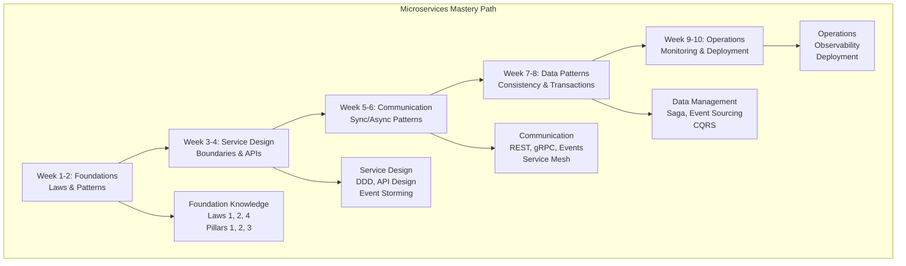

# Microservices Systems Learning Path

**Essential Question**: *How do I design, build, and operate microservices systems that scale from thousands to millions of users?*

> **What You'll Master**: Complete microservices lifecycle - from identifying service boundaries to operating them at scale in production.

## 🎯 Learning Journey Overview

Microservices architecture is like organizing a large company - instead of one massive department handling everything, you create specialized teams that communicate effectively to deliver business value. This path teaches you to decompose monoliths into services, design resilient communication patterns, manage distributed data, and operate complex systems in production.

**Path Duration**: 8-10 weeks (15-20 hours/week)  
**Target Audience**: Software architects, senior developers moving to microservices  
**End Goal**: Design and operate production microservices systems

## 🗺️ Complete Learning Roadmap

### Phase 1: Foundations (Weeks 1-2)
**Goal**: Understand why microservices exist and master fundamental distributed systems laws

#### Week 1: The Microservices Mindset
**Study Plan** (15-18 hours):

**Core Laws** (6 hours):
- [Law of Correlated Failure](../core-principles/laws/correlated-failure.md) - Why service isolation matters
- [Law of Cognitive Load](../core-principles/laws/cognitive-load.md) - Team-sized services principle
- [Law of Economic Reality](../core-principles/laws/economic-reality.md) - When microservices make business sense

**Essential Patterns** (8 hours):
- [Microservices Decomposition](../pattern-library/architecture/microservices-decomposition-mastery.md) - Service boundary identification
- [API Gateway](../pattern-library/communication/api-gateway.md) - Single entry point pattern
- [Service Discovery](../pattern-library/communication/service-discovery.md) - Dynamic service location

**Case Studies** (4 hours):
- [Netflix Microservices Evolution](../architects-handbook/case-studies/elite-engineering/netflix-chaos-engineering.md)
- [Amazon's Service-Oriented Architecture Journey](../architects-handbook/case-studies/infrastructure/monolith-to-microservices.md)

**Practical Exercise** (2 hours):
- Identify service boundaries in a sample monolithic e-commerce system
- Apply Conway's Law to team structure and service design

#### Week 2: Distribution Pillars for Microservices
**Study Plan** (15-18 hours):

**Core Pillars** (8 hours):
- [Work Distribution](../core-principles/pillars/work-distribution.md) - Load balancing across services
- [State Distribution](../core-principles/pillars/state-distribution.md) - Data management strategies
- [Control Distribution](../core-principles/pillars/control-distribution.md) - Service coordination

**Supporting Patterns** (6 hours):
- [Load Balancing](../pattern-library/scaling/load-balancing.md) - Traffic distribution strategies
- [Health Checks](../pattern-library/resilience/health-check.md) - Service health monitoring
- [Circuit Breaker](../pattern-library/resilience/circuit-breaker.md) - Failure isolation

**Hands-On Project** (4 hours):
Build a simple microservices system:
- User service with health checks
- Product service with circuit breaker
- API Gateway routing requests
- Service discovery mechanism

**Assessment** (2 hours):
- Explain the trade-offs between microservices and monoliths
- Design service boundaries for a given business domain

### Phase 2: Service Design (Weeks 3-4)
**Goal**: Master service boundary identification and API design

#### Week 3: Domain-Driven Service Boundaries
**Study Plan** (18-20 hours):

**Domain-Driven Design** (8 hours):
- Bounded contexts and service boundaries
- Event storming for domain modeling
- Aggregate design for service scope
- Context mapping for service relationships

**Pattern Deep-Dives** (6 hours):
- [Strangler Fig Pattern](../pattern-library/architecture/strangler-fig.md) - Incremental migration
- [Anti-Corruption Layer](../pattern-library/architecture/anti-corruption-layer.md) - Legacy system integration
- [Database per Service](../pattern-library/data-management/database-per-service.md) - Data isolation

**Real-World Examples** (4 hours):
- [Uber's Service Architecture](../architects-handbook/case-studies/location-services/uber-location.md)
- [Shopify's Service Decomposition](../architects-handbook/case-studies/financial-commerce/shopify-flash-sales.md)

**Workshop Project** (6 hours):
Design services for an online marketplace:
- User management service
- Product catalog service  
- Order processing service
- Payment service
- Notification service

#### Week 4: API Design and Contracts
**Study Plan** (18-20 hours):

**API Design Mastery** (8 hours):
- [RESTful API Design](../pattern-library/communication/api-gateway.md) - HTTP best practices
- [GraphQL Federation](../pattern-library/architecture/graphql-federation.md) - Unified data access
- API versioning strategies
- Contract-first development

**Service Communication** (6 hours):
- [gRPC](../pattern-library/communication/grpc.md) - High-performance RPC
- [Request-Reply](../pattern-library/communication/request-reply.md) - Synchronous patterns
- [Publish-Subscribe](../pattern-library/communication/publish-subscribe.md) - Async messaging

**Testing Strategies** (4 hours):
- Contract testing with Pact
- Service virtualization
- Integration testing approaches

**Capstone Project** (8 hours):
Implement APIs for marketplace services:
- Design OpenAPI specifications
- Implement contract testing
- Set up API gateway routing
- Add authentication and rate limiting

### Phase 3: Communication Patterns (Weeks 5-6)
**Goal**: Master synchronous and asynchronous communication between services

#### Week 5: Synchronous Communication
**Study Plan** (18-20 hours):

**Advanced HTTP Patterns** (8 hours):
- [Service Mesh](../pattern-library/communication/service-mesh.md) - Traffic management
- [Retry with Backoff](../pattern-library/resilience/retry-backoff-gold.md) - Resilient calls
- [Bulkhead](../pattern-library/resilience/bulkhead-gold.md) - Resource isolation
- [Timeout](../pattern-library/resilience/timeout-advanced.md) - Bounded operations

**Performance Optimization** (6 hours):
- Connection pooling and keep-alive
- Compression and content negotiation
- Caching strategies for service calls
- Service call batching patterns

**Case Study Deep-Dive** (4 hours):
- [Discord's Voice Infrastructure](../architects-handbook/case-studies/elite-engineering/discord-voice-infrastructure.md) - Low-latency communication
- [Stripe API Excellence](../architects-handbook/case-studies/elite-engineering/stripe-api-excellence.md) - Reliable service APIs

**Implementation Project** (8 hours):
Build resilient service communication:
- Implement circuit breaker pattern
- Add retry logic with exponential backoff
- Set up service mesh (Istio/Linkerd)
- Monitor service call patterns

#### Week 6: Asynchronous Messaging
**Study Plan** (18-20 hours):

**Event-Driven Architecture** (8 hours):
- [Event-Driven Architecture](../pattern-library/architecture/event-driven.md) - Async system design
- [Event Streaming](../pattern-library/architecture/event-streaming.md) - Real-time data flow
- Message queue patterns and implementations
- Event schema evolution strategies

**Advanced Messaging Patterns** (6 hours):
- [Choreography](../pattern-library/architecture/choreography.md) - Decentralized orchestration
- [Outbox Pattern](../pattern-library/data-management/outbox.md) - Reliable event publishing
- [Saga Pattern](../pattern-library/data-management/saga-pattern-production-mastery.md) - Distributed transactions

**Technology Deep-Dive** (4 hours):
- Apache Kafka for event streaming
- RabbitMQ for message queuing
- Apache Pulsar for real-time messaging
- Cloud messaging services (SQS, PubSub)

**Hands-On Project** (8 hours):
Implement event-driven communication:
- Set up Kafka cluster
- Implement order processing saga
- Add event sourcing for audit trail
- Build event-driven notifications

### Phase 4: Data Management (Weeks 7-8)
**Goal**: Handle distributed data consistency and transaction challenges

#### Week 7: Distributed Data Patterns
**Study Plan** (20-22 hours):

**Data Consistency Models** (8 hours):
- [CQRS](../pattern-library/data-management/cqrs.md) - Command Query Responsibility Segregation
- [Event Sourcing](../pattern-library/data-management/event-sourcing.md) - Event-based state management
- [Saga Pattern](../pattern-library/data-management/saga.md) - Distributed transaction management
- [Eventual Consistency](../pattern-library/data-management/eventual-consistency.md) - Relaxed consistency

**Advanced Data Patterns** (8 hours):
- [Change Data Capture (CDC)](../pattern-library/data-management/cdc.md) - Data synchronization
- [Materialized Views](../pattern-library/data-management/materialized-view.md) - Read optimization
- [Polyglot Persistence](../pattern-library/data-management/polyglot-persistence.md) - Right tool for data
- [Data Mesh](../pattern-library/data-management/data-mesh.md) - Decentralized data architecture

**Real-World Applications** (6 hours):
- [DynamoDB at Amazon](../architects-handbook/case-studies/databases/amazon-dynamo.md) - Distributed database design
- [Spanner at Google](../architects-handbook/case-studies/databases/google-spanner.md) - Global consistency

**Complex Implementation** (10 hours):
Build distributed data system:
- Implement CQRS with separate read/write models
- Add event sourcing for order management
- Create materialized views for reporting
- Set up CDC pipeline between services

#### Week 8: Transaction Management
**Study Plan** (20-22 hours):

**Distributed Transaction Patterns** (10 hours):
- [Two-Phase Commit](../pattern-library/coordination/two-phase-commit.md) - Strong consistency
- [Saga Implementation Patterns](../pattern-library/coordination/saga-pattern-production-mastery.md) - Choreography vs Orchestration
- Compensation patterns for failures
- Idempotency in distributed systems

**Consistency Guarantees** (6 hours):
- [Idempotency Keys](../pattern-library/data-management/idempotency-keys-gold.md) - Safe retries
- [Distributed Locking](../pattern-library/coordination/distributed-lock.md) - Coordination primitives
- Conflict resolution strategies
- Partial failure handling

**Production Challenges** (6 hours):
Study production incident case studies:
- Payment processing failures
- Data corruption from race conditions
- Cross-service transaction debugging

**Final Project** (12 hours):
Build complete transaction system:
- Order processing with saga pattern
- Payment integration with compensation
- Inventory management with locking
- Audit trail with event sourcing

### Phase 5: Operations & Production (Weeks 9-10)
**Goal**: Deploy, monitor, and operate microservices in production

#### Week 9: Observability and Monitoring
**Study Plan** (20-22 hours):

**Observability Fundamentals** (8 hours):
- [Distributed Tracing](../pattern-library/observability/distributed-tracing-exam.md) - Request flow visibility
- Metrics and monitoring strategies
- Logging in distributed systems
- SLIs, SLOs, and error budgets

**Advanced Monitoring** (8 hours):
- Service dependency mapping
- Chaos engineering practices
- Performance monitoring and alerting
- Business metrics tracking

**Tool Implementation** (6 hours):
- Prometheus and Grafana setup
- Jaeger for distributed tracing
- ELK stack for log aggregation
- Service mesh observability

**Practical Project** (10 hours):
Implement complete observability:
- Set up distributed tracing across services
- Create service health dashboards
- Implement SLI/SLO monitoring
- Add business metrics tracking

#### Week 10: Deployment and Operations
**Study Plan** (20-22 hours):

**Deployment Patterns** (10 hours):
- [Blue-Green Deployment](../pattern-library/deployment/blue-green.md) - Zero-downtime deployment
- [Canary Release](../pattern-library/deployment/canary.md) - Gradual rollout
- [Feature Flags](../pattern-library/deployment/feature-flags.md) - Runtime configuration
- [GitOps Deployment](../pattern-library/architecture/gitops-deployment.md) - Git-driven operations

**Production Operations** (8 hours):
- Incident response for microservices
- Service mesh operations (Istio/Linkerd)
- Auto-scaling strategies
- Cost optimization techniques

**Capstone Assessment** (12 hours):
Final comprehensive project:
- Deploy complete microservices system
- Implement full observability stack
- Set up CI/CD pipelines
- Demonstrate production readiness
- Present architecture decisions and trade-offs

## 📚 Core Laws and Pillars Integration

### Primary Laws (Deep Focus)
1. **[Law of Correlated Failure](../core-principles/laws/correlated-failure.md)** - Service isolation and bulkhead patterns
2. **[Law of Cognitive Load](../core-principles/laws/cognitive-load.md)** - Team-aligned service boundaries
3. **[Law of Asynchronous Reality](../core-principles/laws/asynchronous-reality.md)** - Event-driven communication
4. **[Law of Economic Reality](../core-principles/laws/economic-reality.md)** - Build vs buy vs microservices trade-offs

### Supporting Laws
5. **[Law of Emergent Chaos](../core-principles/laws/emergent-chaos.md)** - Managing system complexity
6. **[Law of Distributed Knowledge](../core-principles/laws/distributed-knowledge.md)** - Data consistency challenges
7. **[Law of Multidimensional Optimization](../core-principles/laws/multidimensional-optimization.md)** - Architecture trade-offs

### Core Pillars Application
- **Work Distribution**: Load balancing, service routing, traffic management
- **State Distribution**: Database per service, data replication, consistency models
- **Truth Distribution**: Event sourcing, saga patterns, consensus in coordination
- **Control Distribution**: Service mesh, circuit breakers, failure handling
- **Intelligence Distribution**: API gateways, edge services, caching strategies

## 🛠️ Essential Patterns by Priority

### Tier 1: Foundation Patterns (Must Implement)
1. [Microservices Architecture](../pattern-library/architecture/microservices-decomposition-mastery.md)
2. [API Gateway](../pattern-library/communication/api-gateway.md)
3. [Service Discovery](../pattern-library/communication/service-discovery.md)
4. [Circuit Breaker](../pattern-library/resilience/circuit-breaker.md)
5. [Health Checks](../pattern-library/resilience/health-check.md)

### Tier 2: Communication Patterns (Essential)
6. [Event-Driven Architecture](../pattern-library/architecture/event-driven.md)
7. [Publish-Subscribe](../pattern-library/communication/publish-subscribe.md)
8. [Saga Pattern](../pattern-library/data-management/saga.md)
9. [CQRS](../pattern-library/data-management/cqrs.md)
10. [Load Balancing](../pattern-library/scaling/load-balancing.md)

### Tier 3: Advanced Patterns (Scale & Optimization)
11. [Service Mesh](../pattern-library/communication/service-mesh.md)
12. [Event Sourcing](../pattern-library/data-management/event-sourcing.md)
13. [Blue-Green Deployment](../pattern-library/deployment/blue-green.md)
14. [Bulkhead](../pattern-library/resilience/bulkhead-gold.md)
15. [Auto-scaling](../pattern-library/scaling/auto-scaling.md)

## 📊 Case Studies Progression

### Week 2-3: Foundation Case Studies
- **[Netflix Microservices](../architects-handbook/case-studies/elite-engineering/netflix-chaos-engineering.md)** - Learn service decomposition strategies
- **[Amazon SOA Evolution](../case-studies/amazon-dynamodb.md)** - Understand scaling drivers

### Week 4-5: Communication Case Studies
- **[Uber Location Services](../architects-handbook/case-studies/location-services/uber-location.md)** - Real-time service communication
- **[Discord Voice Chat](../architects-handbook/case-studies/elite-engineering/discord-voice-infrastructure.md)** - Low-latency service design

### Week 6-7: Data Management Case Studies
- **[Shopify Flash Sales](../architects-handbook/case-studies/financial-commerce/shopify-flash-sales.md)** - High-throughput transaction handling
- **[Stripe Payments](../architects-handbook/case-studies/elite-engineering/stripe-api-excellence.md)** - Reliable financial service design

### Week 8-10: Operations Case Studies
- **[Netflix Chaos Engineering](../architects-handbook/case-studies/elite-engineering/netflix-chaos-engineering.md)** - Production resilience
- **[Figma Real-time Collaboration](../architects-handbook/case-studies/elite-engineering/figma-crdt-collaboration.md)** - Distributed state management

## 🎯 Prerequisites and Skills Assessment

### Required Prerequisites
- **Development Experience**: 2+ years building web applications
- **HTTP/API Knowledge**: Understanding REST principles and HTTP status codes
- **Database Basics**: SQL and NoSQL database concepts
- **Basic Distributed Systems**: Understanding of network calls and their failures
- **Containerization**: Docker basics (containers, images, networking)

### Skills Assessment Quiz
**Rate yourself (1-5 scale) before starting:**

| Skill | Beginner (1-2) | Intermediate (3-4) | Advanced (5) |
|-------|---------------|-------------------|--------------|
| API Design | Can create basic REST APIs | Designs APIs with versioning | Creates API standards |
| Database Design | Basic CRUD operations | Handles relationships well | Designs for scale |
| System Architecture | Understands MVC patterns | Designs multi-tier systems | Designs distributed systems |
| DevOps/Deployment | Manual deployments | CI/CD pipelines | Container orchestration |
| Monitoring/Debugging | Uses logging for debugging | Sets up monitoring | Distributed tracing |

**Recommended Starting Point:**
- **Score 8-15**: Start with Week 1, take time on fundamentals
- **Score 16-20**: Skip to Week 2, review laws as needed
- **Score 21-25**: Start with Week 3, focus on patterns and implementation

## 📈 Progress Milestones and Validation

### Week 2 Checkpoint: Foundation Knowledge
**Validation Criteria**:
- [ ] Explain Conway's Law impact on microservices design
- [ ] Identify service boundaries for a given domain
- [ ] Implement basic circuit breaker pattern
- [ ] Set up service health checks

### Week 4 Checkpoint: Service Design Mastery
**Validation Criteria**:
- [ ] Design API contracts using OpenAPI specification
- [ ] Implement domain-driven service boundaries
- [ ] Create service dependency maps
- [ ] Set up contract testing between services

### Week 6 Checkpoint: Communication Patterns
**Validation Criteria**:
- [ ] Implement both sync and async service communication
- [ ] Handle distributed failure scenarios gracefully
- [ ] Set up event-driven architecture with proper error handling
- [ ] Monitor and observe service communication patterns

### Week 8 Checkpoint: Data Management
**Validation Criteria**:
- [ ] Implement saga pattern for distributed transactions
- [ ] Design CQRS with separate read/write models
- [ ] Handle eventual consistency in business logic
- [ ] Implement event sourcing with proper snapshots

### Week 10 Final Assessment: Production Readiness
**Validation Criteria**:
- [ ] Deploy microservices with zero-downtime deployment
- [ ] Demonstrate full observability (logs, metrics, traces)
- [ ] Handle production incidents with proper runbooks
- [ ] Present complete system architecture with trade-off analysis

## 🎓 Learning Outcomes and Career Impact

### Technical Mastery
**After completing this path, you'll be able to:**

1. **Design Service Architecture**
   - Decompose monoliths using domain-driven design
   - Define service boundaries that align with team structure
   - Create API contracts that evolve gracefully

2. **Implement Communication Patterns**
   - Choose appropriate synchronous vs asynchronous patterns
   - Handle distributed failures with circuit breakers and retries
   - Design event-driven systems with proper error handling

3. **Manage Distributed Data**
   - Implement saga patterns for distributed transactions
   - Handle eventual consistency in business scenarios
   - Design CQRS systems for read/write optimization

4. **Operate in Production**
   - Set up comprehensive observability for microservices
   - Implement zero-downtime deployment strategies
   - Debug and troubleshoot distributed system issues

### Career Progression
**Typical career outcomes:**
- **Senior Software Engineer** → **Staff Engineer/Tech Lead**
- **Backend Developer** → **Distributed Systems Engineer**
- **Monolith Maintainer** → **Microservices Architect**
- **Individual Contributor** → **Technical Leadership Role**

**Salary Impact**: $20k-40k increase typical for microservices expertise

## 🤝 Community and Support

### Study Groups and Discussion
- **Discord Channel**: `#microservices-learners`
- **Weekly Study Sessions**: Thursdays 7 PM PST
- **Project Review Sessions**: Saturdays 2 PM PST
- **Office Hours**: Tuesdays 6 PM PST with microservices practitioners

### Peer Learning Opportunities
- **Code Review Partners**: Get paired with other learners
- **Project Showcases**: Present your implementations
- **Architecture Review Sessions**: Get feedback on designs
- **Mock Interviews**: Practice microservices system design questions

## 🚀 Getting Started

### Your First Steps
1. **Complete Prerequisites Assessment** - Ensure you have required background
2. **Set Up Development Environment** - Docker, IDE, cloud account
3. **Join Community Channels** - Connect with other learners
4. **Block Calendar Time** - Reserve 15-20 hours per week
5. **Start with Week 1** - Begin with fundamental laws

### Success Tips
- **Apply to Current Work**: Look for opportunities to implement patterns in your current job
- **Build Portfolio**: Document your learning journey and projects
- **Teach Others**: Explain concepts to reinforce your understanding
- **Stay Consistent**: Regular daily study beats weekend cramming
- **Ask Questions**: Engage actively in community discussions

---

**Ready to begin your microservices journey?** Start with [Law of Correlated Failure](../core-principles/laws/correlated-failure.md) to understand why service isolation is critical in distributed systems.

*Remember: Microservices are not about technology - they're about organizing teams and systems to deliver business value at scale.*