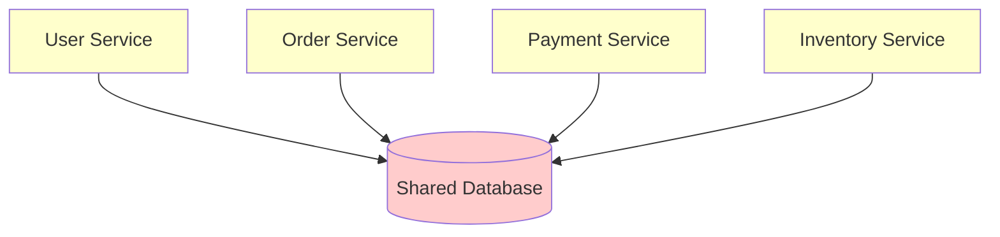
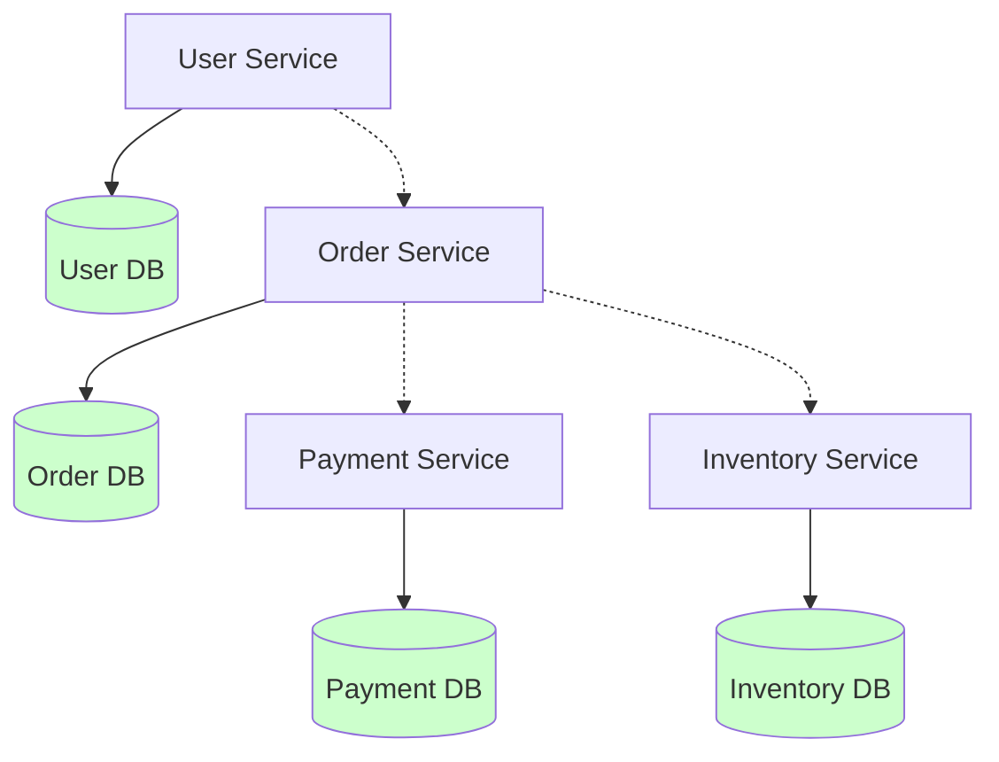
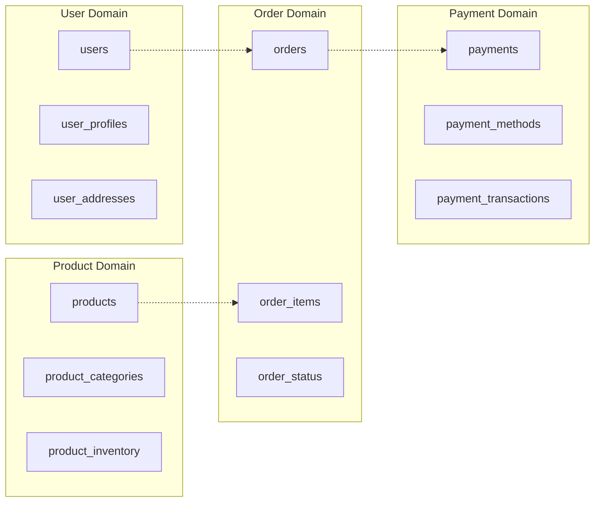
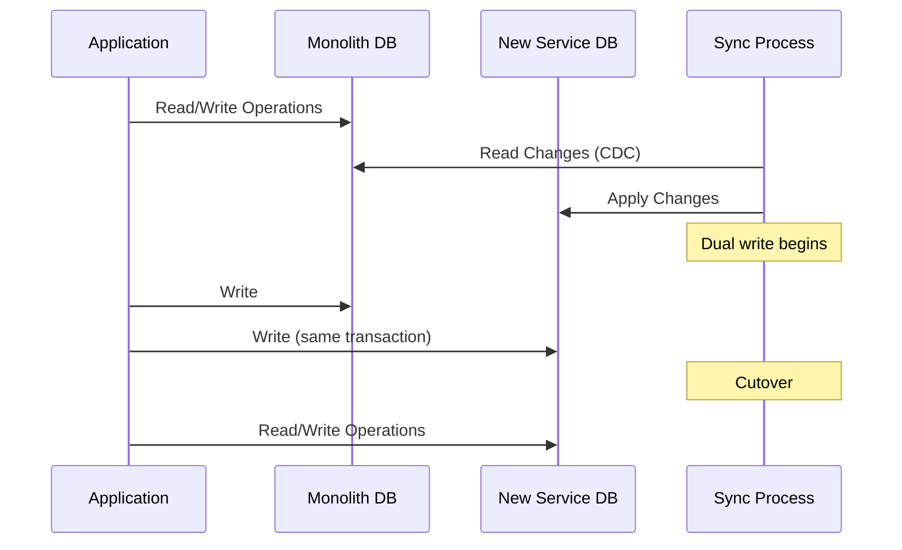
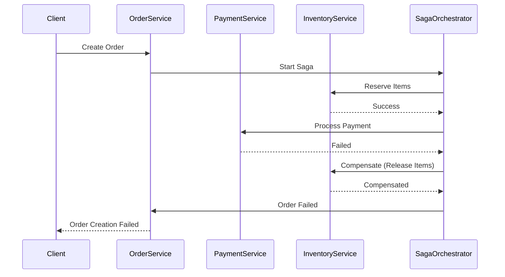
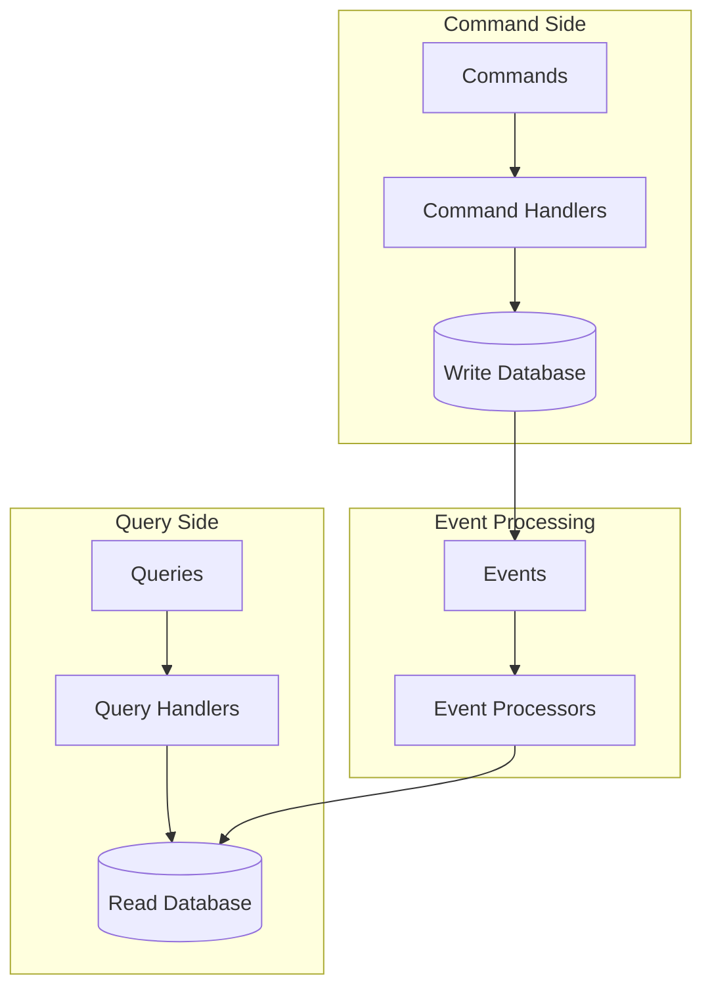
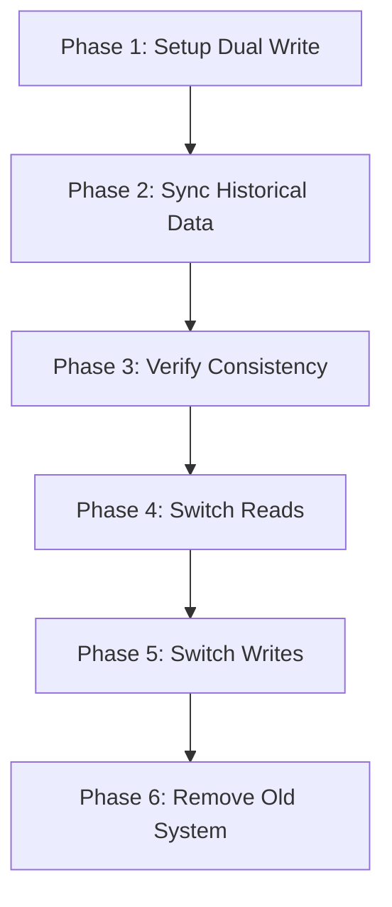
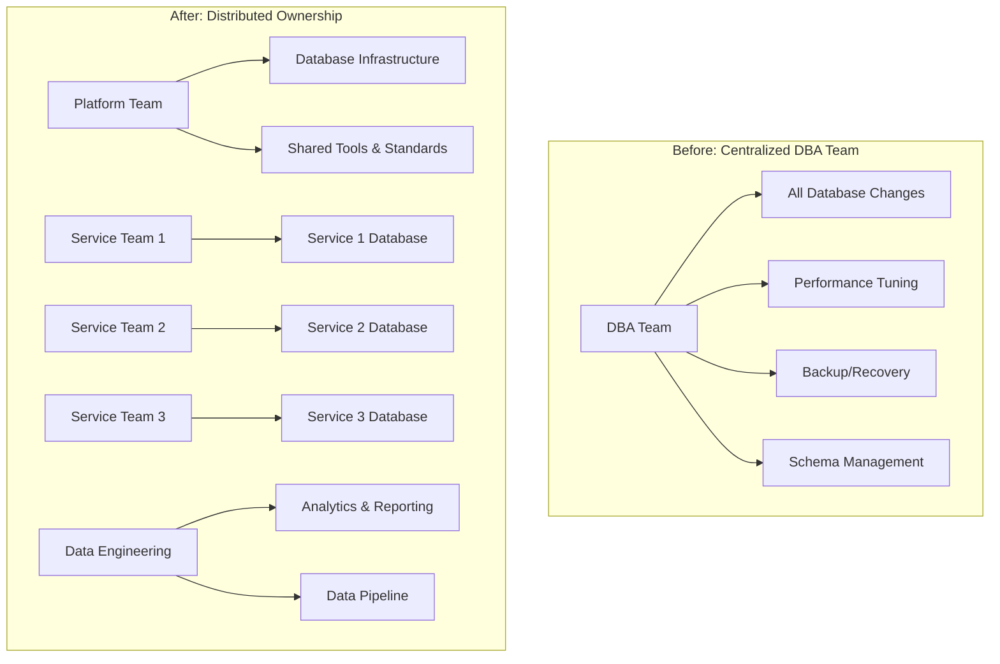
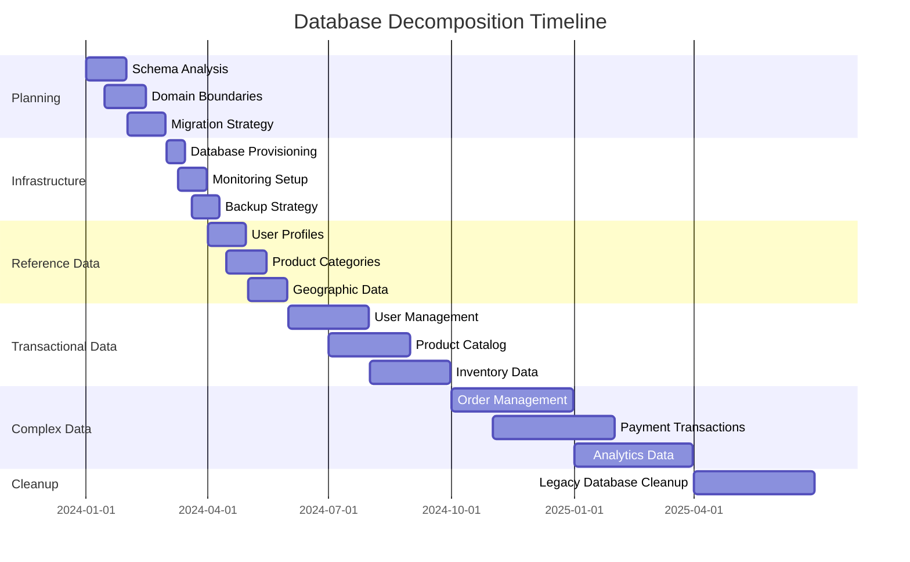

# Database Decomposition Strategy

## Executive Summary

Breaking up monolithic databases is one of the most challenging aspects of microservices migration. This guide provides proven strategies for safely decomposing shared databases while maintaining data consistency, performance, and business continuity.

## Database Decomposition Philosophy

### Core Principles

1. **Data Ownership**: Each service owns its data exclusively
2. **Loose Coupling**: Services communicate through well-defined APIs
3. **Eventual Consistency**: Accept eventual consistency where strong consistency isn't required
4. **Domain Boundaries**: Align data boundaries with business domains

### Success Criteria

- **Zero data loss** during migration
- **Maintained data consistency** across service boundaries
- **Performance within acceptable bounds** (< 20% degradation initially)
- **Rollback capability** at each phase

## Database Anti-Patterns Analysis

### The Shared Database Anti-Pattern



**Problems**:
- Services coupled through database schema
- Concurrent access and locking issues
- Difficulty in scaling individual services
- Complex deployment coordination
- Single point of failure

### Target Architecture: Database per Service



## Phase-Based Decomposition Strategy

### Phase 0: Analysis and Planning (Months 1-2)

#### Database Schema Analysis

```sql
-- Example analysis queries
-- 1. Table dependency analysis
WITH table_deps AS (
  SELECT 
    tc.table_name as child_table,
    kcu.table_name as parent_table,
    kcu.column_name as foreign_key_column
  FROM information_schema.table_constraints tc
  JOIN information_schema.key_column_usage kcu
    ON tc.constraint_name = kcu.constraint_name
  WHERE tc.constraint_type = 'FOREIGN KEY'
)
SELECT 
  parent_table,
  COUNT(*) as dependency_count,
  string_agg(child_table, ', ') as dependent_tables
FROM table_deps
GROUP BY parent_table
ORDER BY dependency_count DESC;

-- 2. Data volume analysis
SELECT 
  schemaname,
  tablename,
  pg_total_relation_size(schemaname||'.'||tablename) as size_bytes,
  n_tup_ins + n_tup_upd + n_tup_del as total_activity
FROM pg_tables t
JOIN pg_stat_user_tables s ON t.tablename = s.relname
ORDER BY size_bytes DESC;
```

#### Domain Boundary Identification



#### Migration Complexity Matrix

| Table | Domain | Dependencies | Data Volume | Change Frequency | Migration Complexity |
|-------|--------|--------------|-------------|------------------|---------------------|
| users | User | Low | Medium | Low | **Easy** |
| products | Product | Medium | High | Medium | **Medium** |
| orders | Order | High | High | High | **Hard** |
| payments | Payment | High | Medium | Medium | **Hard** |

### Phase 1: Reference Data Migration (Months 3-4)

**Objective**: Migrate lookup tables and reference data with minimal dependencies

#### Target Tables
- User profiles and preferences
- Product categories
- Geographic data
- Configuration data

#### Migration Pattern: Copy and Sync



#### Implementation Example

```python
class DualWriteManager:
    def __init__(self, primary_db, secondary_db):
        self.primary_db = primary_db
        self.secondary_db = secondary_db
        self.sync_enabled = True
    
    def create_user(self, user_data):
        try:
            # Primary write
            user_id = self.primary_db.create_user(user_data)
            
            # Secondary write
            if self.sync_enabled:
                try:
                    self.secondary_db.create_user({**user_data, 'id': user_id})
                except Exception as e:
                    # Log but don't fail primary operation
                    logger.error(f"Secondary write failed: {e}")
            
            return user_id
        except Exception as e:
            # Rollback secondary if primary fails
            if self.sync_enabled:
                try:
                    self.secondary_db.delete_user(user_id)
                except:
                    pass
            raise e
    
    def cutover_reads(self):
        """Switch read operations to secondary database"""
        self.read_source = 'secondary'
    
    def cutover_writes(self):
        """Switch write operations to secondary database"""
        self.primary_db = self.secondary_db
        self.sync_enabled = False
```

### Phase 2: Transactional Data with Low Coupling (Months 5-8)

**Objective**: Migrate data with few cross-domain relationships

#### Target Tables
- User management data
- Product catalog data
- Audit logs
- Notification history

#### Advanced Patterns

**Change Data Capture (CDC)**
```yaml
# Debezium CDC configuration
apiVersion: kafka.strimzi.io/v1beta2
kind: KafkaConnector
metadata:
  name: user-data-cdc
spec:
  class: io.debezium.connector.postgresql.PostgresConnector
  tasksMax: 1
  config:
    database.hostname: monolith-db
    database.port: 5432
    database.user: cdc_user
    database.password: ${CDC_PASSWORD}
    database.dbname: monolith
    database.server.name: monolith
    table.include.list: public.users,public.user_profiles
    transforms: route
    transforms.route.type: org.apache.kafka.connect.transforms.RegexRouter
    transforms.route.regex: ([^.]+)\.([^.]+)
    transforms.route.replacement: user-service.$2
```

**Event Sourcing for Complex State**
```python
from dataclasses import dataclass
from typing import List, Any
from datetime import datetime

@dataclass
class Event:
    event_id: str
    aggregate_id: str
    event_type: str
    event_data: dict
    timestamp: datetime
    version: int

class UserAggregate:
    def __init__(self, user_id: str):
        self.user_id = user_id
        self.version = 0
        self.events: List[Event] = []
    
    def apply_event(self, event: Event):
        """Apply event to aggregate state"""
        if event.event_type == 'UserCreated':
            self.email = event.event_data['email']
            self.status = 'ACTIVE'
        elif event.event_type == 'UserDeactivated':
            self.status = 'INACTIVE'
        
        self.version = event.version
        self.events.append(event)
    
    def get_uncommitted_events(self):
        return [e for e in self.events if not e.committed]

# Event store implementation
class EventStore:
    def save_events(self, aggregate_id: str, events: List[Event], expected_version: int):
        # Optimistic concurrency control
        current_version = self.get_version(aggregate_id)
        if current_version != expected_version:
            raise ConcurrencyException()
        
        for event in events:
            self.db.execute("""
                INSERT INTO events (aggregate_id, event_type, event_data, version)
                VALUES (?, ?, ?, ?)
            """, (aggregate_id, event.event_type, event.event_data, event.version))
    
    def get_events(self, aggregate_id: str, from_version: int = 0):
        return self.db.query("""
            SELECT * FROM events 
            WHERE aggregate_id = ? AND version > ?
            ORDER BY version
        """, (aggregate_id, from_version))
```

### Phase 3: Complex Transactional Data (Months 9-15)

**Objective**: Migrate highly coupled data with complex relationships

#### Target Tables
- Orders and order items
- Payment transactions
- Inventory movements
- Customer interactions

#### Saga Pattern for Distributed Transactions



**Saga Implementation**
```python
from enum import Enum
from abc import ABC, abstractmethod

class SagaState(Enum):
    STARTED = "started"
    COMPENSATING = "compensating" 
    COMPLETED = "completed"
    ABORTED = "aborted"

class SagaStep(ABC):
    @abstractmethod
    def execute(self, context):
        pass
    
    @abstractmethod
    def compensate(self, context):
        pass

class OrderSaga:
    def __init__(self):
        self.state = SagaState.STARTED
        self.steps = [
            ReserveInventoryStep(),
            ProcessPaymentStep(),
            CreateOrderStep(),
            SendConfirmationStep()
        ]
        self.completed_steps = []
    
    def execute(self, context):
        try:
            for step in self.steps:
                result = step.execute(context)
                self.completed_steps.append((step, result))
                
                if not result.success:
                    self.compensate(context)
                    self.state = SagaState.ABORTED
                    return False
            
            self.state = SagaState.COMPLETED
            return True
            
        except Exception as e:
            self.compensate(context)
            self.state = SagaState.ABORTED
            raise e
    
    def compensate(self, context):
        self.state = SagaState.COMPENSATING
        
        # Compensate in reverse order
        for step, result in reversed(self.completed_steps):
            try:
                step.compensate(context)
            except Exception as e:
                # Log compensation failure but continue
                logger.error(f"Compensation failed for {step}: {e}")

class ReserveInventoryStep(SagaStep):
    def execute(self, context):
        inventory_service = context.get_service('inventory')
        reservation = inventory_service.reserve_items(
            context.order_items, 
            context.order_id
        )
        return StepResult(success=reservation.success, data=reservation)
    
    def compensate(self, context):
        inventory_service = context.get_service('inventory')
        inventory_service.release_reservation(context.order_id)
```

### Phase 4: Cross-Domain Relationships (Months 16-20)

**Objective**: Handle complex relationships spanning multiple domains

#### Challenges

1. **Foreign Key Relationships Across Services**
2. **Referential Integrity Without Database Constraints**
3. **Complex Queries Spanning Multiple Domains**
4. **Data Consistency in Distributed Environment**

#### Solutions

**Reference Data Management**
```python
class ReferenceDataManager:
    def __init__(self):
        self.cache = Redis()
        self.event_bus = EventBus()
    
    def get_user_reference(self, user_id: str):
        """Get user reference data for other services"""
        cached = self.cache.get(f"user_ref:{user_id}")
        if cached:
            return json.loads(cached)
        
        # Fetch from user service
        user_data = self.user_service.get_reference_data(user_id)
        reference = {
            'user_id': user_data.id,
            'email': user_data.email,
            'display_name': user_data.display_name,
            'status': user_data.status
        }
        
        # Cache for 5 minutes
        self.cache.setex(f"user_ref:{user_id}", 300, json.dumps(reference))
        return reference
    
    def handle_user_updated(self, event):
        """Handle user update events"""
        user_id = event.data['user_id']
        # Invalidate cache
        self.cache.delete(f"user_ref:{user_id}")
        
        # Update denormalized data in other services
        self.event_bus.publish('UserReferenceUpdated', {
            'user_id': user_id,
            'reference_data': self.get_user_reference(user_id)
        })
```

**CQRS (Command Query Responsibility Segregation)**


**Implementation Example**
```python
# Command side
class CreateOrderCommand:
    def __init__(self, user_id: str, items: List[OrderItem]):
        self.user_id = user_id
        self.items = items

class OrderCommandHandler:
    def handle_create_order(self, command: CreateOrderCommand):
        # Validate command
        if not self.validate_user(command.user_id):
            raise ValidationError("Invalid user")
        
        # Create aggregate
        order = OrderAggregate.create(command.user_id, command.items)
        
        # Save events
        events = order.get_uncommitted_events()
        self.event_store.save_events(order.id, events, order.version)
        
        # Publish events
        for event in events:
            self.event_bus.publish(event)

# Query side
class OrderQueryHandler:
    def __init__(self, read_db):
        self.read_db = read_db
    
    def get_order_summary(self, order_id: str):
        return self.read_db.query("""
            SELECT 
                o.order_id,
                o.user_email,
                o.total_amount,
                o.status,
                array_agg(
                    json_build_object(
                        'product_name', oi.product_name,
                        'quantity', oi.quantity,
                        'price', oi.price
                    )
                ) as items
            FROM order_summary o
            JOIN order_items oi ON o.order_id = oi.order_id
            WHERE o.order_id = ?
            GROUP BY o.order_id, o.user_email, o.total_amount, o.status
        """, (order_id,))

# Event processor
class OrderProjectionUpdater:
    def handle_order_created(self, event):
        self.read_db.execute("""
            INSERT INTO order_summary (
                order_id, user_id, user_email, total_amount, status, created_at
            ) VALUES (?, ?, ?, ?, ?, ?)
        """, (
            event.aggregate_id,
            event.data['user_id'],
            event.data['user_email'],
            event.data['total_amount'],
            'CREATED',
            event.timestamp
        ))
```

## Data Migration Strategies

### Strategy 1: Stop-and-Copy (Low Risk Services)

**Best for**: Reference data, configuration, low-change tables

```mermaid
gantt
    title Stop-and-Copy Migration
    dateFormat  HH:mm
    
    section Migration Window
    Stop Application    :00:00, 00:05
    Export Data         :00:05, 00:15
    Transform Data      :00:15, 00:25
    Import Data         :00:25, 00:35
    Verify Data         :00:35, 00:45
    Start Application   :00:45, 00:50
```



**Implementation**:
```bash
#!/bin/bash
# Stop-and-copy migration script

# 1. Stop application
kubectl scale deployment app --replicas=0

# 2. Export data
pg_dump -h monolith-db -U user -t users -t user_profiles --data-only > users_export.sql

# 3. Transform data (if needed)
python transform_user_data.py users_export.sql > users_transformed.sql

# 4. Import to new database
psql -h user-service-db -U user_service -f users_transformed.sql

# 5. Verify data integrity
python verify_migration.py --source monolith-db --target user-service-db --table users

# 6. Start application with new service
kubectl set image deployment/app app=user-service:v2
kubectl scale deployment app --replicas=3
```

### Strategy 2: Dual Write (Medium Risk Services)

**Best for**: Transactional data with moderate change frequency



### Strategy 3: Event Sourcing Migration (High Risk Services)

**Best for**: Complex business entities with high change frequency

```python
class MigrationEventProcessor:
    def __init__(self, source_db, event_store):
        self.source_db = source_db
        self.event_store = event_store
    
    def migrate_order_history(self, order_id: str):
        # Reconstruct events from audit trail
        audit_records = self.source_db.query("""
            SELECT operation, old_values, new_values, timestamp, user_id
            FROM audit_log 
            WHERE table_name = 'orders' AND record_id = ?
            ORDER BY timestamp
        """, (order_id,))
        
        events = []
        for record in audit_records:
            if record.operation == 'INSERT':
                events.append(Event(
                    event_type='OrderCreated',
                    event_data=record.new_values,
                    timestamp=record.timestamp,
                    user_id=record.user_id
                ))
            elif record.operation == 'UPDATE':
                # Determine what changed
                changes = self.diff_values(record.old_values, record.new_values)
                if 'status' in changes:
                    events.append(Event(
                        event_type='OrderStatusChanged',
                        event_data={
                            'old_status': changes['status']['old'],
                            'new_status': changes['status']['new']
                        },
                        timestamp=record.timestamp
                    ))
        
        # Save reconstructed events
        self.event_store.save_events(order_id, events)
```

## Data Consistency Patterns

### Eventual Consistency with Compensation

```python
class EventualConsistencyHandler:
    def __init__(self):
        self.inconsistency_detector = InconsistencyDetector()
        self.compensation_service = CompensationService()
    
    def handle_cross_service_update(self, event):
        try:
            # Primary update
            self.primary_service.update(event.data)
            
            # Async secondary updates
            for service in self.dependent_services:
                self.queue.send_async(service, event)
                
        except Exception as e:
            # Compensation logic
            self.compensation_service.compensate(event)
            raise e
    
    def periodic_consistency_check(self):
        """Run periodic consistency checks"""
        inconsistencies = self.inconsistency_detector.detect()
        for inconsistency in inconsistencies:
            self.compensation_service.resolve(inconsistency)

class InconsistencyDetector:
    def detect(self):
        """Detect data inconsistencies across services"""
        # Example: Check if user references are consistent
        user_service_users = self.user_service.get_all_active_users()
        order_service_user_refs = self.order_service.get_user_references()
        
        inconsistencies = []
        for user_id in order_service_user_refs:
            if user_id not in user_service_users:
                inconsistencies.append({
                    'type': 'orphaned_reference',
                    'service': 'order_service',
                    'reference': user_id,
                    'description': f'User {user_id} referenced in orders but not in user service'
                })
        
        return inconsistencies
```

### Distributed Transaction Patterns

**Two-Phase Commit (2PC) - Use Sparingly**
```python
class TwoPhaseCommitCoordinator:
    def __init__(self, participants):
        self.participants = participants
        self.transaction_id = str(uuid.uuid4())
    
    def execute_transaction(self, operations):
        # Phase 1: Prepare
        prepared_participants = []
        try:
            for participant in self.participants:
                if participant.prepare(self.transaction_id, operations[participant.name]):
                    prepared_participants.append(participant)
                else:
                    raise TransactionAbortException(f"Participant {participant.name} not ready")
            
            # Phase 2: Commit
            for participant in prepared_participants:
                participant.commit(self.transaction_id)
                
            return True
            
        except Exception as e:
            # Abort transaction
            for participant in prepared_participants:
                try:
                    participant.abort(self.transaction_id)
                except Exception as abort_error:
                    logger.error(f"Failed to abort {participant.name}: {abort_error}")
            raise e
```

**Saga Pattern - Preferred for Long-Running Transactions**
```python
class SagaTransaction:
    def __init__(self):
        self.steps = []
        self.compensation_steps = []
    
    def add_step(self, action, compensation):
        self.steps.append(action)
        self.compensation_steps.append(compensation)
    
    def execute(self):
        completed_steps = []
        try:
            for i, step in enumerate(self.steps):
                result = step.execute()
                completed_steps.append((i, result))
                
                if not result.success:
                    self.compensate(completed_steps)
                    return False
            
            return True
            
        except Exception as e:
            self.compensate(completed_steps)
            raise e
    
    def compensate(self, completed_steps):
        for step_index, result in reversed(completed_steps):
            try:
                self.compensation_steps[step_index].execute(result)
            except Exception as e:
                logger.error(f"Compensation failed for step {step_index}: {e}")
```

## Performance Considerations

### Query Performance Optimization

**Before: Single Database Query**
```sql
-- Single query across multiple domains
SELECT 
    u.email,
    u.first_name,
    u.last_name,
    o.order_id,
    o.total_amount,
    p.product_name,
    oi.quantity
FROM users u
JOIN orders o ON u.user_id = o.user_id
JOIN order_items oi ON o.order_id = oi.order_id
JOIN products p ON oi.product_id = p.product_id
WHERE o.created_date >= '2024-01-01'
  AND o.status = 'COMPLETED';
```

**After: Service-Based Queries with Caching**
```python
class OrderReportService:
    def __init__(self):
        self.cache = Redis()
        self.user_service = UserService()
        self.order_service = OrderService()
        self.product_service = ProductService()
    
    async def get_order_report(self, start_date: datetime, status: str):
        # Get orders from order service
        orders = await self.order_service.get_orders_by_date_and_status(start_date, status)
        
        # Batch fetch user data
        user_ids = [order.user_id for order in orders]
        users = await self.user_service.get_users_batch(user_ids)
        user_map = {u.id: u for u in users}
        
        # Batch fetch product data
        product_ids = []
        for order in orders:
            product_ids.extend([item.product_id for item in order.items])
        
        products = await self.product_service.get_products_batch(list(set(product_ids)))
        product_map = {p.id: p for p in products}
        
        # Combine data
        result = []
        for order in orders:
            user = user_map.get(order.user_id)
            if user:
                for item in order.items:
                    product = product_map.get(item.product_id)
                    if product:
                        result.append({
                            'email': user.email,
                            'first_name': user.first_name,
                            'last_name': user.last_name,
                            'order_id': order.id,
                            'total_amount': order.total_amount,
                            'product_name': product.name,
                            'quantity': item.quantity
                        })
        
        return result
```

### Caching Strategies

```python
class MultilevelCache:
    def __init__(self):
        self.l1_cache = {}  # In-memory cache
        self.l2_cache = Redis()  # Redis cache
        self.l3_cache = Database()  # Database
    
    async def get(self, key: str):
        # L1 cache
        if key in self.l1_cache:
            return self.l1_cache[key]
        
        # L2 cache
        value = await self.l2_cache.get(key)
        if value:
            self.l1_cache[key] = value
            return value
        
        # L3 cache (database)
        value = await self.l3_cache.get(key)
        if value:
            await self.l2_cache.set(key, value, ttl=3600)
            self.l1_cache[key] = value
        
        return value
    
    async def invalidate(self, pattern: str):
        # Invalidate all cache levels
        keys_to_remove = [k for k in self.l1_cache.keys() if fnmatch(k, pattern)]
        for key in keys_to_remove:
            del self.l1_cache[key]
        
        await self.l2_cache.delete_pattern(pattern)
```

## Team Structure and Responsibilities

### Database Team Evolution



### Responsibilities Matrix

| Role | Schema Design | Performance | Backups | Migrations | Monitoring |
|------|---------------|-------------|---------|------------|------------|
| **Service Team** | ✓ | ✓ | - | ✓ | ✓ |
| **Platform Team** | Standards | Tools | ✓ | Framework | Infrastructure |
| **Data Engineering** | - | Analytics | Archive | Pipeline | Data Quality |

### Skills Development Plan

**For Application Developers**
- Database design principles
- SQL optimization
- NoSQL patterns
- Data modeling
- Migration strategies

**For DBAs → Platform Engineers**
- Container orchestration
- Infrastructure as code
- Observability tools
- CI/CD pipelines
- Cloud database services

## Migration Timeline and Milestones

### Detailed Timeline



### Risk Mitigation Checkpoints

| Month | Milestone | Success Criteria | Rollback Trigger |
|-------|-----------|------------------|------------------|
| 2 | Schema Analysis Complete | All dependencies mapped | Missing critical dependencies |
| 4 | Infrastructure Ready | All databases provisioned | Infrastructure issues |
| 6 | First Migration Complete | Zero data loss | Data inconsistency |
| 12 | Core Services Migrated | Performance within SLA | >20% performance degradation |
| 18 | Complex Data Migrated | All transactions working | Business process failures |
| 24 | Migration Complete | Legacy database retired | Any critical issues |

## Testing Strategies

### Data Consistency Testing

```python
class ConsistencyTester:
    def __init__(self, source_db, target_db):
        self.source_db = source_db
        self.target_db = target_db
    
    def test_row_count_consistency(self, table_name):
        source_count = self.source_db.count(table_name)
        target_count = self.target_db.count(table_name)
        
        assert source_count == target_count, \
            f"Row count mismatch: source={source_count}, target={target_count}"
    
    def test_data_integrity(self, table_name, key_column):
        # Test primary key uniqueness
        source_keys = set(self.source_db.get_column_values(table_name, key_column))
        target_keys = set(self.target_db.get_column_values(table_name, key_column))
        
        missing_keys = source_keys - target_keys
        extra_keys = target_keys - source_keys
        
        assert not missing_keys, f"Missing keys: {missing_keys}"
        assert not extra_keys, f"Extra keys: {extra_keys}"
    
    def test_checksum_consistency(self, table_name, columns):
        """Compare checksums of specific columns"""
        source_checksum = self.source_db.calculate_checksum(table_name, columns)
        target_checksum = self.target_db.calculate_checksum(table_name, columns)
        
        assert source_checksum == target_checksum, \
            f"Checksum mismatch: source={source_checksum}, target={target_checksum}"
```

### Performance Testing

```python
class PerformanceTester:
    def __init__(self):
        self.metrics_collector = MetricsCollector()
    
    async def test_query_performance(self, queries, iterations=1000):
        results = {}
        
        for query_name, query in queries.items():
            times = []
            for _ in range(iterations):
                start_time = time.perf_counter()
                result = await self.execute_query(query)
                end_time = time.perf_counter()
                times.append(end_time - start_time)
            
            results[query_name] = {
                'min': min(times),
                'max': max(times),
                'avg': sum(times) / len(times),
                'p95': np.percentile(times, 95),
                'p99': np.percentile(times, 99)
            }
        
        return results
    
    async def test_concurrent_load(self, operation, concurrent_users=100, duration=60):
        """Test performance under concurrent load"""
        results = []
        start_time = time.time()
        
        async def worker():
            while time.time() - start_time < duration:
                start = time.perf_counter()
                try:
                    await operation()
                    success = True
                except Exception as e:
                    success = False
                    logger.error(f"Operation failed: {e}")
                
                end = time.perf_counter()
                results.append({
                    'duration': end - start,
                    'success': success,
                    'timestamp': time.time()
                })
                
                await asyncio.sleep(0.1)  # Small delay between operations
        
        # Start concurrent workers
        tasks = [worker() for _ in range(concurrent_users)]
        await asyncio.gather(*tasks)
        
        # Calculate metrics
        successful_ops = [r for r in results if r['success']]
        return {
            'total_operations': len(results),
            'successful_operations': len(successful_ops),
            'success_rate': len(successful_ops) / len(results),
            'avg_response_time': sum(r['duration'] for r in successful_ops) / len(successful_ops),
            'operations_per_second': len(successful_ops) / duration
        }
```

## Lessons Learned

### What Works Well

1. **Start with Reference Data**
   - Low risk, high learning value
   - Builds team confidence
   - Establishes patterns and tools

2. **Incremental Migration**
   - Reduces blast radius
   - Allows for learning and adaptation
   - Maintains business continuity

3. **Comprehensive Testing**
   - Data consistency verification
   - Performance testing
   - End-to-end testing

4. **Event-Driven Architecture**
   - Natural fit for microservices
   - Loose coupling
   - Audit trail and debugging

### Common Pitfalls

1. **Ignoring Data Dependencies**
   - Underestimating foreign key relationships
   - Missing implicit dependencies
   - Inadequate impact analysis

2. **Big Bang Approach**
   - High risk of data loss
   - Difficult rollback
   - Business disruption

3. **Inadequate Performance Testing**
   - N+1 query problems
   - Network latency issues
   - Caching strategy gaps

4. **Poor Error Handling**
   - Inconsistent state during failures
   - Difficult debugging
   - Data corruption risk

### Anti-Patterns to Avoid

1. **Shared Database Between Services**
   ```mermaid
   graph TD
       A[Service A] --> DB[(Shared DB)]
       B[Service B] --> DB
       C[Service C] --> DB
       
       style DB fill:#ffcccc
   ```
   - Tight coupling through schema
   - Deployment coordination required
   - Single point of failure

2. **Synchronous Inter-Service Queries**
   ```mermaid
   sequenceDiagram
       participant Client
       participant ServiceA
       participant ServiceB
       participant ServiceC
       
       Client->>ServiceA: Request
       ServiceA->>ServiceB: Get User Data
       ServiceB->>ServiceC: Get Profile Data
       ServiceC-->>ServiceB: Profile Data
       ServiceB-->>ServiceA: User Data
       ServiceA-->>Client: Response
   ```
   - Increased latency
   - Cascading failures
   - Tight coupling

3. **Lack of Data Ownership**
   - Multiple services writing to same data
   - Unclear responsibility
   - Consistency issues

## Monitoring and Observability

### Key Metrics to Track

```python
class DatabaseMigrationMetrics:
    def __init__(self):
        self.prometheus = PrometheusMetrics()
    
    def track_migration_progress(self, service_name, progress_percentage):
        self.prometheus.gauge(
            'migration_progress_percentage',
            progress_percentage,
            labels={'service': service_name}
        )
    
    def track_data_consistency(self, source, target, table, consistency_score):
        self.prometheus.gauge(
            'data_consistency_score',
            consistency_score,
            labels={
                'source': source,
                'target': target, 
                'table': table
            }
        )
    
    def track_query_performance(self, service, query_type, duration):
        self.prometheus.histogram(
            'database_query_duration_seconds',
            duration,
            labels={
                'service': service,
                'query_type': query_type
            }
        )
    
    def track_migration_errors(self, service, error_type):
        self.prometheus.counter(
            'migration_errors_total',
            1,
            labels={
                'service': service,
                'error_type': error_type
            }
        )
```

### Dashboard Configuration

```yaml
# Grafana dashboard configuration
dashboard:
  title: "Database Migration Progress"
  panels:
    - title: "Migration Progress"
      type: "stat"
      targets:
        - expr: "migration_progress_percentage"
      thresholds:
        - color: "red"
          value: 0
        - color: "yellow" 
          value: 50
        - color: "green"
          value: 90
    
    - title: "Data Consistency Score"
      type: "graph"
      targets:
        - expr: "data_consistency_score"
      yAxes:
        - min: 0
          max: 100
    
    - title: "Query Performance"
      type: "heatmap"
      targets:
        - expr: "rate(database_query_duration_seconds_bucket[5m])"
    
    - title: "Error Rate"
      type: "graph"
      targets:
        - expr: "rate(migration_errors_total[5m])"
      alert:
        conditions:
          - evaluator:
              params: [0.1]
            operator:
              type: "gt"
```

## Cost-Benefit Analysis

### Migration Investment

| Category | Year 1 | Year 2 | Year 3 | Total |
|----------|--------|--------|--------|-------|
| **Database Infrastructure** | $150K | $100K | $80K | $330K |
| **Migration Tools** | $50K | $20K | $20K | $90K |
| **Team Training** | $75K | $25K | $25K | $125K |
| **Consultant Support** | $200K | $100K | $50K | $350K |
| **Testing & QA** | $100K | $50K | $25K | $175K |
| **Downtime Risk** | $50K | $25K | $10K | $85K |
| **Total** | **$625K** | **$320K** | **$210K** | **$1.155M** |

### Expected Benefits

| Benefit | Year 1 | Year 2 | Year 3 | 3-Year Total |
|---------|--------|--------|--------|--------------|
| **Development Velocity** | $75K | $300K | $450K | $825K |
| **Operational Efficiency** | $50K | $200K | $300K | $550K |
| **Database Performance** | $25K | $150K | $250K | $425K |
| **Scaling Cost Reduction** | $30K | $120K | $200K | $350K |
| **Disaster Recovery** | $20K | $80K | $120K | $220K |
| **Total** | **$200K** | **$850K** | **$1.32M** | **$2.37M** |

### ROI Analysis
- **Break-even Point**: Month 20
- **3-Year ROI**: 105%
- **Risk-Adjusted NPV**: $950K

## Conclusion

Database decomposition is a critical success factor for microservices migration. The key principles for success are:

1. **Incremental Approach**: Start with low-risk reference data
2. **Domain-Driven Design**: Align data boundaries with business domains  
3. **Comprehensive Testing**: Ensure data consistency and performance
4. **Monitoring and Observability**: Track progress and detect issues early
5. **Team Preparation**: Develop skills and establish new responsibilities

The investment is significant, but the long-term benefits of improved scalability, team autonomy, and system reliability justify the effort for growing organizations.

---

*Last Updated: January 2024*
*Version: 1.0*
*Status: Production Ready*