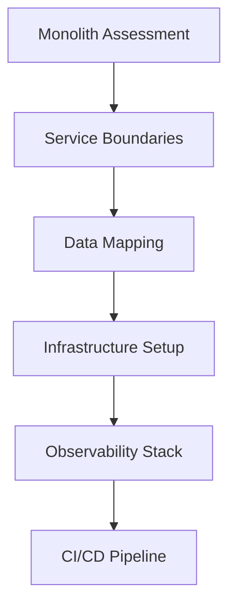
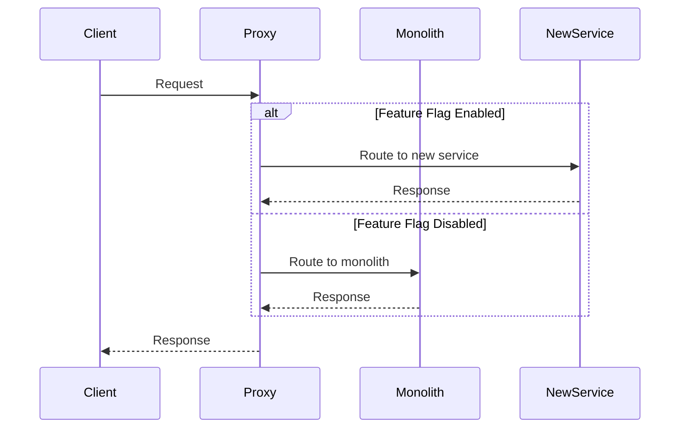
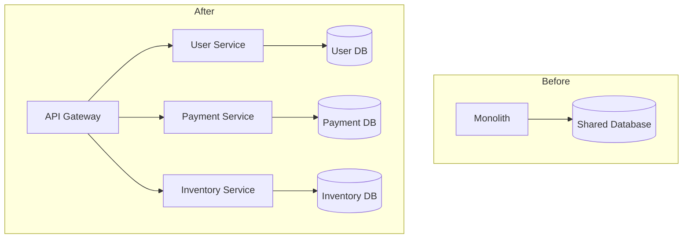
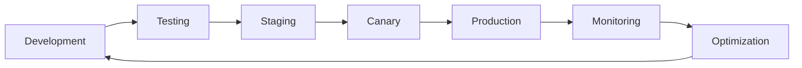
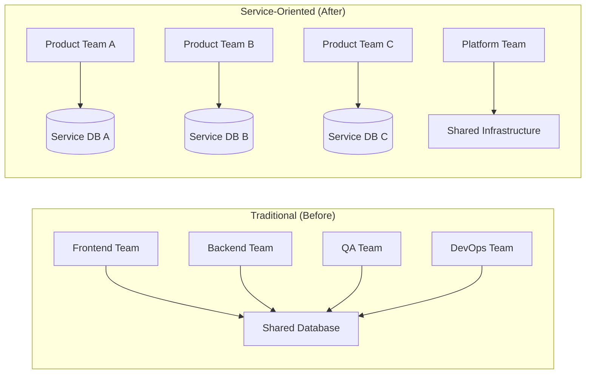
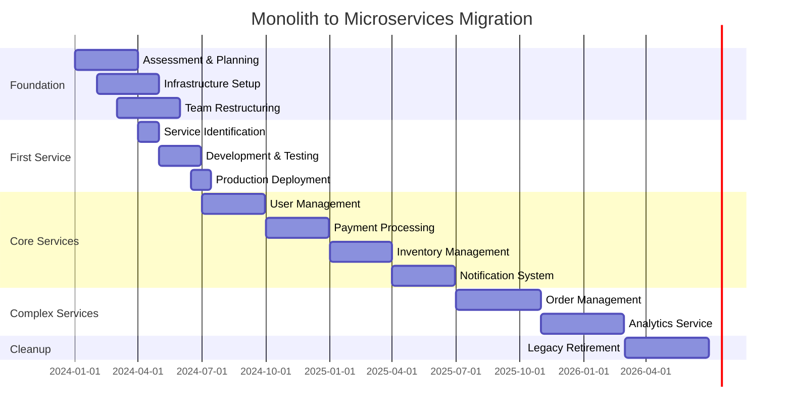

# Monolith to Microservices Migration Strategy

## Executive Summary

Migrating from a monolithic architecture to microservices is one of the most complex engineering transformations an organization can undertake. This guide provides a comprehensive, phase-based approach that minimizes risk while maximizing business continuity.

## Migration Philosophy

### Core Principles

1. **Evolutionary Over Revolutionary**: Incremental changes reduce risk and allow for learning
2. **Business Value First**: Prioritize migrations that deliver immediate business value
3. **Team Autonomy**: Structure teams around services, not functions
4. **Infrastructure as Code**: Automate everything from day one

### Success Metrics

- **Technical**: Service availability (99.9%+), deployment frequency, lead time
- **Business**: Feature delivery velocity, operational costs, team productivity
- **Organizational**: Team autonomy, on-call burden reduction

## Phase-Based Migration Strategy

### Phase 0: Foundation (Months 1-3)

**Objective**: Establish technical and organizational foundations

#### Technical Preparations


#### Key Activities

1. **Architecture Assessment**
   - Map existing dependencies
   - Identify bounded contexts
   - Catalog data flows
   - Document current performance baselines

2. **Team Structure Evolution**
   ```
   Traditional Structure → Service-Oriented Teams
   ├── Frontend Team      → Product Teams (2-pizza rule)
   ├── Backend Team       → Platform Team
   └── DBA Team          → Data Platform Team
   ```

3. **Infrastructure Foundation**
   - Container orchestration (Kubernetes)
   - Service mesh (Istio/Linkerd)
   - Observability stack (Prometheus, Grafana, Jaeger)
   - Secret management (Vault/K8s secrets)

#### Deliverables
- Service boundary map with domain-driven design analysis
- Team topology design with clear ownership models  
- Infrastructure automation with IaC templates
- Comprehensive monitoring dashboards and alerting
- Migration readiness assessment and risk analysis

#### Success Criteria
- [ ] All teams trained on new tools and processes
- [ ] Development environment containerized and automated
- [ ] Observability stack operational with baseline metrics
- [ ] First service boundary clearly defined with stakeholder agreement

### Phase 1: Extract First Service (Months 4-6)

**Objective**: Prove the migration pattern with lowest-risk service

#### Service Selection Criteria
```python
# Service extraction priority matrix
priority_score = (
    business_value * 0.3 +
    technical_complexity_inverse * 0.2 +
    data_coupling_inverse * 0.2 +
    team_readiness * 0.2 +
    risk_level_inverse * 0.1
)
```

#### Implementation Pattern: Strangler Fig


#### Technical Implementation

1. **API Gateway Setup**
   ```yaml
   apiVersion: networking.istio.io/v1beta1
   kind: VirtualService
   metadata:
     name: user-service-routing
   spec:
     http:
     - match:
       - headers:
           canary:
             exact: "true"
       route:
       - destination:
           host: user-service-v2
     - route:
       - destination:
           host: monolith
   ```

2. **Data Migration Strategy**
   - Dual writes during transition
   - Event-driven synchronization
   - Gradual read migration

3. **Rollback Plan**
   - Feature flag instant rollback
   - Data consistency verification
   - Performance monitoring triggers

#### Success Criteria
- Zero downtime during extraction
- 99.9% feature parity
- Performance within 10% of baseline
- Complete rollback capability

### Phase 2: Core Services Extraction (Months 7-18)

**Objective**: Extract high-value, well-bounded services

#### Prioritized Service List
1. **User Management** (Month 7-9)
   - Clear boundaries
   - High reuse potential
   - Moderate complexity

2. **Payment Processing** (Month 10-12)
   - Compliance requirements
   - High business value
   - External integrations

3. **Inventory Management** (Month 13-15)
   - Complex business logic
   - High transaction volume
   - Data consistency requirements

4. **Notification System** (Month 16-18)
   - Cross-cutting concern
   - Async by nature
   - Scaling challenges

#### Advanced Patterns

**Database Per Service**


**Event-Driven Communication**
```yaml
# Event schema example
UserCreated:
  type: object
  properties:
    eventId: string
    eventTime: string
    eventVersion: string
    data:
      userId: string
      email: string
      status: string
      createdAt: string
  required: [eventId, eventTime, eventVersion, data]

PaymentProcessed:
  type: object
  properties:
    eventId: string
    eventTime: string
    eventVersion: string
    data:
      paymentId: string
      userId: string
      amount: number
      currency: string
      status: string
      transactionId: string
  required: [eventId, eventTime, eventVersion, data]
```

#### Service Communication Patterns

1. **Synchronous Communication (Critical Path)**
   ```python
   # Circuit breaker pattern for service calls
   from circuit_breaker import CircuitBreaker
   
   @CircuitBreaker(failure_threshold=5, timeout=30)
   async def call_payment_service(payment_data):
       async with httpx.AsyncClient() as client:
           response = await client.post(
               f"{PAYMENT_SERVICE_URL}/process",
               json=payment_data,
               timeout=5.0
           )
           return response.json()
   ```

2. **Asynchronous Communication (Events)**
   ```python
   # Event publishing
   async def publish_user_created_event(user):
       event = {
           "eventId": str(uuid.uuid4()),
           "eventTime": datetime.utcnow().isoformat(),
           "eventVersion": "1.0",
           "data": {
               "userId": user.id,
               "email": user.email,
               "status": user.status,
               "createdAt": user.created_at.isoformat()
           }
       }
       
       await event_bus.publish("user.created", event)
   ```

#### Data Migration Strategies

**Dual Write Pattern**
```python
class UserRepository:
    def __init__(self):
        self.monolith_db = get_monolith_connection()
        self.microservice_db = get_microservice_connection()
        self.feature_flags = get_feature_flag_client()
    
    async def create_user(self, user_data):
        # Always write to monolith (source of truth)
        user = await self.monolith_db.users.create(user_data)
        
        # Conditionally write to microservice
        if self.feature_flags.is_enabled("dual_write_users"):
            try:
                await self.microservice_db.users.create(user_data)
            except Exception as e:
                # Log error but don't fail - monolith is source of truth
                logger.error(f"Failed to dual write user: {e}")
        
        return user
    
    async def get_user(self, user_id):
        # Read from microservice if migration complete
        if self.feature_flags.is_enabled("read_from_microservice"):
            try:
                return await self.microservice_db.users.get(user_id)
            except Exception as e:
                logger.warning(f"Fallback to monolith: {e}")
        
        # Fallback to monolith
        return await self.monolith_db.users.get(user_id)
```

### Phase 3: Complex Services & Distributed Patterns (Months 19-30)

**Objective**: Handle complex, tightly-coupled services requiring advanced patterns

#### Distributed Transaction Management

**Saga Pattern Implementation**
```python
from typing import List, Dict, Any
from enum import Enum

class SagaStatus(Enum):
    STARTED = "started"
    COMPLETED = "completed"
    FAILED = "failed"
    COMPENSATING = "compensating"

class SagaStep:
    def __init__(self, name: str, action, compensation):
        self.name = name
        self.action = action
        self.compensation = compensation
        self.status = "pending"
        self.result = None

class OrderProcessingSaga:
    """Example: Order processing across multiple services"""
    
    def __init__(self):
        self.steps = [
            SagaStep("reserve_inventory", 
                    self.reserve_inventory, 
                    self.release_inventory),
            SagaStep("process_payment", 
                    self.process_payment, 
                    self.refund_payment),
            SagaStep("create_shipment", 
                    self.create_shipment, 
                    self.cancel_shipment),
            SagaStep("send_confirmation", 
                    self.send_confirmation, 
                    self.send_cancellation)
        ]
        self.status = SagaStatus.STARTED
        self.completed_steps = []
    
    async def execute(self, order_data: Dict[str, Any]):
        """Execute saga with automatic compensation on failure"""
        try:
            for step in self.steps:
                step.result = await step.action(order_data)
                step.status = "completed"
                self.completed_steps.append(step)
            
            self.status = SagaStatus.COMPLETED
            return {"status": "success", "order_id": order_data["order_id"]}
            
        except Exception as e:
            self.status = SagaStatus.COMPENSATING
            await self.compensate()
            self.status = SagaStatus.FAILED
            raise Exception(f"Saga failed: {e}")
    
    async def compensate(self):
        """Execute compensation actions in reverse order"""
        for step in reversed(self.completed_steps):
            try:
                await step.compensation(step.result)
                step.status = "compensated"
            except Exception as e:
                logger.error(f"Compensation failed for {step.name}: {e}")
    
    # Service call implementations
    async def reserve_inventory(self, order_data):
        # Call inventory service
        return await inventory_service.reserve(order_data["items"])
    
    async def release_inventory(self, reservation_data):
        return await inventory_service.release(reservation_data["reservation_id"])
    
    async def process_payment(self, order_data):
        return await payment_service.charge(order_data["payment_info"])
    
    async def refund_payment(self, payment_data):
        return await payment_service.refund(payment_data["transaction_id"])
```

### Phase 4: Optimization & Consolidation (Months 31-36)

**Objective**: Optimize performance, reduce operational complexity, consolidate learnings

#### Service Mesh Implementation
```yaml
# Istio service mesh configuration
apiVersion: install.istio.io/v1alpha1
kind: IstioOperator
metadata:
  name: control-plane
spec:
  values:
    telemetry:
      v2:
        enabled: true
    global:
      meshID: migration-mesh
      network: migration-network
  components:
    pilot:
      k8s:
        resources:
          requests:
            memory: "512Mi"
            cpu: "200m"
    ingressGateways:
    - name: istio-ingressgateway
      enabled: true
      k8s:
        service:
          type: LoadBalancer
```

#### Advanced Monitoring & Observability

**Distributed Tracing Setup**
```python
from opentelemetry import trace
from opentelemetry.exporter.jaeger.thrift import JaegerExporter
from opentelemetry.sdk.trace import TracerProvider
from opentelemetry.sdk.trace.export import BatchSpanProcessor

# Configure distributed tracing
trace.set_tracer_provider(TracerProvider())
tracer = trace.get_tracer(__name__)

jaeger_exporter = JaegerExporter(
    agent_host_name="jaeger",
    agent_port=6831,
)

span_processor = BatchSpanProcessor(jaeger_exporter)
trace.get_tracer_provider().add_span_processor(span_processor)

# Usage in service calls
async def process_order(order_data):
    with tracer.start_as_current_span("process_order") as span:
        span.set_attribute("order.id", order_data["order_id"])
        span.set_attribute("order.value", order_data["total_amount"])
        
        # Child spans for service calls
        with tracer.start_as_current_span("validate_inventory") as child_span:
            inventory_result = await inventory_service.validate(order_data["items"])
            child_span.set_attribute("inventory.available", inventory_result["available"])
        
        with tracer.start_as_current_span("process_payment") as child_span:
            payment_result = await payment_service.process(order_data["payment"])
            child_span.set_attribute("payment.status", payment_result["status"])
        
        return {"status": "completed", "order_id": order_data["order_id"]}
```

## Migration Risk Management

### Risk Assessment Matrix

| Risk Category | Probability | Impact | Mitigation Strategy |
|---------------|-------------|--------|-------------------|
| **Data Loss** | Low | Critical | Dual writes, backup verification, rollback procedures |
| **Performance Degradation** | Medium | High | Load testing, gradual rollout, circuit breakers |
| **Service Unavailability** | Medium | High | Blue-green deployment, health checks, failover |
| **Team Coordination** | High | Medium | Clear ownership, communication protocols, documentation |
| **Technical Debt** | High | Medium | Code review standards, architecture review board |

### Rollback Strategies

#### Immediate Rollback (< 5 minutes)
```bash
#!/bin/bash
# Emergency rollback script
set -e

echo "Initiating emergency rollback..."

# 1. Disable new service via feature flag
curl -X POST "${FEATURE_FLAG_API}/flags/new-service-enabled" \
     -d '{"enabled": false}' \
     -H "Content-Type: application/json"

# 2. Update load balancer to route 100% to monolith
kubectl patch virtualservice user-service \
    --type='merge' \
    -p='{"spec":{"http":[{"route":[{"destination":{"host":"monolith"}}]}]}}'

# 3. Scale down new service
kubectl scale deployment user-service --replicas=0

echo "Rollback completed. Monitoring for 10 minutes..."
sleep 600

# 4. Verify metrics
python verify_rollback_success.py
```

#### Data Consistency Recovery
```python
async def verify_data_consistency():
    """Verify data consistency between monolith and microservices"""
    
    # Sample data from both sources
    monolith_users = await monolith_db.users.sample(1000)
    microservice_users = await microservice_db.users.get_by_ids(
        [u.id for u in monolith_users]
    )
    
    inconsistencies = []
    
    for m_user, ms_user in zip(monolith_users, microservice_users):
        if not users_match(m_user, ms_user):
            inconsistencies.append({
                'user_id': m_user.id,
                'monolith_version': m_user.version,
                'microservice_version': ms_user.version if ms_user else None,
                'differences': get_field_differences(m_user, ms_user)
            })
    
    if inconsistencies:
        await trigger_data_reconciliation(inconsistencies)
        
    return len(inconsistencies)

async def trigger_data_reconciliation(inconsistencies):
    """Reconcile data inconsistencies"""
    for inconsistency in inconsistencies:
        # Use monolith as source of truth during migration
        monolith_user = await monolith_db.users.get(inconsistency['user_id'])
        await microservice_db.users.upsert(monolith_user)
```

## Success Measurement & KPIs

### Technical Metrics

| Metric | Baseline (Monolith) | Target (Microservices) | Current |
|--------|-------------------|----------------------|---------|
| **Deployment Frequency** | Weekly | Daily | - |
| **Lead Time** | 2-4 weeks | 2-5 days | - |
| **MTTR** | 2-4 hours | 15-30 minutes | - |
| **Service Availability** | 99.5% | 99.9% | - |
| **Response Time (P95)** | 500ms | 300ms | - |

### Business Metrics

| Metric | Before | Target | Current |
|--------|--------|--------|---------|
| **Feature Delivery Velocity** | 4 features/month | 12 features/month | - |
| **Team Autonomy Score** | 3/10 | 8/10 | - |
| **On-call Incidents** | 20/month | 5/month | - |
| **Infrastructure Costs** | $10K/month | $12K/month | - |

### Migration Progress Dashboard

```python
def generate_migration_report():
    return {
        'overall_progress': calculate_migration_percentage(),
        'services': {
            'extracted': len(get_extracted_services()),
            'in_progress': len(get_services_in_migration()),
            'remaining': len(get_remaining_monolith_modules())
        },
        'data_migration': {
            'consistency_score': calculate_data_consistency(),
            'dual_write_coverage': get_dual_write_percentage()
        },
        'team_readiness': {
            'training_completion': get_team_training_percentage(),
            'on_call_confidence': get_team_confidence_score()
        },
        'risk_indicators': {
            'high_risk_issues': count_high_risk_issues(),
            'rollback_readiness': assess_rollback_readiness()
        }
    }
```

## Post-Migration Operations

### Service Lifecycle Management



### Ongoing Optimization

1. **Performance Monitoring**
   - Service-specific SLIs/SLOs
   - Distributed tracing analysis
   - Resource utilization optimization

2. **Cost Management**
   - Right-sizing services
   - Auto-scaling optimization
   - Resource sharing strategies

3. **Security Hardening**
   - Service-to-service authentication
   - Network policies
   - Secret rotation automation

---

## Conclusion

Monolith to microservices migration is a journey, not a destination. Success depends on:

- **Incremental approach** - Evolution over revolution
- **Strong foundations** - Infrastructure, monitoring, team structure
- **Risk management** - Comprehensive rollback and recovery procedures  
- **Continuous learning** - Adapt based on real-world feedback
- **Business focus** - Always tie technical decisions to business value

The investment in proper migration planning pays dividends in improved development velocity, system reliability, and team autonomy. However, microservices are not a silver bullet - they introduce complexity that must be managed with appropriate tooling, processes, and expertise.
      userId: string
      email: string
      profile: object
    metadata:
      source: string
      traceId: string
```

#### Team Scaling Strategy
- **Month 7**: 2 service teams
- **Month 12**: 4 service teams
- **Month 18**: 6 service teams

Each team owns:
- Service development
- Infrastructure management
- On-call responsibilities
- Performance optimization

### Phase 3: Complex Domain Services (Months 19-30)

**Objective**: Extract services with complex business logic and data relationships

#### Advanced Challenges

1. **Distributed Transactions**
   ```mermaid
   sequenceDiagram
       participant Order
       participant Payment
       participant Inventory
       participant Saga
       
       Saga->>Order: Create Order
       Order-->>Saga: Success
       Saga->>Payment: Process Payment
       Payment-->>Saga: Success
       Saga->>Inventory: Reserve Items
       Inventory-->>Saga: Failed
       Saga->>Payment: Compensate
       Saga->>Order: Compensate
   ```

2. **Data Consistency Patterns**
   - Saga pattern for long-running transactions
   - Event sourcing for audit trails
   - CQRS for read/write separation

3. **Service Communication Patterns**
   ```python
   # Circuit breaker implementation
   class CircuitBreaker:
       def __init__(self, failure_threshold=5, timeout=60):
           self.failure_count = 0
           self.failure_threshold = failure_threshold
           self.timeout = timeout
           self.state = 'CLOSED'
           self.last_failure_time = None
   
       def call(self, func, *args, **kwargs):
           if self.state == 'OPEN':
               if time.time() - self.last_failure_time > self.timeout:
                   self.state = 'HALF_OPEN'
               else:
                   raise CircuitBreakerError("Circuit breaker is OPEN")
           
           try:
               result = func(*args, **kwargs)
               self.on_success()
               return result
           except Exception as e:
               self.on_failure()
               raise e
   ```

#### Risk Mitigation Strategies

1. **Gradual Migration**
   - Feature flags for functionality
   - Canary deployments
   - Blue-green environments

2. **Data Migration**
   - Change Data Capture (CDC)
   - Event sourcing for state reconstruction
   - Dual-write with reconciliation

3. **Testing Strategy**
   ```yaml
   # Contract testing example
   interactions:
   - description: Get user by ID
     given: User exists
     uponReceiving: A request for user
     withRequest:
       method: GET
       path: /users/123
     willRespondWith:
       status: 200
       body:
         id: 123
         name: "John Doe"
   ```

### Phase 4: Legacy System Retirement (Months 31-36)

**Objective**: Complete monolith decomposition and cleanup

#### Final Services
- **Reporting Service**: Complex analytics and data aggregation
- **Configuration Service**: System-wide settings and feature flags
- **Legacy Integration Service**: Bridge to external systems

#### Cleanup Activities
1. **Database Decomposition**
   - Final data migration
   - Foreign key cleanup
   - Schema optimization

2. **Infrastructure Optimization**
   - Resource right-sizing
   - Cost optimization
   - Security hardening

3. **Documentation and Knowledge Transfer**
   - Architecture decision records
   - Runbooks and playbooks
   - Team onboarding guides

## Team Structure Evolution

### Traditional vs. Service-Oriented Structure



### Team Topology Guidelines

1. **Product Teams** (Stream-aligned)
   - 5-9 people
   - Full-stack capability
   - Own entire service lifecycle
   - Direct customer value delivery

2. **Platform Teams** (Enabling)
   - 3-5 people
   - Infrastructure and tools
   - Developer experience focus
   - Self-service capabilities

3. **Complicated Subsystem Teams**
   - Specialized domains
   - High cognitive load
   - Deep expertise required

## Technical Decisions Framework

### Service Boundary Decision Matrix

| Criteria | Weight | Score (1-5) | Weighted Score |
|----------|--------|-------------|----------------|
| Business Capability | 30% | 4 | 1.2 |
| Data Cohesion | 25% | 3 | 0.75 |
| Team Structure | 20% | 5 | 1.0 |
| Change Frequency | 15% | 4 | 0.6 |
| Scalability Needs | 10% | 3 | 0.3 |
| **Total** | **100%** | | **3.85** |

### Technology Stack Decisions

```yaml
# Example technology matrix
ServiceMesh:
  Options: [Istio, Linkerd, Consul Connect]
  Decision: Istio
  Reasoning: 
    - Comprehensive feature set
    - Strong observability
    - Industry adoption
  TradeOffs:
    - Higher complexity
    - Resource overhead
    - Learning curve

Database:
  Options: [PostgreSQL, MongoDB, Cassandra]
  Decision: PostgreSQL (default), specialized where needed
  Reasoning:
    - ACID guarantees
    - Rich ecosystem
    - Team expertise
```

## Timeline and Milestones

### Detailed Timeline



### Key Milestones

- **Month 3**: Foundation complete, first service identified
- **Month 6**: First service extracted and proven
- **Month 12**: Core services operational
- **Month 18**: Major services extracted
- **Month 30**: Complex services completed
- **Month 36**: Full migration complete

## Lessons Learned

### What Works Well

1. **Start Small and Learn**
   - Extract least-risky service first
   - Build expertise and confidence
   - Refine patterns and processes

2. **Invest in Automation**
   - CI/CD pipelines from day one
   - Infrastructure as code
   - Automated testing and monitoring

3. **Cultural Change Management**
   - Clear communication about benefits
   - Training and skill development
   - Celebrate early wins

### Common Pitfalls

1. **Big Bang Approach**
   - High risk of failure
   - Difficult to rollback
   - Team overwhelm

2. **Ignoring Data Strategy**
   - Data consistency issues
   - Performance degradation
   - Complex debugging

3. **Inadequate Testing**
   - Integration failures
   - Data corruption
   - Service communication issues

### Anti-Patterns to Avoid

1. **Distributed Monolith**
   ```mermaid
   graph TD
       A[Service A] --> B[Shared Database]
       C[Service B] --> B
       D[Service C] --> B
       E[Service D] --> B
   ```
   - Services share databases
   - Synchronous communication everywhere
   - Centralized business logic

2. **Chatty Interfaces**
   - Multiple round trips for single operation
   - N+1 query problems across services
   - Poor performance characteristics

3. **Shared Database Anti-Pattern**
   - Services coupled through database
   - Schema changes affect multiple services
   - Transaction boundaries unclear

## Cost-Benefit Analysis

### Investment Required

| Category | Year 1 | Year 2 | Year 3 | Total |
|----------|--------|--------|--------|-------|
| Infrastructure | $200K | $150K | $100K | $450K |
| Tooling & Platforms | $100K | $50K | $50K | $200K |
| Training | $75K | $25K | $25K | $125K |
| Contractor Support | $300K | $150K | $50K | $500K |
| **Total** | **$675K** | **$375K** | **$225K** | **$1.275M** |

### Expected Benefits

| Benefit | Year 1 | Year 2 | Year 3 | 3-Year Total |
|---------|--------|--------|--------|--------------|
| Development Velocity | $100K | $400K | $600K | $1.1M |
| Operational Efficiency | $50K | $200K | $350K | $600K |
| Scalability Savings | $25K | $150K | $300K | $475K |
| Reduced Downtime | $75K | $200K | $250K | $525K |
| **Total** | **$250K** | **$950K** | **$1.5M** | **$2.7M** |

### ROI Analysis
- **Break-even Point**: Month 18
- **3-Year ROI**: 112%
- **Risk-Adjusted NPV**: $1.2M

## Success Stories

### Case Study: E-commerce Platform Migration

**Background**: Large retail company with 10-year-old monolith
- 200+ developers
- 50M+ requests/day
- 99.5% availability requirement

**Migration Journey**:
- **Phase 1** (6 months): Product catalog service
- **Phase 2** (12 months): User management, cart, payments
- **Phase 3** (18 months): Order management, inventory
- **Results**: 99.9% availability, 50% faster deployment, 30% cost reduction

### Metrics and KPIs

```yaml
Before Migration:
  deployment_frequency: "Monthly"
  lead_time: "3-4 weeks"
  mttr: "4-6 hours"
  availability: "99.5%"
  team_productivity: "Baseline"

After Migration:
  deployment_frequency: "Multiple daily"
  lead_time: "2-3 days"
  mttr: "15-30 minutes"
  availability: "99.9%"
  team_productivity: "+40%"
```

## Conclusion

Migrating from monolith to microservices is a significant undertaking that requires careful planning, strong technical leadership, and organizational commitment. Success depends on:

1. **Evolutionary approach** with clear phases
2. **Strong technical foundations** established early
3. **Team structure** aligned with service boundaries
4. **Comprehensive testing** and monitoring strategies
5. **Clear communication** of benefits and challenges

The investment is substantial, but the long-term benefits of improved scalability, team autonomy, and system reliability make it worthwhile for growing organizations.

## Next Steps

1. **Assessment Phase**: Use this guide to evaluate your current system
2. **Team Preparation**: Train teams on microservices patterns
3. **Infrastructure Setup**: Establish container orchestration and service mesh
4. **Pilot Service**: Select and extract your first service
5. **Iterate and Scale**: Apply learnings to subsequent services

---

*Last Updated: January 2024*
*Version: 2.1*
*Status: Production Ready*